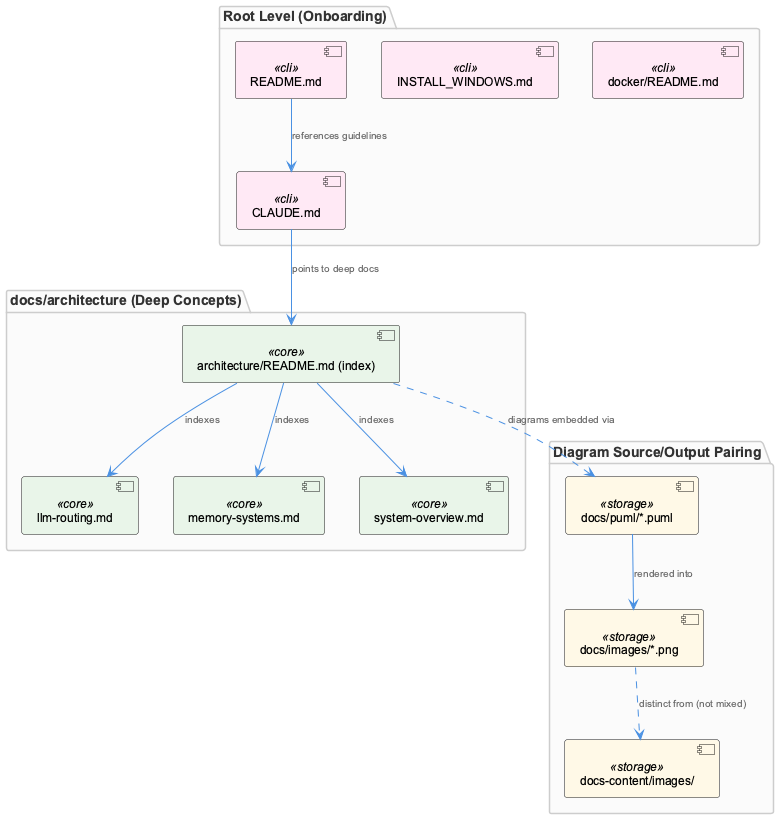
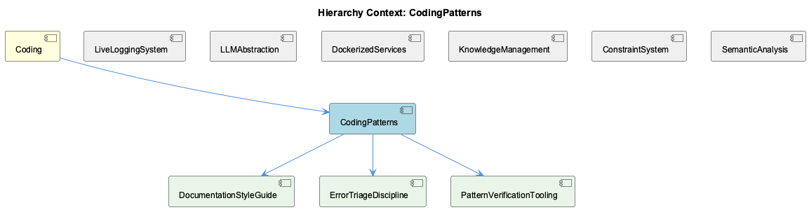

# CodingPatterns

**Type:** Component

CodingPatterns serves as a catch-all component for general programming wisdom, design patterns, conventions, and best practices that are applied across the Coding project but do not belong to any single functional subsystem. Rather than being a discrete module with its own directory, it manifests as recurring architectural idioms observed across the codebase—such as adapter patterns for storage backends, lazy initialization patterns for agent classes, circuit-breaker and caching wrappers around external services, and shared concurrency utilities like work-stealing task distribution. These patterns are documented in docs/architecture/*.md files and implemented consistently across SubComponents like GraphDatabaseManager, LLMServiceProvider, and CircuitBreakerManager.

Because no representative source files were directly attributed to this component, its presence is inferred from cross-cutting conventions referenced in the broader Existing Knowledge graph (e.g., Detail-level entities like ProviderRegistryManager and GraphDatabaseManager) and from architecture documentation describing system-wide approaches (health monitoring, LLM routing, memory systems). The component effectively functions as a conceptual umbrella capturing idiomatic code style, naming conventions (e.g., *Manager, *Adapter, *Service suffixes), and best-practice enforcement mechanisms like the ConstraintMonitoringService and egress-lint-allowlist.json.

Key architectural patterns include the consistent use of dependency-injected registries (ProviderRegistryManager), decorator-like wrapping of network calls (CircuitBreakerManager, CachingMechanism), and configuration-driven behavior (config/features.yaml, config/agent-profiles.json) rather than hardcoded logic, reflecting a broader project convention of externalizing policy from mechanism.

# CodingPatterns: Technical Insight Document

## What It Is

CodingPatterns is not a conventional directory-based module within the Coding project but a conceptual umbrella component that captures cross-cutting programming idioms, naming conventions, and best-practice enforcement mechanisms observed throughout the codebase. Because no dedicated source files or code symbols belong exclusively to it, its existence is inferred entirely from recurring patterns documented in `docs/architecture/*.md` files and instantiated consistently across concrete SubComponents such as `GraphDatabaseManager`, `LLMServiceProvider`, `ProviderRegistryManager`, and `CircuitBreakerManager`. As the parent node in the hierarchy, Coding treats CodingPatterns as a peer of functional components like LiveLoggingSystem, LLMAbstraction, DockerizedServices, KnowledgeManagement, ConstraintSystem, and SemanticAnalysis — but unlike those, it doesn't own a runtime subsystem; instead it describes *how* those subsystems are built.

## Architecture and Design

The architectural signature of CodingPatterns is externalization of policy from mechanism. Rather than hardcoding behavior, the project consistently pushes configuration into declarative artifacts: `config/features.yaml`, `config/feature-profiles.yaml`, `config/agent-profiles.json`, `config/task-taxonomy.yaml`, and `config/prompt-classifier.yaml`. This reflects the "Feature Modularity" philosophy documented in `docs/architecture/features.md`, and it recurs in classifiers like `OntologyClassifier`, which reads schema-driven config instead of embedding categorization logic directly.

A second architectural theme is decorator/wrapper-style resilience: `CircuitBreakerManager` and `CachingMechanism` wrap calls to `LLMServiceProvider`, implying a shared idiom applied uniformly to network-facing services rather than per-call error handling. This same wrapper posture appears conceptually in the child component ResilienceWrappers, though its actual source evidence (`scripts/knowledge-management/verify-patterns.sh`, `src/ontology/heuristics/EntityPatternAnalyzer.ts`) turns out to be guard-rail/compliance code rather than true circuit-breaker logic — a useful reminder that the CodingPatterns umbrella sometimes labels defensive coding practices loosely alongside classic resilience patterns.

Third, monitoring-as-code is a recurring convention: `ConstraintMonitoringService` and `config/health-verification-rules.json` codify best practices as declarative rule sets rather than embedded assertions, mirrored by the child component ConfigDrivenDesign's enforcement script.

## Implementation Details

The most concrete implementation artifact tied to this component family is `scripts/knowledge-management/verify-patterns.sh`, which anchors both the NamingConventions and ConfigDrivenDesign children. It performs compliance checking by grepping for `console.log` versus `Logger.*` calls to enforce the ConditionalLoggingPattern, and by evaluating other heuristics (ReduxStateManagementPattern, NetworkAwareInstallationPattern) via ripgrep. It resolves `CLAUDE_REPO` through `CODING_TOOLS_PATH`/`CODING_REPO` env vars, falling back to a path derived two directories above `SCRIPT_DIR` — a fragile coupling between script location and correctness that developers must respect if relocating the file.

Critically, the script reads a `TransferablePattern` list filtered by `significance >= 8` from a JSON knowledge base (`$SHARED_MEMORY`) via `jq`, and writes compliance scores back into that same file (`.metadata.last_pattern_verification`, `.metadata.pattern_compliance_score`). This makes the knowledge base simultaneously the source of truth and the telemetry sink — a self-referential monitoring-as-code loop consistent with `ConstraintMonitoringService`'s declarative style.

Naming itself is enforced through consistent suffixing: `*Manager` (GraphDatabaseManager, ProviderRegistryManager, ConnectionManager), `*Service` (LLMServiceProvider, SemanticAnalysisService, DashboardService), and `*Adapter` (TranscriptAdapter, SpecstoryAdapter) — a project-wide convention for signaling role clarity rather than a single class hierarchy.

## Integration Points

CodingPatterns integrates with the rest of Coding indirectly, by defining conventions that sibling components implement rather than by exposing an API. Its three children — NamingConventions, ConfigDrivenDesign, and ResilienceWrappers — each operationalize one facet: naming discipline, externalized configuration, and defensive wrapping, respectively. Agent integration follows a standardized abstraction documented in `docs/architecture/agent-abstraction-api.md` and `docs/architecture/adding-new-agent.md`, wiring `config/agents/*.sh` scripts into the system uniformly. Security-adjacent conventions appear via `config/egress-lint-allowlist.json`, a static allowlist preventing unintended network egress rather than a runtime check — an anti-pattern-prevention idiom parallel to the health-check pessimism seen in sibling DockerizedServices' `service-probe.js` (SPEC R6), and to ConstraintSystem's layered `HookConfigLoader` merge strategy.

## Usage Guidelines

Developers should treat CodingPatterns as a reference for idiom compliance rather than a component to modify directly. When adding new services or managers, follow the established `*Manager`/`*Service`/`*Adapter` suffix conventions for immediate role legibility. New configuration should be externalized into YAML/JSON files (following `config/features.yaml`-style patterns) rather than hardcoded, and network-facing service calls should be wrapped using the existing `CircuitBreakerManager`/`CachingMechanism` idiom rather than reimplementing per-call error handling. Anyone modifying `scripts/knowledge-management/verify-patterns.sh` must preserve its environment-variable-based repo-root resolution and its read/write contract against the `$SHARED_MEMORY` JSON knowledge base, since compliance scoring depends on that round-trip. Finally, note the looseness of the "ResilienceWrappers" label — not all files under that child component are actual network-resilience wrappers, so evaluate each artifact's grounding before assuming circuit-breaker semantics apply.

## Hierarchy Context

### Parent
- [Coding](./Coding.md) -- Root node of the coding project knowledge hierarchy, encompassing all development infrastructure knowledge. The project consists of 7 major components: LiveLoggingSystem: [LLM] The LiveLoggingSystem's configuration validation is centralized in scripts/validate-lsl-config.js through the LSLConfigValidator class, which ac; LLMAbstraction: LLMAbstraction provides a provider-agnostic interface over multiple LLM backends (Anthropic, OpenAI, Groq, and local Docker Model Runner) enabling tie; DockerizedServices: [LLM] The health-check subsystem enforces a strict invariant (documented as SPEC R6) that probing functions in service-probe.js—probeHttpHealth() and ; KnowledgeManagement: [LLM] The KnowledgeManagement component centers on the VKB (Virtual Knowledge Base) server, which acts as the primary interface for storing, querying,; CodingPatterns: CodingPatterns serves as a catch-all component for general programming wisdom, design patterns, conventions, and best practices that are applied acros; ConstraintSystem: [LLM] The ConstraintSystem's configuration architecture follows a strict two-tier layered merge pattern implemented in HookConfigLoader (lib/agent-api; SemanticAnalysis: SemanticAnalysis is a multi-agent pipeline (integrations/semantic-analysis/src/agents/) that processes git history and LSL session data to extract, cl.

### Children
- [NamingConventions](./NamingConventions.md) -- [LLM] scripts/knowledge-management/verify-patterns.sh implements a self-contained compliance checker that greps the codebase for `console.log` calls versus `Logger.*` calls to enforce the ConditionalLoggingPattern naming/usage convention referenced in the parent CodingPatterns component. The script hardcodes its resolution of `CLAUDE_REPO` via `CODING_TOOLS_PATH`/`CODING_REPO` env vars with a fallback to a path derived two directories up from `SCRIPT_DIR`, which ties the script's correctness to its physical location at `scripts/knowledge-management/verify-patterns.sh` — moving the file would silently break the repo-root inference unless the env vars are set.
- [ConfigDrivenDesign](./ConfigDrivenDesign.md) -- [LLM] scripts/knowledge-management/verify-patterns.sh is the concrete enforcement mechanism for the ConfigDrivenDesign/CodingPatterns umbrella described in the parent context. Rather than encoding pattern rules directly in application logic, it externalizes 'compliance checks' (ConditionalLoggingPattern, ReduxStateManagementPattern, NetworkAwareInstallationPattern) as ripgrep-based heuristics run against the tree, and reads a `TransferablePattern` list with `significance >= 8` out of a JSON knowledge-base file (`$SHARED_MEMORY`) via `jq`. This is a textbook instance of the 'monitoring-as-code' convention called out in the parent observations (ConstraintMonitoringService, health-verification-rules.json) — the script itself contains no hardcoded assertions about what 'compliant' code looks like beyond what's already declared in data (the pattern list), and it writes its score back into that same JSON file (`.metadata.last_pattern_verification`, `.metadata.pattern_compliance_score`), making the knowledge base both the source of truth and the sink for compliance telemetry.
- [ResilienceWrappers](./ResilienceWrappers.md) -- [LLM] No code_graph evidence was provided for this analysis (the <code_graph> block is empty), so all observations below are grounded directly in the two source files supplied — scripts/knowledge-management/verify-patterns.sh and src/ontology/heuristics/EntityPatternAnalyzer.ts — rather than in graph-derived call relationships. Neither file is a 'wrapper' in the classic circuit-breaker/retry sense described in the parent CodingPatterns context; verify-patterns.sh is a compliance-scanning shell script and EntityPatternAnalyzer.ts is a heuristic classifier, so the ResilienceWrappers label as applied to these files is best read as 'defensive/guard-rail code' rather than network-resilience decorators like CircuitBreakerManager or CachingMechanism.

### Siblings
- [LiveLoggingSystem](./LiveLoggingSystem.md) -- [LLM] The LiveLoggingSystem's configuration validation is centralized in scripts/validate-lsl-config.js through the LSLConfigValidator class, which acts as a schema enforcement gatekeeper for two distinct config artifacts: .specstory/config/lsl-config.json (structural/behavioral settings) and .specstory/config/redaction-config.yaml (privacy/classification rules). This separation reflects a deliberate architectural decision to decouple 'how the logger behaves' from 'what the logger is allowed to record', allowing redaction policy to be iterated on independently from file-management or session-windowing logic. The initializeSchemas() method enumerates five required top-level sections (version, multiUser, fileManager, operationalLogger, classification), meaning any config missing even one of these fails validation outright—this is a strict fail-closed design rather than a permissive fail-open one, which is notable for a system handling potentially sensitive session transcripts.
- [LLMAbstraction](./LLMAbstraction.md) -- LLMAbstraction provides a provider-agnostic interface over multiple LLM backends (Anthropic, OpenAI, Groq, and local Docker Model Runner) enabling tier-based routing, mock mode for testing, and resilient proxy communication. The component spans mock-mode simulation for frontend testing, a local-inference DMR provider that mirrors OpenAI's API shape, a direct-fetch proxy client that patches gaps in the SDK's request schema, and shared JSON-repair utilities that harden all LLM response parsing against malformed replies.

Architecturally, the component favors thin wrappers over deep abstraction: llm-mock-service.ts persists mode state (mock/local/public) per-agent in a shared workflow-progress.json file with legacy fallback support; dmr-provider.ts implements a singleton client pattern with cached health checks and YAML-based config loading across multiple candidate paths; llm-with-process.ts is explicitly documented as a deliberate 'Option B' single-repo wrapper chosen over modifying the upstream @rapid/llm-proxy SDK, preserving SDK metrics tracking while injecting a missing 'process' telemetry field into requests.

A cross-cutting concern is defensive parsing of LLM output: parse-llm-json.ts implements a narrow, character-level state machine that repairs only raw control characters inside string literals (the specific failure mode observed in production on 2026-09-07), deliberately avoiding broader JSON-guessing to keep failures loud and diagnosable rather than silently misinterpreted.
- [DockerizedServices](./DockerizedServices.md) -- [LLM] The health-check subsystem enforces a strict invariant (documented as SPEC R6) that probing functions in service-probe.js—probeHttpHealth() and probeTcpPort()—must never report a 'healthy' status directly. Instead, these functions only distinguish between 'stopped' (connection refused, timeout, or non-2xx HTTP response) and 'unknown' (configuration errors, malformed URLs, or unresolvable hosts). This is a deliberate architectural choice: liveness probes are pessimistic by design, and the actual determination of 'healthy' is deferred to a higher-level coordinator that combines probe results with other signals (e.g., process registration state from ProcessStateManager). New developers extending probe logic must preserve this three-state contract rather than optimistically returning 'healthy' from a probe function, since downstream consumers (the health-coordinator) rely on the absence of false positives here.
- [KnowledgeManagement](./KnowledgeManagement.md) -- [LLM] The KnowledgeManagement component centers on the VKB (Virtual Knowledge Base) server, which acts as the primary interface for storing, querying, and decaying knowledge graph entities. This server sits atop a graph database backend (KMCore) that replaced an earlier LevelDB-based storage engine. Developers working on this component should understand that the VKB server is not just a passthrough to the database—it implements query logic, caching, and decay scheduling that must be preserved across any storage backend swap, as evidenced by the dedicated migration test suite.
- [ConstraintSystem](./ConstraintSystem.md) -- [LLM] The ConstraintSystem's configuration architecture follows a strict two-tier layered merge pattern implemented in HookConfigLoader (lib/agent-api/hooks/hook-config.js). User-level configuration lives at ~/.coding-tools/hooks.json and represents global defaults applicable across all projects, while project-level configuration at .coding/hooks.json can override specific handlers or add project-specific constraints. The mergeConfigs() function performs this layering, meaning a new developer modifying constraint behavior needs to understand which file actually takes effect at runtime — project config wins on key collisions, but non-overlapping keys from both sources are preserved. This design allows teams to ship organization-wide constraints via user config while individual projects retain the ability to loosen or tighten specific rules without forking the entire config file.
- [SemanticAnalysis](./SemanticAnalysis.md) -- SemanticAnalysis is a multi-agent pipeline (integrations/semantic-analysis/src/agents/) that processes git history and LSL session data to extract, classify, and persist structured knowledge entities into the ontology-backed knowledge graph. It orchestrates specialized agents extending BaseAgent (base-agent.ts) which wrap agent-specific logic in a standardized AgentResponse envelope, computing confidence breakdowns, detecting issues, and generating routing suggestions for retry/escalation between workflow steps.

At its core, OntologyClassificationAgent (ontology-classification-agent.ts) assigns ontology metadata (class, confidence, method) to observations by combining heuristic classifiers, an LLM-backed OntologyClassifier, and hard-coded hierarchy-root guards for closed-set entities (CollectiveKnowledge, Coding, DynArch, Timeline, Normalisa) imported from @fwornle/km-core's HIERARCHY_ROOTS. A newer L2 refinement layer (Phase 57/60) further refines generic L1 classes (Component/SubComponent/Detail) into specific subsystem classes declared in coding.lower.json, using pure, independently-testable helper functions (loadL2Classes, buildL2RefinementPrompt, extractL2FromLLMResponse) alongside a deterministic keyword-based fallback classifier (l2-subsystem-classifier.ts).

The SemanticAnalysisAgent (semantic-analysis-agent.ts) performs the actual code/git/vibe cross-analysis, reading files from git history, computing complexity metrics and architectural pattern detection, and invoking an LLM (via @rapid/llm-proxy's LLMService) to generate deeper semantic insights that are merged with heuristically-detected patterns. The pipeline emphasizes testability (extensive node:test suites with tmpdir-isolated ontology fixtures) and graceful degradation (e.g., absent coding.lower.json yields empty L2 refinement rather than errors), reflecting an incremental, plan-driven development process (Phase 42/57/60 markers throughout the code).

---

*Generated from 8 observations*
