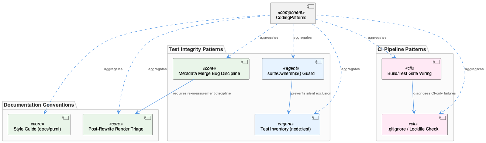
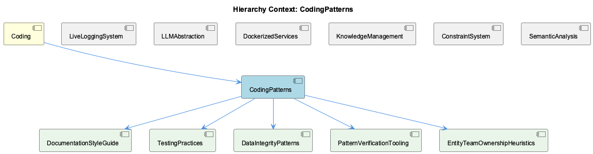

# CodingPatterns

**Type:** Component

# CodingPatterns — Insight Document

## What It Is

CodingPatterns is not a single directory of runtime code but a cross-cutting set of enforced conventions distributed across the repository's tooling. There is no single "entry point" file to point to; instead, its implementation surfaces through guard scripts, style rules, and verification disciplines, each encoding a policy decision made in response to a specific observed failure. Concrete examples include the `docs/puml/` placement contract from the Documentation Style Guide, the `suiteOwnership()` guard for test exclusion, node:test-compatible test-inventory tooling, the manifest/graph synchronization safeguards for metadata merges, and the post-rewrite render-error triage discipline. A developer looking for "the CodingPatterns module" should instead look at these scattered enforcement points rather than expect a service boundary.

## Architecture and Design

The architectural pattern here is best described as **policy-as-tooling**: rather than documenting conventions in prose alone, CodingPatterns pushes them into machine-checked guards (e.g., `suiteOwnership()`) or structural contracts (e.g., mandatory file placement under `docs/puml/`). This reflects a recurring design principle — "explicit over implicit configuration" — where file location, guard checks, or exit codes serve as the actual configuration signal. Misplacing a `.puml` file, silently excluding a test, or chaining CI commands with `;` instead of `&&` all previously produced silent failures; the architectural response is to convert each into a visible, enforced failure mode.

Structurally, this component is organized into five child concerns, each owning a distinct policy domain: DocumentationStyleGuide (docs pipeline conventions), TestingPractices (test discovery/execution correctness), DataIntegrityPatterns (dual-representation synchronization), PatternVerificationTooling (post-rewrite verification discipline), and EntityTeamOwnershipHeuristics (artifact-to-team attribution logic). These children are peers under the Coding root, alongside sibling components like LiveLoggingSystem, LLMAbstraction, DockerizedServices, KnowledgeManagement, ConstraintSystem, and SemanticAnalysis — CodingPatterns does not implement domain logic like those siblings, but instead governs *how* correctness is verified across the whole repo.

## Implementation Details

Each child component carries its own concrete mechanism. TestingPractices addresses the "Test Inventory Discovery — node:test Compatibility" gap, where test files importing from `node:test` were previously invisible to test-inventory tooling and silently skipped rather than failing visibly; it works alongside the `suiteOwnership()` guard, which requires any test exclusion to be an explicit, verified declaration rather than an accidental, undocumented omission. DataIntegrityPatterns addresses the "Metadata Merge Bug — Destructive Overwrite Pattern," where manifest-level and graph-level parent entity descriptions could clobber one another during merges; the fix requires treating one representation as authoritative or reconciling explicitly rather than allowing last-write-wins semantics. PatternVerificationTooling encodes the "Post-Rewrite Render Error Triage" discipline, requiring render errors to be checked against a pre-rewrite baseline before being attributed to a rewrite as regressions. DocumentationStyleGuide fixes the placement contract for `.puml` source files, which must live under `docs/puml/` for the docs rendering pipeline to discover them correctly.

EntityTeamOwnershipHeuristics is the most concretely code-backed child: `src/ontology/heuristics/EntityPatternAnalyzer.ts` implements "Layer 1: File/Artifact Detection" via `analyzeEntityPatterns()`, which runs `checkLocalArtifact()` first (a hardcoded `teamDirectories` prefix-match Map, confidence 0.9) and falls back to `matchArtifactPattern()` (per-team naming-convention regexes like `/LSL(Session|Monitor|Classifier)/i`, confidence 0.75) only if the first check fails — a deliberate "known location beats plausible name" ordering.

## Integration Points

CodingPatterns' enforcement points touch CI build gates directly: the Unified Viewer CI Build/Test Gate Wiring fix illustrates the anti-pattern this component guards against — build scripts discarding `tsc` output and chaining commands with `;` instead of `&&`, letting type errors and test failures pass silently. The fix wires exit codes and command chaining so failures actually fail the build, matching the broader theme of making failures visible.

Within the knowledge hierarchy, CodingPatterns sits under the Coding root alongside its six siblings, but unlike them it doesn't own a runtime subsystem — it enforces cross-cutting quality gates that apply to work happening in those subsystems (e.g., test discovery rules apply regardless of whether the code under test belongs to LLMAbstraction or DockerizedServices). EntityTeamOwnershipHeuristics' `teamDirectories` map explicitly references paths belonging to sibling-adjacent domains (`src/ontology`, `src/knowledge-management`, `src/live-logging`, `scripts`, `.specstory` for Coding; other prefixes for RaaS, ReSi, UI teams), showing this component's classification logic spans the whole repo rather than staying local.

## Usage Guidelines

Developers should treat file location and command wiring as load-bearing configuration, not incidental structure: `.puml` files must live in `docs/puml/` or the docs pipeline silently fails to render them; test exclusions must go through the `suiteOwnership()` guard rather than being dropped ad hoc; and CI scripts must chain with `&&` (not `;`) and propagate `tsc`/test exit codes so failures aren't swallowed. When adding new test runners or import styles, verify test-inventory tooling recognizes them, since silent skips are strictly worse than visible failures. When touching merge/consolidation logic that spans manifest and graph representations, explicitly designate an authoritative source or reconcile both sides rather than allowing whichever write lands last to win. After large rewrites, always triage render errors against a pre-rewrite baseline before assigning blame or prioritizing fixes — conflating pre-existing issues with regressions wastes debugging effort and undermines confidence in the rewrite.

## Work Record

What working sessions recorded about this entity — decisions taken, problems hit, and why things are the way they are:

- Documentation Style Guide for Diagrams and Markdown establishes that .puml source files must live in docs/puml/ and generated diagram artifacts have defined placement rules, enforcing a convention for the docs pipeline to render correctly.
- Test Suite Exclusion Enforcement — suiteOwnership() Guard establishes that test files can only be excluded from the suite via explicit, verified declarations, preventing silent or undocumented coverage gaps.
- Post-Rewrite Render Error Triage establishes a verification discipline requiring pre-existing render errors to be distinguished from regressions before assigning blame or prioritizing fixes after large rewrites.
- Metadata Merge Bug — Destructive Overwrite Pattern documents a recurring failure mode where manifest-level and graph-level entity descriptions can be destructively overwritten during merges, requiring synchronization safeguards.
- Test Suite Exclusion Enforcement — suiteOwnership() Guard establishes that test files cannot be silently dropped from the executed suite; any exclusion must be an explicit, verified declaration checked by tooling. This was introduced because some test files were found excluded without documentation, giving false confidence that coverage existed when it did not — the guard converts an implicit, discoverable-only-by-accident state into a machine-checked declaration.
- Documentation Style Guide for Diagrams and Markdown fixes the placement contract for generated diagram artifacts: .puml source files must live under docs/puml/, and this placement is mandatory for the docs rendering pipeline to pick them up correctly. This is a concrete example of an 'explicit-over-implicit configuration' pattern within CodingPatterns — file location itself acts as the configuration signal, so misplacing a .puml file silently breaks rendering rather than raising an error.
- Metadata Merge Bug — Destructive Overwrite Pattern documents a data-integrity failure mode where manifest-level and graph-level parent entity descriptions could be overwritten destructively during merge operations, requiring multi-stage remediation to keep the two representations in sync and to keep published documentation pages accurate rather than relying on stale carried-over figures. This generalizes into a CodingPatterns convention: merge/consolidation logic touching dual-representation data (manifest + graph) must treat one representation as authoritative or reconcile explicitly, rather than allowing whichever write happens last to silently clobber the other.

## Hierarchy Context

### Parent
- [Coding](./Coding.md) -- Root node of the coding project knowledge hierarchy, encompassing all development infrastructure knowledge. The project consists of 7 major components: LiveLoggingSystem: [LLM] The classification layer for LiveLoggingSystem is implemented in ontology-classification-agent.ts, which categorizes captured session content as; LLMAbstraction: [SESSION] 'LLM Routing Tier Priority' establishes that LLM requests must follow fallback tier order — max-subscription models first, then work/GH Copi; DockerizedServices: [LLM] lib/service-probe.js implements the health-check polling logic that determines readiness of dockerized services (semantic analysis MCP, constrai; KnowledgeManagement: [SESSION] Wave Insight Persistence work record establishes that Wave 4 wrote 73 insight documents but zero Insight graph nodes, because the History si; CodingPatterns: [SESSION] Documentation Style Guide for Diagrams and Markdown establishes that .puml source files must live in docs/puml/ and generated diagram artifa; ConstraintSystem: [SESSION] Statusline Click-Report Feature establishes that clicking the 'constraints' field in the tmux statusline opens or focuses the constraint-mon; SemanticAnalysis: [SESSION] Pipeline CodingLowerOntologySource Emission Bug documents an unresolved defect where the pipeline emits a CodingLowerOntologySource referenc.

### Children
- [DocumentationStyleGuide](./DocumentationStyleGuide.md) -- [SESSION] Documentation Style Guide for Diagrams and Markdown: .puml source files must live in docs/puml/, establishing a single canonical location for diagram source control.
- [TestingPractices](./TestingPractices.md) -- [SESSION] Test Inventory Discovery — node:test Compatibility: ensures test files using node:test imports are recognized by the project's test-inventory tooling so they are executed rather than silently skipped.
- [DataIntegrityPatterns](./DataIntegrityPatterns.md) -- [SESSION] Metadata Merge Bug — Destructive Overwrite Pattern: tracks a multi-stage effort to keep manifest-level and graph-level parent entity descriptions in sync.
- [PatternVerificationTooling](./PatternVerificationTooling.md) -- [SESSION] Post-Rewrite Render Error Triage: establishes the verification discipline for distinguishing pre-existing render errors from regressions after a large rewrite, so fixes are prioritized correctly.
- [EntityTeamOwnershipHeuristics](./EntityTeamOwnershipHeuristics.md) -- [LLM] src/ontology/heuristics/EntityPatternAnalyzer.ts implements the actual 'Layer 1: File/Artifact Detection' stage of EntityTeamOwnershipHeuristics, per its own header comment. analyzeEntityPatterns() runs a two-step check per extracted artifact: checkLocalArtifact() first looks for a direct prefix match against a hardcoded teamDirectories Map (Coding → src/ontology, src/knowledge-management, src/live-logging, scripts, .specstory; RaaS → raas-service, orchestration-engine, event-mesh; ReSi → virtual-target, embedded-functions, reprocessing-engine; UI → curriculum-alignment, aws-lambda, multi-agent-system), returning confidence 0.9. Only if that fails does matchArtifactPattern() fall back to a per-team array of naming-convention regexes (e.g. /LSL(Session|Monitor|Classifier)/i for Coding, /Kubernetes(Cluster|Pod|Service)/i for RaaS) at confidence 0.75 — a deliberate 'known location beats plausible name' ordering.

### Siblings
- [LiveLoggingSystem](./LiveLoggingSystem.md) -- [LLM] The classification layer for LiveLoggingSystem is implemented in ontology-classification-agent.ts, which categorizes captured session content as it flows through the logging pipeline. Its hierarchy-root validation logic is tested separately in ontology-classification-agent.hierarchy-roots.test.ts, indicating that root-node classification (i.e., correctly assigning top-level ontology categories rather than leaf nodes) is treated as a distinct correctness concern from general classification accuracy — likely because incorrect root assignment cascades into misfiled session data across the entire per-person or per-project vault structure.
- [LLMAbstraction](./LLMAbstraction.md) -- [SESSION] 'LLM Routing Tier Priority' establishes that LLM requests must follow fallback tier order — max-subscription models first, then work/GH Copilot models, then Groq Llama-70B only as a last resort — rather than demoting to lower-tier providers as primary
- [DockerizedServices](./DockerizedServices.md) -- [LLM] lib/service-probe.js implements the health-check polling logic that determines readiness of dockerized services (semantic analysis MCP, constraint monitor) before dependent processes proceed. Rather than a single fixed timeout, the probe pattern issues periodic requests against known health endpoints and treats consecutive failures within a window as the signal for 'not ready' versus 'transiently slow', which matters in a Docker context where container startup order and cold-start times (loading models, connecting to databases) are highly variable across restarts.
- [KnowledgeManagement](./KnowledgeManagement.md) -- [SESSION] Wave Insight Persistence work record establishes that Wave 4 wrote 73 insight documents but zero Insight graph nodes, because the History sidebar filters strictly to entityType 'Insight' — documents alone are invisible to graph queries
- [ConstraintSystem](./ConstraintSystem.md) -- [SESSION] Statusline Click-Report Feature establishes that clicking the 'constraints' field in the tmux statusline opens or focuses the constraint-monitor dashboard tab, integrating HookManagementSystem-driven violation data with the dashboard UI
- [SemanticAnalysis](./SemanticAnalysis.md) -- [SESSION] Pipeline CodingLowerOntologySource Emission Bug documents an unresolved defect where the pipeline emits a CodingLowerOntologySource reference in output despite documentation stating this source type should never be produced, indicating a gap between the L2 refinement design and current emission behavior

---

*Generated from 11 observations*
