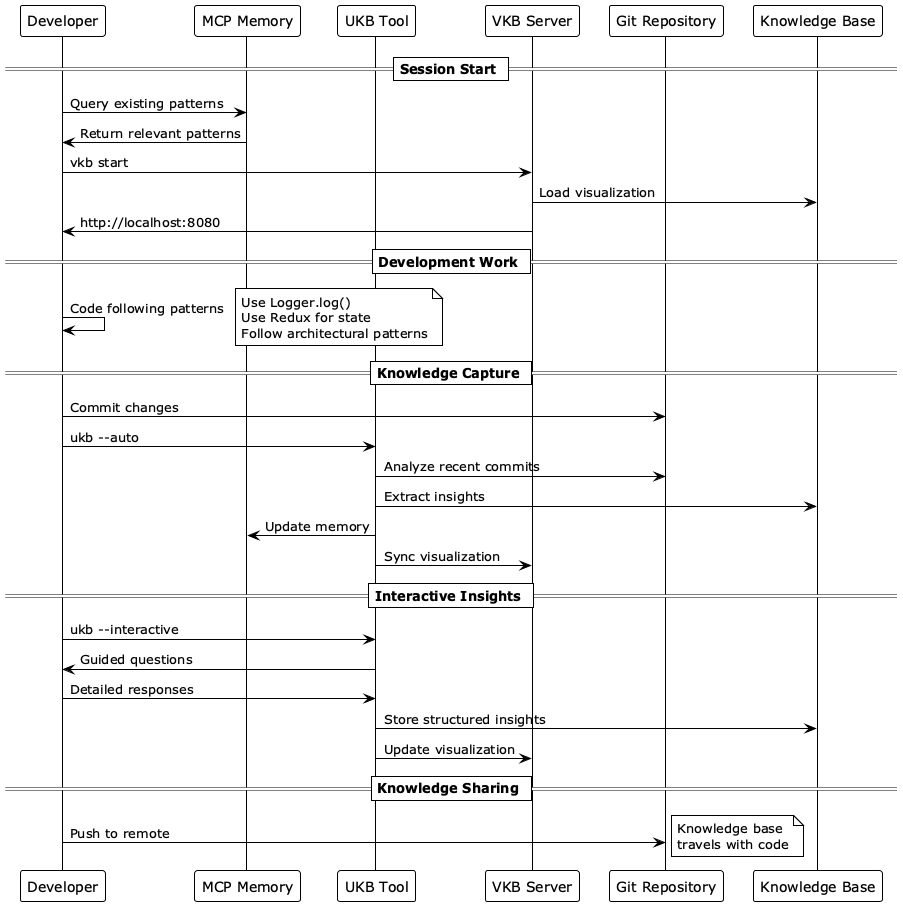
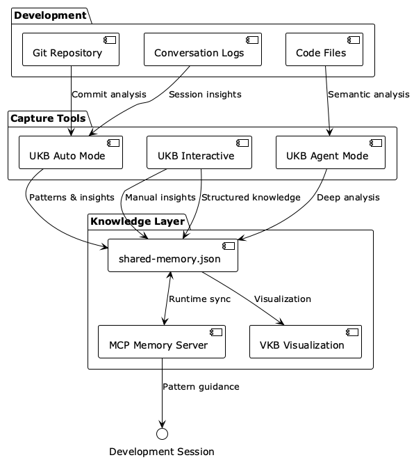

# CodingWorkflow - Development Workflow Pattern

## Table of Contents

- [Overview](#overview)
- [Problem](#problem)
- [Solution](#solution)
- [Critical Rules](#critical-rules)
  - [Never Use Direct Console Logging](#-never-use-direct-console-logging)
  - [Never Edit shared-memory.json Directly](#-never-edit-shared-memoryjson-directly)
  - [Always Check Existing Patterns](#-always-check-existing-patterns)
- [UKB Command Reference](#ukb-command-reference)
  - [Basic Operations](#basic-operations)
  - [Entity Management](#entity-management)
  - [Relation Management](#relation-management)
  - [Git History Analysis](#git-history-analysis)
- [VKB Command Reference](#vkb-command-reference)
  - [Server Management](#server-management)
  - [Diagnostics](#diagnostics)
- [Development Workflow Sequence](#development-workflow-sequence)
- [Knowledge Management Architecture](#knowledge-management-architecture)
- [Use Case Examples](#use-case-examples)
  - [Adding a New Pattern](#1-adding-a-new-pattern)
  - [Deep Git Analysis](#2-deep-git-analysis)
  - [Interactive Insight Capture](#3-interactive-insight-capture)
  - [Visualization and Exploration](#4-visualization-and-exploration)
- [Pattern Compliance Rules](#pattern-compliance-rules)
  - [React State Management](#react-state-management)
  - [Logging Implementation](#logging-implementation)
- [Knowledge Synchronization](#knowledge-synchronization)
  - [Automatic Sync Points](#automatic-sync-points)
  - [Manual Sync Operations](#manual-sync-operations)
- [Troubleshooting](#troubleshooting)
  - [Common Issues](#common-issues)
- [File Structure](#file-structure)
- [Integration Points](#integration-points)
  - [Claude Code Integration](#claude-code-integration)
  - [Git Integration](#git-integration)
  - [Team Collaboration](#team-collaboration)
- [Benefits](#benefits)
- [References](#references)

## Overview

**Pattern Type:** WorkflowPattern  
**Significance:** 10/10 - Critical for consistent development practices  
**Origin Project:** Coding Knowledge Management System  
**Last Updated:** 2025-06-19

## Problem

Development teams need consistent workflows that ensure:
- Code quality and architectural compliance
- Knowledge capture and sharing across sessions
- Proper use of logging and state management patterns
- Systematic approach to capturing and retrieving insights

## Solution

The CodingWorkflow pattern establishes a comprehensive development workflow with knowledge management integration, ensuring consistent practices across all coding activities.

## Critical Rules

### 🚨 Never Use Direct Console Logging
```javascript
// ❌ NEVER DO THIS
console.log("Debug message");
console.warn("Warning message");
console.error("Error message");

// ✅ ALWAYS DO THIS
Logger.log('debug', 'component', "Debug message");
Logger.log('warn', 'validation', "Warning message");
Logger.log('error', 'api', "Error message");
```

### 🚨 Never Edit shared-memory.json Directly
```bash
# ❌ NEVER DO THIS
vim shared-memory.json
nano shared-memory.json

# ✅ ALWAYS DO THIS
ukb --interactive          # Add new insights
ukb --add-entity "Name|Type|Observation"
ukb --add-relation "From,To,Type"
```

### 🚨 Always Check Existing Patterns
```bash
# ✅ At session start, always query patterns
ukb --list-entities | grep -i "pattern"
vkb  # Open visualization to explore connections
```

## UKB Command Reference

### Basic Operations
```bash
# Auto mode - analyze recent git commits
ukb                           # Default: incremental analysis
ukb --auto                    # Explicit auto mode

# Interactive mode - guided insight capture
ukb --interactive             # Manual deep insight capture
ukb --agent                   # Semantic analysis mode
```

### Entity Management
```bash
# Add new entities
ukb --add-entity "PatternName|TransferablePattern|Description of pattern;Key benefit;Implementation notes"

# List and remove entities
ukb --list-entities           # Show all entities
ukb --remove-entity EntityName
ukb --remove-entities Entity1,Entity2,Entity3
ukb --rename-entity OldName,NewName
```

### Relation Management
```bash
# Add relationships
ukb --add-relation "PatternName,ProjectName,implemented in"
ukb --add-relations "Pattern1,Project1,implemented in" "Pattern2,Project2,derived from"

# List and remove relations
ukb --list-relations
ukb --remove-relation "From,To,RelationType"
```

### Git History Analysis
```bash
# Incremental analysis (default)
ukb --auto                    # Analyze new commits since last run

# Full history analysis
ukb --full-history            # Analyze entire git history
ukb --full-history --history-depth 50  # Last 50 commits only

# Force reprocessing
ukb --force-reprocess         # Reprocess all files
```

## VKB Command Reference

### Server Management
```bash
# Start server (default: background)
vkb                          # Start in background
vkb start                    # Explicit start command

# Debugging mode
vkb fg                       # Start in foreground for debugging
vkb foreground               # Alternative foreground command

# Server control
vkb stop                     # Stop server
vkb restart                  # Restart server (kills old instances)
vkb status                   # Check server status
```

### Diagnostics
```bash
vkb logs                     # Show recent server logs
vkb port                     # Check what's using port 8080
vkb help                     # Show all commands
```

## Development Workflow Sequence



The sequence diagram above illustrates the complete development workflow from session start through knowledge capture and sharing. Key phases include:

1. **Session Start**: Query existing patterns from MCP memory and start visualization
2. **Development Work**: Code following established patterns and best practices  
3. **Knowledge Capture**: Automatic analysis of git commits and manual insight capture
4. **Knowledge Sharing**: Git-based distribution of accumulated knowledge

## Knowledge Management Architecture



The architecture diagram shows the three-layer knowledge management system:

- **Knowledge Layer**: Central storage (shared-memory.json), runtime memory (MCP), and visualization (VKB)
- **Capture Tools**: Multiple modes for extracting insights (Auto, Interactive, Agent)
- **Development**: Source materials for knowledge extraction (Git, Code, Conversations)

## Use Case Examples

### 1. Adding a New Pattern
```bash
# Scenario: You discovered a new performance pattern
ukb --add-entity "CacheInvalidationPattern|TransferablePattern|Cache invalidation strategy using event-driven approach;Reduces API calls by 80%;Applicable to React, Vue, and Angular applications"

# Add project relationship (automatically created by ukb validation)
# ukb --add-relation "CacheInvalidationPattern,MyProject,implemented in"
```

### 2. Deep Git Analysis
```bash
# Scenario: New team member needs to understand codebase evolution
ukb --full-history --history-depth 100
# This analyzes last 100 commits and extracts architectural decisions

# For comprehensive understanding
ukb --full-history
# Analyzes entire git history (use for new repositories)
```

### 3. Interactive Insight Capture
```bash
# Scenario: Complex problem-solving session with unique insights
ukb --interactive

# UKB will guide you through:
# 1. Problem description
# 2. Solution approach 
# 3. Why this solution was chosen
# 4. Key learnings
# 5. Applicability to other projects
# 6. Technologies involved
# 7. References and files
# 8. Significance rating (1-10)
```

### 4. Visualization and Exploration
```bash
# Start visualization server
vkb

# Open http://localhost:8080 to:
# - Explore entity relationships
# - Search for specific patterns
# - Navigate between connected concepts
# - View detailed insight documentation
```

## Pattern Compliance Rules

### React State Management
```javascript
// ❌ NEVER use useState for complex state
const [userState, setUserState] = useState({
  profile: {},
  permissions: [],
  preferences: {}
});

// ✅ ALWAYS use Redux for complex state
const userProfile = useSelector(state => state.user.profile);
const dispatch = useDispatch();
```

### Logging Implementation
```javascript
// ❌ NEVER use console methods
console.log("User logged in:", userId);

// ✅ ALWAYS use Logger with categories
Logger.log('info', 'auth', "User logged in", { userId });
Logger.log('debug', 'component', "Component rendered", { props });
Logger.log('error', 'api', "Request failed", { error, endpoint });
```

## Knowledge Synchronization

### Automatic Sync Points
- **Git commits**: Auto-analyzed for patterns and insights
- **Session completion**: Conversation logs processed
- **Entity updates**: Immediately synced to visualization in NDJSON format
- **MCP memory**: Runtime availability of patterns
- **Knowledge base changes**: Any ukb operation automatically updates visualization data

### Manual Sync Operations
```bash
# Generally not needed - ukb handles sync automatically
# But if needed:
vkb restart                   # Force regenerate visualization data

# Verify MCP memory sync
# (Done automatically by claude-mcp startup)

# Manual insight capture
ukb --interactive
```

## Troubleshooting

### Common Issues

#### UKB Interactive Mode Hangs
```bash
# Problem: ukb --interactive waits for input
# Solution: Use piped input
cat > /tmp/ukb-input.txt << 'EOF'
Problem description
Solution description
Rationale
Key learnings
Applicability
Technologies
References
Code files
8
EOF

cat /tmp/ukb-input.txt | ukb --interactive
```

#### VKB Port Conflicts
```bash
# Problem: "Port 8080 already in use"
# Solution: Restart reliably kills all instances
vkb restart

# Check what's using the port
vkb port
lsof -i:8080
```

#### Parsing Errors in Visualization
- **Fixed**: Atomic file updates and automatic NDJSON conversion prevent this
- **If still occurs**: Hard refresh browser (Cmd+Shift+R)

## File Structure

```
knowledge-management/
├── ukb                          # Main insight capture tool (handles visualization sync)
├── vkb                          # Visualization server manager  
├── insights/
│   ├── CodingWorkflow.md       # This comprehensive guide
│   ├── ConditionalLoggingPattern.md
│   └── [other patterns].md
└── shared-memory.json          # Central knowledge base
```

## Integration Points

### Claude Code Integration
```bash
# Start with MCP features
claude-mcp

# Auto-loads knowledge base at session start
# Provides pattern guidance during development
# Captures insights automatically
```

### Git Integration
```bash
# Knowledge base travels with code
git add shared-memory.json
git commit -m "Update knowledge base with new patterns"
git push origin main
```

### Team Collaboration
- Knowledge base is git-tracked for team sharing
- Visualization server enables collaborative exploration
- Standardized patterns ensure consistent code quality

## Benefits

### Practical Improvements
- **Cross-session knowledge retention** for AI assistants
- **Comprehensive technical debt** assessment capability
- **Real-time visualization** of knowledge connections
- **Structured insight capture** with significance ranking
- **Consistent code quality** through pattern enforcement

## References

- [ConditionalLoggingPattern](knowledge-management/insights/ConditionalLoggingPattern.md) - Advanced logging system
- [ReduxStateManagementPattern](knowledge-management/insights/ReduxStateManagementPattern.md) - State management approach
- [KnowledgePersistencePattern](knowledge-management/insights/KnowledgePersistencePattern.md) - Cross-session knowledge retention

---

*This comprehensive guide ensures consistent development practices and effective knowledge management across all coding activities. The ukb tool automatically syncs all changes to the visualization, eliminating the need for manual refresh operations.*