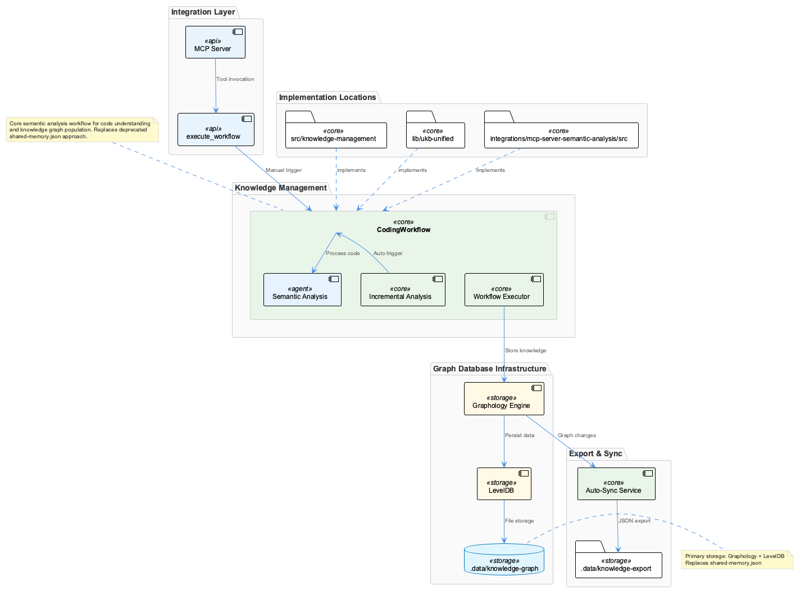
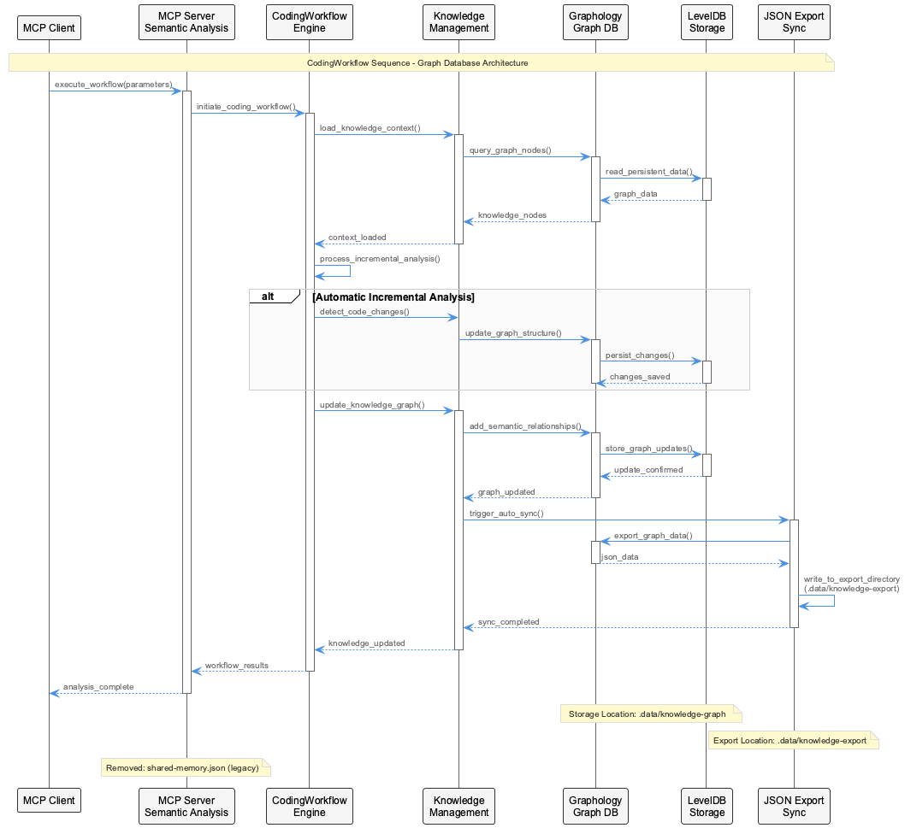
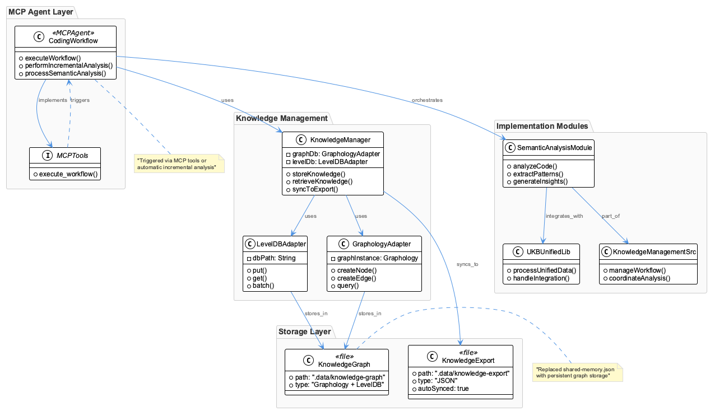
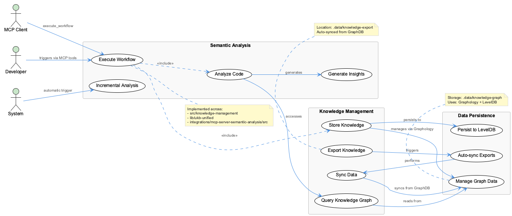

# CodingWorkflow

**Type:** GraphDatabase

CodingWorkflow is implemented across: src/knowledge-management, lib/ukb-unified, integrations/mcp-server-semantic-analysis/src

## What It Is

- shared-memory.json has been REMOVED from the codebase

- JSON exports are at .data/knowledge-export (auto-synced from GraphDB)

- Knowledge storage uses Graphology + LevelDB at .data/knowledge-graph

## How It Works

- CodingWorkflow is implemented across: src/knowledge-management, lib/ukb-unified, integrations/mcp-server-semantic-analysis/src

- Workflow is triggered via MCP tools (execute_workflow) or automatic incremental analysis

- CodingWorkflow is part of the semantic analysis and knowledge management infrastructure

- CodingWorkflow workflow details pending full codebase analysis

## Diagrams

### Architecture

### Sequence

### Class

### Use cases

---

*Generated from 7 observations*
