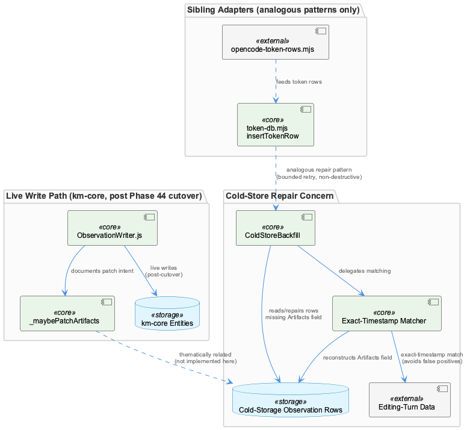
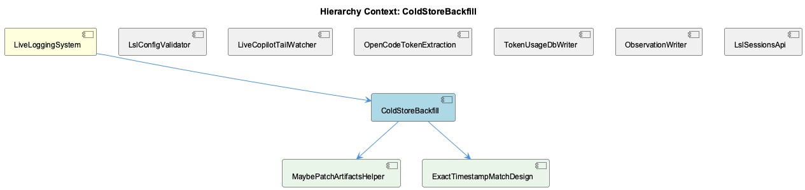

# ColdStoreBackfill

**Type:** SubComponent

## What It Is

ColdStoreBackfill is a data-integrity repair mechanism within LiveLoggingSystem, documented via a session record ("Cold-Store Backfill — Artifacts Field Recovery") rather than located in any retrieved source file. Its stated purpose is to reconstruct missing Artifacts fields in cold-storage observation rows by exact-timestamp matching against corresponding editing-turn data. No implementation file for this component was present in the supplied evidence — the retrieved files (copilot-events-tail.mjs, opencode-token-rows.mjs, token-db.mjs, ObservationWriter.js, and a copilot-session-command test) are all filename-adjacent code from the same LiveLoggingSystem tree but do not implement, import, or reference cold-store backfill logic, Artifacts-field reconciliation, or timestamp-based row joining. This document therefore describes the component as characterized by its own session record and by its declared relationship to siblings, while being explicit about what is inferred versus confirmed.

## Architecture and Design

The defining design decision, per the session record, is the choice of exact-timestamp matching over a fuzzy/time-window join strategy. This was explicitly selected to avoid false positives that would corrupt unrelated rows — a conservative trade-off that favors correctness and non-destructiveness over recall (some legitimately-missing Artifacts fields may go unrepaired if no exact timestamp match exists). This positions ColdStoreBackfill as an offline/batch reconciliation pass operating on already-persisted rows, architecturally distinct from the live-ingestion write path represented by sibling ObservationWriter.

Because ObservationWriter documents a hard cutover from SQLite to km-core (Phase 44) with no dual-write window, any backfill targeting "cold-storage observation rows" must operate on km-core entities post-cutover rather than a legacy SQLite table — this is an architectural constraint inherited from the parent LiveLoggingSystem's storage evolution, not something demonstrated directly in ColdStoreBackfill's own code.

## Implementation Details

The concrete implementation is not present in the retrieved sources. The child entity MaybePatchArtifactsHelper corresponds most closely to ObservationWriter.js's `_maybePatchArtifacts` private method, named in that file's header comments alongside `_findExistingByContentHash` and `_isSemanticallyDuplicate` as helpers repointed from SQLite to km-core lookups (`findByContentHash`, `findRecentByAgent`, `findByLegacyId`) during Phase 44 Plan 13 — but the method body is truncated out of the available source, so its actual patch logic cannot be verified. The other child, ExactTimestampMatchDesign, names the comparator strategy described in the session record but likewise has no corresponding join/comparator function in any supplied file (no code reads two row sets and equi-joins them on timestamp). Both children should be treated as named-but-unverified design elements pending discovery of the actual backfill script.

## Integration Points

ColdStoreBackfill sits under LiveLoggingSystem alongside LslConfigValidator, LiveCopilotTailWatcher, OpenCodeTokenExtraction, TokenUsageDbWriter, ObservationWriter, and LslSessionsApi. Its closest functional relationship is to ObservationWriter, since both concern the Artifacts field and observation-row integrity — ObservationWriter on the live write path (dedup, retention floor, `ANCHOR_FOR_KIND` provenance edges, `_observationEmitter` SSE fan-out), ColdStoreBackfill on repairing rows that already reached cold storage in a defective state. The session record frames the defect as one that would otherwise "silently degrade downstream consumers" — consolidation or attribution passes expecting an Artifacts reference on every row — implying an implicit dependency from those downstream consumers on ColdStoreBackfill's repair guarantee. A house-wide convention of "never corrupt unrelated rows" is visible in sibling TokenUsageDbWriter's `insertTokenRow` (bounded MAX(id)+1 retry, idempotent `ensureCacheColumns` migration) and OpenCodeTokenExtraction's provider-gating no-double-count invariant; these are analogous safety disciplines within the same codebase, not evidence that ColdStoreBackfill shares implementation, but they suggest a consistent architectural ethos around safe reconstruction of historical data.

## Usage Guidelines

Given the gaps in direct evidence, developers should treat this document's implementation claims as provisional: confirm the actual backfill script's location before modifying or extending it. Any change to the matching strategy should preserve the exact-timestamp discipline unless a deliberate, reviewed trade-off toward fuzzy matching is made, since the session record indicates this precision-over-recall choice was intentional. Because km-core (not SQLite) is the post-cutover source of truth, backfill logic must target km-core entities and should reuse ObservationWriter's `findByContentHash`/`findRecentByAgent`/`findByLegacyId` lookup surface where possible rather than reimplementing row access. Future retrieval or documentation passes should prioritize locating the true ColdStoreBackfill source file (likely a script/job under LiveLoggingSystem's cold-store or backfill directory) since none of the currently indexed files under lib/lsl/ or src/live-logging/ contain it.

## Work Record

What working sessions recorded about this entity — decisions taken, problems hit, and why things are the way they are:

- Cold-Store Backfill — Artifacts Field Recovery: reconstructs missing Artifacts fields in cold-storage observation rows by exact-timestamp matching against editing-turn data, explicitly designed to avoid false-positive matches that would corrupt unrelated rows
- Cold-Store Backfill — Artifacts Field Recovery: this recorded work repairs cold-storage observation rows that are missing their Artifacts field by reconstructing it via exact-timestamp matching against corresponding editing-turn data. The record explicitly states this matching strategy was chosen to avoid false-positive matches, implying a looser fuzzy/time-window approach was considered and rejected as too risky for a backfill that mutates historical rows.
- The same Cold-Store Backfill record frames the defect it fixes as one that would otherwise 'silently degrade downstream consumers' — i.e. consolidation or attribution passes that expect an Artifacts reference on every observation row. This positions ColdStoreBackfill as a data-integrity repair tool operating on already-persisted rows, distinct from the live-ingestion write path, since it targets rows that already made it to cold storage in a defective state.

## Hierarchy Context

### Parent
- [LiveLoggingSystem](./LiveLoggingSystem.md) -- [SESSION] LSL Session Continuity Bootstrap (/sl command): re-establishes full project context at session start by loading the most recent LSL transcript files under .specstory/history/ and producing a structured continuity summary covering time range, projects touched, branch state, and pending work

### Children
- [MaybePatchArtifactsHelper](./MaybePatchArtifactsHelper.md) -- [LLM] No supplied file defines or references a symbol named 'MaybePatchArtifactsHelper'. The closest match is ObservationWriter.js's `_maybePatchArtifacts` private method, mentioned only in a header comment in src/live-logging/ObservationWriter.js as one of three helpers ('_findExistingByContentHash', '_isSemanticallyDuplicate', '_maybePatchArtifacts') that were repointed from a SQLite handle to km-core lookups (findByContentHash/findRecentByAgent/findByLegacyId) during Phase 44 Plan 13. The actual method body implementing the patch logic is truncated out of the retrieved source, so even this partial match cannot be verified beyond its name and stated responsibility.
- [ExactTimestampMatchDesign](./ExactTimestampMatchDesign.md) -- [LLM] None of the five supplied code files implement, import, or reference any exact-timestamp matching logic for reconciling cold-store observation rows against editing-turn data. copilot-events-tail.mjs implements live file-tail polling of Copilot's events.jsonl via statSync/readSync on a fixed 200ms interval (TAIL_POLL_INTERVAL_MS), which is a live-ingestion mechanism, not a batch backfill comparator. There is no function here that reads two independent row sets and joins them on an equality-matched timestamp field.

### Siblings
- [LslConfigValidator](./LslConfigValidator.md) -- [CGR] LSLConfigValidator (class) in validate-lsl-config.js
- [LiveCopilotTailWatcher](./LiveCopilotTailWatcher.md) -- [LLM] `lib/lsl/live/copilot-events-tail.mjs` is the LiveCopilotTailWatcher implementation itself: `scanForLiveSessions()` walks `~/.copilot/session-state/<uuid>/` directories, keeping only those with a live (non-stale) `inuse.<pid>.lock`, found via `findLiveLockFile()` matching the `/^inuse\.\d+\.lock$/` pattern and a 10-minute `LOCK_STALE_GRACE_MS` grace window that treats an orphaned lock from a hard-crashed session as 'dead' rather than live. Each surviving session directory is then handed to `tailEventsFile()`, which opens a 200ms (`TAIL_POLL_INTERVAL_MS`) `statSync` poll on `events.jsonl`, reading only newly appended bytes via `fs.openSync`/`fs.readSync` at the previously recorded offset and splitting on newlines with a `residual` buffer to hold a partial trailing line across polls.
- [OpenCodeTokenExtraction](./OpenCodeTokenExtraction.md) -- [LLM+CGR] `buildOpencodeTokenRows` in lib/lsl/token/opencode-token-rows.mjs is the core extraction function: it opens `~/.local/share/opencode/opencode.db` read-only via better-sqlite3, scans the most recent `MESSAGE_SCAN_LIMIT` (4000) rows of the `message` table by `rowid DESC`, and for each assistant message whose `providerID`/`provider` field is in `BYPASS_PROVIDERS = Set(['github-copilot'])` emits one `TokenUsageRow`-shaped object via `extractTokens(d)`. Messages from proxy-routed providers (e.g. `anthropic`) are explicitly skipped — this is the D-04 no-double-count invariant stated in the file's header comment: a message already captured as a proxy wire row must never be reconstructed a second time from OpenCode's own store.
- [TokenUsageDbWriter](./TokenUsageDbWriter.md) -- [LLM] The closest match to a 'TokenUsageDbWriter' in the supplied files is lib/lsl/token/token-db.mjs, whose insertTokenRow() function performs the actual database write to token_usage.db. It uses an id-allocation seed (NEXT_ID_SQL) scoped per adapter user_hash and wraps the INSERT in a bounded retry loop (INSERT_ID_RETRY_ATTEMPTS=3) that recomputes MAX(id)+1 on SQLITE_CONSTRAINT collisions, distinguishing genuine duplicate tool_call_id rows (dropped) from lost id races (retried).
- [ObservationWriter](./ObservationWriter.md) -- [SESSION] Attribution Router Module: ObservationWriter now uses deterministic path-based routing (repo-router.mjs) instead of a prior unreliable embedding-similarity voting approach, fixing misattribution of KB observations to owning teams/repos
- [LslSessionsApi](./LslSessionsApi.md) -- [LLM] None of the supplied files define, export, route, or reference an entity named `LslSessionsApi`. The closest thematic neighbor is `lib/lsl/live/copilot-events-tail.mjs`, whose `scanForLiveSessions(sessionStateDir, myUid)` function enumerates session directories under `~/.copilot/session-state/<uuid>/` by checking for a live `inuse.<pid>.lock` file (via `findLiveLockFile`) and uid ownership (via `isOwnedByMe`). This is a filesystem-polling live-session *detector* for one specific agent (Copilot), not a generic sessions API surface — it has no HTTP route, no REST handler, and no shared session-listing contract that other agents (Claude, opencode) go through.

---

*Generated from 9 observations*
