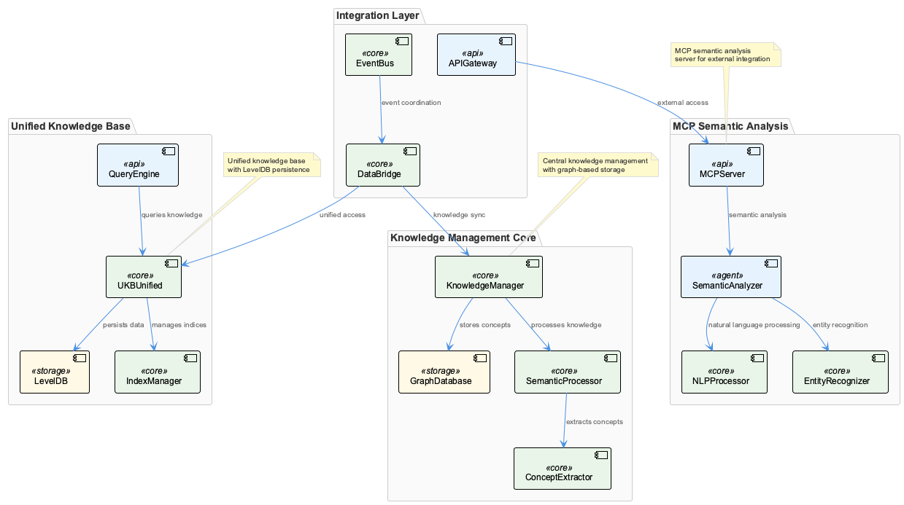
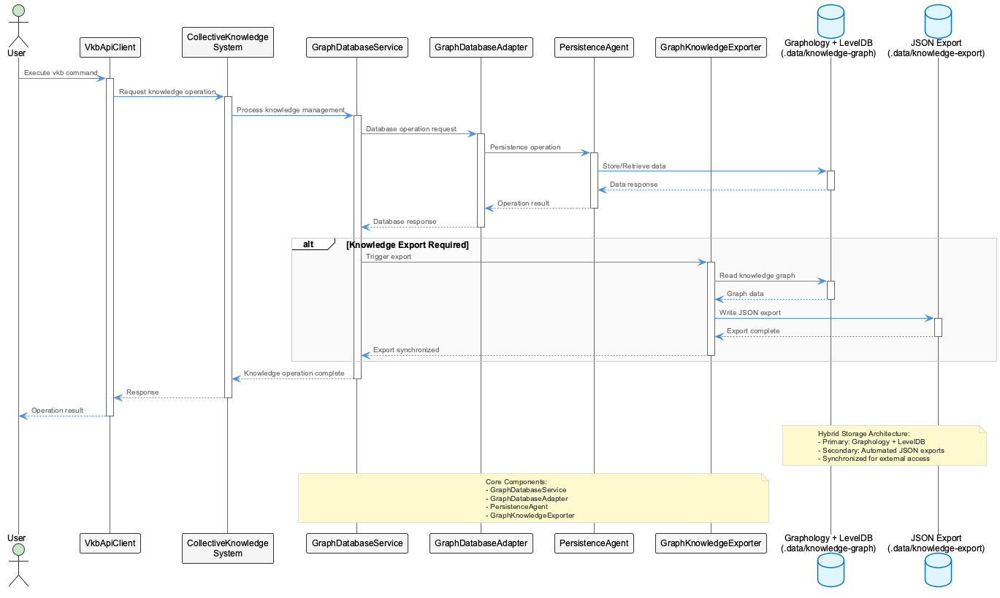
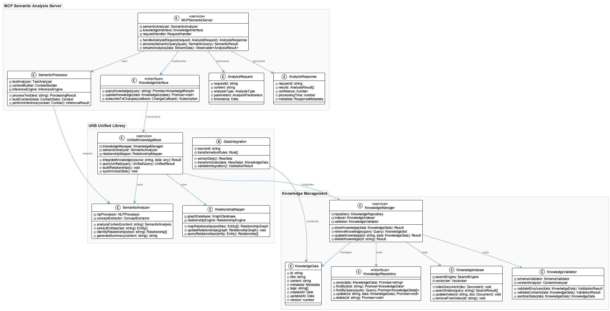
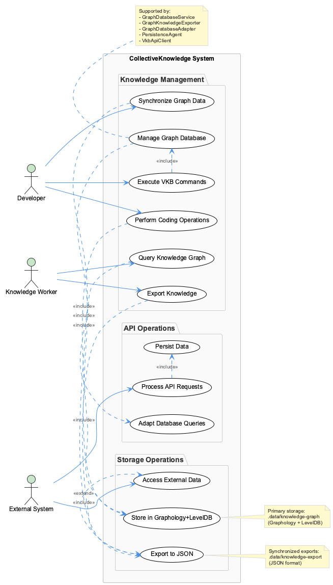

# CollectiveKnowledge

**Type:** System

Knowledge management operations utilize three core commands (vkb, coding, graph-sync) and are supported by GraphDatabaseService, GraphKnowledgeExporter, GraphDatabaseAdapter, PersistenceAgent, and Vkb...

# CollectiveKnowledge System Analysis

## Architectural Patterns Identified

The CollectiveKnowledge system demonstrates a **dual-persistence architecture** that combines graph-native storage with traditional export mechanisms. This pattern reflects a sophisticated understanding of different data access patterns and consumer requirements. The primary storage layer uses Graphology with LevelDB backing, indicating a choice for performant, embedded graph operations while maintaining data durability through a proven key-value store.

The system employs a **command-driven architecture** through its three core operations (vkb, coding, graph-sync), suggesting an emphasis on discrete, well-defined operations rather than continuous streaming or real-time processing. This pattern typically indicates batch-oriented workflows where knowledge operations are intentional and bounded, allowing for better transaction management and consistency guarantees.

The distribution of components across `src/knowledge-management` and `lib/ukb-unified` directories reveals a **layered service architecture** where domain-specific knowledge management logic is separated from unified knowledge base utilities. This separation suggests the system is designed to support multiple knowledge domains or contexts while sharing common infrastructure.

## Design Decisions and Trade-offs

The hybrid storage approach represents a significant architectural trade-off between **performance and accessibility**. The Graphology + LevelDB combination optimizes for complex graph traversals and relationship queries within the application runtime, while the synchronized JSON exports in `.data/knowledge-export` sacrifice storage efficiency for universal data access. This dual approach acknowledges that knowledge systems must serve both algorithmic consumers requiring rich graph semantics and external integrations needing standard data formats.

The choice of LevelDB as the persistence backing indicates a preference for **operational simplicity over distributed scalability**. LevelDB provides excellent single-node performance and reliability but constrains the system to vertical scaling approaches. This suggests the system prioritizes deployment simplicity and consistency over horizontal scale-out capabilities, which aligns with knowledge management systems where data integrity often trumps raw throughput requirements.

The automated synchronization between storage layers introduces **eventual consistency concerns** but provides resilience against format-specific failures. If either the graph database or export mechanism fails, the system can potentially recover or continue operating in a degraded mode.

## System Structure Insights

The component architecture reveals a well-structured separation of concerns through specialized services. The GraphDatabaseService likely handles core graph operations and query processing, while the GraphKnowledgeExporter manages the translation between internal graph representations and external formats. This separation allows each component to optimize for its specific responsibilities without coupling storage concerns to export logic.

The GraphDatabaseAdapter pattern suggests the system is designed with **storage backend flexibility** in mind, despite currently using a specific LevelDB implementation. This abstraction layer would facilitate future migrations to different graph databases or storage technologies without requiring changes to higher-level knowledge management logic.

The PersistenceAgent and VkbApiClient components indicate the system supports both local persistence operations and remote API interactions, suggesting a **hybrid deployment model** where knowledge can be managed locally but synchronized or shared through API endpoints.

## Scalability Considerations

The current architecture presents both opportunities and constraints for scaling. The LevelDB foundation provides excellent single-node performance characteristics but creates a clear boundary for horizontal scaling. As knowledge graphs grow in size and complexity, the system may encounter memory and storage limitations that cannot be addressed through distribution.

However, the export synchronization mechanism provides a potential scaling pathway through **read replica strategies**. Multiple consuming systems could work against the JSON exports while a single authoritative instance manages the graph database, distributing query load while maintaining write consistency.

The command-driven interface design supports scaling through **operation queuing and batching**. The discrete nature of vkb, coding, and graph-sync operations means they could potentially be distributed across multiple workers or scheduled for optimal resource utilization as operational volumes grow.

## Maintainability Assessment

The system demonstrates strong maintainability characteristics through its modular component design and clear separation between storage and access layers. The abstraction provided by GraphDatabaseAdapter creates a stable interface that should isolate most of the system from changes to underlying storage implementation details.

The dual-persistence approach, while adding complexity, actually enhances **operational maintainability** by providing multiple data recovery paths and reducing vendor lock-in to specific graph database technologies. The JSON exports serve as both an integration mechanism and a human-readable backup format.

The distributed component architecture across multiple directories suggests good **code organization** but may require careful dependency management to prevent circular references or tight coupling between knowledge management operations and unified knowledge base utilities. The success of this architecture depends heavily on maintaining clean interfaces between these layers.

The command-based operation model provides excellent **debugging and auditing capabilities**, as discrete operations can be logged, replayed, and tested independently. This design choice significantly reduces the complexity of troubleshooting knowledge management workflows compared to systems with more complex state machines or event-driven architectures.

## Diagrams

### Architecture

### Sequence

### Class

### Use cases

---

*Generated from 2 observations*
