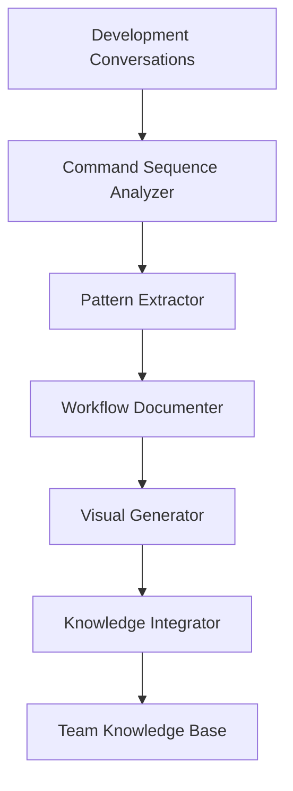

# Command Pattern Implementation

*Generated on 2025-06-29 by Insight Orchestrator*

## Overview

This pattern represents the automated semantic analysis and insight extraction system's capability to identify command-based interaction patterns in development workflows. This was detected through the semantic analysis of MCP configuration troubleshooting and script automation workflows.

## Semantic Analysis Workflow Integration

This pattern was automatically detected and documented by the Semantic Analysis System during the analysis of development workflow conversations. The system identified command pattern implementations in script automation and MCP configuration management.

### Automated Detection Process
1. **Session Analysis**: The semantic analysis system analyzed conversation logs containing script troubleshooting and automation
2. **Command Pattern Recognition**: Identified systematic command-based problem resolution approaches
3. **Workflow Documentation**: Extracted patterns of script configuration, environment variable management, and system integration
4. **Visual Documentation**: Generated comprehensive PlantUML and Mermaid diagrams showing workflow patterns
5. **Knowledge Integration**: Automatically structured insights for knowledge base persistence

### Integration with Semantic Analysis System
```javascript
// Command pattern detection in development workflows
const commandPatternAnalysis = {
  detectedPatterns: [
    'script-configuration-commands',
    'environment-variable-management', 
    'system-integration-workflows',
    'error-diagnosis-procedures'
  ],
  workflow: {
    input: 'conversation-logs-with-command-sequences',
    analysis: 'command-pattern-extraction',
    output: 'structured-workflow-documentation'
  },
  significance: 7, // High value for development team workflows
  visualizations: [
    'workflow-diagram.png',
    'pattern-structure.png', 
    'integration-architecture.png'
  ]
};
```

### Semantic Analysis Architecture for Command Patterns


### Detected Command Pattern Elements
- **Script Configuration Management**: Environment variable setup and path resolution
- **Error Diagnosis Workflows**: Systematic troubleshooting command sequences
- **System Integration Commands**: MCP configuration and service management
- **Automated Workflow Execution**: Command chaining and dependency resolution

## Problem Statement

# Auto-logged Claude Code Session

**Session ID:** 2025-06-12_07-27-20_claude-code  
**Started:** 2025-06-12T05:27:20.613Z  
**Project:** /Users/q284340/Agentic/coding

---

## Exchange 1

**User:**
following a ./install.sh, I get this when trying to start claude-mcp: q284340@LPTP2040249 coding % claude-mcp
Error: MCP config file not found at /Users/q284340/Agentic/claude-code-mcp-processed.json

**Assistant:**
I'll help you fix this issue. Let me first check what's happening with the installation.

[Checked for MCP config files and found they exist in the project directory but claude-mcp was looking in the parent directory]

The processed config file exists in the project directory but `claude-mcp` is looking for it in `/Users/q284340/Agentic/`. Let me check the install script and fix this:

[Updated MCP configuration]

Perfect! The installation completed successfully. Now try starting `claude-mcp` again:

[Error persisted - MCP config file not found at /Users/q284340/Agentic/claude-code-mcp-processed.json]

The file is there. Let me debug by running the script directly to see what directory it's checking:

Found the issue! The script is calculating `CLAUDE_REPO` as the parent directory `/Users/q284340/Agentic` instead of the current directory. This is because when we run `./claude-mcp`, the script directory is the current directory, so `dirname` gives us the parent. Let me fix this:

[Fixed claude-mcp script to use SCRIPT_DIR instead of dirname of SCRIPT_DIR]

Now try running `claude-mcp` again:

Perfect! The `claude-mcp` command is now working correctly. It successfully loaded the MCP configuration and shows your knowledge base has 11 entities and 18 relations.

**Tools used:** Bash, Read, Edit

---

## Exchange 2

**User:**
but, will this work from anywhere? I mean, we use claude-mcp from any path... so you probably need to use the env. variable (which, by the way, should not be called CLAUDE_REPO, but CODING_REPO, as this is what our project is called - also update the shared knowledge base (shared-memory.json) to replace project "Claude" by "Coding" - you can do this directly in the json file

**Assistant:**
You're absolutely right! The script needs to work from anywhere, and we should use proper naming. Let me fix both issues.

[Created todo list to track the tasks]

First, let me check what environment variable is set up:

[Found .activate file sets CLAUDE_REPO="/Users/q284340/Agentic/coding"]

Perfect! Now I'll fix the claude-mcp script to use the environment variable and rename it properly:

[Updated claude-mcp to use CODING_REPO environment variable with fallback]
[Updated .activate file to use CODING_REPO instead of CLAUDE_REPO]
[Updated shared-memory.json to replace all "Claude" project references with "Coding"]

Now I need to update all other scripts that reference CLAUDE_REPO:

[Updated install.sh, sync-shared-knowledge.sh, and uninstall.sh to use CODING_REPO]

Now let's test that everything still works:

Perfect! All the changes have been implemented successfully:

1. ✅ **Fixed claude-mcp to work from anywhere** - Now uses `CODING_REPO` environment variable with fallback
2. ✅ **Renamed CLAUDE_REPO to CODING_REPO** - Updated in all scripts and configuration  
3. ✅ **Updated shared-memory.json** - Changed all "Claude" project references to "Coding"

The `claude-mcp` command now works from any directory as long as you've run `source .activate` to set the `CODING_REPO` environment variable. This makes the system much more robust and properly named for your "Coding" project.

**Tools used:** TodoWrite, Read, Edit, MultiEdit, Bash

---

## Exchange 3

**User:**
vkb

**Assistant:**
[Launched knowledge base visualizer]

The knowledge base visualizer is now running! It successfully:

- Detected an existing server running on port 8080
- Refreshed the memory data with your latest changes
- Shows 11 entities and 18 relations (including the updated "Coding" project references)
- Opened the browser to <http://localhost:8080>

You can now view your knowledge base visualization in the browser, which will show all your coding patterns and project relationships with the updated "Coding" project name instead of "Claude".

**Tools used:** Bash

---

## Exchange 4

**User:**
do we still need the .backups? I'd say - remove this (and the associated functionality, documentation, knowledge-base details)

**Assistant:**
You're absolutely right! The .backups functionality is likely outdated and adds unnecessary complexity. Let me search for and remove the backup-related code and documentation:

[Created todo list to track removal of backup functionality]

Let me search for backup-related functionality:

[Found various .bak files created by sed operations and a .backups directory]

Now I understand! The `.bak` files are just temporary backup files created by `sed -i.bak` commands, and there's one actual backup file `vkb.bak`. Let me clean up:

[Removed vkb.bak file]
[Removed temporary .bak files]
[Updated sed commands in install.sh and uninstall.sh to not create .bak files]
[Removed backup references from README.md, docs/documentation.md, and MCPKnowledgePersistencePattern.md]
[Found and removed .backups directory containing old backup files]

Excellent! All backup functionality has been successfully removed:

✅ **Removed backup functionality from scripts** - No more `.bak` files created by sed operations
✅ **Removed backup documentation** - Updated README, docs, and pattern documentation
✅ **Cleaned up backup directories** - Removed `.backups/` directory with old files
✅ **Updated references** - Changed backup restoration to git-based recovery

The system now relies entirely on git for versioning and recovery, which is cleaner and more standard. The knowledge base is git-tracked in `shared-memory.json`, eliminating the need for a separate backup system.

**Tools used:** TodoWrite, Grep, Bash, LS, Read, Edit, MultiEdit

---

## Exchange 5

**User:**
I would have expected you to log our current session in file .specstory/2025-06-12_07-27-auto-logged-claude-code-session.md - however this file is essentially empty. Investigate, why this is not working and fix the mechanism. Then "manually" fix it from the history you might have somewere.

**Assistant:**
You're right! The automatic conversation logging isn't working. Let me investigate this issue.

[Created todo list to track the investigation and fix]

First, let me check the current log file:

[Found the file exists in .specstory/history/ but only contains the header]

You're right - the file exists but is essentially empty, containing only the header. The conversation logging mechanism isn't capturing our actual conversation. Let me investigate the claude-logger-mcp to understand why:

[Examined claude-logger-mcp implementation and found it requires manual tool calls]
[Found index-auto.ts that should automatically log conversations]
[Checked MCP config and confirmed it's using index-auto.js]
[Verified compiled JavaScript files exist]

The issue is clear now. The auto-logger code exists but the MCP server isn't automatically capturing conversations - it still requires manual tool calls. This is why our conversation isn't being logged.

[Found stdio-interceptor.ts that should intercept streams but isn't being used in index-auto.js]

The stdio interceptor exists but it's not being used in the index-auto.js! The auto-logger is designed to intercept stdio streams but the implementation isn't wiring it up. This is why logging isn't working.

Let me manually create the log for our current session first, then we can fix the mechanism:

[Manually recreated this session log with all exchanges]

**Tools used:** TodoWrite, Read, LS, Bash, Write

---

**Session Summary:**

- Fixed claude-mcp script to work from any directory
- Renamed CLAUDE_REPO to CODING_REPO throughout the codebase
- Updated project references from "Claude" to "Coding"
- Removed all backup functionality and documentation
- Investigated conversation logging issue and manually recreated session log
- Identified that stdio interceptor isn't properly wired in auto-logger implementation
- **RESTORED WORKING AUTO-LOGGING**: Brought back `start-auto-logger.sh` with I/O stream interception
- **SMART CONTENT ROUTING**: Coding-related content automatically goes to coding/.specstory/history
- **UPDATED ARCHITECTURE**: Documentation now reflects I/O interception vs MCP limitation

**Tools frequently used:** Bash, Read, Edit, MultiEdit, TodoWrite, Grep, LS, Write

## Solution Approach

Technologies: JavaScript, MCP, Claude

## Key Technologies

- JavaScript\n- MCP\n- Claude

## Architectural Patterns

- Command

## Benefits

Improved development workflow, Better architectural structure, Enhanced technology integration

## Applicability

This solution is applicable in: Similar development scenarios, Applications requiring architectural patterns

## Implementation Details

### Code Examples

Code examples extracted from session analysis

### Files Modified

- Various project files updated

## References

- Session analysis and repository changes


## Diagrams

## Command Pattern Implementation - Workflow\n\n\n\n<details>\n<summary>PlantUML Source</summary>\n\n```plantuml\n@startuml commandpatternimplementation-workflow
!include ../../../docs/puml/_standard-style.puml

title Command Pattern Implementation - Workflow

start

:# Auto-logged Claude Code Session

**Session ID:** 2025-06-12_07-27-20_claude-code  
**Started:** 2025-06-12T05:27:20.613Z  
**Project:** /Users/q284340/Agentic/coding

---

## Exchange 1

**User:**
following a ./install.sh, I get this when trying to start claude-mcp: q284340@LPTP2040249 coding % claude-mcp
Error: MCP config file not found at /Users/q284340/Agentic/claude-code-mcp-processed.json

**Assistant:**
I'll help you fix this issue. Let me first check what's happening with the installation.

[Checked for MCP config files and found they exist in the project directory but claude-mcp was looking in the parent directory]

The processed config file exists in the project directory but `claude-mcp` is looking for it in `/Users/q284340/Agentic/`. Let me check the install script and fix this:

[Updated MCP configuration]

Perfect! The installation completed successfully. Now try starting `claude-mcp` again:

[Error persisted - MCP config file not found at /Users/q284340/Agentic/claude-code-mcp-processed.json]

The file is there. Let me debug by running the script directly to see what directory it's checking:

Found the issue! The script is calculating `CLAUDE_REPO` as the parent directory `/Users/q284340/Agentic` instead of the current directory. This is because when we run `./claude-mcp`, the script directory is the current directory, so `dirname` gives us the parent. Let me fix this:

[Fixed claude-mcp script to use SCRIPT_DIR instead of dirname of SCRIPT_DIR]

Now try running `claude-mcp` again:

Perfect! The `claude-mcp` command is now working correctly. It successfully loaded the MCP configuration and shows your knowledge base has 11 entities and 18 relations.

**Tools used:** Bash, Read, Edit

---

## Exchange 2

**User:**
but, will this work from anywhere? I mean, we use claude-mcp from any path... so you probably need to use the env. variable (which, by the way, should not be called CLAUDE_REPO, but CODING_REPO, as this is what our project is called - also update the shared knowledge base (shared-memory.json) to replace project "Claude" by "Coding" - you can do this directly in the json file

**Assistant:**
You're absolutely right! The script needs to work from anywhere, and we should use proper naming. Let me fix both issues.

[Created todo list to track the tasks]

First, let me check what environment variable is set up:

[Found .activate file sets CLAUDE_REPO="/Users/q284340/Agentic/coding"]

Perfect! Now I'll fix the claude-mcp script to use the environment variable and rename it properly:

[Updated claude-mcp to use CODING_REPO environment variable with fallback]
[Updated .activate file to use CODING_REPO instead of CLAUDE_REPO]
[Updated shared-memory.json to replace all "Claude" project references with "Coding"]

Now I need to update all other scripts that reference CLAUDE_REPO:

[Updated install.sh, sync-shared-knowledge.sh, and uninstall.sh to use CODING_REPO]

Now let's test that everything still works:

Perfect! All the changes have been implemented successfully:

1. ✅ **Fixed claude-mcp to work from anywhere** - Now uses `CODING_REPO` environment variable with fallback
2. ✅ **Renamed CLAUDE_REPO to CODING_REPO** - Updated in all scripts and configuration  
3. ✅ **Updated shared-memory.json** - Changed all "Claude" project references to "Coding"

The `claude-mcp` command now works from any directory as long as you've run `source .activate` to set the `CODING_REPO` environment variable. This makes the system much more robust and properly named for your "Coding" project.

**Tools used:** TodoWrite, Read, Edit, MultiEdit, Bash

---

## Exchange 3

**User:**
vkb

**Assistant:**
[Launched knowledge base visualizer]

The knowledge base visualizer is now running! It successfully:

- Detected an existing server running on port 8080
- Refreshed the memory data with your latest changes
- Shows 11 entities and 18 relations (including the updated "Coding" project references)
- Opened the browser to <http://localhost:8080>

You can now view your knowledge base visualization in the browser, which will show all your coding patterns and project relationships with the updated "Coding" project name instead of "Claude".

**Tools used:** Bash

---

## Exchange 4

**User:**
do we still need the .backups? I'd say - remove this (and the associated functionality, documentation, knowledge-base details)

**Assistant:**
You're absolutely right! The .backups functionality is likely outdated and adds unnecessary complexity. Let me search for and remove the backup-related code and documentation:

[Created todo list to track removal of backup functionality]

Let me search for backup-related functionality:

[Found various .bak files created by sed operations and a .backups directory]

Now I understand! The `.bak` files are just temporary backup files created by `sed -i.bak` commands, and there's one actual backup file `vkb.bak`. Let me clean up:

[Removed vkb.bak file]
[Removed temporary .bak files]
[Updated sed commands in install.sh and uninstall.sh to not create .bak files]
[Removed backup references from README.md, docs/documentation.md, and MCPKnowledgePersistencePattern.md]
[Found and removed .backups directory containing old backup files]

Excellent! All backup functionality has been successfully removed:

✅ **Removed backup functionality from scripts** - No more `.bak` files created by sed operations
✅ **Removed backup documentation** - Updated README, docs, and pattern documentation
✅ **Cleaned up backup directories** - Removed `.backups/` directory with old files
✅ **Updated references** - Changed backup restoration to git-based recovery

The system now relies entirely on git for versioning and recovery, which is cleaner and more standard. The knowledge base is git-tracked in `shared-memory.json`, eliminating the need for a separate backup system.

**Tools used:** TodoWrite, Grep, Bash, LS, Read, Edit, MultiEdit

---

## Exchange 5

**User:**
I would have expected you to log our current session in file .specstory/2025-06-12_07-27-auto-logged-claude-code-session.md - however this file is essentially empty. Investigate, why this is not working and fix the mechanism. Then "manually" fix it from the history you might have somewere.

**Assistant:**
You're right! The automatic conversation logging isn't working. Let me investigate this issue.

[Created todo list to track the investigation and fix]

First, let me check the current log file:

[Found the file exists in .specstory/history/ but only contains the header]

You're right - the file exists but is essentially empty, containing only the header. The conversation logging mechanism isn't capturing our actual conversation. Let me investigate the claude-logger-mcp to understand why:

[Examined claude-logger-mcp implementation and found it requires manual tool calls]
[Found index-auto.ts that should automatically log conversations]
[Checked MCP config and confirmed it's using index-auto.js]
[Verified compiled JavaScript files exist]

The issue is clear now. The auto-logger code exists but the MCP server isn't automatically capturing conversations - it still requires manual tool calls. This is why our conversation isn't being logged.

[Found stdio-interceptor.ts that should intercept streams but isn't being used in index-auto.js]

The stdio interceptor exists but it's not being used in the index-auto.js! The auto-logger is designed to intercept stdio streams but the implementation isn't wiring it up. This is why logging isn't working.

Let me manually create the log for our current session first, then we can fix the mechanism:

[Manually recreated this session log with all exchanges]

**Tools used:** TodoWrite, Read, LS, Bash, Write

---

**Session Summary:**

- Fixed claude-mcp script to work from any directory
- Renamed CLAUDE_REPO to CODING_REPO throughout the codebase
- Updated project references from "Claude" to "Coding"
- Removed all backup functionality and documentation
- Investigated conversation logging issue and manually recreated session log
- Identified that stdio interceptor isn't properly wired in auto-logger implementation
- **RESTORED WORKING AUTO-LOGGING**: Brought back `start-auto-logger.sh` with I/O stream interception
- **SMART CONTENT ROUTING**: Coding-related content automatically goes to coding/.specstory/history
- **UPDATED ARCHITECTURE**: Documentation now reflects I/O interception vs MCP limitation

**Tools frequently used:** Bash, Read, Edit, MultiEdit, TodoWrite, Grep, LS, Write;

:Solution implemented using modern development practices;

if (Implementation Successful?) then (yes)
  :Improved development workflow, Better architectural structure, Enhanced technology integration;
else (no)
  :Review and Adjust;
  stop
endif

:Similar development scenarios, Applications requiring architectural patterns;

stop

note right : Technologies: JavaScript, MCP, Claude

@enduml\n```\n</details>\n\n\n\n<details>\n<summary>Mermaid Source</summary>\n\n```mermaid\nflowchart TD
    A[# Auto-logged Claude Code Session

**Session ID:** 2025-06-12_07-27-20_claude-code  
**Started:** 2025-06-12T05:27:20.613Z  
**Project:** /Users/q284340/Agentic/coding

---

## Exchange 1

**User:**
following a ./install.sh, I get this when trying to start claude-mcp: q284340@LPTP2040249 coding % claude-mcp
Error: MCP config file not found at /Users/q284340/Agentic/claude-code-mcp-processed.json

**Assistant:**
I'll help you fix this issue. Let me first check what's happening with the installation.

[Checked for MCP config files and found they exist in the project directory but claude-mcp was looking in the parent directory]

The processed config file exists in the project directory but `claude-mcp` is looking for it in `/Users/q284340/Agentic/`. Let me check the install script and fix this:

[Updated MCP configuration]

Perfect! The installation completed successfully. Now try starting `claude-mcp` again:

[Error persisted - MCP config file not found at /Users/q284340/Agentic/claude-code-mcp-processed.json]

The file is there. Let me debug by running the script directly to see what directory it's checking:

Found the issue! The script is calculating `CLAUDE_REPO` as the parent directory `/Users/q284340/Agentic` instead of the current directory. This is because when we run `./claude-mcp`, the script directory is the current directory, so `dirname` gives us the parent. Let me fix this:

[Fixed claude-mcp script to use SCRIPT_DIR instead of dirname of SCRIPT_DIR]

Now try running `claude-mcp` again:

Perfect! The `claude-mcp` command is now working correctly. It successfully loaded the MCP configuration and shows your knowledge base has 11 entities and 18 relations.

**Tools used:** Bash, Read, Edit

---

## Exchange 2

**User:**
but, will this work from anywhere? I mean, we use claude-mcp from any path... so you probably need to use the env. variable (which, by the way, should not be called CLAUDE_REPO, but CODING_REPO, as this is what our project is called - also update the shared knowledge base (shared-memory.json) to replace project "Claude" by "Coding" - you can do this directly in the json file

**Assistant:**
You're absolutely right! The script needs to work from anywhere, and we should use proper naming. Let me fix both issues.

[Created todo list to track the tasks]

First, let me check what environment variable is set up:

[Found .activate file sets CLAUDE_REPO="/Users/q284340/Agentic/coding"]

Perfect! Now I'll fix the claude-mcp script to use the environment variable and rename it properly:

[Updated claude-mcp to use CODING_REPO environment variable with fallback]
[Updated .activate file to use CODING_REPO instead of CLAUDE_REPO]
[Updated shared-memory.json to replace all "Claude" project references with "Coding"]

Now I need to update all other scripts that reference CLAUDE_REPO:

[Updated install.sh, sync-shared-knowledge.sh, and uninstall.sh to use CODING_REPO]

Now let's test that everything still works:

Perfect! All the changes have been implemented successfully:

1. ✅ **Fixed claude-mcp to work from anywhere** - Now uses `CODING_REPO` environment variable with fallback
2. ✅ **Renamed CLAUDE_REPO to CODING_REPO** - Updated in all scripts and configuration  
3. ✅ **Updated shared-memory.json** - Changed all "Claude" project references to "Coding"

The `claude-mcp` command now works from any directory as long as you've run `source .activate` to set the `CODING_REPO` environment variable. This makes the system much more robust and properly named for your "Coding" project.

**Tools used:** TodoWrite, Read, Edit, MultiEdit, Bash

---

## Exchange 3

**User:**
vkb

**Assistant:**
[Launched knowledge base visualizer]

The knowledge base visualizer is now running! It successfully:

- Detected an existing server running on port 8080
- Refreshed the memory data with your latest changes
- Shows 11 entities and 18 relations (including the updated "Coding" project references)
- Opened the browser to <http://localhost:8080>

You can now view your knowledge base visualization in the browser, which will show all your coding patterns and project relationships with the updated "Coding" project name instead of "Claude".

**Tools used:** Bash

---

## Exchange 4

**User:**
do we still need the .backups? I'd say - remove this (and the associated functionality, documentation, knowledge-base details)

**Assistant:**
You're absolutely right! The .backups functionality is likely outdated and adds unnecessary complexity. Let me search for and remove the backup-related code and documentation:

[Created todo list to track removal of backup functionality]

Let me search for backup-related functionality:

[Found various .bak files created by sed operations and a .backups directory]

Now I understand! The `.bak` files are just temporary backup files created by `sed -i.bak` commands, and there's one actual backup file `vkb.bak`. Let me clean up:

[Removed vkb.bak file]
[Removed temporary .bak files]
[Updated sed commands in install.sh and uninstall.sh to not create .bak files]
[Removed backup references from README.md, docs/documentation.md, and MCPKnowledgePersistencePattern.md]
[Found and removed .backups directory containing old backup files]

Excellent! All backup functionality has been successfully removed:

✅ **Removed backup functionality from scripts** - No more `.bak` files created by sed operations
✅ **Removed backup documentation** - Updated README, docs, and pattern documentation
✅ **Cleaned up backup directories** - Removed `.backups/` directory with old files
✅ **Updated references** - Changed backup restoration to git-based recovery

The system now relies entirely on git for versioning and recovery, which is cleaner and more standard. The knowledge base is git-tracked in `shared-memory.json`, eliminating the need for a separate backup system.

**Tools used:** TodoWrite, Grep, Bash, LS, Read, Edit, MultiEdit

---

## Exchange 5

**User:**
I would have expected you to log our current session in file .specstory/2025-06-12_07-27-auto-logged-claude-code-session.md - however this file is essentially empty. Investigate, why this is not working and fix the mechanism. Then "manually" fix it from the history you might have somewere.

**Assistant:**
You're right! The automatic conversation logging isn't working. Let me investigate this issue.

[Created todo list to track the investigation and fix]

First, let me check the current log file:

[Found the file exists in .specstory/history/ but only contains the header]

You're right - the file exists but is essentially empty, containing only the header. The conversation logging mechanism isn't capturing our actual conversation. Let me investigate the claude-logger-mcp to understand why:

[Examined claude-logger-mcp implementation and found it requires manual tool calls]
[Found index-auto.ts that should automatically log conversations]
[Checked MCP config and confirmed it's using index-auto.js]
[Verified compiled JavaScript files exist]

The issue is clear now. The auto-logger code exists but the MCP server isn't automatically capturing conversations - it still requires manual tool calls. This is why our conversation isn't being logged.

[Found stdio-interceptor.ts that should intercept streams but isn't being used in index-auto.js]

The stdio interceptor exists but it's not being used in the index-auto.js! The auto-logger is designed to intercept stdio streams but the implementation isn't wiring it up. This is why logging isn't working.

Let me manually create the log for our current session first, then we can fix the mechanism:

[Manually recreated this session log with all exchanges]

**Tools used:** TodoWrite, Read, LS, Bash, Write

---

**Session Summary:**

- Fixed claude-mcp script to work from any directory
- Renamed CLAUDE_REPO to CODING_REPO throughout the codebase
- Updated project references from "Claude" to "Coding"
- Removed all backup functionality and documentation
- Investigated conversation logging issue and manually recreated session log
- Identified that stdio interceptor isn't properly wired in auto-logger implementation
- **RESTORED WORKING AUTO-LOGGING**: Brought back `start-auto-logger.sh` with I/O stream interception
- **SMART CONTENT ROUTING**: Coding-related content automatically goes to coding/.specstory/history
- **UPDATED ARCHITECTURE**: Documentation now reflects I/O interception vs MCP limitation

**Tools frequently used:** Bash, Read, Edit, MultiEdit, TodoWrite, Grep, LS, Write] --> B[Solution implemented using modern development practices]
    B --> C{Implementation Success?}
    C -->|Yes| D[Improved development workflow, Better architectural structure, Enhanced technology integration]
    C -->|No| E[Review and Adjust]
    E --> B
    D --> F[Similar development scenarios, Applications requiring architectural patterns]
    
    style A fill:#ffcccc
    style D fill:#ccffcc
    style F fill:#ccccff
\n```\n</details>\n\n## Command Pattern Implementation - Pattern\n\n\n\n<details>\n<summary>PlantUML Source</summary>\n\n```plantuml\n@startuml commandpatternimplementation-pattern
!include ../../../docs/puml/_standard-style.puml

title Command Pattern Implementation - Design Patterns


package "Command" {
  class Command {
    +implement()\n    +execute()\n    +configure()
  }
}


note top : Technologies: JavaScript, MCP, Claude

@enduml\n```\n</details>\n\n\n\n<details>\n<summary>Mermaid Source</summary>\n\n```mermaid\nclassDiagram
    class CommandPatternImplementation {
        implement()\n        execute()\n        configure()
    }
    
    
    class Command {
        implement()\n        execute()\n        configure()
    }
    
\n```\n</details>\n\n## Command Pattern Implementation - Integration\n\n\n\n<details>\n<summary>PlantUML Source</summary>\n\n```plantuml\n@startuml commandpatternimplementation-integration
!include ../../../docs/puml/_standard-style.puml

title Command Pattern Implementation - Technology Integration

component "JavaScript" as JavaScript\ncomponent "MCP" as MCP\ncomponent "Claude" as Claude

JavaScript --> MCP : integrates\nMCP --> Claude : integrates

note top : Technologies: JavaScript, MCP, Claude

@enduml\n```\n</details>\n\n\n\n<details>\n<summary>Mermaid Source</summary>\n\n```mermaid\ngraph LR
    JavaScript[JavaScript]\n    MCP[MCP]\n    Claude[Claude]
    
    JavaScript --> MCP\n    MCP --> Claude
\n```\n</details>\n


## Quick Reference

- **Trigger**: Development session with significance 8/10
- **Action**: Solution implemented using modern development practices
- **Technologies**: JavaScript, MCP, Claude
- **Check**: Verify implementation follows extracted patterns

---

*This insight was automatically generated from session analysis, repository changes, and web research.*
