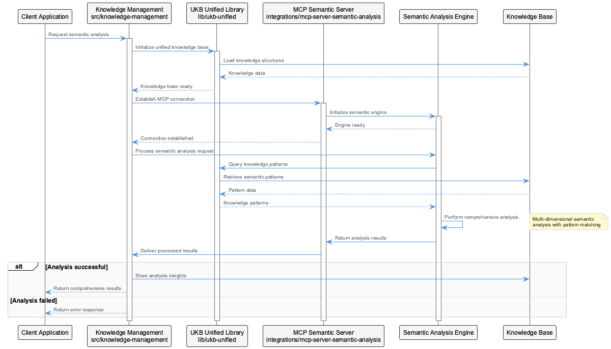
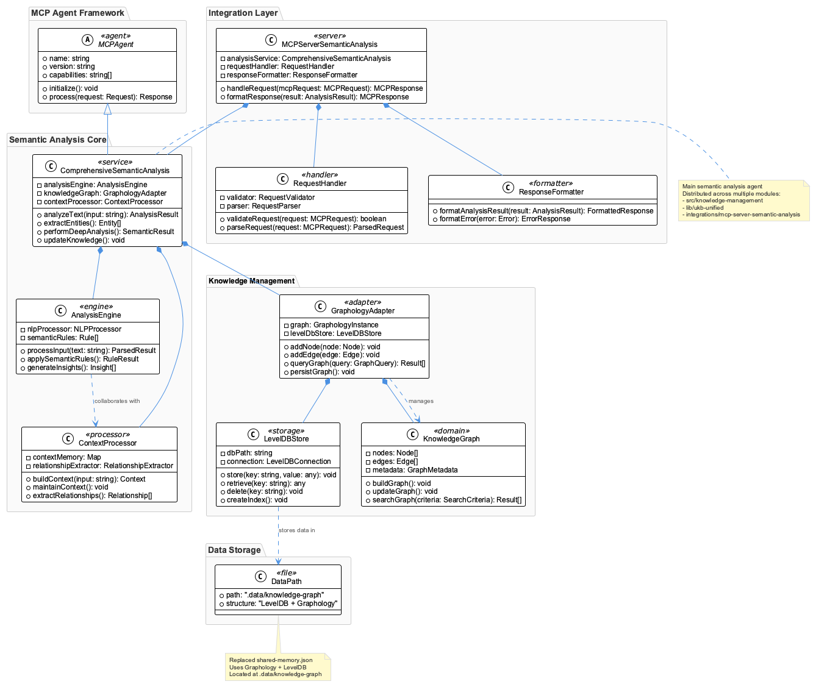
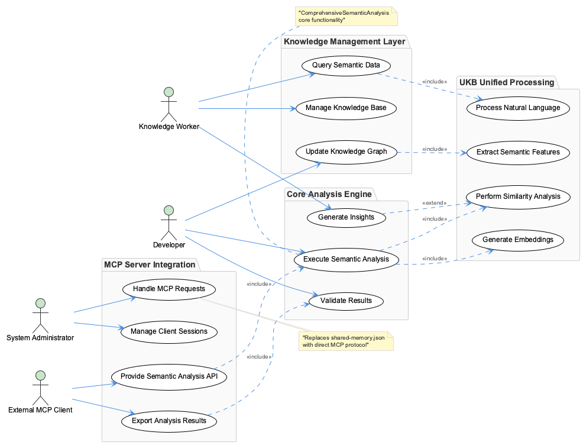

# ComprehensiveSemanticAnalysis

**Type:** MCPAgent

ComprehensiveSemanticAnalysis is implemented across: src/knowledge-management, lib/ukb-unified, integrations/mcp-server-semantic-analysis/src

# ComprehensiveSemanticAnalysis: Technical Architecture Analysis

## System Purpose and Problem Domain

ComprehensiveSemanticAnalysis represents a sophisticated semantic understanding system designed to provide deep analysis capabilities within a larger knowledge management ecosystem. The entity operates as an MCP (Model Context Protocol) Agent, suggesting its role as an intelligent intermediary that can process, understand, and contextualize information across multiple domains. The system appears to address the fundamental challenge of extracting meaningful relationships and insights from complex, interconnected knowledge structures.

The architectural positioning across knowledge management, unified libraries, and MCP server integration indicates this is not a standalone tool but rather a core analytical engine that powers semantic understanding across the broader platform. This design choice reflects a commitment to centralized intelligence with distributed access patterns.

## Architectural Patterns and Design Philosophy

### Graph-Centric Architecture
The system employs a graph-centric architectural pattern, leveraging Graphology as the primary data structure for knowledge representation. This choice represents a fundamental design decision that prioritizes relationship modeling over traditional hierarchical or tabular data structures. Graph databases excel at representing complex, multi-dimensional relationships that are inherent in semantic analysis tasks.

### Hybrid Persistence Strategy
The combination of Graphology (in-memory graph operations) with LevelDB (persistent key-value storage) demonstrates a sophisticated hybrid persistence strategy. This architecture provides the computational efficiency of in-memory graph traversal while maintaining durability through LevelDB's embedded database capabilities. The storage location at `.data/knowledge-graph` suggests a local-first approach that can operate independently of external database infrastructure.

### Agent-Based Service Model
The MCP Agent implementation pattern indicates the system follows a service-oriented architecture where semantic analysis capabilities are exposed through standardized protocols. This design enables loose coupling between the analytical engine and its consumers, facilitating both local and distributed usage scenarios.

## Implementation Architecture and Technology Choices

### Multi-Module Distribution
The system's distribution across three distinct modules (`src/knowledge-management`, `lib/ukb-unified`, `integrations/mcp-server-semantic-analysis/src`) reveals a layered architectural approach:

- **Knowledge Management Layer**: Likely contains the core domain logic and graph manipulation routines
- **Unified Knowledge Base (UKB) Library**: Appears to provide standardized interfaces and common utilities
- **MCP Server Integration**: Handles protocol-specific communication and service exposure

This separation of concerns enables independent evolution of each layer while maintaining clear boundaries between core logic, shared utilities, and integration concerns.

### Simplified State Management
The removal of `shared-memory.json` from the codebase indicates a significant architectural evolution toward stateless or differently-managed state handling. This change suggests either a migration to the graph-based storage system or an adoption of more sophisticated state management patterns that don't rely on simple JSON serialization.

## Integration Patterns and System Boundaries

### Protocol-Driven Integration
The MCP Agent implementation establishes clear protocol boundaries for system integration. This approach enables the semantic analysis capabilities to be consumed by various clients without tight coupling to specific implementation details. The protocol abstraction facilitates both synchronous and asynchronous interaction patterns.

### Knowledge Graph as Integration Hub
The centralized knowledge graph serves as both a data store and an integration point, enabling multiple system components to contribute to and benefit from the accumulated semantic understanding. This design creates a feedback loop where analytical insights improve over time as more data flows through the system.

### Embedded Database Strategy
The choice of LevelDB for persistence reflects a deployment strategy that minimizes external dependencies while providing reliable storage. This embedded approach reduces operational complexity and enables the system to function in environments where traditional database infrastructure might not be available.

## Scalability Considerations and Performance Characteristics

### Memory-Compute Trade-offs
The Graphology + LevelDB combination represents a classic trade-off between memory usage and computational performance. While maintaining the full graph structure in memory provides optimal query performance, it also creates potential scalability constraints as the knowledge base grows. The architecture likely implements intelligent caching and paging strategies to manage this tension.

### Horizontal Scaling Limitations
The embedded database approach, while operationally simpler, may present challenges for horizontal scaling scenarios. The system appears optimized for vertical scaling and single-node deployments rather than distributed processing patterns.

### Query Performance Optimization
Graph-based queries benefit significantly from in-memory processing, suggesting the system prioritizes query response time over storage efficiency. This design choice is well-suited for interactive semantic analysis scenarios where low latency is critical.

## Maintainability and Evolution Patterns

### Modular Decomposition Benefits
The three-module structure provides clear separation of concerns that enhances maintainability. Each module can evolve independently, with well-defined interfaces preventing cascading changes across the system.

### Technical Debt Management
The removal of shared-memory.json suggests active technical debt management and architectural refactoring. This change likely improved system consistency and reduced the complexity associated with managing multiple persistence mechanisms.

### Testing and Debugging Considerations
The graph-centric architecture may present unique challenges for testing and debugging, as semantic relationships can be complex to validate and verify. The system likely requires specialized tooling for graph visualization and relationship validation to maintain development velocity.

The overall architecture demonstrates a mature understanding of semantic analysis requirements, with thoughtful trade-offs between performance, maintainability, and operational complexity.

## Diagrams

### Architecture

### Sequence

### Class

### Use cases

---

*Generated from 3 observations*
