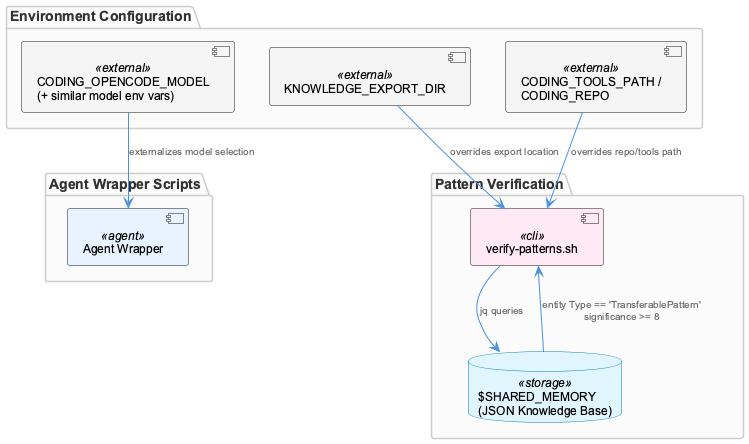
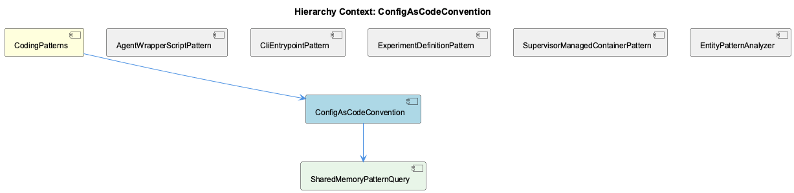

# ConfigAsCodeConvention

**Type:** SubComponent

verify-patterns.sh reads pattern definitions dynamically from a jq-queried JSON knowledge base file ($SHARED_MEMORY) filtering entities by entityType == 'TransferablePattern' and significance >= 8

# ConfigAsCodeConvention

## What It Is

ConfigAsCodeConvention is a SubComponent of the broader CodingPatterns family, capturing a recurring design principle across the Coding infrastructure: behavior and data that would traditionally be hardcoded into scripts should instead be externalized into configuration — environment variables, JSON knowledge base files, or override paths — and read dynamically at runtime. This convention is most concretely demonstrated in `scripts/knowledge-management/verify-patterns.sh`, which queries a JSON knowledge base file (`$SHARED_MEMORY`) via `jq` rather than embedding pattern names in the script itself, and in the agent wrapper scripts under `config/agents/`, which rely on environment variables like `CODING_OPENCODE_MODEL` to select model configuration.

## Architecture and Design

The architectural pattern underlying ConfigAsCodeConvention is separation of declarative configuration from imperative logic. Instead of scripts branching on hardcoded values, they resolve behavior at invocation time from three categories of external sources: (1) knowledge-base-driven data, exemplified by the child component SharedMemoryPatternQuery, (2) environment-variable-driven parameterization, exemplified by sibling AgentWrapperScriptPattern, and (3) environment-variable-driven path overrides for file locations. This mirrors the adapter-style design used by the parent component CodingPatterns, where agent wrapper scripts (claude.sh, copilot.sh, opencode.sh, pi.sh) normalize third-party CLI surfaces into a common interface — ConfigAsCodeConvention is the underlying mechanism that makes that normalization possible without code changes when new models, paths, or patterns are introduced.

The design trades a small amount of runtime overhead (invoking `jq`, resolving env vars) for significant flexibility: pattern definitions and file locations can change without touching script logic. This is consistent with the CliEntrypointPattern sibling, where `verify-patterns.sh` is a standalone entrypoint computing paths relative to `SCRIPT_DIR` — configuration externalization pairs naturally with self-contained, independently invocable scripts.

## Implementation Details

The concrete mechanics are visible in SharedMemoryPatternQuery, the child of ConfigAsCodeConvention: `verify-patterns.sh` executes `jq -r '.entities[] | select(.entityType == "TransferablePattern" and .significance >= 8) | .name' "$SHARED_MEMORY"` to extract qualifying pattern names at runtime. This query filters on two conditions — entity type and a significance threshold (>= 8) — meaning the knowledge base schema itself encodes filtering criteria that the script merely applies, rather than the script encoding pattern lists directly.

Separately, environment variables like `CODING_OPENCODE_MODEL` externalize model selection for agent wrapper scripts, avoiding hardcoded model names inside `opencode.sh` and its siblings. Similarly, `KNOWLEDGE_EXPORT_DIR` and `CODING_TOOLS_PATH`/`CODING_REPO` allow overriding default file/directory locations, decoupling the scripts from assumptions about their execution environment or repository layout.

## Integration Points

ConfigAsCodeConvention sits under CodingPatterns alongside siblings AgentWrapperScriptPattern, CliEntrypointPattern, ExperimentDefinitionPattern, SupervisorManagedContainerPattern, and EntityPatternAnalyzer. It shares direct conceptual overlap with AgentWrapperScriptPattern (both concern environment-variable-driven configuration of agent wrapper scripts) and with CliEntrypointPattern (both apply to `verify-patterns.sh`). Its child, SharedMemoryPatternQuery, implements the knowledge-base-querying half of the convention, forming a parent-child relationship where ConfigAsCodeConvention is the general principle and SharedMemoryPatternQuery is its concrete instantiation for pattern discovery.

The convention depends on the existence of a queryable JSON knowledge base (`$SHARED_MEMORY`) and on environment variables being set or defaulted appropriately (`CODING_OPENCODE_MODEL`, `KNOWLEDGE_EXPORT_DIR`, `CODING_TOOLS_PATH`, `CODING_REPO`). It contrasts with EntityPatternAnalyzer, whose `teamDirectories` Map hardcodes directory-to-team ownership — a notable exception to the config-as-code convention elsewhere in the codebase, suggesting the convention is not yet applied uniformly.

## Usage Guidelines

Developers extending scripts in this ecosystem should favor reading configuration from environment variables or the shared JSON knowledge base over hardcoding values, following the model set by `verify-patterns.sh` and the agent wrappers. When adding new pattern types or significance thresholds, changes should be made to the knowledge base data or query filters rather than embedding new logic in `verify-patterns.sh`. When adding support for a new agent or model, new environment variables should be introduced following the `CODING_*` naming convention rather than hardcoding literals into wrapper scripts. Developers should also be aware of the inconsistency represented by EntityPatternAnalyzer's hardcoded `teamDirectories`, which may be a candidate for future migration to this convention.

## Hierarchy Context

### Parent
- [CodingPatterns](./CodingPatterns.md) -- [LLM] The agent wrapper scripts under config/agents/ (claude.sh, copilot.sh, opencode.sh, pi.sh) implement a consistent adapter pattern where each script normalizes a distinct third-party CLI's invocation surface into a common interface expected by the rest of the Coding infrastructure. Rather than having callers branch on which agent is being invoked, each wrapper reads its own set of environment variables (e.g., CODING_OPENCODE_MODEL for opencode.sh) and translates them into the flags or config files that the underlying binary expects. This pattern lets orchestration code (likely in bin/coding or docs/architecture/agent-abstraction-api.md-described layers) treat all agents uniformly, at the cost of needing to keep each wrapper script in sync whenever a new common capability (like model selection or proxy routing) is added — a new developer adding agent support should look at an existing wrapper like claude.sh as the canonical template, per docs/architecture/adding-new-agent.md.

### Children
- [SharedMemoryPatternQuery](./SharedMemoryPatternQuery.md) -- verify-patterns.sh runs `jq -r '.entities[] | select(.entityType == "TransferablePattern" and .significance >= 8) | .name' "$SHARED_MEMORY"` to pull pattern names at runtime rather than hardcoding them.

### Siblings
- [AgentWrapperScriptPattern](./AgentWrapperScriptPattern.md) -- Each wrapper reads a distinct env var namespace, e.g. CODING_OPENCODE_MODEL for opencode.sh, to select model configuration without changing caller code
- [CliEntrypointPattern](./CliEntrypointPattern.md) -- scripts/knowledge-management/verify-patterns.sh acts as a standalone CLI entrypoint invoked directly rather than through a shared bin/ dispatcher, computing paths relative to SCRIPT_DIR
- [ExperimentDefinitionPattern](./ExperimentDefinitionPattern.md) -- docs/benchmarks/coding-v1/README.md and RESULTS.md describe a benchmark named coding-v1 whose configuration/results are documented separately from code, implying a declarative experiment definition
- [SupervisorManagedContainerPattern](./SupervisorManagedContainerPattern.md) -- No supervisord configuration files or Dockerfile content were present in the provided Source Files to substantiate specific observations
- [EntityPatternAnalyzer](./EntityPatternAnalyzer.md) -- EntityPatternAnalyzer.teamDirectories Map hardcodes directory-to-team ownership, e.g. 'Coding' owns src/ontology, src/knowledge-management, scripts, .specstory

---

*Generated from 3 observations*
