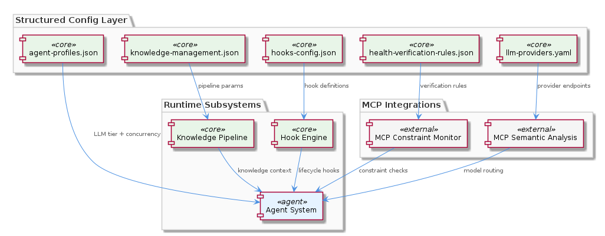
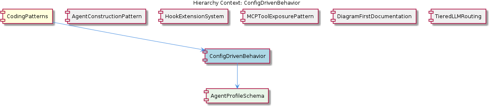

# ConfigDrivenBehavior

**Type:** SubComponent

config/knowledge-management.json and config/hooks-config.json extend the pattern to knowledge pipelines and hook definitions, establishing that every new subsystem must declare its configurable surface in a corresponding config file

# ConfigDrivenBehavior

## What It Is

ConfigDrivenBehavior is a project-wide coding pattern implemented through a suite of structured configuration files housed under the `config/` directory at the repository root, supplemented by per-integration configuration documents in `integrations/*/docs/`. The pattern materializes through concrete artifacts: `config/agent-profiles.json` for per-agent behavioral parameters, `config/health-verification-rules.json` for health check logic, `config/llm-providers.yaml` for provider-to-model-tier mappings, `config/knowledge-management.json` for knowledge pipeline configuration, and `config/hooks-config.json` for hook definitions.

As a SubComponent within the broader CodingPatterns parent, ConfigDrivenBehavior codifies a strict architectural separation between *what* the system does (behavior) and *how* it is implemented in source code. The pattern is canonical to the project: `integrations/mcp-server-semantic-analysis/docs/configuration.md` explicitly states that environment variables alone are insufficient — structured config files are the canonical source of behavioral parameters. Its single child entity, AgentProfileSchema, represents the schema contract for entries in `config/agent-profiles.json`, governing runtime behavior such as which LLM tier to use and concurrency limits for a given agent type.

## Architecture and Design

The architecture follows an **externalized configuration** pattern in which behavioral parameters are declared in JSON or YAML documents and loaded at runtime rather than compiled into source. The design distributes configuration into purpose-specific files, each owned by a particular subsystem: agent behavior in `config/agent-profiles.json`, health verification in `config/health-verification-rules.json`, LLM provider routing in `config/llm-providers.yaml`, knowledge pipelines in `config/knowledge-management.json`, and hook lifecycle definitions in `config/hooks-config.json`. This decomposition mirrors the subsystem boundaries of the project itself, providing a one-to-one correspondence between operational concerns and configuration surfaces.

The pattern interacts closely with several sibling components under CodingPatterns. It complements TieredLLMRouting, which uses `config/llm-providers.yaml` (and the accompanying `integrations/mcp-server-semantic-analysis/docs/TIERED-MODEL-PROPOSAL.md`) to classify tasks into complexity buckets before assigning a provider — a routing decision driven entirely by config, not code. It also pairs naturally with the HookExtensionSystem, whose runtime hook contract specified in `integrations/mcp-constraint-monitor/docs/CLAUDE-CODE-HOOK-FORMAT.md` is parameterized by `config/hooks-config.json`. Likewise, AgentConstructionPattern's constructor + lazy-init + execute() lifecycle is parameterized by `config/agent-profiles.json` entries that AgentProfileSchema defines.

A key design decision is that operational changes — switching a task class from a lightweight to a heavyweight model, disabling a health rule during an incident, adding a new agent type — are achievable as config-only operations. This explicitly avoids the code review cycle for changes that are operational in nature, while keeping the schema contract auditable through the config files themselves. The trade-off is that schema drift and validation become first-class concerns: a malformed JSON entry can break runtime behavior in ways a compile-time check would not catch.

## Implementation Details

Each configuration file is paired with a documented contract describing its expected structure. For LLM providers, `integrations/mcp-server-semantic-analysis/docs/configuration.md` documents how `config/llm-providers.yaml` maps provider names to model tiers and endpoints, making provider switching a config-only operation. For the constraint monitor subsystem, `integrations/mcp-constraint-monitor/docs/constraint-configuration.md` demonstrates the pattern with a dedicated configuration document per integration — establishing the convention that every integration with non-trivial behavior ships its own configuration reference.

The implementation of `config/agent-profiles.json` exemplifies the pattern's payoff: adding a new agent type requires only a new JSON entry, not a code change. The schema for these entries is captured by the child AgentProfileSchema, which encodes the per-agent parameters including LLM tier selection and concurrency limits. Similarly, `config/health-verification-rules.json` externalizes health check logic so individual rules can be disabled during incidents by editing JSON, bypassing the normal code review cycle entirely — a deliberate operational concession to incident response speed.

The mechanics rely on each subsystem reading its configuration file at startup (or on reload) and using the declared parameters to drive runtime decisions. The pattern is enforced as a convention: `config/knowledge-management.json` and `config/hooks-config.json` extend the same approach to knowledge pipelines and hooks, establishing that every new subsystem must declare its configurable surface in a corresponding config file. This uniformity means that operators looking to tune a subsystem know exactly where to look — the `config/` directory or the relevant integration's docs.

## Integration Points

ConfigDrivenBehavior integrates with virtually every operational subsystem in the project. Through `config/llm-providers.yaml`, it underpins TieredLLMRouting and any agent that consults a tiered model assignment. Through `config/agent-profiles.json`, it parameterizes the lifecycle defined by AgentConstructionPattern, supplying the per-agent values that AgentProfileSchema specifies. Through `config/hooks-config.json`, it feeds the hook definitions consumed by HookExtensionSystem, whose JSON payload contract is documented in `integrations/mcp-constraint-monitor/docs/CLAUDE-CODE-HOOK-FORMAT.md`.

Integration-level configuration documents form a second tier of interfaces. `integrations/mcp-server-semantic-analysis/docs/configuration.md` serves as the canonical reference for the semantic analysis integration, while `integrations/mcp-constraint-monitor/docs/constraint-configuration.md` plays the same role for the constraint monitor. Sibling MCPToolExposurePattern — under which `integrations/code-graph-rag/README.md` exposes graph <USER_ID_REDACTED> as MCP tools — relies on this same convention: tool exposure parameters live in config, not in tool implementations.

The pattern also intersects with documentation siblings. DiagramFirstDocumentation, anchored by `docs/puml/_standard-style.puml`, complements ConfigDrivenBehavior by ensuring that the visual representation of subsystems is as externalized and shared as their behavioral parameters. Together they form the project's discipline of pushing both behavioral knowledge and visual specification out of source code into declarative artifacts.

## Usage Guidelines

When adding a new subsystem to the project, developers must declare its configurable parameters in a corresponding config file rather than relying on environment variables alone or embedding defaults in source. This rule is explicit in `integrations/mcp-server-semantic-analysis/docs/configuration.md`, which states that environment variables are insufficient — structured config files are the canonical source. Each new integration should also produce a configuration reference document under `integrations/<name>/docs/`, following the precedent set by `configuration.md` and `constraint-configuration.md`.

For operational changes, prefer editing the relevant config file over writing new code. Switching an LLM provider should be a one-line change in `config/llm-providers.yaml`. Disabling a problematic health rule during an incident should be a JSON edit in `config/health-verification-rules.json`. Adding a new agent type should be a new entry in `config/agent-profiles.json` conforming to AgentProfileSchema. Reviewers should treat config changes as operational rather than structural, allowing them to bypass the code review cycle that source changes require — but config changes should still be tracked and auditable through version control.

Maintainability considerations follow directly from the pattern. Because schema validation is not enforced by the compiler, developers must keep configuration documents (the `docs/configuration.md` style files) accurate and synchronized with the JSON/YAML they describe. When extending the AgentProfileSchema or any other config schema, update both the file and its accompanying documentation. Scalability is supported by the pattern's locality: each subsystem owns its config file, so adding subsystems does not bloat a central configuration but instead adds new files alongside existing ones — preserving the one-subsystem-per-config-file convention that makes the system navigable as it grows.

## Hierarchy Context

### Parent
- [CodingPatterns](./CodingPatterns.md) -- [LLM] **Externalized Configuration as Runtime Behavior Control**: The project enforces a strict separation between behavior and code through a suite of JSON/YAML configuration files under config/. Files such as config/agent-profiles.json, config/health-verification-rules.json, config/llm-providers.yaml, config/knowledge-management.json, and config/hooks-config.json collectively replace what would otherwise be scattered hard-coded logic. A new developer should understand that adding a new agent profile, adjusting an LLM provider's model tier, or modifying a health rule does not require touching TypeScript or Python source files — only the relevant config file. This pattern means that operational changes (e.g., switching a task class from a lightweight to a heavyweight model, or disabling a health rule during an incident) are achievable at runtime or deploy time without code review cycles. The convention also implies that any new subsystem added to the project is expected to declare its configurable parameters in a corresponding config file rather than using environment variables alone or embedding defaults in source.

### Children
- [AgentProfileSchema](./AgentProfileSchema.md) -- Based on the parent context, each entry in config/agent-profiles.json governs runtime behavior including which LLM tier to use and concurrency limits for a given agent type.

### Siblings
- [AgentConstructionPattern](./AgentConstructionPattern.md) -- integrations/mcp-server-semantic-analysis/docs/architecture/agents.md documents the agent architecture showing each agent follows a constructor + lazy-init + execute() lifecycle rather than eager initialization at import time
- [HookExtensionSystem](./HookExtensionSystem.md) -- integrations/mcp-constraint-monitor/docs/CLAUDE-CODE-HOOK-FORMAT.md specifies the exact JSON payload format that hooks emit on each tool call entry and exit, defining the contract between agents and monitors
- [MCPToolExposurePattern](./MCPToolExposurePattern.md) -- integrations/code-graph-rag/README.md describes the code-graph-rag system exposing its graph query capabilities as MCP tools, not as a Python library import or REST API
- [DiagramFirstDocumentation](./DiagramFirstDocumentation.md) -- docs/puml/_standard-style.puml provides shared color palette, font, and stereotype definitions imported by all other diagrams, ensuring visual consistency across subsystem diagrams
- [TieredLLMRouting](./TieredLLMRouting.md) -- integrations/mcp-server-semantic-analysis/docs/TIERED-MODEL-PROPOSAL.md formally proposes and documents the tiered model selection approach, classifying tasks into complexity buckets before provider assignment

---

*Generated from 6 observations*
