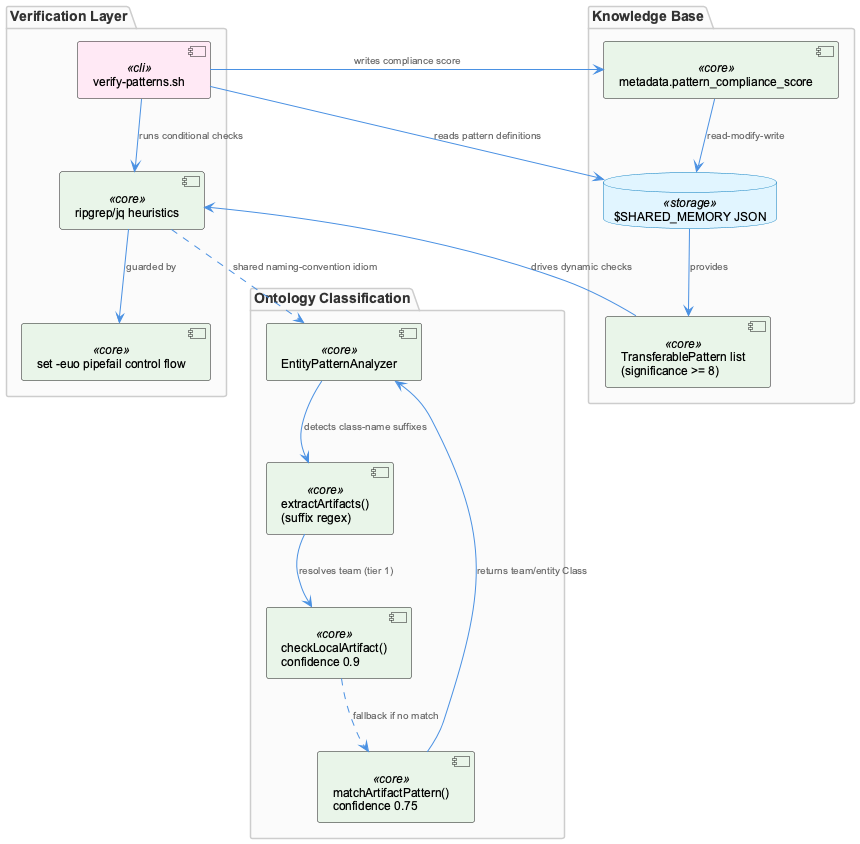
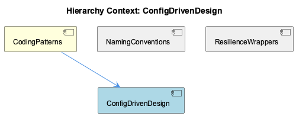

# ConfigDrivenDesign

**Type:** SubComponent

[Code References] scripts/knowledge-management/verify-patterns.sh:1-8 - set -euo pipefail combined with path resolution via CODING_TOOLS_PATH/CODING_REPO fallback chain; scripts/knowledge-management/verify-patterns.sh:24-40 - ConditionalLoggingPattern check using rg console.log vs Logger.* counts with '|| echo "0"' fallback; scripts/knowledge-management/verify-patterns.sh:150-176 - TransferablePattern significance>=8 lookup via jq against $SHARED_MEMORY, driving dynamic per-pattern usage checks; scripts/knowledge-management/verify-patterns.sh:213-236 - conditional TOTAL_CHECKS/PASSED_CHECKS accumulation and SCORE calculation, including bare '((PASSED_CHECKS++))' arithmetic under errexit; scripts/knowledge-management/verify-patterns.sh:239-246 - final jq read-modify-write back into $SHARED_MEMORY (.metadata.last_pattern_verification, .metadata.pattern_compliance_score); src/ontology/heuristics/EntityPatternAnalyzer.ts:20-100 - teamDirectories and artifactPatterns static maps defining the classification policy in-code rather than in external config; src/ontology/heuristics/EntityPatternAnalyzer.ts:113-160 - analyzeEntityPatterns() orchestrating extractArtifacts() then a two-tier checkLocalArtifact()/matchArtifactPattern() cascade with confidence 0.9 vs 0.75; src/ontology/heuristics/EntityPatternAnalyzer.ts:169-190 - extractArtifacts() regex for class-name suffix detection: [A-Z][a-zA-Z]+(Service|Agent|Manager|Engine|Handler|Analyzer|Classifier|Filter|Monitor); src/ontology/heuristics/EntityPatternAnalyzer.ts:198-212 - checkLocalArtifact() directory-prefix matching against teamDirectories; src/ontology/heuristics/EntityPatternAnalyzer.ts:220-237 - matchArtifactPattern() regex-pattern matching against artifactPatterns, returning team + entityClass + confidence 0.75

# ConfigDrivenDesign — Technical Insight Document

## What It Is

ConfigDrivenDesign, as a SubComponent of CodingPatterns, captures the project's recurring practice of externalizing policy from mechanism — expressing "what is compliant" or "what is classified" as data rather than as hardcoded conditionals. Its two primary concrete manifestations in the observed codebase are `scripts/knowledge-management/verify-patterns.sh`, a shell script that enforces compliance checks (ConditionalLoggingPattern, ReduxStateManagementPattern, NetworkAwareInstallationPattern) by reading `TransferablePattern` definitions with `significance >= 8` out of a JSON knowledge base (`$SHARED_MEMORY`) via `jq`, and `src/ontology/heuristics/EntityPatternAnalyzer.ts`, which reinterprets the *Manager/*Service/*Adapter naming convention (itself a NamingConventions concern) as a machine-readable classification signal rather than a human style guideline.

Both artifacts embody the same idiom described for the parent CodingPatterns component's `config/features.yaml` and `config/agent-profiles.json`: mechanism iterates over whatever policy is present in data, rather than encoding policy directly in control flow.

## Architecture and Design

The defining architectural pattern is **monitoring-as-code**: verify-patterns.sh contains no hardcoded assertions about what "compliant" means beyond what is already declared in the pattern list it reads from `$SHARED_MEMORY`. This mirrors the ConstraintMonitoringService/health-verification-rules.json convention noted in the parent context. Critically, the script also performs a **read-modify-write telemetry loop**: it reads pattern definitions from the JSON knowledge base and writes its own compliance score back into the same file (`.metadata.last_pattern_verification`, `.metadata.pattern_compliance_score`), making the knowledge base simultaneously the source of truth and the sink for compliance data.

A second pattern is **conditional check registration** (verify-patterns.sh:213-236): `TOTAL_CHECKS` is only incremented when a check's precondition holds (e.g., the Redux check only counts if `package.json` contains "react"; the network-awareness check only counts if `install.sh` exists). This makes the scoring denominator itself data-driven per repository — a config-driven-behavior idiom applied at the level of a verification script rather than a runtime feature flag.

A third pattern, found in EntityPatternAnalyzer, is **layered/cascading confidence resolution, first-match-wins**: `checkLocalArtifact()` (confidence 0.9, directory-prefix match against `teamDirectories`) is tried before falling back to `matchArtifactPattern()` (confidence 0.75, regex match against `artifactPatterns`). This is structurally identical to ordered-target routing patterns elsewhere in the project (e.g., `semantic_routing.targets`), suggesting "ordered list, first match wins, with an explicit confidence score per tier" is a cross-cutting idiom independently reimplemented across unrelated subsystems (LLM routing vs. knowledge/team classification) rather than promoted to a shared, named `TransferablePattern`.

## Implementation Details

`verify-patterns.sh` resolves its checks using `rg`-based heuristics: `CONSOLE_LOG_COUNT` vs `LOGGER_COUNT` for ConditionalLoggingPattern (lines 24-40), and similar ripgrep counts for Redux and network-awareness checks. Each count is wrapped in an `|| echo "0"` fallback to tolerate missing matches. The pattern definitions themselves are pulled dynamically via a `jq` query against `$SHARED_MEMORY` (lines 150-176), filtering `TransferablePattern` entries by `significance >= 8`, so the set of checks performed can grow or shrink purely by editing the knowledge base JSON, without touching script logic.

The scoring and persistence logic (lines 213-246) accumulates `PASSED_CHECKS`/`TOTAL_CHECKS` conditionally, computes a percentage, and writes it back via a final `jq` read-modify-write. Two shell-specific fragilities are worth flagging as maintainability risks: first, the `|| echo "0"` fallbacks silently coerce *any* `rg` failure — not just "no matches" — into a "0 findings, compliant" result, which contradicts the fail-closed intent of the `set -euo pipefail` header at the top of the file (lines 1-8) and produces false COMPLIANT statuses on genuine tool errors. Second, the bare `((PASSED_CHECKS++))` arithmetic idiom is a known bash pitfall: when the pre-increment value is 0, the expression evaluates to 0 (falsy), tripping `errexit` under `set -e` on bash 5.x/Linux even though the increment succeeds — a latent abort site on the very first passing check, though not reproduced under macOS's bundled bash 3.2.

EntityPatternAnalyzer.ts implements its classification pipeline as "Layer 1: File/Artifact Detection" in a presumably multi-layer system. `extractArtifacts()` (~line 152) runs the regex `[A-Z][a-zA-Z]+(Service|Agent|Manager|Engine|Handler|Analyzer|Classifier|Filter|Monitor)` over free-text knowledge content to detect class-name-like tokens. `analyzeEntityPatterns()` (lines 113-160) orchestrates extraction followed by the two-tier `checkLocalArtifact()`/`matchArtifactPattern()` cascade (lines 198-212, 220-237), which maps matches to a team and an ontology `entityClass`. Notably, `teamDirectories` and `artifactPatterns` (lines 20-100) are hardcoded in-memory maps rather than loaded from external config — a discrepancy from the config-driven ideal this SubComponent is named for.

## Integration Points

verify-patterns.sh integrates purely through filesystem and environment conventions — `CODING_TOOLS_PATH`/`CODING_REPO` env vars, a `$SHARED_MEMORY` JSON path, and availability of `rg`/`jq` — with no compile-time or type-level coupling to the rest of the codebase. This makes it fragile to missing dependencies but decoupled from any specific language runtime. Its path-resolution fragility (fallback derived from `SCRIPT_DIR`) is shared with the sibling NamingConventions component's description of the same script, since both analyses examine the identical file from different angles (logging-convention enforcement vs. pattern-verification mechanics).

EntityPatternAnalyzer sits within a larger, presumably multi-layer ontology classification pipeline (per its own "Layer 1" docstring), feeding team/entityClass attribution downstream. It shares its cascading-confidence resolution shape with routing configuration elsewhere in the project (`semantic_routing.targets`), suggesting an implicit, currently undocumented dependency on a shared design idiom rather than a shared code path.

The sibling ResilienceWrappers component notes that neither verify-patterns.sh nor EntityPatternAnalyzer.ts is a resilience wrapper in the circuit-breaker/retry sense (CircuitBreakerManager, CachingMechanism) — they are better classified as guard-rail/defensive code, reinforcing that ConfigDrivenDesign is a distinct concern from ResilienceWrappers even though both are siblings under CodingPatterns.

## Usage Guidelines

Developers modifying verify-patterns.sh should treat `$SHARED_MEMORY` as the authoritative policy source: adding or adjusting compliance checks should be done by editing `TransferablePattern` entries (with `significance >= 8`) rather than adding new hardcoded `rg` invocations, to preserve the monitoring-as-code contract. Any change to the `|| echo "0"` fallback pattern should distinguish "no matches found" from "tool invocation failed" to avoid silently reporting false compliance — this is flagged as a real correctness gap given the project's otherwise deliberate fail-open/fail-closed asymmetry rule (per CLAUDE.md). Similarly, the `((VAR++))` idiom should be replaced with a `set -e`-safe form (e.g., `VAR=$((VAR+1))`) to avoid environment-dependent script aborts.

For EntityPatternAnalyzer, developers should be aware that `teamDirectories` and `artifactPatterns` are currently hardcoded rather than externally configured, which is inconsistent with the parent CodingPatterns preference for config-driven behavior — any evolution of this class should consider migrating these maps to external configuration to align with the pattern the SubComponent is named after. No test coverage was found for either file's heuristics (regex correctness, directory-prefix accuracy), so changes to these patterns should be validated manually or accompanied by new tests before being trusted as compliance signals. Finally, given the reuse of the layered-confidence-cascade shape in unrelated subsystems (routing vs. classification), teams introducing similar cascades elsewhere should consider promoting this to a shared, named `TransferablePattern` rather than reimplementing it independently.

## Hierarchy Context

### Parent
- [CodingPatterns](./CodingPatterns.md) -- CodingPatterns serves as a catch-all component for general programming wisdom, design patterns, conventions, and best practices that are applied across the Coding project but do not belong to any single functional subsystem. Rather than being a discrete module with its own directory, it manifests as recurring architectural idioms observed across the codebase—such as adapter patterns for storage backends, lazy initialization patterns for agent classes, circuit-breaker and caching wrappers around external services, and shared concurrency utilities like work-stealing task distribution. These patterns are documented in docs/architecture/*.md files and implemented consistently across SubComponents like GraphDatabaseManager, LLMServiceProvider, and CircuitBreakerManager.

Because no representative source files were directly attributed to this component, its presence is inferred from cross-cutting conventions referenced in the broader Existing Knowledge graph (e.g., Detail-level entities like ProviderRegistryManager and GraphDatabaseManager) and from architecture documentation describing system-wide approaches (health monitoring, LLM routing, memory systems). The component effectively functions as a conceptual umbrella capturing idiomatic code style, naming conventions (e.g., *Manager, *Adapter, *Service suffixes), and best-practice enforcement mechanisms like the ConstraintMonitoringService and egress-lint-allowlist.json.

Key architectural patterns include the consistent use of dependency-injected registries (ProviderRegistryManager), decorator-like wrapping of network calls (CircuitBreakerManager, CachingMechanism), and configuration-driven behavior (config/features.yaml, config/agent-profiles.json) rather than hardcoded logic, reflecting a broader project convention of externalizing policy from mechanism.

### Siblings
- [NamingConventions](./NamingConventions.md) -- [LLM] scripts/knowledge-management/verify-patterns.sh implements a self-contained compliance checker that greps the codebase for `console.log` calls versus `Logger.*` calls to enforce the ConditionalLoggingPattern naming/usage convention referenced in the parent CodingPatterns component. The script hardcodes its resolution of `CLAUDE_REPO` via `CODING_TOOLS_PATH`/`CODING_REPO` env vars with a fallback to a path derived two directories up from `SCRIPT_DIR`, which ties the script's correctness to its physical location at `scripts/knowledge-management/verify-patterns.sh` — moving the file would silently break the repo-root inference unless the env vars are set.
- [ResilienceWrappers](./ResilienceWrappers.md) -- [LLM] No code_graph evidence was provided for this analysis (the <code_graph> block is empty), so all observations below are grounded directly in the two source files supplied — scripts/knowledge-management/verify-patterns.sh and src/ontology/heuristics/EntityPatternAnalyzer.ts — rather than in graph-derived call relationships. Neither file is a 'wrapper' in the classic circuit-breaker/retry sense described in the parent CodingPatterns context; verify-patterns.sh is a compliance-scanning shell script and EntityPatternAnalyzer.ts is a heuristic classifier, so the ResilienceWrappers label as applied to these files is best read as 'defensive/guard-rail code' rather than network-resilience decorators like CircuitBreakerManager or CachingMechanism.

---

*Generated from 9 observations*
