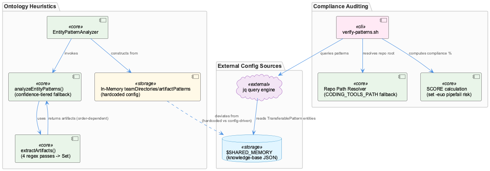
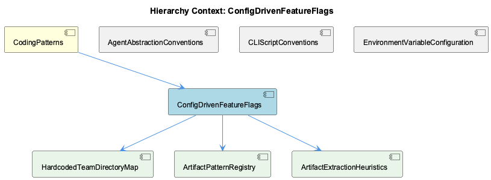

# ConfigDrivenFeatureFlags

**Type:** SubComponent

# ConfigDrivenFeatureFlags — Technical Insight Document

## What It Is

ConfigDrivenFeatureFlags, as a SubComponent within the broader CodingPatterns parent context, names a convention rather than a single mechanism: the idea that behavior — team ownership, artifact classification, compliance checks — should be driven by data external to code, so it can change without a TypeScript/JS edit and rebuild. In practice, the two concrete implementations sampled under this component diverge sharply in how faithfully they honor that principle.

The primary implementation lives in `src/ontology/heuristics/EntityPatternAnalyzer.ts`, whose constructor builds two in-memory catalogs — `teamDirectories: Map<string, string[]>` and `artifactPatterns: ArtifactPattern[]` — that classify code artifacts into a four-team ownership taxonomy (Coding, RaaS, ReSi, UI). These catalogs are the basis for its children, HardcodedTeamDirectoryMap and ArtifactPatternRegistry, and are consumed by ArtifactExtractionHeuristics' regex-based extraction logic. The second implementation, `scripts/knowledge-management/verify-patterns.sh`, is a shell-based compliance auditor that computes a percentage pass/fail score across codebase conventions.

## Architecture and Design

The defining architectural tension in this component is the gap between its name and its implementation. Elsewhere in the codebase, components like OntologyClassifier and SensitivityClassifier honor a "declarative catalog" convention via external files like `config/feature-profiles.yaml`. EntityPatternAnalyzer inverts this: its "config" is TypeScript object literals constructed in the constructor, meaning the declarative catalog is fused with executable code. This is architecturally significant because it undermines the stated goal — team ownership changes require code edits and redeploys, not config PRs.

By contrast, verify-patterns.sh achieves genuine config-driven behavior by querying a shared knowledge store at runtime: `jq -r '.entities[] | select(.entityType == "TransferablePattern" and .significance >= 8) | .name'` against `$SHARED_MEMORY`. New patterns can be registered in the knowledge base JSON without touching the script — the one piece in this component that fully realizes the parent CodingPatterns convention.

A second architectural pattern is the confidence-tiered fallback chain used in `analyzeEntityPatterns()`: a direct directory-prefix match via `checkLocalArtifact()` (confidence 0.9) falls back to a regex match via `matchArtifactPattern()` (confidence 0.75). This mirrors the environment-variable fallback idiom seen in sibling components (AgentAbstractionConventions, CLIScriptConventions, EnvironmentVariableConfiguration) and in verify-patterns.sh's own `CODING_TOOLS_PATH:-${CODING_REPO:-$DEFAULT_REPO}` root resolution — a three-tier explicit-override → project-env-var → computed-default chain consistent with the 12-factor idiom the parent context describes as informally enforced across the codebase.

## Implementation Details

EntityPatternAnalyzer's `extractArtifacts()` runs four separate regex passes — file paths, npm scoped packages, Service/Agent/Manager-suffixed class names, and bare directory prefixes — accumulating results into a `Set<string>` for deduplication. Critically, `analyzeEntityPatterns()` then iterates this set in extraction order and returns on the *first* match rather than comparing all candidates for the globally highest-confidence match. This makes classification confidence order-dependent, a subtlety documented by ArtifactExtractionHeuristics as an implicit precision/recall trade-off baked into control flow rather than exposed as a tunable flag.

The two lookup structures feeding this pipeline are structurally divergent, as detailed by ArtifactPatternRegistry: `teamDirectories` uses `Array.prototype.some(dir => artifact.startsWith(dir))` prefix matching, while `artifactPatterns` runs `pattern.test(artifact)` against regexes paired with `{team, patterns, entityClassMap}` objects. Because these are separately maintained, a new artifact type for an existing team may need edits in both structures to classify at the high-confidence (0.9) tier rather than falling through to the lower-confidence (0.75) regex tier — and HardcodedTeamDirectoryMap notes an actual drift instance: an "Agentic" team referenced in `inferEntityClass`'s `teamMappings` is absent from both `artifactPatterns` and `teamDirectories`.

verify-patterns.sh implements its compliance scoring via `SCORE=$((PASSED_CHECKS * 100 / TOTAL_CHECKS))`, incrementing counters with `((PASSED_CHECKS++))` guarded by conditions like `[ "$CONSOLE_LOG_COUNT" -eq 0 ]`. This carries a latent bash hazard: under `set -euo pipefail`, `((PASSED_CHECKS++))` returns exit status 1 when the pre-increment value is 0, which can abort the script on Linux/bash5 while being silently masked on macOS/bash3.2 — a non-deterministic, platform-dependent failure mode.

## Integration Points

ConfigDrivenFeatureFlags sits under the CodingPatterns parent, alongside siblings AgentAbstractionConventions, CLIScriptConventions, and EnvironmentVariableConfiguration — all of which independently corroborate the same environment-variable-fallback idiom found in verify-patterns.sh's repo-root resolution. This shows the pattern is not unique to this component but a project-wide convention for relocatable, CI-safe executables.

Internally, the component's three children — HardcodedTeamDirectoryMap, ArtifactPatternRegistry, and ArtifactExtractionHeuristics — represent three facets of the same EntityPatternAnalyzer.ts constructor and its consuming methods, rather than independent subsystems. verify-patterns.sh integrates with the knowledge-management layer via `$SHARED_MEMORY`, reading `TransferablePattern` entities with `significance >= 8`, linking this component to whatever process populates that shared JSON store.

One notable integration gap: the two graphify test fixtures (`DesignViewModel.cs`, `DesignView.xaml`) surfaced in this component's code sample are unrelated WPF/XAML binding fixtures, indicating a retrieval-precision gap in how code-graph context was assembled rather than a genuine architectural dependency.

## Usage Guidelines

Developers extending team/artifact classification in EntityPatternAnalyzer.ts must edit both `teamDirectories` and `artifactPatterns` to keep high- and low-confidence tiers consistent — editing only one risks silent confidence degradation or classification drift, as already evidenced by the missing "Agentic" team. Given that this catalog is compiled into TypeScript rather than externalized, any change requires a rebuild; if the goal is genuine config-driven behavior, migrating this catalog toward the `config/feature-profiles.yaml`-style approach used by <AWS_SECRET_REDACTED> should be considered.

For `extractArtifacts()`/`analyzeEntityPatterns()`, developers should be aware that match confidence depends on `Set` iteration order, not on comparing all candidates — this is a correctness-relevant nuance when debugging unexpected low-confidence classifications.

For verify-patterns.sh, new compliance patterns should be added via the `$SHARED_MEMORY` JSON store (as `TransferablePattern` entities with sufficient `significance`) rather than by editing the script, preserving its config-driven property. Maintainers should also be cautious of the `((PASSED_CHECKS++))` / `set -euo pipefail` interaction, which risks non-deterministic script termination across bash versions — a guard clause or `|| true` should be added before relying on this script in CI on Linux.

## Hierarchy Context

### Parent
- [CodingPatterns](./CodingPatterns.md) -- [LLM] The config/agents/*.sh scripts (claude.sh, copilot.sh, opencode.sh, pi.sh) implement a uniform adapter pattern where each script normalizes a different vendor CLI into a common invocation contract described in docs/architecture/agent-abstraction-api.md. Concretely, each script accepts the same positional arguments and environment variables (e.g., LLM_PROXY_URL, CODING_OPENCODE_MODEL), performs argument translation specific to its backend binary, and emits output in a shared format consumable by the orchestrator layer. This lets the rest of the system (e.g., wave-controller.ts or any dispatcher invoking these scripts) remain agnostic to which underlying agent CLI is actually installed—new agents can be onboarded by adding a new script that satisfies the same contract rather than modifying core dispatch logic, as described in docs/architecture/adding-new-agent.md.

### Children
- [HardcodedTeamDirectoryMap](./HardcodedTeamDirectoryMap.md) -- [LLM] EntityPatternAnalyzer's constructor (src/ontology/heuristics/EntityPatternAnalyzer.ts) hardcodes team ownership as a `Map<string, string[]>` (`teamDirectories`) mapping four teams — Coding, RaaS, ReSi, UI — to literal directory-prefix strings (e.g. 'src/ontology', 'raas-service', 'virtual-target', 'curriculum-alignment'). This is a compile-time catalog: adding a fifth team, renaming a directory, or moving 'scripts' under a different team requires editing this TypeScript file and rebuilding, in direct contrast to the config/feature-profiles.yaml pattern the parent context attributes to OntologyClassifier and SensitivityClassifier. The component's own name ('HardcodedTeamDirectoryMap') captures this precisely.
- [ArtifactPatternRegistry](./ArtifactPatternRegistry.md) -- [LLM] EntityPatternAnalyzer's constructor (src/ontology/heuristics/EntityPatternAnalyzer.ts) builds two parallel but structurally divergent lookup tables: `teamDirectories: Map<string, string[]>` (a flat list of path prefixes per team) and `artifactPatterns: ArtifactPattern[]` (an array of `{team, patterns: RegExp[], entityClassMap}` objects). These are consumed by two different private methods — `checkLocalArtifact()` iterates `teamDirectories.entries()` and does an `Array.prototype.some(dir => artifact.startsWith(dir))` check, while `matchArtifactPattern()` iterates `artifactPatterns` and runs `pattern.test(artifact)` for each regex. Maintaining team-ownership knowledge in two separate, differently-shaped structures (one string-prefix based, one regex based) means a new artifact type belonging to an existing team may need edits in both places to be reliably classified at high confidence (0.9) rather than falling through to the lower-confidence (0.75) regex tier.
- [ArtifactExtractionHeuristics](./ArtifactExtractionHeuristics.md) -- [LLM] EntityPatternAnalyzer.ts's constructor builds two hardcoded structures — `teamDirectories: Map<string, string[]>` and `artifactPatterns: ArtifactPattern[]` — that together encode a four-team ownership taxonomy (Coding, RaaS, ReSi, UI). This is a classic 'rules-as-data' design, but because the data lives in TypeScript literals rather than an external file, the class conflates the declarative catalog with the executable code, meaning the only way to extend team coverage (e.g., adding an 'Agentic' team, which is referenced in `inferEntityClass`'s `teamMappings` but absent from `artifactPatterns` and `teamDirectories`) is to edit and redeploy this file — an inconsistency that itself signals the catalog is already drifting out of sync internally.

### Siblings
- [AgentAbstractionConventions](./AgentAbstractionConventions.md) -- [LLM] The `config/agents/*.sh` adapter scripts described in the parent context establish a normalization boundary that is structurally mirrored in `scripts/knowledge-management/verify-patterns.sh`: both are Bash entrypoints that resolve their own root via `$(cd "$(dirname ...)" && pwd)` rather than assuming a fixed working directory, and both read configuration through environment variables with fallback chains (`CODING_TOOLS_PATH:-${CODING_REPO:-$DEFAULT_REPO}` in verify-patterns.sh mirrors the `LLM_PROXY_URL`/`RAPID_LLM_PROXY_URL` fallback idiom cited for the agent scripts). This shows the environment-variable-with-fallback convention is not confined to LLM provider wiring — it is a project-wide idiom for making any `bin/`- or `scripts/`-level executable relocatable and invocable from CI, cron, or an arbitrary submodule checkout without hardcoded paths.
- [CLIScriptConventions](./CLIScriptConventions.md) -- [LLM] The config/agents/*.sh adapter pattern described in the parent context is one instance of a broader convention visible in scripts/knowledge-management/verify-patterns.sh: shell scripts in this codebase are written as self-contained, idempotent CLI tools that resolve their own root directory via `SCRIPT_DIR="$(cd "$(dirname "${BASH_SOURCE[0]}")" && pwd)"` and then derive a repo-relative path (`DEFAULT_REPO="$(dirname "$(dirname "$SCRIPT_DIR")")"`), overridable via `CODING_TOOLS_PATH`/`CODING_REPO` env vars. This mirrors the env-var-driven configuration idiom (LLM_PROXY_URL, QWEN_LOCAL_API_KEY) at the shell-script layer: no script hardcodes an absolute path, so the same script works whether invoked from bin/, cron, or CI.
- [EnvironmentVariableConfiguration](./EnvironmentVariableConfiguration.md) -- [LLM] The parent context describes environment-variable-driven configuration (LLM_PROXY_URL, RAPID_LLM_PROXY_URL, QWEN_LOCAL_API_KEY, QWEN_LAPTOP_API_BASE_URL, GSD_BROWSER_BROWSER_PATH) as a pervasive but informally-enforced convention with no central schema validator. This is corroborated by scripts/knowledge-management/verify-patterns.sh, which itself resolves its own root path via an environment-variable fallback chain: `CLAUDE_REPO="${CODING_TOOLS_PATH:-${CODING_REPO:-$DEFAULT_REPO}}"`. This is the same PROVIDER_ROLE_PURPOSE-style layering described for LLM integrations, but applied to repo-root discovery — a script that must run correctly whether invoked from CI, a cron job, or a developer's shell, none of which can be assumed to have identical environment setup.

---

*Generated from 9 observations*
