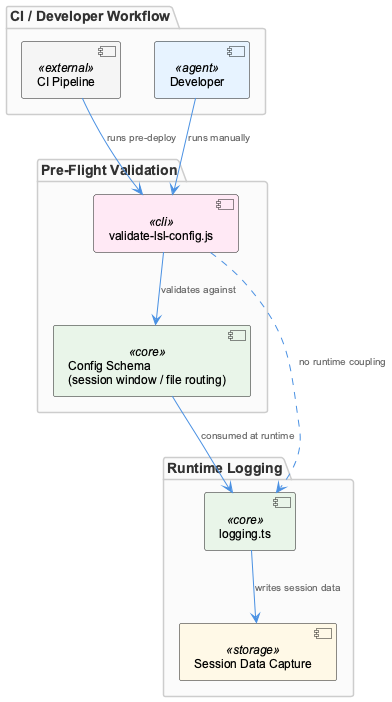
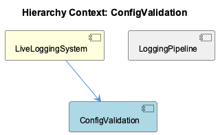

# ConfigValidation

**Type:** SubComponent

scripts/validate-lsl-config.js runs as a standalone script separate from logging.ts, allowing developers to validate config changes without invoking the live logging pipeline

# ConfigValidation

## What It Is

ConfigValidation is implemented as a standalone script, `scripts/validate-lsl-config.js`, which exists separately from `logging.ts`, the main runtime pipeline. As a SubComponent of LiveLoggingSystem, it serves a single, focused responsibility: verifying that configuration—specifically session window durations and file routing rules—conforms to an expected schema or contract before that configuration is ever consumed by the live logging pipeline. It is not a library imported at runtime; it is a discrete, executable artifact intended to be run independently of session data capture.

## Architecture and Design

The defining architectural decision here is separation of concerns between validation and execution. Rather than embedding config checks inside `logging.ts` (its sibling component, LoggingPipeline), the system isolates correctness-checking into its own script. This reflects a pre-flight/fail-fast pattern: misconfiguration is meant to be caught before any session data capture begins, avoiding the far costlier scenario of discovering malformed config mid-capture, where data loss or corrupted transcripts could result.

This isolation also decouples config correctness from runtime execution—`logging.ts` does not need to invoke or depend on validation logic to run, and conversely, validation does not require the logging pipeline to be live. This is a deliberate trade-off: it introduces an extra manual/CI step rather than automatic runtime enforcement, but it gains simplicity, testability, and the ability to validate config changes in isolation, without side effects on production logging behavior.

## Implementation Details

The core artifact is `scripts/validate-lsl-config.js`. Its existence implies an underlying schema/contract governing at least two config domains: session window durations and file routing rules, both of which are consumed at runtime by `logging.ts`. The script is designed to be invoked as a pre-flight check—suggesting an execution model built around CI pipelines or manual pre-deployment runs rather than being triggered automatically as part of the logging process. No code symbols or internal classes are documented, indicating a straightforward script structure rather than a class-based or modular implementation.

## Integration Points

ConfigValidation's primary integration point is conceptual rather than direct code coupling: it validates the same configuration structures that `logging.ts` (LoggingPipeline) later consumes at runtime. As a child SubComponent of LiveLoggingSystem, it forms one stage in that system's broader pipeline—configuration validation, session windowing, file routing, classification, and transcript capture—each treated as a distinct, separable stage.

Because it runs standalone, it has no runtime dependency on LoggingPipeline; the relationship is one of contract-sharing (schema for session windows and routing rules) rather than function calls or shared state.

## Usage Guidelines

Developers should run `scripts/validate-lsl-config.js` before deploying any changes to session window durations or file routing configuration, ideally as part of CI or as a manual pre-deployment step. It should not be assumed that `logging.ts` performs equivalent checks at runtime—validation is intentionally external, so skipping this script risks deploying misconfigured settings that only surface as failures once live session capture is underway. Treat the script as the authoritative pre-flight gate for config correctness within LiveLoggingSystem.

## Hierarchy Context

### Parent
- [LiveLoggingSystem](./LiveLoggingSystem.md) -- [LLM] The LiveLoggingSystem is structured as a pipeline with distinct, separable stages: configuration validation, session windowing, file routing, classification, and transcript capture. This separation is evident in the presence of scripts/validate-lsl-config.js as a standalone pre-flight check that runs independently of the main logging.ts pipeline, meaning developers can validate configuration changes (session window durations, file routing rules) without triggering the full logging pipeline. This design supports fail-fast behavior: catching misconfiguration before any live session data is captured, rather than discovering issues mid-capture when data loss or malformed logs could occur.

### Siblings
- [LoggingPipeline](./LoggingPipeline.md) -- logging.ts implements the main pipeline that executes after configuration has been validated by the separate pre-flight script

---

*Generated from 5 observations*
