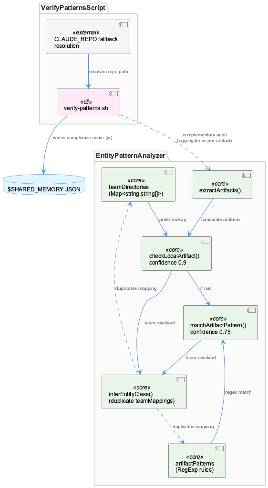
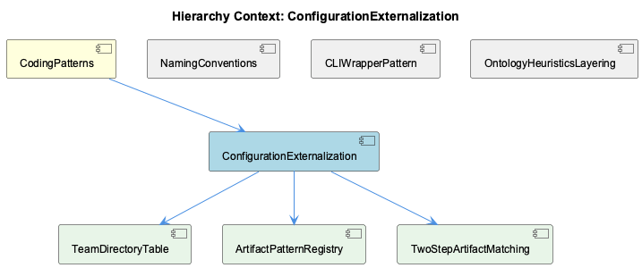

# ConfigurationExternalization

**Type:** SubComponent

[Code References] src/ontology/heuristics/EntityPatternAnalyzer.ts:1-40 - class fields teamDirectories and artifactPatterns define the externalized classification rules; src/ontology/heuristics/EntityPatternAnalyzer.ts (analyzeEntityPatterns) - orchestrates extractArtifacts → checkLocalArtifact → matchArtifactPattern with confidence scoring (0.9 vs 0.75); src/ontology/heuristics/EntityPatternAnalyzer.ts (extractArtifacts) - regex-based extraction hardcodes the '*Manager/*Service/*Handler' suffix convention; src/ontology/heuristics/EntityPatternAnalyzer.ts (inferEntityClass) - duplicate team/entity-class mapping including an 'Agentic' team absent from teamDirectories; scripts/knowledge-management/verify-patterns.sh:1-30 - CLAUDE_REPO resolution via CODING_TOOLS_PATH/CODING_REPO/DEFAULT_REPO fallback chain; scripts/knowledge-management/verify-patterns.sh (ConditionalLoggingPattern check) - rg-based console.log vs Logger.* count comparison feeding compliance score

# ConfigurationExternalization

## What It Is

ConfigurationExternalization is a design idiom, as `CodingPatterns` describes it, embodied concretely in `src/ontology/heuristics/EntityPatternAnalyzer.ts` and in `scripts/knowledge-management/verify-patterns.sh`. Rather than one implementation, it names a *strategy*: pulling classification and compliance rules out of imperative branching logic and into declarative data structures or externally-resolved parameters. In EntityPatternAnalyzer.ts, this manifests as two constructor-built data tables — `teamDirectories` (the child component `TeamDirectoryTable`) and `artifactPatterns` (the child component `ArtifactPatternRegistry`) — that drive team/entity classification without any code path branching on team name directly. In verify-patterns.sh, the same spirit shows up as environment-variable fallback chains (`CODING_TOOLS_PATH:-${CODING_REPO:-$DEFAULT_REPO}`) that let the script locate the repo root regardless of invocation context.

Notably, despite the name, EntityPatternAnalyzer.ts has no actual external config file (no config/*.yaml or config/*.json) — its "externalized" rules are hardcoded literals in the constructor. This is an important nuance: the pattern here is about separating *rule data* from *rule-application logic*, not necessarily about physical file externalization.

## Architecture and Design

The architecture rests on the child component `TwoStepArtifactMatching`, a two-tier, confidence-scored resolution strategy implemented in `analyzeEntityPatterns()`. `checkLocalArtifact()` runs first, returning confidence 0.9 for a direct directory-prefix match against `TeamDirectoryTable`; only if that fails does `matchArtifactPattern()` run, returning confidence 0.75 for a regex match against `ArtifactPatternRegistry`. This ordering encodes a deliberate precision-over-recall tradeoff: directory ownership is trusted more than naming-convention regexes (e.g. `/LSL(Session|Monitor|Classifier)/i`), since naming conventions can coincidentally collide across teams while directory placement cannot — in theory. As documented under `OntologyHeuristicsLayering`, this ordering doubles as a performance optimization, since EntityPatternAnalyzer is Layer 1 of a multi-layer pipeline with a sub-millisecond budget, and cheap `startsWith()` prefix checks are always attempted before costlier `RegExp.test()` loops.

Complementing this per-artifact runtime classifier is verify-patterns.sh, which performs project-wide statistical auditing rather than individual attribution — using `rg` counts (e.g. `console.log` vs `Logger.*`) and computing a compliance percentage written into a `$SHARED_MEMORY` JSON store via `jq`. These two mechanisms are architecturally distinct but complementary: one attributes ownership per-artifact at runtime, the other audits aggregate pattern adoption in a CI/dev-loop batch mode. As the sibling `CLIWrapperPattern` observation notes, this script's placement under `scripts/` (not `bin/`) and its inline business logic suggest an unstated convention distinguishing thin `bin/` wrappers from heavier operational tooling permitted in `scripts/`.

## Implementation Details

`TeamDirectoryTable` is a `Map<string, string[]>` with four entries (Coding, RaaS, ReSi, UI), each mapping to path prefixes (e.g. Coding → `['src/ontology', 'src/knowledge-management', 'src/live-logging', 'scripts', '.specstory']`). `checkLocalArtifact()` performs a linear scan via `dirs.some((dir) => artifact.startsWith(dir))` — appropriate at this scale (<1ms) but purely lexical, with no path-boundary check, meaning `'scripts-external/foo.ts'` would false-positive against the `'scripts'` prefix. This is a latent correctness gap: the higher-confidence path (0.9) is actually more brittle to naming coincidences than the regex-based fallback, which at least anchors on word boundaries.

`ArtifactPatternRegistry` (the `artifactPatterns` array) pairs each team with `RegExp[]` and an `entityClassMap`. Artifacts are gathered first by `extractArtifacts()`, which runs four regexes — file paths, npm scoped packages (`@langchain/core`), class names ending in Service/Agent/Manager/Engine/Handler/Analyzer/Classifier/Filter/Monitor, and bare directory prefixes — deduplicated into a `Set<string>`. This hardcodes the suffix vocabulary from the parent `NamingConventions`/`CodingPatterns` context directly into `classPattern`; a new suffix convention (e.g. `*Adapter`) would silently fail extraction.

`TwoStepArtifactMatching`'s `analyzeEntityPatterns()` iterates extracted artifacts and returns on the *first* hit, rather than collecting all candidates and picking the highest confidence overall. Because `extractArtifacts()` interleaves four regex passes in fixed sequence, the effective priority between "file path" and "class name" artifacts is an accidental byproduct of regex ordering, not an explicit confidence-maximization step.

Separately, `inferEntityClass()` duplicates the team→entity-class mapping in a third shape, `Record<string, Record<string, string>>`, including an 'Agentic' team (Agent/RAG/LLM/Vector) absent from `TeamDirectoryTable` entirely — a three-way duplication risk across `teamDirectories`, `artifactPatterns[].entityClassMap`, and `inferEntityClass`'s `teamMappings`.

verify-patterns.sh implements its own externalization via the `SCRIPT_DIR`/`DEFAULT_REPO`/`CLAUDE_REPO` fallback chain, but degrades silently: absent `rg`/`jq`/`$SHARED_MEMORY`, counts default to `"0"` via `|| echo "0"`, potentially masking a broken environment as full compliance.

## Integration Points

EntityPatternAnalyzer sits beneath `CodingPatterns` as parent, operationalizing its `*Manager`/`*Service` suffix conventions into machine-readable classification, and shares its file with sibling `NamingConventions`, which frames the same `extractArtifacts()`/`matchArtifactPattern()` mechanics as a naming-convention enforcement layer, and `OntologyHeuristicsLayering`, which frames it as Layer 1 of a larger confidence-scored pipeline. The `LayerResult` return type (`layer: 1`, `layerName: 'EntityPatternAnalyzer'`) is the interface contract with downstream layers. verify-patterns.sh integrates with the broader environment-variable convention (alongside `GSD_BROWSER_BROWSER_PATH`, `LLM_CLI_PROXY_URL`) and writes into the shared `$SHARED_MEMORY` JSON store via `jq`, coupling a nominally read-only audit script to external mutable state.

## Usage Guidelines

Adding a new team or artifact convention to EntityPatternAnalyzer should be a data change, not a new code path — but given the triple duplication across `TeamDirectoryTable`, `ArtifactPatternRegistry`, and `inferEntityClass`, developers must update all three consistently (the 'Agentic' team's absence from `teamDirectories` shows this discipline has already lapsed). New architectural suffixes must be added to `classPattern` in `extractArtifacts()` or they become invisible to classification. Prefix matching in `checkLocalArtifact()` should ideally be boundary-aware to avoid false positives like `scripts-external`. For verify-patterns.sh, treat missing `rg`/`jq` as a hard failure during setup rather than trusting its silent 0-defaults, and recognize that `scripts/` tooling is expected to own more logic inline than `bin/` wrappers.

## Hierarchy Context

### Parent
- [CodingPatterns](./CodingPatterns.md) -- [LLM] The '*Manager' suffix convention observed across GraphDatabaseManager, ProviderRegistryManager, ConnectionManager, MockModeManager, and CircuitBreakerManager signals a project-wide idiom for classes that own mutable, long-lived state and coordinate access to a shared resource (a database connection, a pool of LLM providers, a network connection, or a fault-tolerance mechanism). New developers should expect these classes to expose lifecycle methods (init/connect/close or similar), maintain internal state that must be protected from concurrent misuse, and typically be instantiated once and passed around or accessed via a singleton/registry rather than created ad hoc per call. When adding a new stateful coordination class to the Coding project, following this suffix convention (rather than inventing a new name like 'Handler' or 'Controller') keeps discoverability high, since grep-based searches for '*Manager' across the codebase double as an architectural map of all stateful coordination points, including CircuitBreakerManager's role in resilience patterns tied to RUNG_OFFLOADED-style degraded-mode operation.

### Children
- [TeamDirectoryTable](./TeamDirectoryTable.md) -- [LLM] The `teamDirectories` Map in EntityPatternAnalyzer.ts's constructor (src/ontology/heuristics/EntityPatternAnalyzer.ts) is the literal 'TeamDirectoryTable' — a `Map<string, string[]>` with four entries (Coding, RaaS, ReSi, UI) mapping team names to arrays of path prefixes (e.g. Coding → ['src/ontology', 'src/knowledge-management', 'src/live-logging', 'scripts', '.specstory']). It is consumed exclusively by `checkLocalArtifact()`, which iterates `this.teamDirectories.entries()` and calls `dirs.some((dir) => artifact.startsWith(dir))` — a linear scan over at most 4 teams × ~3-5 prefixes each, which is why the class's own docblock can credibly claim '<1ms response time'. There is no indexing structure (e.g. a trie or sorted-prefix search) because the table is small and static; this is an appropriate trade-off for the current scale but would degrade linearly if team count grew substantially.
- [ArtifactPatternRegistry](./ArtifactPatternRegistry.md) -- [LLM] EntityPatternAnalyzer's constructor (src/ontology/heuristics/EntityPatternAnalyzer.ts) builds `teamDirectories` as a `Map<string, string[]>` with exactly four keys — Coding, RaaS, ReSi, UI — each mapping to a flat array of path prefixes (e.g. Coding → ['src/ontology', 'src/knowledge-management', 'src/live-logging', 'scripts', '.specstory']). `checkLocalArtifact()` iterates this map with `dirs.some((dir) => artifact.startsWith(dir))`, which means prefix matching is purely lexical: an artifact string like 'scripts-external/foo.ts' would false-positive against the 'scripts' prefix because there is no trailing-slash or path-boundary check. This is a latent correctness gap in an otherwise carefully tiered (confidence 0.9 vs 0.75) resolution strategy — the higher-confidence path is actually more brittle to naming coincidences than its RegExp-based fallback, which at least anchors on word boundaries via patterns like `/LSL(Session|Monitor|Classifier)/i`.
- [TwoStepArtifactMatching](./TwoStepArtifactMatching.md) -- [LLM] The core two-step matching strategy lives in EntityPatternAnalyzer.analyzeEntityPatterns() (src/ontology/heuristics/EntityPatternAnalyzer.ts), which iterates the artifacts returned by extractArtifacts() and, for each one, calls checkLocalArtifact() before matchArtifactPattern(), returning on the FIRST hit rather than collecting all candidate matches. This early-return-per-artifact design means that if the first extracted artifact matches at low confidence via matchArtifactPattern() (0.75) while a later artifact in the same Set would have matched checkLocalArtifact() (0.9), the lower-confidence result wins simply because of Set iteration order — Set insertion order in V8 is insertion order, but extractArtifacts() interleaves four different regex passes (filePathPattern, npmPattern, classPattern, dirPattern) appended in a fixed sequence, so the effective priority between 'file path' and 'class name' artifacts is an accidental byproduct of regex ordering in extractArtifacts(), not an explicit confidence-maximization step across all artifacts.

### Siblings
- [NamingConventions](./NamingConventions.md) -- [LLM] `src/ontology/heuristics/EntityPatternAnalyzer.ts` operationalizes the project's suffix-naming conventions described in the parent context (Manager/Service/Adapter) as a machine-readable classification heuristic. Its `extractArtifacts()` method uses a regex `[A-Z][a-zA-Z]+(Service|Agent|Manager|Engine|Handler|Analyzer|Classifier|Filter|Monitor)` to pull class names directly out of free-text knowledge content, then `matchArtifactPattern()` maps those names to a team and an inferred `entityClass` via the `artifactPatterns` array. This means naming conventions in this codebase are not just a human-readability aid — they are load-bearing for an automated team/entity-attribution pipeline (Layer 1 of what is implied to be a multi-layer classification system, given `layer: 1` and `layerName: 'EntityPatternAnalyzer'` in the returned `LayerResult`). A class that doesn't follow the established suffix vocabulary becomes invisible to this classifier.
- [CLIWrapperPattern](./CLIWrapperPattern.md) -- [LLM] The 'CLIWrapperPattern' component's namesake convention is only partially borne out by the actual code sample provided: scripts/knowledge-management/verify-patterns.sh is placed under scripts/, not bin/, and rather than being a thin wrapper it embeds substantial business logic directly in the shell script itself — regex-based compliance checks (console.log vs Logger usage counts), a full Markdown report generator, a compliance scoring algorithm (PASSED_CHECKS * 100 / TOTAL_CHECKS), and direct jq mutation of a $SHARED_MEMORY JSON file. This is a concrete counter-example to the parent entity's stated bin/ thin-wrapper convention ('short, primarily responsible for argument parsing and delegating to library/service code') and suggests scripts/ and bin/ are governed by different, unstated conventions: bin/ for delegation-only entry points, scripts/ for heavier one-off operational tooling that is allowed to own its logic inline.
- [OntologyHeuristicsLayering](./OntologyHeuristicsLayering.md) -- [LLM] `EntityPatternAnalyzer` (src/ontology/heuristics/EntityPatternAnalyzer.ts) implements Layer 1 of a multi-layer, confidence-scored classification pipeline: its own docstring labels it 'Layer 1: File/Artifact Detection' with a documented <1ms target. The two public-facing code paths — `checkLocalArtifact()` (returns confidence 0.9 for a direct team-directory prefix match) and `matchArtifactPattern()` (returns confidence 0.75 for a regex-based match against `artifactPatterns`) — are tried in that fixed order inside `analyzeEntityPatterns()`, meaning a cheap `startsWith()` check is always preferred over regex evaluation. This ordering is itself an implicit performance optimization: string-prefix checks over the `teamDirectories` Map are O(1)-ish and run before the more expensive `RegExp.test()` loop over `artifactPatterns`, so the sub-millisecond budget is protected by cutting regex work whenever a cheaper match already resolves the team.

---

*Generated from 9 observations*
