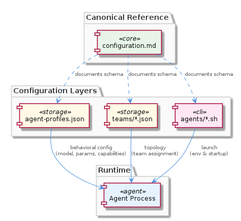
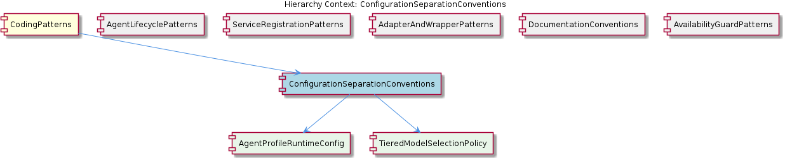

# ConfigurationSeparationConventions

**Type:** SubComponent

The convention prevents the anti-pattern of embedding team topology inside agent profiles, which would make it impossible to reassign agents between teams without editing capability-defining files.

# ConfigurationSeparationConventions

## What It Is

ConfigurationSeparationConventions is a sub-component of CodingPatterns that codifies a deliberate three-way split of agent-related configuration across distinct files and directories in the repository. The convention is physically realized in three locations: `config/agent-profiles.json` (runtime behavioral configuration), `config/teams/*.json` (team topology), and `config/agents/*.sh` (launch scripts). The canonical reference for this schema is documented at `integrations/mcp-server-semantic-analysis/docs/configuration.md`.

The convention exists to enforce a clean separation of concerns across three orthogonal axes of agent configuration: **what an agent is** (capabilities, model, parameters), **where an agent belongs** (team membership and coordination structure), and **how an agent runs** (process invocation, environment, startup mechanics). Each axis lives in its own file format and directory, ensuring that changes to one dimension do not require editing files that own other dimensions.

## Architecture and Design

The architectural approach is a strict **separation-of-concerns partitioning** applied to configuration files. Rather than consolidating agent definitions into a single JSON document or YAML manifest, the convention splits them across three storage modalities chosen to match the nature of each concern. `config/agent-profiles.json` is a single aggregated JSON document because runtime behavioral parameters (model selection, tuning) are naturally compared across agents. `config/teams/*.json` uses one-file-per-team because team topologies are independently evolving units of coordination. `config/agents/*.sh` uses shell scripts because process invocation is inherently imperative and benefits from shell's native environment-handling capabilities.

This design embodies the **anti-coupling principle**: capability-defining files (profiles) must never embed team topology, because doing so would make it impossible to reassign agents between teams without editing the very files that define agent capabilities. The convention explicitly prevents this anti-pattern. Similarly, launch mechanics are isolated from both capability and topology so that environment changes (e.g., changing how a process is spawned) do not perturb behavioral or organizational definitions.

The three-way split also has direct implications for **change auditability**. Adding a new agent requires three independent edits — one per axis — and each shows up as a discrete, reviewable change in version control. This composability extends to operational scenarios: a team reorganization touches only `config/teams/*.json`, a model upgrade touches only `config/agent-profiles.json`, and a runtime environment change touches only `config/agents/*.sh`.

## Implementation Details

The three configuration surfaces are implemented with deliberately different file structures matching their semantic roles:

**Runtime Behavioral Configuration (`config/agent-profiles.json`)**: A single JSON document that holds per-agent runtime tuning — model identifiers, sampling parameters, capability flags. This is the surface refined by the child sub-component **AgentProfileRuntimeConfig**, which establishes that this file owns model identity exclusively. The forthcoming **TieredModelSelectionPolicy** child component, proposed in `integrations/mcp-server-semantic-analysis/docs/TIERED-MODEL-PROPOSAL.md`, extends the profile schema to allow assigning lightweight versus full-capability models per agent rather than applying a single global model setting.

**Team Topology (`config/teams/*.json`)**: Each file in this directory encodes a single team's membership and coordination structure. The one-file-per-team layout means team boundaries are filesystem-visible and individually versioned. Importantly, agents are referenced from team files by identifier — the team file does not redefine agent capabilities, only declares membership.

**Launch Scripts (`config/agents/*.sh`)**: Each agent has a corresponding shell script that handles process invocation, environment variable setup, and startup mechanics. This isolates the imperative concerns of process management from the declarative concerns of capability and topology.

To add a new agent, a contributor must touch all three areas independently: add a profile entry to `config/agent-profiles.json`, add or modify a team file under `config/teams/`, and create a launch script under `config/agents/`. The required coordination across three locations is the explicit cost paid for the resulting clarity of separation.

## Integration Points

This sub-component sits under the **CodingPatterns** parent, which articulates broader project-wide conventions including the three-phase lazy initialization contract for LLM-backed agents documented in `integrations/mcp-server-semantic-analysis/docs/architecture/agents.md`. ConfigurationSeparationConventions complements that lifecycle pattern: while the lifecycle contract governs *runtime* construction (constructor → ensureLLMInitialized() → execute()), this convention governs the *configuration inputs* that feed into the `constructor(repoPath, team)` signature defined by sibling **AgentLifecyclePatterns**. The `team` parameter passed to BaseAgent subclasses is sourced from `config/teams/*.json`, while behavioral parameters are read from `config/agent-profiles.json`.

The convention also relates to sibling patterns through shared philosophy. Like **AdapterAndWrapperPatterns**, which hides Graphology and LevelDB behind a domain-oriented `GraphDatabaseAdapter` API, ConfigurationSeparationConventions hides the multi-dimensional complexity of agent definition behind clean per-concern interfaces. Like **DocumentationConventions**, this convention is documented as a canonical reference — `integrations/mcp-server-semantic-analysis/docs/configuration.md` serves the same canonical-reference role for configuration that `docs/puml/` `.puml` files serve for architecture diagrams.

The child sub-components extend specific facets of this separation: **AgentProfileRuntimeConfig** specifies what belongs in the profile file, and **TieredModelSelectionPolicy** proposes a schema evolution within the profile boundary. Neither child crosses into team topology or launch script territory, reinforcing the separation discipline.

## Usage Guidelines

When adding a new agent, contributors must make three independent edits — one per configuration axis — and treat each as a separately auditable change. Do not consolidate these edits into a single file by, for example, embedding team assignment fields inside the agent profile entry. The convention explicitly forbids this because it would couple capability definitions to topology decisions, preventing clean team reassignment.

When reassigning agents between teams, edit only `config/teams/*.json` files. Do not modify `config/agent-profiles.json` for topology purposes — that file owns model identity and runtime tuning exclusively, per the **AgentProfileRuntimeConfig** child specification. Similarly, when adjusting how an agent process is launched (environment variables, startup commands, working directory), confine changes to the relevant `config/agents/*.sh` script and avoid leaking process concerns into the JSON configuration files.

When evolving the configuration schema, update the canonical reference at `integrations/mcp-server-semantic-analysis/docs/configuration.md` alongside the code changes. New configuration axes should be considered carefully — adding a fourth split would multiply the contributor burden, so additions should remain within the existing three boundaries unless a genuinely orthogonal concern emerges. Schema extensions like the proposed tiered model selection should fit within an existing axis (in that case, within the profile axis) rather than introducing a new file location.

Finally, treat the three-way split as a project-wide invariant rather than a local stylistic preference. The convention's value compounds with the number of agents in the system: as more agents are added, the cost of violating the separation (entangled edits, broken reassignment workflows) grows nonlinearly, while the cost of adhering to it remains constant per-agent.

## Hierarchy Context

### Parent
- [CodingPatterns](./CodingPatterns.md) -- [LLM] The project enforces a strict three-phase lazy initialization contract for all LLM-backed agents, documented in integrations/mcp-server-semantic-analysis/docs/architecture/agents.md. The contract mandates the sequence: constructor(repoPath, team) → ensureLLMInitialized() → execute(input). In the constructor phase, the agent captures only its configuration context (repository path and team assignment) without touching LLM infrastructure. The second phase, ensureLLMInitialized(), is an idempotent guard method that performs the actual LLM client instantiation and is designed to be safe to call multiple times — only the first call allocates resources. The third phase, execute(input), is the sole public entry point for agent work and implicitly relies on ensureLLMInitialized() having been called (either explicitly by a harness or at the top of execute() itself). This pattern is a deliberate trade-off: it keeps agent construction cheap for cases where agents are instantiated in bulk but only a subset are actually invoked, preventing unnecessary LLM connection overhead. A new contributor adding an agent must not acquire LLM connections in the constructor — doing so would break the lifecycle contract and cause resource exhaustion in orchestrator scenarios that pre-instantiate agents.

### Children
- [AgentProfileRuntimeConfig](./AgentProfileRuntimeConfig.md) -- The core convention established by this sub-component is that config/agent-profiles.json owns model identity and runtime tuning, while agent wiring and topology definitions live in separate files; this boundary is described as intentional in the Agent Architecture documentation at integrations/mcp-server-semantic-analysis/docs/architecture/agents.md.
- [TieredModelSelectionPolicy](./TieredModelSelectionPolicy.md) -- The proposal is documented at integrations/mcp-server-semantic-analysis/docs/TIERED-MODEL-PROPOSAL.md, which outlines assigning lightweight versus full-capability models per agent profile rather than applying a single global model setting across all agents.

### Siblings
- [AgentLifecyclePatterns](./AgentLifecyclePatterns.md) -- BaseAgent subclasses documented in integrations/mcp-server-semantic-analysis/docs/architecture/agents.md all follow a constructor(repoPath, team) signature that captures only configuration context, explicitly forbidding any LLM client instantiation at this stage.
- [ServiceRegistrationPatterns](./ServiceRegistrationPatterns.md) -- scripts/api-service.js calls ProcessStateManager.registerService() immediately after process spawn, establishing the registration as the canonical signal that a service is live and trackable.
- [AdapterAndWrapperPatterns](./AdapterAndWrapperPatterns.md) -- GraphDatabaseAdapter wraps the Graphology graph library combined with LevelDB persistence, exposing a domain-oriented API rather than the raw Graphology or LevelDB interfaces directly.
- [DocumentationConventions](./DocumentationConventions.md) -- All architecture diagrams are stored as .puml files under docs/puml/ directories, as evidenced by the documentation listing showing integrations/mcp-server-semantic-analysis/docs/architecture/ containing multiple .md files that reference PlantUML sources.
- [AvailabilityGuardPatterns](./AvailabilityGuardPatterns.md) -- isServerAvailable() is called before dynamic imports of VkbApiClient, ensuring the optional external API client is never loaded if its backing server cannot be reached.

---

*Generated from 6 observations*
