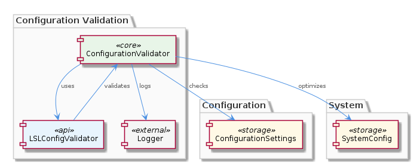
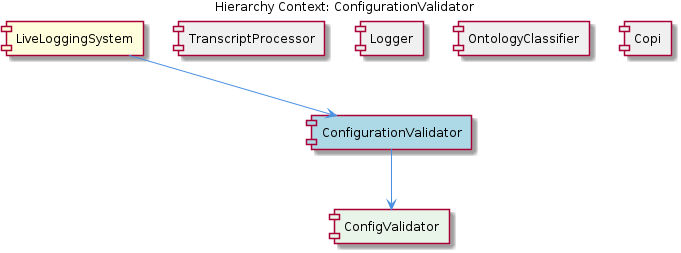

# ConfigurationValidator

**Type:** SubComponent

The ConfigurationValidator includes features for configuration validation, ensuring that the configuration conforms to expected formats and standards.

## What It Is  

The **ConfigurationValidator** lives in the `scripts` directory of the repository and is realized by the **LSLConfigValidator** script.  It is a sub‑component of the larger **LiveLoggingSystem** and itself contains a child component named **ConfigValidator**.  Its primary responsibility is to inspect the system’s configuration files for syntactic correctness, semantic consistency, and adherence to predefined standards.  When it detects sub‑optimal settings, it emits concrete optimization suggestions that developers can apply to improve performance and resource utilization.  Because the validator is **configurable**, callers can tailor which validation rules are active and adjust the aggressiveness of the optimization advice.

## Architecture and Design  

The overall design follows a **modular architecture** that is explicitly described in the parent component’s documentation.  Each major concern—logging, transcript processing, ontology classification, and configuration validation—is isolated in its own folder and exposed through well‑defined interfaces.  Within this modular scheme, the ConfigurationValidator is **composed** into the LiveLoggingSystem (`LiveLoggingSystem → ConfigurationValidator → ConfigValidator`).  This composition enables the parent system to invoke validation as a discrete step without coupling to the internal validation logic.

The validator adopts a **configuration‑driven strategy**: validation rules and optimization heuristics are supplied via external settings, allowing the same LSLConfigValidator script to be reused across environments with different performance goals.  The reliance on the **unified logging interface** (`integrations/mcp-server-semantic-analysis/src/logging.ts`) demonstrates a **cross‑cutting concern** implementation—logging is factored out of the validator and injected via the Logger component, keeping the validation code focused on its domain.

## Implementation Details  

The heart of the validator is the **LSLConfigValidator** script located in `scripts/`.  Although the source code is not enumerated in the observations, the naming convention implies a single executable (or module) that orchestrates the validation workflow.  Inside this script, the **ConfigValidator** child component encapsulates the low‑level checks—parsing configuration files, verifying required keys, and applying consistency rules.  Because the validator is described as “handling complex configuration scenarios,” it likely implements a layered validation pipeline: a **syntactic layer** (e.g., JSON/YAML schema validation) followed by a **semantic layer** that cross‑references related settings to detect contradictory or inefficient combinations.

When an issue is discovered, the validator logs the event through the **Logger** component’s unified interface.  This ensures that all validation messages—errors, warnings, and optimization suggestions—appear in the same log stream as other system events, facilitating centralized monitoring.  The configurability of the validator is achieved through external settings (e.g., a JSON/YAML options file) that enable or disable specific rule sets and control the verbosity of the optimization feedback.

## Integration Points  

* **Parent – LiveLoggingSystem**: The LiveLoggingSystem incorporates the ConfigurationValidator as a distinct module.  During system startup or configuration reload, LiveLoggingSystem invokes the validator to guarantee that the environment is correctly set up before any logging or transcript processing begins.  

* **Sibling – Logger**: All validation output is routed through the Logger component (`integrations/mcp-server-semantic-analysis/src/logging.ts`).  This shared logging facility guarantees consistent formatting, log levels, and destination handling across the entire platform.  

* **Sibling – TranscriptProcessor & OntologyClassifier**: While these components do not directly call the validator, they depend on a correctly configured system.  Validation failures therefore act as a gatekeeper, preventing downstream processing from operating on malformed or sub‑optimal configurations.  

* **Child – ConfigValidator**: The ConfigValidator implements the concrete rule set.  It can be extended or replaced without altering the outer LSLConfigValidator script, supporting future enhancements such as new configuration schemas or additional optimization heuristics.  

* **External Interfaces**: Because the validator is configurable, it expects a configuration descriptor (likely a file path or environment variable) that specifies which rule bundles to activate.  This descriptor is read at runtime, making the validator adaptable to different deployment contexts (development, staging, production).

## Usage Guidelines  

1. **Invoke Early** – Run the ConfigurationValidator immediately after any configuration change or before launching the LiveLoggingSystem.  Early detection prevents cascading failures in the Logger, TranscriptProcessor, or OntologyClassifier.  

2. **Leverage Configurability** – Supply a validation profile that matches the target environment.  For example, enable aggressive performance‑optimizing rules in production while keeping a lightweight rule set for local development.  

3. **Monitor Logs** – Since all validation feedback is emitted via the Logger component, configure your logging backend (file, stdout, or remote collector) to capture `WARN` and `INFO` levels where optimization suggestions appear.  Treat `ERROR` entries as blockers that must be resolved before proceeding.  

4. **Extend via ConfigValidator** – When new configuration parameters are introduced, add corresponding checks to the ConfigValidator child.  Because the outer LSLConfigValidator script delegates to ConfigValidator, you can evolve validation logic without disrupting the script’s entry point.  

5. **Avoid Direct Modification of LSLConfigValidator** – Treat the script as a stable orchestrator.  Custom logic should be encapsulated in separate rule modules or configuration files to preserve upgradeability and maintain a clean separation of concerns.

---

### Architectural Patterns Identified
* Modular architecture (separate folders for distinct concerns)  
* Composition (LiveLoggingSystem → ConfigurationValidator → ConfigValidator)  
* Configuration‑driven strategy (validation rules supplied via external settings)  
* Cross‑cutting concern handling via a unified logging interface  

### Design Decisions and Trade‑offs
* **Separation of validation logic** into a child component (ConfigValidator) enables easier extension but adds an extra indirection layer.  
* **Centralized logging** simplifies observability at the cost of tighter coupling to the Logger’s API.  
* **Configurable rule sets** provide flexibility for different environments but require disciplined management of configuration files to avoid drift.  

### System Structure Insights
* The validator sits at a strategic point in the startup pipeline, acting as a gatekeeper for downstream modules.  
* Its location in `scripts/` suggests it is intended for command‑line or CI‑style execution rather than being a long‑running service.  

### Scalability Considerations
* Because validation is performed as a batch operation, scalability hinges on the size of the configuration data rather than concurrent request handling.  
* Adding parallel validation of independent configuration sections could improve performance for very large configs, though the current design appears sequential.  

### Maintainability Assessment
* **High maintainability** due to clear modular boundaries and the use of a dedicated child component for rule implementation.  
* The reliance on external configuration for rule selection reduces code churn when adapting to new environments.  
* Potential maintenance burden arises if the rule set grows large; organizing rules into logical groups within ConfigValidator will be essential.

## Hierarchy Context

### Parent
- [LiveLoggingSystem](./LiveLoggingSystem.md) -- [LLM] The LiveLoggingSystem component utilizes a modular architecture, with separate components for logging, transcript processing, and configuration validation. This is evident in the directory structure, where the 'integrations' folder contains subfolders for 'browser-access', 'code-graph-rag', and 'copi', each representing a distinct aspect of the system. For instance, the 'copi' subfolder contains files such as 'INSTALL.md' and 'USAGE.md', which provide installation and usage guidelines for the Copi component. The 'lib/agent-api' folder contains the TranscriptAdapter abstract base class, which is responsible for reading and converting transcripts from different agent formats. The 'scripts' folder contains the LSLConfigValidator, which is used for validating and optimizing LSL configuration. The logging module, located in 'integrations/mcp-server-semantic-analysis/src/logging.ts', provides a unified logging interface and is used throughout the system.

### Children
- [ConfigValidator](./ConfigValidator.md) -- The ConfigurationValidator sub-component is implemented in the 'scripts' folder, using the LSLConfigValidator script to validate and optimize configuration.

### Siblings
- [TranscriptProcessor](./TranscriptProcessor.md) -- The TranscriptProcessor uses the TranscriptAdapter abstract base class in 'lib/agent-api' to read and convert transcripts from various agent formats.
- [Logger](./Logger.md) -- The Logger component is implemented in 'integrations/mcp-server-semantic-analysis/src/logging.ts', providing a unified logging interface.
- [OntologyClassifier](./OntologyClassifier.md) -- The OntologyClassifier uses a modular design, allowing for easy integration of new ontology systems and classification mechanisms.
- [Copi](./Copi.md) -- The Copi component is implemented in the 'integrations/copi' folder, providing a GitHub Copilot CLI wrapper with logging and Tmux integration.

---

*Generated from 7 observations*
