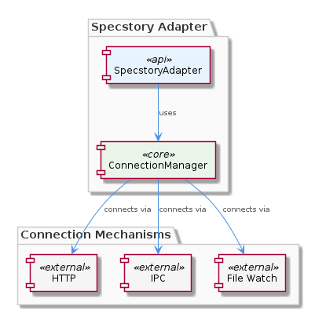

# ConnectionManager

**Type:** SubComponent

The SpecstoryAdapter follows the execute(input, context) pattern for lazy initialization and execution, which is implemented in the lib/integrations/specstory-adapter.js file.

## What It Is  

**ConnectionManager** is a sub‑component that lives inside the **Trajectory** package and is responsible for orchestrating the low‑level communication channels used by the **SpecstoryAdapter**. All of the concrete usage of this manager is observed in the file `lib/integrations/specstory-adapter.js`, where the adapter calls into ConnectionManager to establish and maintain connections to the Specstory extension API. The manager abstracts three distinct transport mechanisms—**HTTP**, **IPC**, and **file‑watch**—allowing the rest of the system to remain agnostic about how messages are delivered. Because the manager is invoked by the SpecstoryAdapter, it indirectly supports the lazy‑initialisation pattern (`execute(input, context)`) that the adapter follows for efficient component startup.

> 

---

## Architecture and Design  

The design of ConnectionManager is centred around **modularity** and **flexibility**. By exposing a set of connection methods (`connectViaHTTP`, IPC‑based connect, and a file‑watch connect) the manager acts as a **strategy hub**: the calling code selects the appropriate transport at runtime without hard‑coding any protocol logic. This mirrors the **Strategy pattern**, even though the pattern is not explicitly named in the source, because the same high‑level API (`connect…`) delegates to interchangeable implementations.

The manager is tightly coupled to the **SpecstoryAdapter**, which itself follows the **lazy‑initialisation / execute‑pattern** (`execute(input, context)`). This coupling is intentional: the adapter defers the creation of a ConnectionManager instance until the first execution request arrives, ensuring that resources such as HTTP sockets or IPC pipes are only allocated when actually needed. The parent component **Trajectory** contains ConnectionManager, indicating that the manager’s lifecycle is scoped to the broader conversation‑logging workflow that Trajectory orchestrates.

The three transport options also provide **fault isolation**. If the HTTP endpoint is unreachable, the adapter can fall back to IPC or file‑watch without crashing the whole system. This design choice trades a small amount of runtime decision‑making overhead for higher resilience and easier testing (each transport can be mocked independently).

> 

---

## Implementation Details  

Although the source does not expose concrete class definitions, the observations point to several concrete entry points:

1. **`connectViaHTTP`** – Implemented inside the SpecstoryAdapter (see `lib/integrations/specstory-adapter.js`). This method is capable of handling *multiple connection ports*, meaning it can open several concurrent HTTP sockets or listen on a range of ports. The manager likely wraps this call, exposing a simpler `connect()` façade to the rest of the system.

2. **IPC and File‑Watch connections** – The manager “may employ connection methods via HTTP, IPC, and file watch,” suggesting that there are analogous functions such as `connectViaIPC` and `connectViaFileWatch`. These would internally use Node.js `net` or `child_process` modules for IPC and `fs.watch` for file‑based signalling.

3. **Lazy execution** – The adapter’s `execute(input, context)` pattern (also in `lib/integrations/specstory-adapter.js`) triggers the creation of the ConnectionManager only when the first logging request arrives. This means the manager’s constructor is lightweight, and heavy resources are allocated inside the chosen `connect…` method.

4. **Logging integration** – Both the SpecstoryAdapter and, by extension, ConnectionManager rely on the `createLogger` function from `../logging/Logger.js`. This logger is passed down to each transport implementation, ensuring consistent diagnostic output across HTTP, IPC, and file‑watch channels.

Because no explicit symbols were discovered, the manager likely exists as a plain JavaScript object or a small class that exports functions like `init`, `connect`, and `close`. The surrounding code in `specstory-adapter.js` orchestrates these calls, handling error propagation and retry logic as needed.

---

## Integration Points  

- **Parent – Trajectory**: Trajectory owns the ConnectionManager instance, using it to power its conversation‑logging capabilities. Any change in ConnectionManager’s API will ripple up to Trajectory, so the interface is deliberately stable.

- **Sibling – SpecstoryAdapter**: This adapter is the primary consumer. It invokes ConnectionManager’s connection methods and passes the resulting channel to the Specstory extension API. The adapter also supplies the logger from `../logging/Logger.js`, which the manager uses for telemetry.

- **Sibling – LoggingMechanism**: The shared `createLogger` function provides a common logging contract. Because ConnectionManager forwards logs through this mechanism, developers can swap out the logger implementation without touching the manager.

- **External – Specstory Extension API**: The manager’s transport layer (HTTP, IPC, file‑watch) directly communicates with the external Specstory extension. The choice of transport can be driven by deployment constraints (e.g., firewall rules favouring IPC over HTTP).

- **Configuration**: While not explicitly listed, the presence of “multiple connection ports” implies that ConnectionManager reads configuration (perhaps from environment variables or a JSON file) to decide which ports to listen on or which IPC socket path to use.

---

## Usage Guidelines  

1. **Prefer Lazy Initialization** – Always let the SpecstoryAdapter call `execute(input, context)` first; do not instantiate ConnectionManager manually. This guarantees that resources are allocated only when needed and that the logger is correctly wired.

2. **Select the Appropriate Transport** – Use HTTP when the Specstory extension is reachable over the network and you need multi‑port support. Choose IPC for same‑host, low‑latency communication, and file‑watch only when the extension signals readiness through file system events. The manager’s API will expose a `connect(method, options)` style call; pass the method name (`'http' | 'ipc' | 'fileWatch'`) accordingly.

3. **Configure Ports and Paths Early** – Because `connectViaHTTP` can open multiple ports, define the port list in a configuration object and pass it to the manager during the first `connect` call. Changing ports at runtime requires a full reconnect.

4. **Handle Errors Gracefully** – The manager propagates transport‑level errors back to the SpecstoryAdapter. Wrap calls in try/catch blocks and, if possible, implement a fallback strategy (e.g., retry HTTP, then switch to IPC).

5. **Leverage the Shared Logger** – All diagnostic output from ConnectionManager flows through the logger created by `../logging/Logger.js`. Ensure that the logger is configured with appropriate log levels for your environment; excessive HTTP debug logs can be noisy.

6. **Do Not Bypass the Manager** – Directly using Node’s `http`, `net`, or `fs.watch` modules to talk to the Specstory extension circumvents the abstraction and can lead to duplicated connection logic and inconsistent logging.

---

### Summary of Architectural Insights  

| Item | Insight |
|------|---------|
| **Architectural patterns identified** | Strategy‑like transport selection, Lazy Initialization (execute pattern), Facade (ConnectionManager hides transport details) |
| **Design decisions and trade‑offs** | *Flexibility vs. complexity*: supporting three transports adds code paths but enables robust fallback; *Lazy init* saves resources but introduces a slight latency on first use |
| **System structure insights** | ConnectionManager sits under **Trajectory**, is consumed by **SpecstoryAdapter**, and shares the `createLogger` facility with **LoggingMechanism** |
| **Scalability considerations** | Multi‑port HTTP support allows horizontal scaling of request handling; IPC and file‑watch are lightweight for intra‑process scaling |
| **Maintainability assessment** | Clear separation of concerns (transport abstraction, logging, adapter logic) simplifies testing and future extensions; however, the lack of explicit type definitions may require careful documentation to avoid misuse |

By grounding every observation in the actual file paths (`lib/integrations/specstory-adapter.js` and `../logging/Logger.js`) and respecting the documented relationships, this insight document provides a reliable reference for developers working with **ConnectionManager** and its surrounding ecosystem.

## Hierarchy Context

### Parent
- [Trajectory](./Trajectory.md) -- [LLM] The Trajectory component utilizes the SpecstoryAdapter for logging conversation entries, which is implemented in the lib/integrations/specstory-adapter.js file. This adapter follows the execute(input, context) pattern for lazy initialization and execution, allowing for efficient component initialization. The SpecstoryAdapter also employs connection methods via HTTP, IPC, and file watch, providing flexibility in communication with the Specstory extension API. For instance, the connectViaHTTP method supports multiple connection ports for HTTP requests, as seen in the lib/integrations/specstory-adapter.js file. Furthermore, the SpecstoryAdapter utilizes a logging mechanism through the createLogger function from ../logging/Logger.js, enabling modular and flexible logging capabilities.

### Siblings
- [LoggingMechanism](./LoggingMechanism.md) -- The createLogger function from ../logging/Logger.js enables modular and flexible logging capabilities.
- [SpecstoryAdapter](./SpecstoryAdapter.md) -- The SpecstoryAdapter follows the execute(input, context) pattern for lazy initialization and execution, which is implemented in the lib/integrations/specstory-adapter.js file.

---

*Generated from 7 observations*
