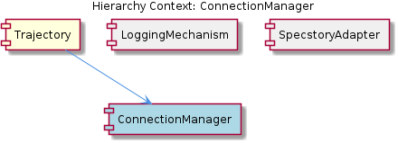

# ConnectionManager

**Type:** SubComponent

The ConnectionManager sub-component is mentioned in the manifest, but its implementation details are unknown due to the lack of source code.

## What It Is  

The **ConnectionManager** is a sub‑component that appears in the project manifest as part of the **Trajectory** component.  No source files containing a concrete implementation were located in the repository – the “Code Structure” section reports *0 code symbols found* and no key files are listed.  Consequently, the exact file path (e.g., `lib/connection-manager.js` or similar) is unknown, and the implementation may reside in a module that is not currently checked‑in or is generated at build time.  

From the observations, the ConnectionManager is envisioned as the logical piece that orchestrates **multiple connections to the Specstory service**.  It is expected to provide facilities such as connection pooling, error handling with fall‑backs, metrics collection, and possibly load‑balancing or fail‑over capabilities.  Its role is therefore to abstract the low‑level connection details away from higher‑level consumers (e.g., the **Trajectory** component) and present a stable, reusable interface for establishing and maintaining those connections.

---

## Architecture and Design  

Because the source is absent, the architectural picture must be inferred from the surrounding context and the explicit observations.  

1. **Separation of Concerns** – The manifest places ConnectionManager under **Trajectory**, indicating a clear boundary: Trajectory coordinates overall workflow while delegating the responsibility of managing Specstory connections to ConnectionManager.  This mirrors a classic *Facade* style where a higher‑level component (Trajectory) hides the complexity of connection handling behind a dedicated manager.  

2. **Potential Connection‑Pooling Pattern** – Observation 4 mentions “a connection pooling mechanism to improve performance.”  If implemented, this would follow the well‑known *Object Pool* pattern: a pool of pre‑created, reusable connection objects is maintained, and callers borrow/release them rather than creating a new socket or HTTP client for each request.  

3. **Error‑Handling / Fallback Strategy** – Observation 5 suggests the manager “could be configured to handle errors and fallbacks during connection establishment.”  This aligns with a *Retry* or *Circuit‑Breaker* style approach, where the manager tracks failure rates and either retries with back‑off or switches to an alternate endpoint.  

4. **Metrics & Monitoring** – Observation 6 points to “monitor and analyze connection metrics.”  This implies an internal telemetry subsystem (counters, latency histograms, success/failure rates) that may be exposed via an internal API or exported to external monitoring tools.  

5. **Load‑Balancing / Failover** – Observation 7 raises the possibility of load‑balancing or failover logic.  If present, the manager would likely maintain a list of Specstory endpoints and select one per request based on health checks or round‑robin distribution, which is a classic *Strategy* pattern for endpoint selection.  

The only concrete code reference in the surrounding hierarchy is the **SpecstoryAdapter** class in `lib/integrations/specstory-adapter.js`.  That file demonstrates asynchronous connection establishment via a `connectViaHTTP` function that uses callbacks.  While ConnectionManager does not appear directly in that file, the existence of an asynchronous adapter suggests that ConnectionManager would need to be compatible with the same async style (e.g., returning promises or accepting callbacks) so that Trajectory can compose its workflow without blocking.

---

## Implementation Details  

Given the lack of concrete symbols, the implementation can only be described in terms of *expected* building blocks derived from the observations:

| Expected Piece | Likely Responsibility | Possible Location (inferred) |
|----------------|-----------------------|------------------------------|
| **ConnectionPool** | Holds a configurable number of live HTTP/WS connections to Specstory; provides `acquire()` / `release()` methods. | Could be defined in a module such as `lib/connection-manager/pool.js`. |
| **ConnectionFactory** | Knows how to create a fresh Specstory connection (e.g., invoking `SpecstoryAdapter.connectViaHTTP`). | May be co‑located with the pool or in `lib/integrations/specstory-adapter.js`. |
| **ErrorHandler / RetryPolicy** | Wraps connection attempts, applies exponential back‑off, and optionally switches to a secondary endpoint. | Could be a helper in `lib/connection-manager/retry.js`. |
| **MetricsCollector** | Instruments each connection lifecycle event (open, close, error, latency) and aggregates counters. | Might export to a monitoring library (e.g., Prometheus) via `lib/connection-manager/metrics.js`. |
| **EndpointSelector** | Implements load‑balancing or failover logic (round‑robin, health‑check based). | Could be a strategy object in `lib/connection-manager/selector.js`. |
| **Public API** | Exposes methods such as `getConnection()`, `releaseConnection(conn)`, `shutdown()`, and possibly `getMetrics()`. | Likely the default export of `lib/connection-manager/index.js`. |

The **SpecstoryAdapter**’s `connectViaHTTP` function is a concrete example of the low‑level connection primitive that ConnectionManager would wrap.  The adapter uses callbacks, so ConnectionManager would either adapt those callbacks into a promise‑based pool API (common in modern Node.js code) or continue the callback style for consistency.  The asynchronous nature of the adapter aligns with the need for ConnectionManager to be non‑blocking, allowing Trajectory to issue multiple concurrent connection requests.

---

## Integration Points  

1. **Trajectory (Parent)** – Trajectory references ConnectionManager in the manifest and is expected to call its public API when it needs to interact with Specstory.  The manager therefore acts as a service provider for Trajectory, encapsulating all connection‑related concerns.  

2. **SpecstoryConnector (Sibling)** – This sibling also deals with Specstory, but its description focuses on a single `connectViaHTTP` call.  It is plausible that SpecstoryConnector is a thin wrapper around the low‑level adapter, while ConnectionManager provides the higher‑level pooling and resilience features that SpecstoryConnector alone does not.  In practice, SpecstoryConnector might delegate to ConnectionManager for any repeated or high‑throughput use cases.  

3. **ConversationLogger (Sibling)** – Although unrelated to connections, ConversationLogger appears in the same manifest level.  Both siblings likely share the same lifecycle management (initialization, shutdown) orchestrated by Trajectory, meaning that any start‑up sequence that brings up ConnectionManager should be coordinated with the logger to ensure logs capture connection events.  

4. **SpecstoryAdapter (External Integration)** – The adapter lives in `lib/integrations/specstory-adapter.js`.  ConnectionManager would import this module to create raw connections, then apply pooling, retry, and metrics around it.  The adapter’s callback‑based API is a concrete integration point that the manager must handle.  

5. **Configuration / Environment** – The observations hint at configurability (e.g., pool size, retry limits, endpoint list).  Those settings would likely be supplied via a JSON/YAML config file referenced by Trajectory or via environment variables, and read by ConnectionManager at initialization.

---

## Usage Guidelines  

*Initialize Early*: Trajectory should instantiate ConnectionManager during its own start‑up phase so that the connection pool is ready before any Specstory calls are made.  

*Prefer the Manager Over Direct Adapter Calls*: When a component needs a Specstory connection, it should request one from ConnectionManager (`await cm.getConnection()` or via callback) rather than invoking `SpecstoryAdapter.connectViaHTTP` directly.  This ensures pooling, retry, and metrics are applied consistently.  

*Release Connections Promptly*: After a request completes, the caller must release the connection back to the pool (`cm.releaseConnection(conn)`).  Failing to do so can exhaust the pool and degrade performance.  

*Observe Metrics*: Developers should monitor the metrics exposed by ConnectionManager (e.g., connection latency, error rates).  High error counts may indicate the need to adjust retry policies or add additional Specstory endpoints.  

*Handle Errors at the Call Site*: While ConnectionManager can encapsulate retries, callers should still be prepared for a final failure (e.g., a thrown exception or an error callback) and implement appropriate fallback logic (perhaps switching to an offline mode).  

*Configuration Consistency*: All pool‑related settings (max size, idle timeout) should be kept in a single configuration object that Trajectory passes to ConnectionManager.  Changing these values at runtime without a restart may lead to undefined behavior unless the manager explicitly supports hot‑reloading.  

---

## Architectural Patterns Identified  

| Pattern | Evidence from Observations |
|---------|----------------------------|
| **Facade / Service Layer** | ConnectionManager sits under Trajectory and abstracts Specstory connection details. |
| **Object Pool (Connection Pooling)** | Observation 4 explicitly mentions a pooling mechanism. |
| **Retry / Circuit‑Breaker (Error‑Handling)** | Observation 5 discusses handling errors and fallbacks. |
| **Strategy (Endpoint Selection / Load Balancing)** | Observation 7 suggests load‑balancing or failover logic. |
| **Telemetry / Monitoring** | Observation 6 points to metrics collection. |

---

## Design Decisions and Trade‑offs  

*Pooling vs. On‑Demand Connections*: Pooling reduces connection‑setup latency but consumes resources even when idle.  The design must balance pool size against memory/CPU constraints, especially in environments with limited resources.  

*Callback vs. Promise API*: The existing `SpecstoryAdapter.connectViaHTTP` uses callbacks.  Wrapping this in promises simplifies modern async/await usage but adds an extra abstraction layer.  Choosing one style influences the ergonomics for Trajectory and any other consumers.  

*Centralized vs. Distributed Error Handling*: Embedding retry logic inside ConnectionManager centralizes resilience, but it also hides failure details from callers that might need more granular context.  The trade‑off is between simplicity for most callers and flexibility for advanced use cases.  

*Metrics Overhead*: Collecting detailed per‑connection metrics provides valuable insight but can introduce CPU and I/O overhead.  The design should allow metrics collection to be toggled or sampled.  

*Load‑Balancing Complexity*: Implementing sophisticated load‑balancing (e.g., health‑check driven) improves availability but adds state management and health‑probe traffic.  A simpler round‑robin selector may be sufficient for many deployments.

---

## System Structure Insights  

- **Trajectory** acts as the orchestrator, delegating connection concerns to ConnectionManager.  
- **ConnectionManager** is the dedicated service layer for Specstory connectivity, likely composed of several internal modules (pool, factory, retry, metrics, selector).  
- **SpecstoryConnector** may be a thin wrapper that directly uses the low‑level adapter for one‑off connections, while ConnectionManager handles high‑throughput scenarios.  
- **ConversationLogger** operates independently but shares the same lifecycle management, meaning its initialization order may need to be coordinated with ConnectionManager to capture connection‑related logs.  

Overall, the system follows a modular decomposition where each concern (connection handling, logging, adapter specifics) lives in its own sub‑component, promoting separation of responsibilities.

---

## Scalability Considerations  

- **Horizontal Scaling**: Because ConnectionManager maintains an in‑process pool, scaling the service horizontally (multiple Node.js instances) will automatically multiply the total number of concurrent Specstory connections, which can improve throughput but must be bounded by the Specstory service’s capacity.  
- **Pool Size Tuning**: Adjusting the pool’s max size allows the system to handle more simultaneous requests without overwhelming the remote service.  Autoscaling policies could adjust this value based on observed load metrics.  
- **Failover & Load‑Balancing**: If multiple Specstory endpoints are configured, ConnectionManager can distribute traffic, reducing hot‑spots and providing resilience against a single endpoint failure.  
- **Metrics‑Driven Scaling**: The metrics collector (Observation 6) can feed alerts that trigger scaling actions when latency or error rates cross thresholds.

---

## Maintainability Assessment  

The absence of concrete source files makes a direct maintainability audit impossible, but the inferred design promotes good maintainability:

- **Clear Separation**: By isolating connection logic in a dedicated manager, changes to pooling, retry policies, or metrics can be made without touching Trajectory or other consumers.  
- **Configuration‑Driven Behavior**: If pool size, retry limits, and endpoint lists are externalized, operational tweaks require no code changes.  
- **Modular Internal Structure**: Splitting responsibilities into distinct internal modules (pool, selector, metrics) keeps each file focused, easing testing and future refactoring.  
- **Potential Technical Debt**: The lack of visible implementation suggests the component may be a placeholder or generated at build time.  If that is the case, developers must ensure the generation process is well‑documented; otherwise, future contributors may struggle to locate or modify the code.  

Overall, assuming the inferred patterns are realized, ConnectionManager would be a maintainable, extensible piece of the system, provided that its implementation follows the modular outline suggested by the observations.

## Diagrams

### Relationship

## Architecture Diagrams

## Hierarchy Context

### Parent
- [Trajectory](./Trajectory.md) -- [LLM] The Trajectory component's use of asynchronous programming is evident in the SpecstoryAdapter class, specifically in the connectViaHTTP function in lib/integrations/specstory-adapter.js, which establishes a connection to the Specstory service via HTTP. This asynchronous approach allows the component to handle multiple tasks concurrently, improving overall performance and responsiveness. The connectViaHTTP function is a prime example of this, as it uses callbacks to handle the connection establishment process. Furthermore, the SpecstoryAdapter class's implementation of the initialize function, which attempts connections to the Specstory service using different methods, demonstrates the component's ability to adapt to various connection scenarios.

### Siblings
- [SpecstoryConnector](./SpecstoryConnector.md) -- The connectViaHTTP function in lib/integrations/specstory-adapter.js uses callbacks to handle the connection establishment process.
- [ConversationLogger](./ConversationLogger.md) -- The ConversationLogger sub-component is mentioned in the manifest, but its implementation details are unknown due to the lack of source code.

---

*Generated from 7 observations*
