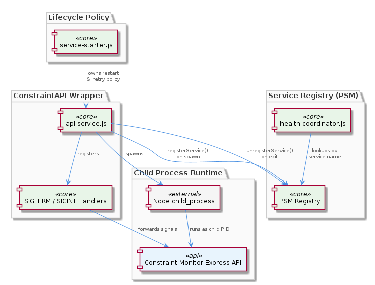
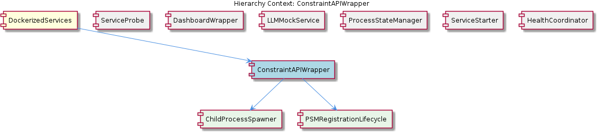

# ConstraintAPIWrapper

**Type:** SubComponent

Retry and restart policy for the constraint API is owned by lib/service-starter.js, not by api-service.js itself, keeping the wrapper focused solely on lifecycle signals and PSM registration

# ConstraintAPIWrapper — Technical Insight Document

## What It Is

ConstraintAPIWrapper is the lifecycle wrapper implemented in `scripts/api-service.js` that owns the constraint monitor Express API as a managed subprocess. It is not the API itself — rather, it is the thin orchestration layer that spawns the API, registers it with the ProcessStateManager (PSM), forwards process signals, and cleans up registry state on exit. Structurally, it sits inside the `DockerizedServices` parent component and is composed of two children: `ChildProcessSpawner` (the subprocess creation concern) and `PSMRegistrationLifecycle` (the registry coordination concern).

The wrapper exists to solve a specific architectural problem: the rest of the system — particularly `scripts/health-coordinator.js` — needs to reference the constraint API by a stable logical identity rather than by an ephemeral OS-level PID. By spawning the Express API as a child process and registering only the wrapper-managed handle with PSM, `api-service.js` decouples service identity from process identity, fulfilling what the parent `DockerizedServices` documentation describes as the "PSM decoupling contract."

## Architecture and Design

The architectural approach is a classic **wrapper/supervisor pattern** combined with **registry-based service discovery**. `scripts/api-service.js` uses Node's `child_process` module (specifically `child_process.spawn`, per the `ChildProcessSpawner` child entity) to launch the Express API in a separate OS process. The choice of `spawn` over `exec` or `fork` is deliberate: spawn returns a `ChildProcess` handle whose lifecycle events (`'exit'`, `'error'`) are directly observable, which is essential for the wrapper's role as lifecycle owner.

Three design concerns are carefully separated across collaborating components:
1. **Process spawning and signal ownership** — owned by `ConstraintAPIWrapper` (`scripts/api-service.js`)
2. **Restart and retry policy** — owned by the sibling `ServiceStarter` (`lib/service-starter.js`)
3. **Registry of logical services** — owned by the sibling `ProcessStateManager` (PSM singleton)

This separation is intentional and reinforced in the codebase: `lib/service-starter.js` is explicitly isolated from SIGTERM/SIGINT handling, while the wrapper is explicitly isolated from retry decisions. The wrapper installs `SIGTERM` and `SIGINT` handlers that forward signals to the child process, making it the sole owner of signal-handling for this service. This means signals delivered to the wrapper script propagate cleanly to the Express API child, while restart decisions remain a separate concern handled upstream.

The wrapper mirrors its sibling `DashboardWrapper` (`scripts/dashboard-service.js`) exactly in structural pattern — both spawn via `child_process`, call `psm.registerService()`, wire signal forwarding, and call `psm.unregisterService()` in the exit handler. This replication is a conscious design choice favoring per-service wrapper scripts over a centralized abstraction.

## Implementation Details

The implementation follows a precise sequence enforced by the `PSMRegistrationLifecycle` child entity. First, `api-service.js` registers the service with PSM (via `psm.registerService()`) to establish a stable logical identity in the registry. This registration persists independently of the child's OS-level PID — a critical property because it means subsequent restarts (which yield new PIDs) do not invalidate the registry entry. After registration, the Express API is launched through `child_process.spawn`, and the returned `ChildProcess` handle is retained for signal forwarding.

Signal handling is implemented through Node's process-level signal listeners. When the wrapper receives `SIGTERM` or `SIGINT`, the handler forwards the signal to the spawned child process. This forwarding model means external orchestrators (Docker, systemd, or a terminal user pressing Ctrl+C) interact with the wrapper, not the Express API directly — the wrapper is the public signal interface for the service.

Cleanup is handled in the exit handler, which calls `psm.unregisterService()` when the Express API process terminates. This removes the entry from the PSM registry and prevents stale entries from misleading health checks performed by `scripts/health-coordinator.js`. Because PSM is a singleton shared across all wrapper scripts and consumers, this cleanup is immediately visible to every consumer without explicit notification.

Notably, the wrapper itself contains no retry or restart logic. If the child process exits unexpectedly, the wrapper unregisters from PSM and exits; any decision to restart the service belongs to `lib/service-starter.js`. This keeps `api-service.js` minimal, focused, and easy to reason about.

## Integration Points

The ConstraintAPIWrapper integrates with several sibling components through well-defined contracts. Its primary integration is with `ProcessStateManager` — the wrapper depends on the PSM singleton for `registerService()` and `unregisterService()` calls, and PSM in turn is <USER_ID_REDACTED> by `HealthCoordinator` (`scripts/health-coordinator.js`) to determine service availability. Because PSM is a singleton, no explicit reference passing is needed; both producer (wrapper) and consumer (health coordinator) access the same registry instance.

The wrapper has an implicit relationship with `ServiceStarter` (`lib/service-starter.js`), which owns the restart/retry policy for the constraint API. While there is no direct call between them at the wrapper level, the architectural division is strict: `service-starter.js` decides *when* the service should run, and `api-service.js` decides *how* it runs (process lifecycle and signal ownership) once started.

`ServiceProbe` (at `lib/utils/service-probe.js`) is consumed by `HealthCoordinator` rather than by the wrapper directly, but it participates in the same health-monitoring ecosystem that benefits from the wrapper's PSM registration discipline. Other sibling services such as `LLMMockService` are independent in implementation but share the broader Dockerized service environment.

The child entities — `ChildProcessSpawner` and `PSMRegistrationLifecycle` — are not separate modules but rather conceptual sub-responsibilities within `api-service.js`. They represent the two collaborating concerns that together make the wrapper work: subprocess creation and registry coordination.

## Usage Guidelines

When working with ConstraintAPIWrapper, developers should respect the strict separation of concerns it embodies. **Do not add retry or restart logic to `scripts/api-service.js`** — that responsibility belongs to `lib/service-starter.js`, and mixing the two would violate the design contract that both files explicitly maintain. Similarly, do not bypass the wrapper to interact with the Express API child directly; the wrapper is the sole owner of signal-handling and lifecycle events for this service.

When the constraint API needs to be referenced from elsewhere in the system, **always query PSM by service name rather than capturing a PID**. The whole point of the wrapper is to make PIDs an internal implementation detail; consumers like `HealthCoordinator` rely on this contract. A restart that produces a new child PID must be transparent to PSM consumers, and only `api-service.js` should update the registry.

If you need to add a new containerized service, the established convention is to create a new wrapper script that replicates the boilerplate found in `api-service.js` and its sibling `dashboard-service.js` — both follow an identical structural pattern of spawn → registerService → wire signals → unregisterService on exit. As noted in the `DockerizedServices` parent documentation, this duplication is a recognized maintenance concern that may warrant centralization as the number of services grows, but the current convention favors explicit per-service wrappers over abstraction.

Finally, ensure that any modification to the exit handler preserves the `psm.unregisterService()` call. Skipping this cleanup leaves stale entries in the PSM registry that will mislead `health-coordinator.js` into reporting a defunct service as active — a subtle bug that undermines the entire health-monitoring system.

## Hierarchy Context

### Parent
- [DockerizedServices](./DockerizedServices.md) -- [LLM] The ProcessStateManager (PSM) singleton implements a deliberate decoupling between service identity and process identity across both `scripts/api-service.js` and `scripts/dashboard-service.js`. Each script follows an identical structural pattern: spawn a child process via Node's `child_process` module, register the resulting process handle with the PSM via `psm.registerService()`, wire up `SIGTERM`/`SIGINT` forwarding so that signals delivered to the wrapper propagate to the child, and call `psm.unregisterService()` in the exit handler. This indirection means that the rest of the system (including `scripts/health-coordinator.js`) can query the PSM registry without holding direct references to OS-level process IDs. The practical consequence for developers is that a service restart — where a new child process replaces the old one — does not require the health coordinator or any consumer of PSM state to be aware of the PID change; only the wrapper scripts update the registry. This pattern also cleanly isolates the restart/retry logic in `lib/service-starter.js` from signal-handling responsibilities, since the wrapper owns the process lifecycle signals while the starter owns the retry policy. A new developer should note that adding a new containerized service almost certainly means creating a new wrapper script that replicates this boilerplate rather than centralizing it, which is a potential maintenance concern as the number of services grows.

### Children
- [ChildProcessSpawner](./ChildProcessSpawner.md) -- scripts/api-service.js uses Node's child_process.spawn (not exec or fork) to launch the Express API, which keeps the child process lifetime directly observable through process lifecycle events (e.g., 'exit', 'error') on the returned ChildProcess handle.
- [PSMRegistrationLifecycle](./PSMRegistrationLifecycle.md) -- api-service.js registers the service with PSM prior to spawning the Express API child process, establishing a stable logical identity in the PSM registry that persists independently of the child's OS-level PID.

### Siblings
- [ServiceProbe](./ServiceProbe.md) -- ServiceProbe lives at lib/utils/service-probe.js and is consumed by scripts/health-coordinator.js, establishing a clear utility-to-orchestrator dependency direction
- [DashboardWrapper](./DashboardWrapper.md) -- scripts/dashboard-service.js mirrors the structural pattern of api-service.js exactly: spawn via child_process, registerService, wire signals, unregisterService on exit
- [LLMMockService](./LLMMockService.md) -- llm-mock-service.ts persists LLM mode state to workflow-progress.json rather than keeping it in memory, making mode selection survive process restarts within the Docker environment
- [ProcessStateManager](./ProcessStateManager.md) -- PSM is a singleton, meaning all wrapper scripts (api-service.js, dashboard-service.js) and health-coordinator.js share a single registry instance without passing references explicitly
- [ServiceStarter](./ServiceStarter.md) -- lib/service-starter.js is explicitly isolated from SIGTERM/SIGINT handling — signal propagation is owned by the wrapper scripts (api-service.js, dashboard-service.js), not by the starter
- [HealthCoordinator](./HealthCoordinator.md) -- health-coordinator.js consumes PSM state by name rather than PID, so service restarts are transparent — it never needs to be notified of PID changes in api-service.js or dashboard-service.js

---

*Generated from 6 observations*
