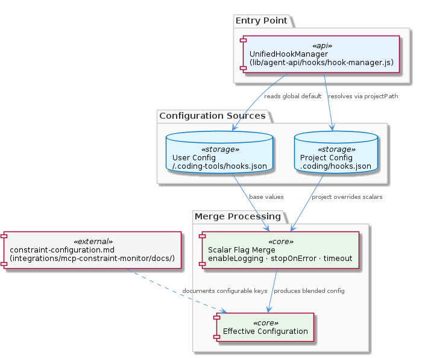
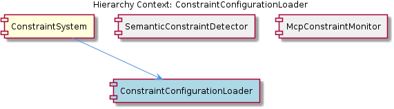

# ConstraintConfigurationLoader

**Type:** SubComponent

Because the effective config is always a blend of two sources, debugging unexpected constraint behavior requires inspecting both ~/.coding-tools/hooks.json and .coding/hooks.json — a pattern developers must internalize when troubleshooting hook misfires.

# ConstraintConfigurationLoader — Technical Insight Document

## What It Is

The ConstraintConfigurationLoader is a SubComponent of the broader ConstraintSystem, implemented in `lib/agent-api/hooks/hook-manager.js`. Its single entry point is `UnifiedHookManager.initialize(projectPath)`, which accepts a `projectPath` argument used to resolve the project-level configuration file. The loader's responsibility is to materialize the effective runtime configuration that governs constraint hook behavior by reading from two well-defined locations on disk and merging them according to a deliberate precedence rule.

Configuration sources are split between a fixed user-level file at `~/.coding-tools/hooks.json` — which acts as a global default applying across all of a developer's projects — and a project-level file at `.coding/hooks.json` resolved relative to the provided `projectPath`. The user-facing reference for which keys participate in this loader's behavior is documented in `integrations/mcp-constraint-monitor/docs/constraint-configuration.md`, which complements (rather than duplicates) the programmatic merge logic embedded in the hook manager.

Within the ConstraintSystem hierarchy, ConstraintConfigurationLoader is the sub-component that resolves *how* constraints will behave at runtime, while sibling components handle *what* constraints to detect and surface: SemanticConstraintDetector performs conversation-level inference over message context, and McpConstraintMonitor (documented in `integrations/mcp-constraint-monitor/README.md`) provides the runtime monitoring surface that consumes detection results.

## Architecture and Design

The architecture follows a **two-tier layered configuration pattern** with strict scope limits on what may be overridden. Tier one (user-level) provides personal developer defaults from `~/.coding-tools/hooks.json`; tier two (project-level) provides repository-enforced settings from `.coding/hooks.json`. The merge resolves conflicts by giving project-level authority over a narrow, explicitly enumerated set of scalar behavioral flags: `enableLogging`, `stopOnError`, and `timeout`. Structured or list-type configuration keys are not subject to this override logic — they are intentionally excluded from the merge algorithm.

This precedence design encodes a clear architectural intent: **repository maintainers have final authority on enforcement-critical behavior**, while developer customization is preserved for everything outside the override scope. A developer who disables logging in their personal config can have it forcibly re-enabled by a project's `.coding/hooks.json`. This is a deliberate trade-off that prioritizes compliance and consistency in shared codebases over individual developer preferences, particularly for compliance-sensitive projects where logging or error-stopping behavior cannot be unilaterally disabled.

The pattern aligns with the broader ConstraintSystem philosophy described at the parent level — namely that constraints exist to be enforced uniformly, and the configuration layer must not become an escape hatch from those enforcement guarantees. By limiting the override-eligible keys to scalar flags only, the design avoids unbounded complexity in merge semantics (no list concatenation, no deep object merging) and keeps the behavior predictable and easy to reason about.

## Implementation Details

The mechanics center on `UnifiedHookManager.initialize(projectPath)`. When called, the method first locates and parses `~/.coding-tools/hooks.json` to establish user-level defaults. It then resolves `.coding/hooks.json` against `projectPath` and, if present, parses the project-level configuration. The merge step then walks the scalar override set — `enableLogging`, `stopOnError`, `timeout` — and applies the project value when it differs from the user-level value. Keys outside this scalar set are not subject to project-level override.

The fixed location of `~/.coding-tools/hooks.json` is significant: because it is not parameterized, it serves as a single source of personal defaults across every project a developer works on. This makes user-level preferences cheap to set once and reuse, but it also means changes propagate globally and may be silently overridden in any project that ships its own `.coding/hooks.json`. The `projectPath` parameter on `initialize()` is the only knob that varies the project-level lookup, so the loader's behavior is fully determined by the developer's home directory and the working project root.

The split between programmatic merge logic in `lib/agent-api/hooks/hook-manager.js` and human-readable documentation in `integrations/mcp-constraint-monitor/docs/constraint-configuration.md` reflects a separation of concerns: the code enforces the merge mechanics, while the documentation tells developers which keys they can meaningfully set in each tier. Keeping these aligned is an ongoing maintenance responsibility — changes to the override scalar set must be mirrored in the documentation.

## Integration Points

ConstraintConfigurationLoader integrates upward into its parent ConstraintSystem by producing the effective configuration object that other sub-components consume. Its sibling SemanticConstraintDetector, which performs conversation-level inference, relies on this configuration to know whether logging is active and how to respond to errors. McpConstraintMonitor, as the runtime monitoring surface, similarly depends on flags like `enableLogging` and `stopOnError` resolved by the loader to determine its own behavior at the integration boundary.

Externally, the loader interfaces with the filesystem at two well-defined paths (`~/.coding-tools/hooks.json` and `<projectPath>/.coding/hooks.json`), making the filesystem its primary dependency. There is no network call, no database, and no remote configuration service in the observed design — the loader is intentionally local and deterministic. This keeps initialization fast and removes a class of failure modes (network errors, auth) from the constraint startup path.

The `projectPath` argument is the integration contract with callers: whichever component invokes `UnifiedHookManager.initialize()` is responsible for supplying an accurate project root. Misidentifying the project root would cause the loader to silently fall back to user-only configuration, since the project-level file would not be found at the wrong path.

## Usage Guidelines

When troubleshooting unexpected constraint behavior, developers must inspect **both** `~/.coding-tools/hooks.json` and the project's `.coding/hooks.json`. Because the effective configuration is always a blend of two sources, looking at only one file will routinely lead to incorrect conclusions about why a hook fired (or failed to fire). This is a non-negotiable habit for anyone debugging hook misfires in the ConstraintSystem.

Developers should treat `~/.coding-tools/hooks.json` as personal defaults and accept that those defaults may be overridden in compliance-sensitive repositories. If a project enforces `enableLogging: true`, that decision was made deliberately by repository maintainers and cannot be reversed from the user-level file. Conversely, project maintainers should use `.coding/hooks.json` sparingly and only for the three scalar flags that actually participate in the override logic — setting structured or list-type keys at the project level will not produce the override effect they might expect, since those are outside the merge scope.

When extending the loader, contributors should preserve the narrow scalar-override contract. Adding new keys to the override set requires updating both the merge logic in `lib/agent-api/hooks/hook-manager.js` and the user-facing documentation in `integrations/mcp-constraint-monitor/docs/constraint-configuration.md`. Broadening the merge to include structured types would change the design's complexity profile significantly and should be approached cautiously.

---

## Analytical Summary

**1. Architectural patterns identified**
- Two-tier layered configuration with explicit precedence
- Single-entry-point initialization (`UnifiedHookManager.initialize(projectPath)`)
- Scoped merge — override applies only to an enumerated scalar set
- Local filesystem-only configuration (no remote dependencies)

**2. Design decisions and trade-offs**
- *Project-wins-over-user for scalar flags*: prioritizes enforcement consistency over developer autonomy; the cost is that personal preferences can be silently overridden.
- *Fixed user-level path* (`~/.coding-tools/hooks.json`): simplifies setup but couples all of a user's projects to a single defaults file.
- *Scalar-only override scope*: keeps merge semantics simple and predictable, at the cost of less expressive project-level configuration.
- *Documentation/code split*: improves discoverability but creates an alignment maintenance burden.

**3. System structure insights**
The loader is a focused sub-component within ConstraintSystem, cleanly separated from detection (SemanticConstraintDetector) and monitoring (McpConstraintMonitor) responsibilities. Its narrow contract — produce an effective configuration from two known files — makes it a stable foundation for the siblings that consume its output.

**4. Scalability considerations**
The design scales well for the intended use case (per-developer, per-project configuration) because both file reads are local and bounded. There is no obvious scalability ceiling on the number of projects or developers. The fixed user-level path could become a friction point for developers who want different defaults per project context, but that scenario is explicitly the role of `.coding/hooks.json`.

**5. Maintainability assessment**
Maintainability is strong due to the small, well-defined surface area: one entry point, two file paths, three override keys. The primary maintenance risk is drift between `lib/agent-api/hooks/hook-manager.js` and `integrations/mcp-constraint-monitor/docs/constraint-configuration.md` — any change to the override scalar set must be reflected in both. Debugging is somewhat more complex than a single-file configuration system would be, but the two-file inspection habit is teachable and consistent.

## Hierarchy Context

### Parent
- [ConstraintSystem](./ConstraintSystem.md) -- [LLM] The ConstraintSystem employs a two-tier configuration merge strategy implemented in `lib/agent-api/hooks/hook-manager.js` (`UnifiedHookManager.initialize(projectPath)`). During initialization, the manager first reads user-level defaults from `~/.coding-tools/hooks.json`, then loads project-level overrides from `.coding/hooks.json` relative to the provided `projectPath`. For scalar behavioral flags — specifically `enableLogging`, `stopOnError`, and `timeout` — the project-level value wins on conflict, giving repository maintainers authority to enforce stricter or more permissive settings than user defaults. This design means a developer who has disabled logging in their personal config can have it forcibly re-enabled by a project's `.coding/hooks.json`, which is important for compliance-sensitive codebases. New developers should be aware that the effective runtime configuration is never purely one source; debugging unexpected constraint behavior requires inspecting both config files and understanding which keys are subject to override.

### Siblings
- [SemanticConstraintDetector](./SemanticConstraintDetector.md) -- According to integrations/mcp-constraint-monitor/docs/semantic-constraint-detection.md, the detector operates at conversation-level inference, meaning it analyzes intent and meaning across message context rather than matching surface-level text patterns.
- [McpConstraintMonitor](./McpConstraintMonitor.md) -- integrations/mcp-constraint-monitor/README.md defines the top-level purpose of this integration, positioning it as the runtime monitoring surface for constraints detected by the underlying system.

---

*Generated from 6 observations*
