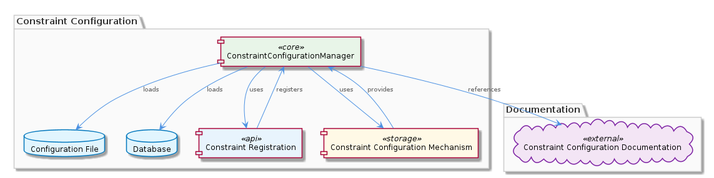
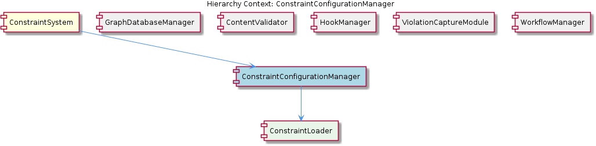

# ConstraintConfigurationManager

**Type:** SubComponent

ConstraintConfigurationManager works with the integrations/mcp-constraint-monitor/docs/constraint-configuration.md file to provide constraint configuration documentation.

## What It Is  

The **ConstraintConfigurationManager** lives inside the **ConstraintSystem** sub‑tree and is the authoritative source for all constraint‑related configuration data. It is instantiated from the **ConstraintSystem** component (see the parent‑component description) and works together with its child **ConstraintLoader** to bring configuration into the runtime. The manager reads raw constraint definitions from either a configuration file or a database and stores them using an internal **constraint configuration mechanism**. Documentation for the format and semantics of those definitions is maintained in the file  

```
integrations/mcp-constraint-monitor/docs/constraint-configuration.md
```  

Developers and runtime components retrieve ready‑to‑use constraint configurations from the manager, which also governs their lifecycle—from registration through enforcement to eventual retirement.

---

## Architecture and Design  

The design of the **ConstraintConfigurationManager** follows a classic *configuration‑loader* pattern. Its responsibilities are cleanly separated into three logical layers:

1. **Loading Layer** – delegated to the **ConstraintLoader** child, which abstracts the details of pulling raw definitions from a file system or a persistent store.  
2. **Registration Layer** – a *constraint registration mechanism* that allows individual constraints to announce themselves for later enforcement. This creates a decoupled contract: constraints need only know how to register, not how the manager stores them.  
3. **Lifecycle Layer** – the manager owns the full lifecycle of each configuration, handling creation, updates, and removal in a deterministic way.

The manager’s interaction with other parts of the system is illustrated in the architecture diagram below, which shows its position inside **ConstraintSystem** and its relationship to sibling components such as **ViolationCaptureModule** (which consumes enforced constraints) and **HookManager** (which also uses a similar configuration‑file‑or‑DB loading approach).  



From an architectural standpoint, the manager does **not** embed any persistence logic directly; instead it relies on external sources (file or DB) and on the documentation file for schema guidance. This keeps the component lightweight and focused on *in‑memory* management, while the persistence concerns are handled elsewhere in the system (e.g., the **GraphDatabaseAdapter** used by the parent **ConstraintSystem**).

The relationship diagram further clarifies how the manager registers constraints and serves them to enforcement points, while also exposing its configuration‑store API to consumers.  



---

## Implementation Details  

* **Configuration Sources** – The manager can be initialized with a path to a JSON/YAML file or with a database connection string. The exact loading logic resides in **ConstraintLoader**, which abstracts the source type and returns a normalized configuration object.  

* **Constraint Registration Mechanism** – When a constraint implementation starts, it calls a registration API exposed by the manager (e.g., `registerConstraint(name, schema, handler)`). The manager stores the registration in an internal map keyed by constraint name. This map is the primary lookup table used when other components request a configuration.  

* **Lifecycle Management** – The manager tracks timestamps and version numbers for each configuration entry. When a new version is loaded, it atomically swaps the old entry, notifies any listeners (such as **ViolationCaptureModule**), and marks the previous version as deprecated. This approach avoids race conditions during hot‑reloading.  

* **Documentation Coupling** – The file `integrations/mcp-constraint-monitor/docs/constraint-configuration.md` is treated as the single source of truth for the configuration schema. The manager validates every loaded configuration against the rules described in that markdown file, ensuring that malformed definitions are rejected early.  

* **Public API** – The manager exposes a read‑only accessor (`getConstraintConfig(name)`) that other components use to fetch the current configuration for enforcement. Because the manager owns the lifecycle, callers receive a stable reference that is automatically refreshed on reload.  

* **Child Component – ConstraintLoader** – Although no concrete code symbols were discovered, the hierarchy explicitly lists **ConstraintLoader** as a child. Its role is limited to I/O: reading from files, issuing DB queries, and returning raw configuration blobs to the manager. All higher‑level concerns (validation, registration, lifecycle) remain inside the manager.

---

## Integration Points  

* **Parent – ConstraintSystem** – The manager is a core sub‑component of **ConstraintSystem**, which itself relies on a **GraphDatabaseAdapter** for persistence of graph structures. While the manager does not directly interact with the graph database, it benefits from the same configuration‑driven philosophy used throughout the system.  

* **Sibling – ViolationCaptureModule** – After constraints are enforced, any violations are captured by this sibling. It queries the manager for the active configuration to interpret violation payloads correctly.  

* **Sibling – HookManager & WorkflowManager** – Both of these components also load definitions from files or databases. Their loading pipelines resemble the manager’s, suggesting a shared design language across the subsystem.  

* **External Documentation** – The markdown file in `integrations/mcp-constraint-monitor/docs/` is an external contract. Any change to constraint schema must be reflected there, otherwise the manager’s validation step will reject the new definitions.  

* **ConstraintLoader** – As the sole child, this loader is the entry point for all raw configuration data. It may be swapped out for a different implementation (e.g., a remote configuration service) without affecting the manager’s public API, thanks to the clear separation of concerns.

---

## Usage Guidelines  

1. **Always Register First** – When adding a new constraint, invoke the manager’s registration API before any enforcement logic runs. This guarantees that the constraint is discoverable by downstream modules.  

2. **Keep Documentation Synchronized** – Any modification to the constraint schema must be mirrored in `integrations/mcp-constraint-monitor/docs/constraint-configuration.md`. The manager validates against this file at load time, and mismatches will cause startup failures.  

3. **Prefer File‑Based Loading in Development** – For rapid iteration, point the manager to a local configuration file. In production, switch to the database source by configuring the appropriate connection string; the **ConstraintLoader** will handle the switch transparently.  

4. **Treat Configurations as Immutable After Load** – Although the manager supports hot‑reloading, individual constraint handlers should treat the configuration object they receive as read‑only. Mutating it can break the atomic swap semantics and lead to inconsistent enforcement.  

5. **Leverage Versioning** – When updating constraints, increment the version field in the configuration. The manager uses this to decide whether a reload is necessary and to notify listeners.  

6. **Monitor Registration Logs** – The manager emits logs when constraints are registered, updated, or retired. Watching these logs helps ensure that the lifecycle is proceeding as expected, especially during deployments that introduce new constraints.  

---

### Architectural Patterns Identified  

* **Loader‑Registry Pattern** – Separation of raw loading (ConstraintLoader) from registration and lifecycle management.  
* **Configuration‑Driven Design** – All behavior is driven by external definitions validated against a documented schema.  

### Design Decisions and Trade‑offs  

* **Decoupled Persistence** – By not embedding DB logic, the manager stays lightweight, but it relies on the correctness of the external loader and the underlying storage layer.  
* **Schema Validation via Markdown** – Using a markdown file for schema definition simplifies documentation but introduces a runtime parsing step; any typo in the markdown can cause silent rejections.  

### System Structure Insights  

The manager sits at the heart of the **ConstraintSystem**, providing a shared source of truth for constraint definitions. Its child **ConstraintLoader** isolates I/O concerns, while sibling components adopt a similar loading strategy, indicating a consistent architectural language across the subsystem.  

### Scalability Considerations  

* **Horizontal Scaling** – Because the manager holds configurations in memory, each instance of the service must load the same definitions. A shared configuration store (e.g., a centralized DB) ensures consistency across replicas.  
* **Hot‑Reload Support** – Atomic swapping of configurations enables live updates without downtime, supporting high‑availability deployments.  

### Maintainability Assessment  

The clear separation between loading, registration, and lifecycle logic makes the component easy to test and evolve. Documentation coupling enforces a single source of truth, reducing drift between code and spec. However, reliance on a markdown‑based schema validator adds a maintenance surface: changes to the markdown must be carefully reviewed to avoid breaking the validation pipeline. Overall, the design promotes maintainability through modular responsibilities and explicit contracts.


## Hierarchy Context

### Parent
- [ConstraintSystem](./ConstraintSystem.md) -- [LLM] The ConstraintSystem component utilizes a GraphDatabaseAdapter for persistence, which is implemented in the storage/graph-database-adapter.ts file. This adapter enables the system to store and retrieve graph structures using Graphology and LevelDB, with automatic JSON export sync. The use of Graphology allows for efficient graph operations, while LevelDB provides a robust and scalable storage solution. The GraphDatabaseAdapter class in storage/graph-database-adapter.ts is responsible for managing the graph database, including creating and deleting graphs, as well as handling graph queries. The automatic JSON export sync feature ensures that the graph data is consistently updated and available for other components to access.

### Children
- [ConstraintLoader](./ConstraintLoader.md) -- The ConstraintConfigurationManager is part of the ConstraintSystem, indicating that constraint loading is a fundamental aspect of the system's operation, as hinted in the project hierarchy context.

### Siblings
- [GraphDatabaseManager](./GraphDatabaseManager.md) -- GraphDatabaseManager uses the GraphDatabaseAdapter class in storage/graph-database-adapter.ts to manage graph database operations.
- [ContentValidator](./ContentValidator.md) -- ContentValidator checks entity content against predefined validation rules to ensure accuracy and consistency.
- [HookManager](./HookManager.md) -- HookManager loads hook events from a configuration file or database.
- [ViolationCaptureModule](./ViolationCaptureModule.md) -- ViolationCaptureModule captures constraint violations from tool interactions and stores them in a database.
- [WorkflowManager](./WorkflowManager.md) -- WorkflowManager loads workflow definitions from a configuration file or database.


---

*Generated from 7 observations*
