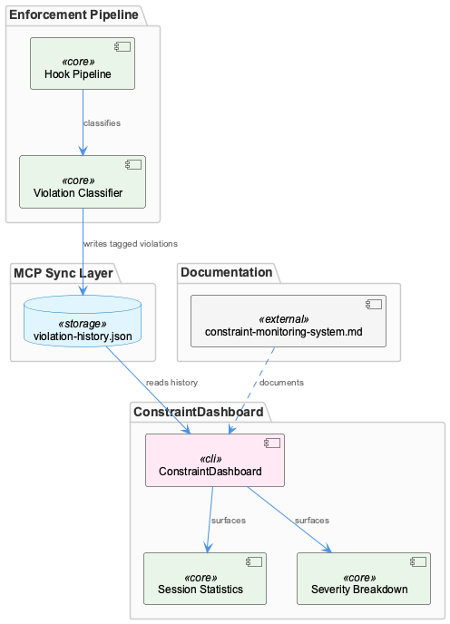
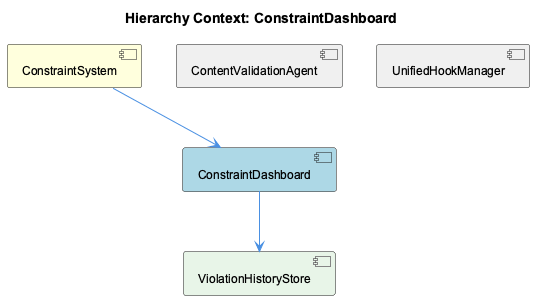

# ConstraintDashboard

**Type:** SubComponent

The .mcp-sync/ directory path indicates the dashboard integrates with the broader MCP (Model Context Protocol) sync layer used across the Coding toolkit for cross-component state sharing

## What It Is

ConstraintDashboard is a SubComponent of the ConstraintSystem that serves as the primary consumer-facing interface for the enforcement pipeline's output. It reads violation data from `.mcp-sync/violation-history.json` — a shared persistence file maintained within the broader MCP (Model Context Protocol) sync layer — and surfaces that data as structured, queryable statistics for monitoring and analysis. The dashboard does not participate in violation detection or enforcement itself; it is a read-oriented reporting layer that transforms raw persisted violation records into meaningful operational views. Its architecture and monitoring responsibilities are documented in `docs/constraints/constraint-monitoring-system.md`.

## Architecture and Design

ConstraintDashboard sits at the output end of a pipeline that originates in UnifiedHookManager. The hook manager intercepts agent tool lifecycle events, routes them through registered handlers, and when violations are detected, writes structured records into `.mcp-sync/violation-history.json`. ConstraintDashboard's role is to consume that file. This is a clean separation of concerns: the enforcement pipeline (UnifiedHookManager and its handlers) owns the write path, and ConstraintDashboard owns the read and presentation path.

The `.mcp-sync/` directory placement is a deliberate architectural decision. By locating the shared state file here rather than in a component-specific path, the system participates in a cross-component state sharing convention used across the broader Coding toolkit. This means ConstraintDashboard is not coupled to a private data store — it reads from a shared sync layer that other components can also write to or read from. The trade-off is that the schema of `violation-history.json` becomes a shared contract that multiple components depend on.

The dashboard contains ViolationHistoryStore as a child component, which encapsulates the mechanics of reading and interpreting the `.mcp-sync/violation-history.json` file. This separation suggests ConstraintDashboard is intentionally layered: ViolationHistoryStore handles data access and persistence concerns, while the dashboard itself handles aggregation, filtering, and presentation logic.

## Implementation Details

The violation records stored in `violation-history.json` carry at minimum two enriched metadata fields that make the dashboard's statistical views possible: a **session identifier** and a **severity tier**. Session tagging is applied at capture time by the hook pipeline, enabling ConstraintDashboard to compute per-session statistics — isolating which violations occurred in which Claude Code session. This is particularly valuable in a cross-session persistence model where the history file accumulates records across many independent runs.

Severity classification is similarly applied upstream at capture time, not at display time. This means the dashboard does not re-evaluate or re-classify violations; it trusts the severity values written into each record by the enforcement pipeline. The presence of multiple severity tiers implies the ConstraintSystem uses a graduated enforcement model, though the specific tier definitions are owned by the capture layer rather than the dashboard.

ViolationHistoryStore manages the interface between ConstraintDashboard and the raw JSON file. Based on its placement as a child component, it likely handles file reads, deserialization, and any indexing or filtering operations needed to serve the dashboard's per-session and per-severity query patterns.

## Integration Points

ConstraintDashboard's primary integration is with `.mcp-sync/violation-history.json`, which is written by the UnifiedHookManager pipeline and read by ViolationHistoryStore on the dashboard's behalf. This file is the sole data interface between the enforcement side and the monitoring side of the ConstraintSystem. There is no observed direct coupling between ConstraintDashboard and UnifiedHookManager at the code level — they communicate exclusively through this shared file.

The `.mcp-sync/` directory also places ConstraintDashboard in the orbit of any other Coding toolkit components that use the MCP sync layer for cross-component state. This could mean that other tools are capable of reading or contributing to violation history if they conform to the same file schema. The monitoring architecture documentation in `docs/constraints/constraint-monitoring-system.md` is the canonical reference for understanding these integration boundaries and should be consulted when extending either the write path or the dashboard's read logic.

As a sibling to ContentValidationAgent within the ConstraintSystem, ConstraintDashboard operates in a complementary role: ContentValidationAgent uses git history as a staleness signal to flag outdated observations, while ConstraintDashboard uses session-tagged violation history to surface enforcement outcomes. Both are consumers of upstream pipeline outputs rather than active enforcers.

## Usage Guidelines

Developers working with ConstraintDashboard should treat the schema of `.mcp-sync/violation-history.json` as a shared contract. Any changes to how violations are structured — particularly the session identifier field or severity classification — will directly affect the dashboard's ability to compute its statistics. Schema changes should be coordinated across the hook pipeline (write side) and ViolationHistoryStore (read side) simultaneously.

Because the dashboard relies on severity values assigned at capture time, the accuracy of severity breakdowns is entirely dependent on the classification logic in the enforcement pipeline. If severity tiers are misconfigured or inconsistently applied upstream, the dashboard will surface misleading statistics. Monitoring the dashboard's severity distribution over time is therefore also an indirect signal of enforcement pipeline health.

The cross-session nature of `violation-history.json` means the file will grow over time. Developers extending ViolationHistoryStore or the dashboard's query logic should consider how large history files affect read performance, and whether pruning or archival conventions need to be established. The `.mcp-sync/` directory convention and the monitoring architecture document in `docs/constraints/constraint-monitoring-system.md` should be the starting points for any such decisions.

## Hierarchy Context

### Parent
- [ConstraintSystem](./ConstraintSystem.md) -- The ConstraintSystem is a multi-layered enforcement framework that validates code actions and file operations during Claude Code sessions. It operates through a hook-based architecture where the UnifiedHookManager (lib/agent-api/hooks/hook-manager.js) intercepts agent tool events (pre-tool, post-tool, etc.) and routes them through registered handlers loaded from user-level (~/.coding-tools/hooks.json) and project-level (.coding/hooks.json) configuration files. Violations detected during these checks are captured, persisted, and surfaced through a dashboard for monitoring.

### Children
- [ViolationHistoryStore](./ViolationHistoryStore.md) -- Per parent context, .mcp-sync/violation-history.json serves as the cross-session persistence layer for violation data, placing it in the .mcp-sync directory which is referenced in docs/constraints/constraint-monitoring-system.md as part of the constraint monitoring infrastructure.

### Siblings
- [ContentValidationAgent](./ContentValidationAgent.md) -- ContentValidationAgent uses git history as a staleness signal, comparing recorded entity observations against recent commits to flag observations that predate significant file changes
- [UnifiedHookManager](./UnifiedHookManager.md) -- UnifiedHookManager lives at lib/agent-api/hooks/hook-manager.js and serves as the single interception point for all agent tool lifecycle events in the ConstraintSystem

---

*Generated from 5 observations*
