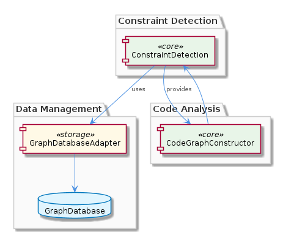
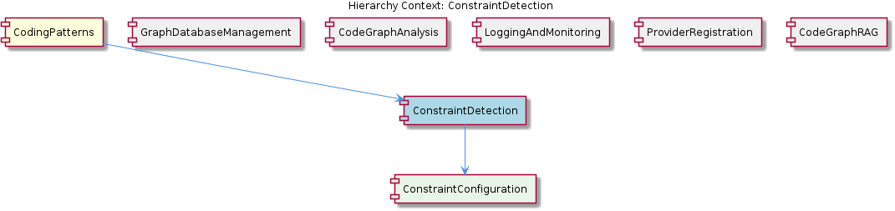

# ConstraintDetection

**Type:** SubComponent

The execute(input, context) pattern provides a flexible and extensible way for detecting and monitoring constraints, as seen in integrations/mcp-constraint-monitor/docs/constraint-configuration.md.

## What It Is  

**ConstraintDetection** is the sub‑component that lives inside the **CodingPatterns** hierarchy and is responsible for *detecting* and *monitoring* code‑level constraints. Its implementation is documented in the Markdown files under the **mcp‑constraint‑monitor** integration:

* `integrations/mcp-constraint-monitor/docs/semantic-constraint-detection.md` – describes the `execute(input, context)` entry point used for constraint detection.  
* `integrations/mcp-constraint-monitor/docs/constraint-configuration.md` – details how constraints are configured and how the same `execute` pattern is applied for flexible monitoring.

The sub‑component consumes graph data via the **GraphDatabaseAdapter** (found in `storage/graph-database-adapter.ts`) and collaborates with the **CodeGraphConstructor** (see `integrations/mcp-server-semantic-analysis/src/agent/code-graph-agent.ts`). When a constraint violation is identified, it emits alerts and notifications, giving downstream tooling a concise view of the code‑base’s constraint health.

---

## Architecture and Design  

The design of **ConstraintDetection** is anchored on two clear architectural choices that emerge directly from the observations:

1. **Command‑style `execute(input, context)` pattern** – All detection work is funneled through a single, extensible method. This pattern, highlighted in both documentation files, gives the component a uniform entry point that can be invoked by different callers (e.g., scheduled jobs, real‑time hooks, or the **CodeGraphConstructor**). It also isolates input parsing from the core detection logic, making the component easy to extend with new constraint types.

2. **Graph‑centric data handling via `GraphDatabaseAdapter`** – Constraint detection relies on traversing relationships stored in a graph database. The adapter abstracts Graphology and LevelDB persistence, presenting a clean API for reading nodes, edges, and metadata. By delegating all graph operations to this adapter, **ConstraintDetection** stays focused on the business rule evaluation rather than low‑level storage concerns.

Interaction flow (illustrated in the relationship diagram below) shows **ConstraintDetection** receiving an `input` payload, consulting the **GraphDatabaseAdapter** for the relevant code graph, applying the configured constraints (via its child **ConstraintConfiguration**), and finally emitting alerts that are consumed by logging/monitoring siblings.

### Architectural Patterns Identified  

| Pattern | Evidence |
|---------|----------|
| **Command / Execute pattern** | `execute(input, context)` described in `semantic-constraint-detection.md` and `constraint-configuration.md` |
| **Adapter pattern** | `GraphDatabaseAdapter` abstracts Graphology/LevelDB (parent component description) |
| **Observer‑like notification** | Alerts and notifications are produced when constraints are violated (Observation 4) |
| **Composite configuration** | Child component **ConstraintConfiguration** holds the declarative rules that drive detection (Observation 7) |

---

## Implementation Details  

### Core Entry Point  
The public API is a single function, likely exported as `execute(input, context)`. The `input` contains the code artifact(s) to be inspected, while `context` provides runtime services (e.g., logger, request metadata). The pattern’s flexibility is noted in Observation 6, allowing new constraint checks to be added without changing the signature.

### Graph Interaction  
Inside `execute`, the component calls into **GraphDatabaseAdapter** (implemented in `storage/graph-database-adapter.ts`). This adapter supplies methods such as `getNode(id)`, `getNeighbors(node)`, and transactional read/write helpers. By leveraging Graphology’s in‑memory graph model together with LevelDB persistence, the detection logic can perform fast traversals over code relationships (e.g., inheritance, imports, API contracts).

### Constraint Evaluation  
The concrete rules live in the **ConstraintConfiguration** child. The configuration file (`integrations/mcp-constraint-monitor/docs/constraint-configuration.md`) defines which constraints are active, their severity, and any thresholds. During execution, the detector iterates over the configuration, queries the graph for the relevant patterns, and evaluates each rule. When a rule fails, an alert object is constructed and handed off to the **LoggingAndMonitoring** sibling (which buffers and flushes logs asynchronously, per its description).

### Collaboration with CodeGraphConstructor  
The **CodeGraphConstructor** (in `integrations/mcp-server-semantic-analysis/src/agent/code-graph-agent.ts`) builds the underlying code graph that **ConstraintDetection** later queries. The constructor invokes **ConstraintDetection** after the graph is materialized, ensuring that constraints are checked against the latest representation of the codebase.

---

## Integration Points  

* **Parent – CodingPatterns**: The sub‑component inherits the overall graph‑first philosophy of its parent, which is “heavily influenced by the GraphDatabaseAdapter”. This ensures consistent data models across all pattern‑related sub‑components.  

* **Sibling – GraphDatabaseManagement**: Shares the same `GraphDatabaseAdapter` implementation, meaning any changes to storage (e.g., swapping LevelDB for another backend) automatically propagate to **ConstraintDetection**.  

* **Sibling – CodeGraphAnalysis**: Directly consumes the graph produced by **CodeGraphConstructor**. The tight coupling guarantees that constraint checks are always performed on a fresh, accurate graph.  

* **Sibling – LoggingAndMonitoring**: Receives the alerts generated by **ConstraintDetection**. Because logging is buffered asynchronously, constraint violations are recorded without blocking detection.  

* **Sibling – ProviderRegistration**: Although not explicitly referenced, any new constraint providers could be registered through the **ProviderRegistry**, allowing the `execute` method to discover additional rule implementations at runtime.  

* **Child – ConstraintConfiguration**: Holds the declarative definition of constraints. Modifying this file changes the behavior of **ConstraintDetection** without code changes, supporting a configuration‑driven approach.

All interactions are mediated through well‑defined interfaces (the `execute` function, the adapter’s API, and the configuration schema), keeping coupling low and enabling independent evolution of each sibling.

---

## Usage Guidelines  

1. **Invoke via the `execute` method** – Always pass a fully‑formed `input` object that includes the target code entity identifiers and any supplemental metadata required by the constraints. The `context` should contain a logger instance and, if needed, a cancellation token for long‑running scans.  

2. **Configure constraints declaratively** – Edit the files described in `integrations/mcp-constraint-monitor/docs/constraint-configuration.md` to add, remove, or adjust constraint rules. Because the configuration is read at runtime, no recompilation is necessary.  

3. **Ensure the graph is up‑to‑date** – Run the **CodeGraphConstructor** (or the associated pipeline in the **CodeGraphAnalysis** sibling) before calling `execute`. Stale graph data will lead to false positives or missed violations.  

4. **Monitor alerts through LoggingAndMonitoring** – Subscribe to the alert channel or configure the async log buffer to forward constraint violations to your incident‑response system.  

5. **Extend with new providers carefully** – If you need custom constraint logic, register a provider through **ProviderRegistration**’s `ProviderRegistry`. The new provider must adhere to the same interface expected by the `execute` flow (i.e., a function that receives a graph fragment and returns a boolean/alert).  

---

## Architectural Patterns Identified  

* **Command / Execute pattern** – Central `execute(input, context)` entry point.  
* **Adapter pattern** – `GraphDatabaseAdapter` abstracts the underlying graph store.  
* **Observer‑style notification** – Alerts emitted on constraint violations.  
* **Configuration‑driven composition** – Child **ConstraintConfiguration** supplies rule definitions.

## Design Decisions and Trade‑offs  

* **Single‑method API** simplifies consumption but places all branching logic inside one function, potentially growing its size.  
* **Graph‑first storage** enables rich relationship queries but adds a dependency on Graphology/LevelDB; swapping the backend would require changes only in the adapter, preserving detector logic.  
* **Configuration‑driven rules** promote flexibility; however, complex constraints may become hard to express declaratively, pushing developers toward custom providers.  

## System Structure Insights  

The sub‑component sits at the intersection of **graph data management** (via the adapter) and **semantic analysis** (via the constructor). Its placement under **CodingPatterns** reflects a broader strategy where pattern detection, constraint checking, and code‑graph RAG share a unified graph backbone. The sibling components each specialize (storage, analysis, logging, provider registration) while reusing the same graph abstraction, reinforcing a cohesive ecosystem.

## Scalability Considerations  

* **Graph storage scalability** is handled by LevelDB’s on‑disk persistence; as codebases grow, the adapter can paginate reads to keep memory usage bounded.  
* **Detection parallelism** can be achieved by invoking `execute` concurrently on disjoint graph partitions, because the adapter’s read‑only operations are thread‑safe.  
* **Alert throughput** is mitigated by the asynchronous buffering in **LoggingAndMonitoring**, preventing detection from being throttled by downstream logging pipelines.

## Maintainability Assessment  

The clear separation between **execute**, **GraphDatabaseAdapter**, and **ConstraintConfiguration** yields high maintainability:

* **Isolation of concerns** – storage, rule definition, and execution are in distinct modules.  
* **Declarative configuration** reduces code churn for rule changes.  
* **Shared adapter** means improvements to graph handling benefit all siblings simultaneously.  

Potential maintenance challenges include the risk of the `execute` function becoming a monolith if many bespoke constraints are added without proper modularization. Introducing a lightweight plugin system via **ProviderRegistration** can mitigate this risk while preserving the existing design.

## Hierarchy Context

### Parent
- [CodingPatterns](./CodingPatterns.md) -- [LLM] The CodingPatterns component's architecture is heavily influenced by the GraphDatabaseAdapter class in storage/graph-database-adapter.ts, which provides methods for creating, reading, and manipulating graph data. This class utilizes Graphology and LevelDB for persistence, ensuring efficient data storage and retrieval. The CodeGraphConstructor sub-component, as seen in integrations/mcp-server-semantic-analysis/src/agent/code-graph-agent.ts, relies on the GraphDatabaseAdapter for constructing and analyzing code graphs. This tightly coupled relationship between the GraphDatabaseAdapter and CodeGraphConstructor enables the efficient creation and analysis of code graphs.

### Children
- [ConstraintConfiguration](./ConstraintConfiguration.md) -- The integrations/mcp-constraint-monitor/docs/constraint-configuration.md file outlines the constraint configuration guide, providing insight into how constraints are set up and monitored.

### Siblings
- [GraphDatabaseManagement](./GraphDatabaseManagement.md) -- GraphDatabaseAdapter in storage/graph-database-adapter.ts utilizes Graphology and LevelDB for persistence, ensuring efficient data storage and retrieval.
- [CodeGraphAnalysis](./CodeGraphAnalysis.md) -- The CodeGraphConstructor in integrations/mcp-server-semantic-analysis/src/agent/code-graph-agent.ts relies on the GraphDatabaseAdapter for constructing and analyzing code graphs.
- [LoggingAndMonitoring](./LoggingAndMonitoring.md) -- The LoggingAndMonitoring sub-component uses async log buffering and flushing for logging and monitoring.
- [ProviderRegistration](./ProviderRegistration.md) -- The ProviderRegistration sub-component uses the ProviderRegistry class for registering new providers.
- [CodeGraphRAG](./CodeGraphRAG.md) -- The CodeGraphRAG sub-component is a graph-based RAG system for any codebases, as seen in integrations/code-graph-rag/README.md.

---

*Generated from 7 observations*
