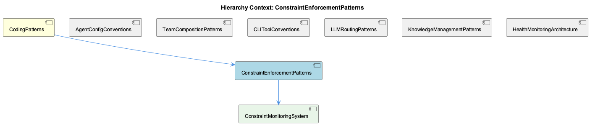

# ConstraintEnforcementPatterns

**Type:** SubComponent

The existence of a dedicated docs/constraints/ directory parallel to docs/architecture/ signals that constraint enforcement is treated as a first-class architectural concern with its own documentation domain

# ConstraintEnforcementPatterns

## What It Is

ConstraintEnforcementPatterns is implemented as a dedicated documentation and enforcement subsystem rooted at `docs/constraints/`, establishing code <USER_ID_REDACTED> standards as a first-class architectural concern within the broader CodingPatterns domain. The subsystem is anchored by two primary documents: `docs/constraints/README.md`, titled *Constraints - Code <USER_ID_REDACTED> Enforcement*, which defines the authoritative catalog of coding standards, and `docs/constraints/constraint-monitoring-system.md`, which describes the active enforcement machinery that operationalizes those standards beyond static documentation.

The critical architectural signal here is the *location* of this subsystem. By placing constraint definitions in `docs/constraints/` — parallel to `docs/architecture/` rather than inside it — the project asserts that <USER_ID_REDACTED> enforcement is not merely a byproduct of architectural decisions but a sovereign domain with its own governance, vocabulary, and lifecycle. This mirrors the broader project pattern where dedicated directories signal dedicated ownership: just as `config/agents/` owns agent configuration and `config/teams/` owns team topology, `docs/constraints/` owns the authoritative definition of what constitutes correct code.

## Architecture and Design

The design of ConstraintEnforcementPatterns follows a layered authority model. At the top sits `docs/constraints/README.md` as the canonical source of truth for <USER_ID_REDACTED> rules. CLAUDE.md, serving as the project's operational guidelines surface, is understood to *summarize* these rules rather than define them — making the constraints directory the upstream authority and CLAUDE.md a downstream consumer. This separation prevents rule duplication drift and ensures that any change to <USER_ID_REDACTED> standards flows from one authoritative location outward.

The child component ConstraintMonitoringSystem, documented in `docs/constraints/constraint-monitoring-system.md`, represents the enforcement arm of this pattern. The existence of a dedicated monitoring document signals a deliberate architectural decision to treat constraints as *runtime or CI-time concerns*, not merely editorial guidelines. This transforms the constraint system from a passive reference document into an active enforcement layer — constraints are checked, violations are detected, and results feed into observable system state.

The relationship with the broader health observability infrastructure is architecturally significant. The `docs/health-system/` documentation describes a 4-Layer Health Monitoring Architecture, and the constraint monitoring system appears to integrate with or feed into this layer. This suggests a design decision to unify code <USER_ID_REDACTED> signals with operational health signals — treating constraint violations as a dimension of system health rather than a separate <USER_ID_REDACTED> concern. This is a meaningful trade-off: it increases coupling between the <USER_ID_REDACTED> subsystem and the health infrastructure, but it gains the benefit of a single observability surface where developers can reason about both runtime behavior and code <USER_ID_REDACTED> posture together.

## Implementation Details

The implementation of ConstraintEnforcementPatterns is primarily documentation-driven at its current observed state, with no code symbols identified in the analysis. The mechanics are carried by two documents working in concert. `docs/constraints/README.md` establishes the *what* — the enumerated categories of coding standards that constitute acceptable practice in this codebase. `docs/constraints/constraint-monitoring-system.md` establishes the *how* — the machinery by which those standards are actively verified.

The ConstraintMonitoringSystem child component is the operational realization of this pattern. While specific implementation classes or functions are not surfaced in the available observations, the architectural intent is clear: the monitoring system translates the declarative constraint definitions from the README into checkable, reportable conditions. The "monitoring" framing (rather than "linting" or "validation") implies ongoing or periodic evaluation rather than point-in-time checks, consistent with the health system integration described above.

The authority chain from `docs/constraints/` to CLAUDE.md represents an important implementation detail for contributors: when CLAUDE.md references a <USER_ID_REDACTED> rule, the full specification lives in the constraints directory. This means that resolving ambiguity about any rule requires consulting `docs/constraints/README.md` as the ground truth, not the summary in CLAUDE.md.

## Integration Points

ConstraintEnforcementPatterns sits within CodingPatterns alongside siblings including AgentConfigConventions, CLIToolConventions, LLMRoutingPatterns, KnowledgeManagementPatterns, and HealthMonitoringArchitecture. Among these siblings, the most architecturally significant integration is with HealthMonitoringArchitecture. The 4-Layer Health Monitoring Architecture documented in `docs/health-system/` appears to receive signals from or coordinate with the ConstraintMonitoringSystem, meaning constraint enforcement results are observable through the same infrastructure used to monitor agent health, routing performance, and system behavior.

The relationship with AgentConfigConventions and CLIToolConventions is one of *scope boundary*. The `docs/constraints/README.md` is explicitly described as separate from agent config or CLI conventions — a deliberate design decision to prevent constraint rules from being scattered across `config/agents/` scripts or `bin/` tool definitions. This clean separation means that adding a new agent (following `docs/architecture/adding-new-agent.md`) does not require updating constraint definitions, and vice versa.

CLAUDE.md functions as a downstream integration point that surfaces constraint summaries for the AI agents operating in this project. This creates a dependency where changes to `docs/constraints/` should propagate to CLAUDE.md to maintain consistency, but the constraints directory remains the source of record.

## Usage Guidelines

Developers working within this subsystem should treat `docs/constraints/README.md` as the single authoritative source for all code <USER_ID_REDACTED> rules. When a rule appears in CLAUDE.md, trace its full specification back to the constraints directory before interpreting or modifying it. Modifications to <USER_ID_REDACTED> standards should originate in `docs/constraints/` and propagate outward — not be introduced directly into CLAUDE.md or agent configuration scripts.

When adding new constraint categories, the established pattern calls for documentation within `docs/constraints/` and corresponding coverage in the ConstraintMonitoringSystem. A constraint that is documented but not monitored is architecturally incomplete by the design intent of this subsystem — the monitoring system exists precisely to operationalize documented rules.

Because constraint monitoring integrates with the health observability layer, developers should expect constraint violations to surface as health signals rather than isolated linting output. This means the appropriate place to observe and triage constraint failures is through the health monitoring infrastructure described in `docs/health-system/`, not only through standalone constraint tooling. Contributors extending the constraint system should ensure new constraint checks are registered with the monitoring system in a way that makes their status visible to the 4-Layer Health Monitoring Architecture, preserving the unified observability model that this design intentionally establishes.

## Hierarchy Context

### Parent
- [CodingPatterns](./CodingPatterns.md) -- CodingPatterns serves as the architectural catch-all component for the Coding project, capturing general programming wisdom, design patterns, and conventions that permeate the codebase. Based on the repository structure, the project follows a consistent agent-abstraction pattern where AI agents (Claude, Copilot, Mastra, OpenCode) are configured via config/agents/ shell scripts and unified under config/agent-profiles.json, enabling agent-agnostic workflows. The system demonstrates strong separation of concerns through layered architecture: bins for CLI entrypoints, config for declarative configuration, docs for architecture documentation, and docker for deployment.

### Children
- [ConstraintMonitoringSystem](./ConstraintMonitoringSystem.md) -- docs/constraints/README.md establishes ConstraintEnforcementPatterns as a dedicated subsystem titled 'Constraints - Code <USER_ID_REDACTED> Enforcement', explicitly separated from agent config or CLI conventions

### Siblings
- [AgentConfigConventions](./AgentConfigConventions.md) -- config/agents/ directory holds per-agent shell scripts that declare environment-specific setup, with docs/architecture/adding-new-agent.md codifying the step-by-step convention for registering a new provider
- [TeamCompositionPatterns](./TeamCompositionPatterns.md) -- config/teams/ directory is the canonical location for team topology manifests, mirroring the per-agent config/agents/ pattern but at the group level
- [CLIToolConventions](./CLIToolConventions.md) -- docs/getting-started.md references bin/ tools as the primary interaction layer, indicating CLI scripts are the intended entrypoints rather than imported libraries
- [LLMRoutingPatterns](./LLMRoutingPatterns.md) -- Three distinct proxy URL environment variables—LLM_PROXY_URL, RAPID_LLM_PROXY_URL, and LLM_CLI_PROXY_URL—are documented as project-wide constants, indicating tiered routing where different latency/cost profiles are selected by context
- [KnowledgeManagementPatterns](./KnowledgeManagementPatterns.md) -- GraphKMStore is explicitly named in project documentation as the graph-based knowledge storage component, with docs/architecture/memory-systems.md describing its Graph-Based Knowledge Storage Architecture
- [HealthMonitoringArchitecture](./HealthMonitoringArchitecture.md) -- docs/health-system/4-layer-architecture-implementation-plan.md explicitly names a 4-Layer Health Monitoring Architecture, indicating health monitoring is decomposed into four distinct responsibility tiers

---

*Generated from 5 observations*
