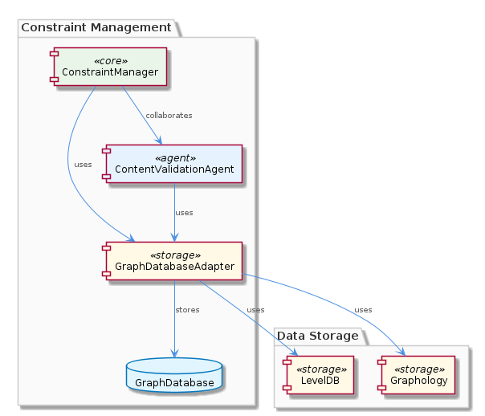
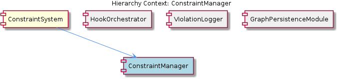

# ConstraintManager

**Type:** SubComponent

The ConstraintManager could be related to the ContentValidationAgent in integrations/mcp-server-semantic-analysis/src/agents/content-validation-agent.ts, which relies on the GraphDatabaseAdapter.

## What It Is  

The **ConstraintManager** is the core sub‑component of the **ConstraintSystem** that orchestrates the definition, storage, and evaluation of constraints applied to entity content. Although the exact source file is not listed, the observations point to a likely implementation file named `constraint-manager.ts`. Its primary responsibilities are to persist constraint definitions using the **GraphDatabaseAdapter** (`storage/graph-database-adapter.ts`) and to validate incoming data against those definitions, a role that mirrors the behavior of the **ContentValidationAgent** found in `integrations/mcp-server-semantic-analysis/src/agents/content-validation-agent.ts`. By residing under the **ConstraintSystem**, the manager inherits the system‑wide persistence strategy (Graphology + LevelDB) and collaborates closely with sibling components such as **ViolationLogger** (which records any rule breaches) and **HookOrchestrator** (which may trigger additional processing when constraints change).

---

## Architecture and Design  

The design of **ConstraintManager** follows a **graph‑oriented persistence** pattern. Constraint definitions are modeled as nodes and edges within a Graphology graph, and the underlying storage is handled by **LevelDB** through the **GraphDatabaseAdapter**. This choice enables fast look‑ups of constraint relationships (e.g., hierarchical rules or dependency graphs) without requiring a relational schema.  

Interaction between components is straightforward: the manager calls the adapter’s API to create, update, or delete constraint nodes, while read‑only queries for validation are served by traversing the in‑memory graph that LevelDB synchronously mirrors. The **ContentValidationAgent** demonstrates the consumer side of this architecture—retrieving constraint data via the same adapter to perform rule checks.  

A **separation‑of‑concerns** pattern is evident. Persistence logic lives exclusively in `storage/graph-database-adapter.ts`, while validation logic resides in the manager (and is reused by agents). Violation handling is delegated to the sibling **ViolationLogger**, keeping the manager focused on “decision” rather than “reporting”. This modular split reduces coupling and makes each piece independently testable.

---

## Implementation Details  

* **Persistence Interface** – The manager invokes methods from `GraphDatabaseAdapter` (e.g., `addNode`, `addEdge`, `getNodeById`) to persist constraint entities. Because the adapter automatically syncs JSON exports, any change to the constraint graph is instantly reflected in a portable representation that other services can consume.  

* **Data Structure** – Constraints are represented as a **graph** (or tree where appropriate) where each node encodes a rule (type, target field, validation logic) and edges express relationships such as “inherits”, “excludes”, or “requires”. This structure is ideal for representing complex rule hierarchies without flattening them into a flat list.  

* **Validation Routine** – Inspired by the **ContentValidationAgent**, the manager likely provides a method such as `validate(entity: Entity): ValidationResult`. This routine fetches the relevant constraint sub‑graph, iterates over each rule, and applies the rule’s predicate to the entity’s data. The result aggregates any failures, which are then handed off to **ViolationLogger**.  

* **Violation Handling** – While the exact API is not listed, the proximity of **ViolationLogger** in the sibling list suggests that the manager emits a structured violation object (e.g., `{constraintId, entityId, message}`) to the logger, which persists or forwards it for downstream alerting.  

* **Extensibility Hooks** – The presence of **HookOrchestrator** hints that the manager may expose hook points (e.g., `onConstraintAdded`, `onConstraintRemoved`) that the orchestrator can subscribe to, enabling other modules (such as the Copi project) to react to constraint lifecycle events without modifying the manager itself.

---

## Integration Points  

1. **GraphDatabaseAdapter (`storage/graph-database-adapter.ts`)** – The sole persistence gateway. All CRUD operations for constraints flow through this adapter, guaranteeing that the underlying Graphology + LevelDB stack remains consistent.  

2. **ContentValidationAgent (`integrations/mcp-server-semantic-analysis/src/agents/content-validation-agent.ts`)** – Consumes the same constraint graph to validate incoming entity payloads. The manager and the agent share the adapter, ensuring that validation always reflects the latest persisted rules.  

3. **ViolationLogger** – Receives violation payloads from the manager. By centralizing logging, the system can aggregate, filter, and route constraint breaches uniformly across the platform.  

4. **HookOrchestrator** – May register callbacks on constraint lifecycle events emitted by the manager, allowing other integrations (e.g., Copi) to execute custom logic when constraints are modified.  

5. **GraphPersistenceModule** – Although not directly mentioned, this sibling’s focus on persistence suggests it could provide higher‑level utilities (e.g., backup/restore) that the manager indirectly benefits from via the shared adapter.

---

## Usage Guidelines  

* **Define Constraints via the Manager API** – Always add, update, or delete constraints through the manager’s public methods rather than interacting with the adapter directly. This ensures that any side‑effects (hook notifications, violation logging configuration) are correctly triggered.  

* **Leverage Graph Structure** – When modeling complex rule sets, use edges to express relationships (inheritance, mutual exclusion). This keeps validation logic simple and avoids duplication of rule definitions.  

* **Handle Validation Results Promptly** – The manager returns a `ValidationResult` that may contain multiple violations. Feed these directly to **ViolationLogger**; do not swallow or ignore them, as downstream monitoring relies on accurate reporting.  

* **Register Hooks Early** – If custom behavior is needed on constraint changes, register callbacks with **HookOrchestrator** during application bootstrap. This avoids race conditions where a constraint is altered before the hook is attached.  

* **Avoid Direct LevelDB Access** – All persistence should be mediated by `GraphDatabaseAdapter`. Direct LevelDB manipulation bypasses the JSON export sync and can lead to inconsistent state across components.  

---

### Architectural Patterns Identified  
1. Graph‑oriented persistence (Graphology + LevelDB)  
2. Separation of concerns (Persistence vs. Validation vs. Logging)  
3. Hook/observer pattern via **HookOrchestrator**  

### Design Decisions and Trade‑offs  
* **Graph storage** provides fast relationship queries but introduces complexity in serialization; the automatic JSON export mitigates this.  
* **Dedicated ViolationLogger** isolates reporting concerns, at the cost of an extra inter‑component call.  
* **Central manager** simplifies rule administration but creates a single point of failure; redundancy can be achieved by clustering the underlying LevelDB store.  

### System Structure Insights  
* **ConstraintSystem** → **ConstraintManager** → **GraphDatabaseAdapter** (persistence)  
* Siblings **ViolationLogger**, **HookOrchestrator**, **GraphPersistenceModule** interact through well‑defined interfaces, keeping the overall architecture modular.  

### Scalability Considerations  
* LevelDB scales well for read‑heavy workloads typical of validation; write scalability depends on batch updates to the graph.  
* Because constraints are stored as a graph, adding new rule types does not increase query complexity dramatically—traversals remain O(1) for direct look‑ups.  

### Maintainability Assessment  
* Clear responsibility boundaries and reuse of the adapter across multiple components (manager, agents) reduce duplicated code.  
* The explicit hook mechanism allows extensions without modifying core logic, supporting easier evolution.  
* However, the lack of a concrete file for **ConstraintManager** suggests documentation gaps; adding a dedicated source file and unit‑test suite would further improve maintainability.

## Hierarchy Context

### Parent
- [ConstraintSystem](./ConstraintSystem.md) -- [LLM] The ConstraintSystem component utilizes the GraphDatabaseAdapter for persistence, which is implemented in the storage/graph-database-adapter.ts file. This adapter enables the system to store and manage constraints in a graph database, utilizing Graphology and LevelDB for efficient data storage and retrieval. The adapter also features automatic JSON export sync, allowing for seamless data exchange between the graph database and other components. For example, the ContentValidationAgent, located in integrations/mcp-server-semantic-analysis/src/agents/content-validation-agent.ts, relies on the GraphDatabaseAdapter to retrieve and validate entity content against configured rules.

### Siblings
- [HookOrchestrator](./HookOrchestrator.md) -- The HookOrchestrator might be related to the Copi project in integrations/copi, which has documentation on hook functions and usage.
- [ViolationLogger](./ViolationLogger.md) -- The ViolationLogger might be related to the ConstraintManager, as it handles constraint violations.
- [GraphPersistenceModule](./GraphPersistenceModule.md) -- The GraphPersistenceModule might be related to the GraphDatabaseAdapter, as it utilizes Graphology and LevelDB for persistence.

---

*Generated from 7 observations*
