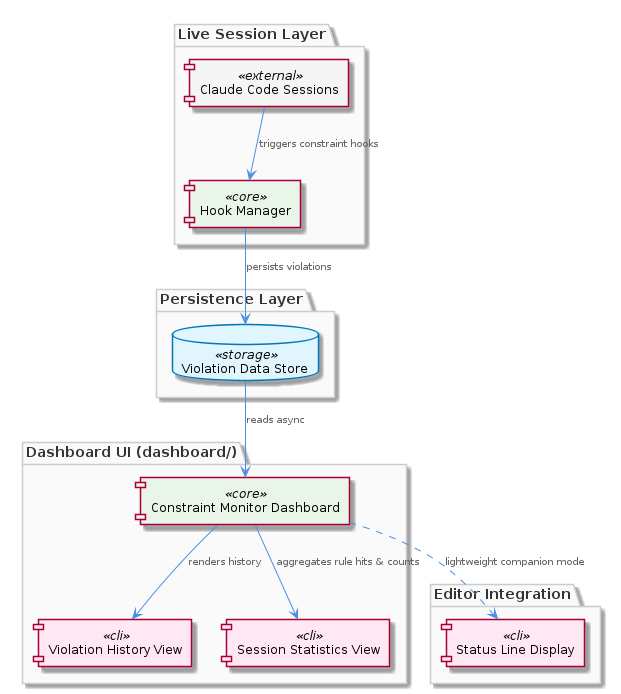
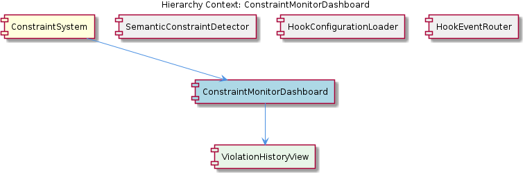

# ConstraintMonitorDashboard

**Type:** SubComponent

Co-located with status-line-integration.md (integrations/mcp-constraint-monitor/docs/status-line-integration.md), suggesting the dashboard has a companion lightweight status-line display mode for editor integration

# ConstraintMonitorDashboard — Technical Insight Document

## What It Is

The `ConstraintMonitorDashboard` is a self-contained UI sub-project located at `integrations/mcp-constraint-monitor/dashboard/` within the broader `mcp-constraint-monitor` integration. It ships with its own `README.md`, signaling that it is treated as a distinct deliverable with its own lifecycle, build conventions, and documentation surface separate from the parent integration's tooling.

Functionally, the dashboard is the human-facing visualization layer of the `ConstraintSystem`. It surfaces the violation data captured by the constraint monitoring and enforcement subsystem during Claude Code sessions, presenting both granular history (via its child `ViolationHistoryView`) and aggregated "session statistics" such as violation counts, rule hit rates, and temporal patterns across multiple sessions. The presence of a sibling document at `integrations/mcp-constraint-monitor/docs/status-line-integration.md` further suggests the dashboard has a companion lightweight status-line display mode designed for inline editor integration, complementing the full dashboard experience.

The dashboard's `README.md` title (`'or'`) hints at an alternative-views model — the UI likely toggles between violation history and session statistics rather than displaying both simultaneously, giving users a focused lens on either case-by-case forensics or aggregate trends.

## Architecture and Design

The dashboard is built around an **asynchronous, read-only consumer pattern**. Rather than participating directly in the constraint enforcement path, it operates off of persisted violation data written by the hook manager during live sessions. This is a deliberate architectural separation: enforcement happens inline on the hot path (intercepting Claude Code's native pre-tool, post-tool, startup, and shutdown events), while visualization is decoupled and runs against the materialized record. The dashboard therefore never blocks tool execution or constraint checks, and it can be opened, closed, or refreshed independently of session activity.

Within the parent `ConstraintSystem`, the dashboard sits at the presentation tier of a clear separation of concerns. Its siblings handle distinct responsibilities: `SemanticConstraintDetector` (documented in `semantic-constraint-detection.md` and `semantic-detection-design.md`) provides the detection intelligence beyond simple pattern matching; `HookConfigurationLoader` resolves the two-level configuration model that merges `~/.coding-tools/hooks.json` and `.coding/hooks.json`; and `HookEventRouter` parses the hook envelope per the `CLAUDE-CODE-HOOK-FORMAT.md` specification. The dashboard consumes the output of this pipeline rather than reaching into any of these components directly.

Internally, the dashboard composes its functionality from at least one child component, `ViolationHistoryView`, which is the dedicated sub-UI for surfacing the time-ordered stream of recorded violations. The dual-mode design (history vs. statistics) plus the inferred status-line companion mode suggests a view-router or mode-switch pattern at the dashboard's top level, with each mode mounting a different rendering subtree against the same underlying persisted data source.

## Implementation Details

The dashboard exists as its own sub-project at `integrations/mcp-constraint-monitor/dashboard/`, which strongly implies it has its own package boundary, dependencies, and likely its own build/serve scripts distinct from the rest of the `mcp-constraint-monitor` integration. The `README.md` co-located there is the canonical entry point for developers wanting to run or extend it.

The dashboard's data source is the persisted violation log produced by the hook manager. Because the system "captures violations in real time, persists them for dashboard display," the dashboard's implementation primarily concerns itself with reading, parsing, and rendering this store — not with writing to it or coordinating with the hooks. This makes the dashboard fundamentally a query-and-render layer.

The child `ViolationHistoryView` handles the violation-by-violation enumeration, while the dashboard shell itself is responsible for the "session statistics" aggregation. Statistics implementation must group persisted violations along several dimensions (per-rule hit rates, per-session counts, and temporal patterns spanning multiple Claude Code sessions), meaning the dashboard contains aggregation logic over the same underlying store that `ViolationHistoryView` reads from in raw form.

The companion status-line integration, documented at `integrations/mcp-constraint-monitor/docs/status-line-integration.md`, indicates a separate render target — almost certainly emitting a compact textual summary suitable for embedding in an editor or terminal status line, in contrast to the richer full dashboard experience.

## Integration Points

The dashboard's primary integration point is the **persisted violation store** written by the hook manager. This is the seam that decouples the dashboard from the rest of the `ConstraintSystem`: as long as the persistence schema is honored, the dashboard requires no direct coupling to `HookEventRouter`, `HookConfigurationLoader`, or `SemanticConstraintDetector`. The detector's outputs flow through the hook pipeline, get persisted, and the dashboard reads from there.

The dashboard also integrates with the editor/terminal environment through the status-line mode described in `status-line-integration.md`. This represents a second consumer-side surface that shares the dashboard's data access concerns but renders in a constrained display context.

Indirectly, the dashboard depends on the configuration merge semantics established by `HookConfigurationLoader` — because the rules that produce violations come from the combined user-level (`~/.coding-tools/hooks.json`) and project-level (`.coding/hooks.json`) configurations, the dashboard's displayed rule identities and hit-rate statistics implicitly reflect that merged ruleset. Similarly, the format of incoming hook events parsed per `CLAUDE-CODE-HOOK-FORMAT.md` upstream shapes what data ultimately reaches the persisted store the dashboard consumes.

## Usage Guidelines

Developers working on the dashboard should treat it as a **read-only consumer** of the constraint system's persisted state. Do not introduce code paths that write back to the violation store or that participate in synchronous hook handling — that responsibility belongs to the hook manager and its associated routers. Maintaining this boundary preserves the dashboard's ability to operate asynchronously without affecting Claude Code's tool execution latency.

When extending the dashboard, respect the alternative-views model implied by the `README.md`. New visualizations should slot into the existing mode-switch structure (history view via `ViolationHistoryView`, statistics view at the dashboard shell) rather than collapsing both into a single monolithic screen. If a third mode is required — for example, a rule-explorer or session-replay view — it should be added as a peer mode, not blended into an existing one.

For status-line integration work, consult `integrations/mcp-constraint-monitor/docs/status-line-integration.md` and treat the status-line renderer as a sibling presentation surface that shares the dashboard's data access logic but has its own rendering constraints (compact, single-line, possibly polling-based). Avoid duplicating data access; factor shared store-reading logic so both the full dashboard and the status-line mode benefit from a single source of truth.

Finally, because the dashboard aggregates across multiple Claude Code sessions, any schema changes to the persisted violation format must be backward-compatible or accompanied by a migration — otherwise historical aggregation (rule hit rates and temporal patterns) will fracture across the schema boundary.

---

## Architectural Analysis Summary

**1. Architectural Patterns Identified**
- **Read-side / Write-side separation** between the hook manager (writer) and the dashboard (reader), mediated by a persisted violation store.
- **Self-contained sub-project** packaging (`integrations/mcp-constraint-monitor/dashboard/` with its own `README.md`).
- **Mode-switch / alternative-views** UI pattern (history vs. statistics).
- **Composite UI** via the parent dashboard containing the `ViolationHistoryView` child.
- **Multi-surface presentation** with both a full dashboard and a status-line companion mode.

**2. Design Decisions and Trade-offs**
- *Decoupling visualization from enforcement* trades real-time fidelity for zero impact on the hot path; violations may appear in the dashboard slightly after they occur, but enforcement is never slowed.
- *Persisting violations rather than streaming them* enables cross-session aggregation but introduces a schema-stability obligation.
- *Splitting the UI into a full dashboard and a status-line mode* improves contextual fit but requires maintaining two render targets over shared data.
- *Treating the dashboard as a sub-project* improves modularity and independent iteration but adds a second build/dependency surface inside `mcp-constraint-monitor`.

**3. System Structure Insights**
- The dashboard occupies the presentation tier of the `ConstraintSystem`, cleanly separated from its siblings (`SemanticConstraintDetector`, `HookConfigurationLoader`, `HookEventRouter`) which handle detection, configuration, and event routing respectively.
- The single documented child (`ViolationHistoryView`) suggests a still-shallow component tree with room to grow as additional view modes are added.
- The dashboard depends on upstream contracts — the hook event format (`CLAUDE-CODE-HOOK-FORMAT.md`) and the merged configuration model — only transitively, through the persisted store.

**4. Scalability Considerations**
- The dashboard's performance scales with the size of the persisted violation log; aggregation over many sessions will require efficient grouping (per-rule, per-session, temporal) and may eventually need indexed access or pre-computed rollups if violation volume grows.
- Because the dashboard is asynchronous and read-only, it scales independently of session activity — multiple dashboard instances could in principle read the same store without contention with the hook manager's writes.
- The status-line mode imposes its own scaling profile: it must remain cheap enough to update frequently within an editor without re-aggregating the full history.

**5. Maintainability Assessment**
- **Positive:** Clear separation of concerns from siblings, self-contained sub-project layout, dedicated `README.md`, and documented companion integration (`status-line-integration.md`) all support maintainability.
- **Positive:** Read-only consumer role means changes to the dashboard cannot regress enforcement correctness.
- **Risk:** The persisted violation schema is an implicit contract between the hook manager and the dashboard; without explicit versioning, schema drift could silently break historical aggregation.
- **Risk:** Dual presentation surfaces (full dashboard + status-line) require disciplined factoring of shared data-access logic to avoid divergence.
- **Opportunity:** Adding new child views as peers to `ViolationHistoryView` is straightforward given the mode-switch architecture, making the dashboard a natural extension point for future constraint-system observability features.

## Hierarchy Context

### Parent
- [ConstraintSystem](./ConstraintSystem.md) -- The ConstraintSystem is a constraint monitoring and enforcement subsystem that validates code actions and file operations against configured rules during Claude Code sessions. It operates through a hook-based architecture where Claude Code's native hook events (pre-tool, post-tool, startup, shutdown, etc.) are intercepted and routed through a unified hook manager that loads configuration from both user-level (~/.coding-tools/hooks.json) and project-level (.coding/hooks.json) sources. The system captures violations in real time, persists them for dashboard display, and supports semantic constraint detection beyond simple pattern matching.

### Children
- [ViolationHistoryView](./ViolationHistoryView.md) -- The dashboard sub-project lives in integrations/mcp-constraint-monitor/dashboard/ with its own README.md, indicating it is a self-contained UI component focused on surfacing monitor data to users.

### Siblings
- [SemanticConstraintDetector](./SemanticConstraintDetector.md) -- Documented in integrations/mcp-constraint-monitor/docs/semantic-constraint-detection.md and semantic-detection-design.md, indicating the detection logic is substantial enough to warrant both a user-facing doc and an internal design doc
- [HookConfigurationLoader](./HookConfigurationLoader.md) -- The two-level configuration model (user-level and project-level hooks.json) is documented in integrations/mcp-constraint-monitor/README.md, establishing a clear precedence/merge strategy between global and per-project rules
- [HookEventRouter](./HookEventRouter.md) -- Claude Code hook data format is documented in integrations/mcp-constraint-monitor/docs/CLAUDE-CODE-HOOK-FORMAT.md, defining the event envelope the router must parse for each hook type

---

*Generated from 5 observations*
