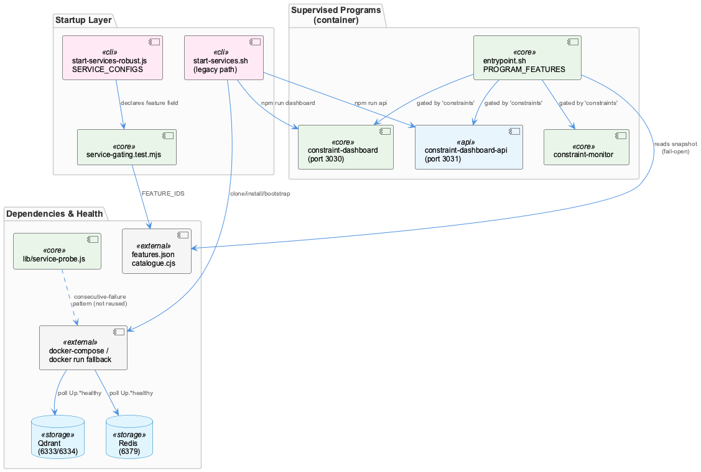
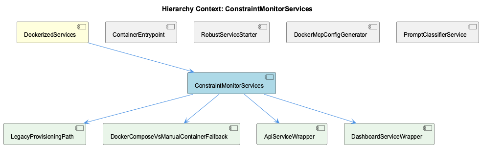

# ConstraintMonitorServices

**Type:** SubComponent

## What It Is

ConstraintMonitorServices refers to the constraint-monitor subsystem as provisioned and supervised across two distinct layers of the coding-services stack: the shell-based bootstrap logic in `start-services.sh` (legacy path), and the supervisord-managed process trio defined in `docker/entrypoint.sh`'s `PROGRAM_FEATURES` mapping (`constraint-monitor`, `constraint-dashboard`, `constraint-dashboard-api`). It is a SubComponent of DockerizedServices, sitting alongside ContainerEntrypoint, RobustServiceStarter, DockerMcpConfigGenerator, and PromptClassifierService. Its own children — LegacyProvisioningPath, DockerComposeVsManualContainerFallback, ApiServiceWrapper, and DashboardServiceWrapper — decompose the provisioning, container-fallback, and process-startup concerns, though the latter two children are notably unimplemented as named abstractions in the supplied files: they exist only as inline shell invocations (`npm run api`, `PORT=3030 npm run dashboard`), not as discrete wrapper objects.

## Architecture and Design

The dominant architectural fact is that constraint-monitor is not one service but three independently-supervised processes sharing a single feature flag, `constraints`, read from `/coding/.coding/runtime/features.json` in `docker/entrypoint.sh`. This is a deliberate coarse-grained gating decision: it guarantees all-or-nothing consistency (dashboard, API, and monitor can't drift out of sync) at the cost of independent toggling — you cannot disable just the dashboard without killing the monitor process too. The gating logic also fails open: an unreadable snapshot or an unrecognized feature both resolve to "enabled," a conservative default that prevents accidental service loss on stale host state but means feature flags are more a soft-disable than a hard gate.

A second structural decision is the dual-path startup selected by `ROBOUST_MODE` in `start-services.sh`: robust mode `exec`s directly into `scripts/start-services-robust.js` (the RobustServiceStarter sibling), while the legacy branch — housed in the LegacyProvisioningPath child — contains the only shell-native implementation of constraint-monitor's `git clone`, `npm install`, and Docker startup. Since `ROBUST_MODE` defaults to `true`, this legacy path is effectively dead code for most operators, yet it remains the sole place where the actual bootstrap mechanics are visible in the current file set.

Within that legacy path, DockerComposeVsManualContainerFallback implements a real branch-not-switch design: `docker-compose.yml` presence selects between a docker-compose flow (with health-polling against `Up.*healthy`) and a manual `docker run` fallback (bare container-presence checks, no health semantics). This asymmetry is a notable trade-off — the fallback path is materially weaker in reliability guarantees than the primary path.

## Implementation Details

In the docker-compose branch, `start-services.sh` checks `docker-compose ps | grep -E "(qdrant|redis)" | grep -q "Up.*healthy"` in a loop of 12 attempts × 5s (60s max), short-circuiting if already running, soft-failing `docker-compose pull` timeouts to "using existing images," then running `docker-compose up -d`. The manual fallback instead does named-container existence checks (`docker ps --filter "name=constraint-monitor-qdrant"` / `-redis`), starts missing containers via raw `docker run -d --name ... -p ...` (Qdrant on 6333/6334, Redis on 6379), sleeps a flat 3 seconds, and re-checks presence only — no health polling at all.

Once dependencies are up, the dashboard (`PORT=3030 npm run dashboard`) and API (`npm run api`, implicitly port 3031) are launched as backgrounded shell jobs with status captured only in shell-local `CONSTRAINT_MONITOR_STATUS`/`_WARNING` variables printed to console — there is no structured health object returned to any caller, a notable observability gap given the ApiServiceWrapper and DashboardServiceWrapper children have no corresponding code presence to formalize this.

On the container-entry side, `docker/entrypoint.sh`'s `PROGRAM_FEATURES` string (`constraint-monitor:constraints constraint-dashboard:constraints constraint-dashboard-api:constraints`) drives generation of a supervisord include file gating autostart per the `constraints` flag, evaluated via `node -e` reading `snap.features?.[feature]`.

## Integration Points

ConstraintMonitorServices' health-polling logic is a hand-rolled duplicate of the pattern that its parent DockerizedServices formalizes in `lib/service-probe.js`, which treats consecutive failures within a window (not single timeouts) as the not-ready signal. The docker-compose health loop in `start-services.sh` implements this same wait-and-poll idea inline rather than delegating to the shared probe module — a maintainability liability flagged explicitly in the observations.

At the host level, `tests/features/service-gating.test.mjs` enforces a contract (via `SERVICE_ORDER`/`SERVICE_CONFIGS` from `scripts/start-services-robust.js` and `FEATURE_IDS` from `lib/features/catalogue.cjs`) that any constraint-monitor service entry must declare a valid `feature` and be correctly bucketed into `results.disabled` versus `results.failed`/`degraded` — though the entry's own `startFn`/`healthCheckFn` implementation lives in a truncated portion of `start-services-robust.js` not present here. This mirrors how sibling RobustServiceStarter drives feature-gated startup for other services like `transcriptMonitor`.

Sibling ContainerEntrypoint provides a weaker upstream guarantee than desired: it blocks supervisord invocation on raw TCP reachability checks for Qdrant/Redis via `wait_for_service()`, not HTTP health-endpoint polling, meaning a TCP-open dependency could still be mid-cold-start when constraint-monitor's processes are handed off. Session records also flag a live, unresolved false-positive defect in the shared health-reporting machinery, and a broader workflow requirement that rebuilt containers must have their supervised processes explicitly reconfirmed healthy rather than trusted from Docker's "up" status alone.

## Usage Guidelines

Operators should treat the `constraints` feature flag as an all-or-nothing switch: disabling it stops the monitor, dashboard, and API together, with no supported way to isolate one. Because unrecognized/missing feature snapshots fail open, do not rely on flag absence to disable these programs on old hosts. When diagnosing constraint-monitor issues, check `ROBUST_MODE` first — the shell-native provisioning logic in LegacyProvisioningPath only executes when this is explicitly `false`, otherwise `scripts/start-services-robust.js` is authoritative. In legacy mode, prefer ensuring `docker-compose.yml` is present in the constraint-monitor checkout, since the manual `docker run` fallback in DockerComposeVsManualContainerFallback offers no real health verification, only container-presence checks after a fixed 3-second sleep. Finally, given the duplicated health-polling logic and known false-positive issues in the shared probe machinery, do not assume a "healthy" report is reliable without independent confirmation, particularly after any coding-services container rebuild.

## Code Evidence

Key code artifacts grounding this entity's analysis:

- tests/features/service-gating.test.mjs enforces (via `SERVICE_ORDER`/`SERVICE_CONFIGS` imported from scripts/start-services-robust.js) that every host-launched service — which would include whatever entry represents constraint monitor in that file's SERVICE_CONFIGS map — must declare a `feature` field drawn from `FEATURE_IDS` in lib/features/catalogue.cjs, and that a disabled feature causes the service to be recorded under `results.disabled` rather than `results.failed`/`results.degraded`. This test governs the CONTRACT constraint-monitor's service entry must satisfy on the host side, but the entry's own `startFn`/`healthCheckFn` implementation is in the truncated portion of start-services-robust.js not present in the supplied files.

## Work Record

What working sessions recorded about this entity — decisions taken, problems hit, and why things are the way they are:

- The 'Coding-Services Docker Container — Health Verification Workflow' record establishes that after any docker-compose rebuild of coding-services, all supervised processes and health endpoints must be explicitly confirmed live before downstream pipelines (e.g. wave-analysis) rely on them — a rebuilt container reporting 'up' in Docker does not guarantee constraint-monitor's three supervisord programs are actually healthy, since health verification is a separate manual/scripted gating step, not an automatic property of container startup.
- The 'Observation Pipeline / System Health Monitoring — Open Issue Tracking' and 'Health Prompt Hook — Observation Pipeline Status Reporting' records both flag a health-check false positive that has been surfaced repeatedly across sessions but was not yet committed as a fix at time of recording — this is a live, unresolved defect in the same probe/health-reporting machinery that governs whether constraint-monitor's supervised processes are reported healthy, distinct from the docker/entrypoint.sh feature-gating mechanism itself.

## Hierarchy Context

### Parent
- [DockerizedServices](./DockerizedServices.md) -- [LLM] lib/service-probe.js implements the health-check polling logic that determines readiness of dockerized services (semantic analysis MCP, constraint monitor) before dependent processes proceed. Rather than a single fixed timeout, the probe pattern issues periodic requests against known health endpoints and treats consecutive failures within a window as the signal for 'not ready' versus 'transiently slow', which matters in a Docker context where container startup order and cold-start times (loading models, connecting to databases) are highly variable across restarts.

### Children
- [LegacyProvisioningPath](./LegacyProvisioningPath.md) -- [LLM] start-services.sh's legacy branch is gated by a single top-level check — `if [ "$ROBUST_MODE" = "true" ]; then exec node scripts/start-services-robust.js; fi` — followed by `echo "⚠️  Using LEGACY startup mode (no retry logic)"`. Everything below that echo, including the constraint-monitor provisioning block, is dead code on any invocation where `ROBUST_MODE` is unset or `true`, which is the documented default (`ROBUST_MODE="${ROBUST_MODE:-true}"`). This makes LegacyProvisioningPath an opt-in fallback that most operators will never exercise, yet it remains the only place in the supplied files where constraint-monitor's git clone, npm install, and docker startup are actually implemented in shell rather than delegated to a Node service.
- [DockerComposeVsManualContainerFallback](./DockerComposeVsManualContainerFallback.md) -- [LLM] start-services.sh's legacy path (guarded by `if [ "$ROBUST_MODE" = "true" ]` at the top of the file, which `exec`s into scripts/start-services-robust.js and never reaches the code below) contains the actual docker-compose-vs-manual fallback: after `cd "$CONSTRAINT_DIR"`, it checks `if [ -f "docker-compose.yml" ]` and branches into two structurally different code paths rather than one function with an internal switch. The docker-compose branch does `docker-compose ps | grep -E "(qdrant|redis)" | grep -q "Up"` to short-circuit if already running, else `timeout 120 docker-compose pull` (soft-failing to 'using existing images'), then `timeout 60 docker-compose up -d`, then a 12×5s health-poll loop against `Up.*healthy`. The manual branch, reached only `else` (no docker-compose.yml found), does none of that: it checks two specific container names via `docker ps --filter "name=constraint-monitor-qdrant"` / `-redis`, starts each with a bare `docker run -d --name ... -p ...` if missing, sleeps a flat 3 seconds, and re-checks with the same filter pattern — no healthy-status polling at all, just container presence.
- [ApiServiceWrapper](./ApiServiceWrapper.md) -- [LLM] None of the supplied files define, import, or reference a class, module, or function named `ApiServiceWrapper` anywhere in their visible contents — not in `start-services.sh`, `scripts/start-services-robust.js`, `docker/entrypoint.sh`, `scripts/prompt-classifier-service.mjs`, or `tests/features/service-gating.test.mjs`. The closest thematic match is the constraint-monitor 'API server' invoked via `npm run api` inside `start-services.sh`'s legacy path, and the `observationsApi` service key referenced in `tests/features/service-gating.test.mjs`'s gating tests (backed by `SERVICE_CONFIGS.observationsApi` in `scripts/start-services-robust.js`, only partially shown before truncation) — but neither is named or shaped as an 'ApiServiceWrapper'.
- [DashboardServiceWrapper](./DashboardServiceWrapper.md) -- [LLM] None of the supplied files define, import, or reference a symbol, class, or file named `DashboardServiceWrapper`. `start-services.sh` starts the constraint-monitor dashboard and API as raw backgrounded shell jobs (`PORT=3030 npm run dashboard > /dev/null 2>&1 &` and `npm run api > /dev/null 2>&1 &`, both under the manual-container fallback branch), which is conceptually the closest thing to a 'dashboard service wrapper' in this file set, but it is inline bash, not a named wrapper component/object of any kind.

### Siblings
- [ContainerEntrypoint](./ContainerEntrypoint.md) -- [LLM] docker/entrypoint.sh implements the ContainerEntrypoint directly: it blocks on wait_for_service() TCP checks for Qdrant and Redis before ever invoking supervisord via `exec "$@"`, meaning the container's supervised process tree (feeding into service-probe/service-starter health checks described in the parent) only begins after database reachability is confirmed at the raw TCP level — a weaker guarantee than the HTTP health-endpoint polling the parent describes, since a TCP-open Qdrant/Redis could still be mid-cold-start.
- [RobustServiceStarter](./RobustServiceStarter.md) -- [LLM] scripts/start-services-robust.js implements the actual RobustServiceStarter logic: SERVICE_CONFIGS declares each service (transcriptMonitor, liveLoggingCoordinator, etc.) with required/optional classification, maxRetries, timeout, a startFn, and a healthCheckFn, and startOneService (referenced in tests/features/service-gating.test.mjs) drives feature-gated startup with blocking semantics for required services. This confirms the parent's description of retry-with-timeout and graceful degradation is concretely realized here rather than being aspirational documentation.
- [DockerMcpConfigGenerator](./DockerMcpConfigGenerator.md) -- [LLM] No file among the supplied sources — docker/entrypoint.sh, scripts/prompt-classifier-service.mjs, scripts/start-services-robust.js, start-services.sh, tests/features/service-gating.test.mjs — defines, imports, or references a class, function, or module named 'DockerMcpConfigGenerator'. The closest thematic neighbors are docker/entrypoint.sh's feature-gating block (lines building /etc/supervisor/features.d/disabled.conf from a features.json snapshot) and lib/service-starter.js (referenced by start-services-robust.js), neither of which generates MCP configuration.
- [PromptClassifierService](./PromptClassifierService.md) -- [SESSION] A live-network dial failure was traced to the classifier holding one fixed backend URL from boot: two --pi turns hit 'classifier HTTP 502' when the network changed and the laptop backend went unreachable while the on-prem cluster destination stayed up; config/prompt-classifier.yaml now declares an ordered backend list with first-enabled-network-match, mirroring llm-routing.yaml's offload target pattern.

---

*Generated from 9 observations*
