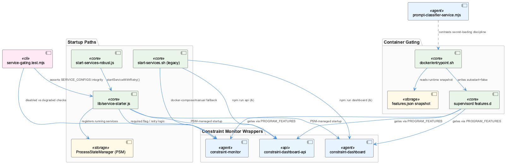
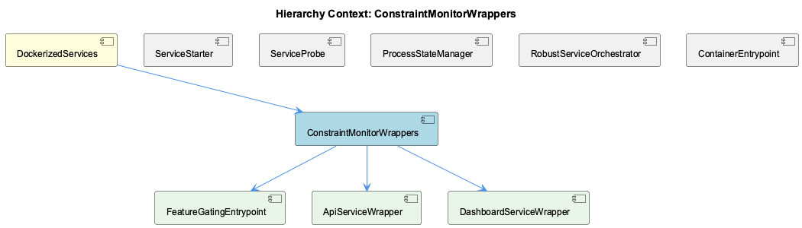

# ConstraintMonitorWrappers

**Type:** SubComponent

# ConstraintMonitorWrappers — Technical Insight Document

## What It Is

ConstraintMonitorWrappers is a SubComponent living under DockerizedServices that groups the process-management surface for the constraint-monitor stack: `FeatureGatingEntrypoint`, `ApiServiceWrapper`, and `DashboardServiceWrapper`. Its concrete implementations span `docker/entrypoint.sh` (container-side feature gating), `start-services.sh` (legacy bash startup), `scripts/start-services-robust.js` (structured Node.js startup), and `tests/features/service-gating.test.mjs` (structural guarantees). Rather than a single class or module, this SubComponent is best understood as a *contract* — the same three programs (`constraint-monitor`, `constraint-dashboard`, `constraint-dashboard-api`) must be startable, gateable, and introspectable consistently across two independent startup paths and two independent feature-gating layers.

## Architecture and Design

The defining architectural trait inherited from parent DockerizedServices is the spawn-then-register wrapper pattern: `api-service.js`/`dashboard-service.js` spawn the real process (dashboard-server.js on 3031, Next.js dev server on 3030) and register it with ProcessStateManager under names like `constraint-api-child`, so PSM — not supervisord — is the canonical registry queried by health-coordinator and CLI tooling.

Two parallel startup implementations coexist and are switched by `ROBUST_MODE`: the legacy `start-services.sh` path (sibling to RobustServiceOrchestrator's Node path) treats constraint-monitor databases as best-effort, falling through docker-compose → manual `docker run constraint-monitor-qdrant`/`constraint-monitor-redis` → degraded regex-only mode, reporting `CONSTRAINT_MONITOR_STATUS` as `FULLY OPERATIONAL`/`DEGRADED MODE`/`NOT RUNNING`. `scripts/start-services-robust.js` formalizes the same degrade-vs-block decision as a `required` boolean in `SERVICE_CONFIGS`, generically enforced by `startServiceWithRetry()` from `lib/service-starter.js` — a considerably more maintainable design than re-deriving the decision per-service in shell.

Feature gating is similarly duplicated across two independent enforcement points: `FeatureGatingEntrypoint` (container-side, in `docker/entrypoint.sh`) and the host-side `ServiceStarter`/`ServiceProbe` pair reading `SERVICE_CONFIGS.feature`. Both are deliberately fail-open — an unknown feature or missing snapshot resolves to "enabled" — but they enforce this symmetry through structurally different mechanisms with no shared schema, only convention and tests.

## Implementation Details

`FeatureGatingEntrypoint` builds a `PROGRAM_FEATURES` mapping of `program:feature` pairs — `constraint-monitor:constraints`, `constraint-dashboard:constraints`, `constraint-dashboard-api:constraints` — and, for each, shells out to `node -e` (jq is unavailable in the image) to read `snap.features?.[feature]` from `/coding/.coding/runtime/features.json`. When explicitly `false`, it writes `[program:<name>]\nautostart=false` into `/etc/supervisor/features.d/disabled.conf`. Critically, it only ever writes this override fragment — `supervisord.conf` remains the single source of truth for `command=`/default `autostart=`, so the gating layer's blast radius is limited to a fixed, enumerable set of programs. Because `constraint-dashboard` and `constraint-dashboard-api` are both keyed to one `constraints` feature, `DashboardServiceWrapper` cannot assume independent on/off control — toggling `constraints` takes down both together.

On the host side, `tests/features/service-gating.test.mjs` encodes invariants directly protecting these wrappers: every service must declare a feature, every declared feature must be real (checked against `FEATURE_IDS` in `lib/features/catalogue.cjs`), and `SERVICE_ORDER`/`SERVICE_CONFIGS` must cover each other exactly. The suite also distinguishes "disabled" from "degraded" result buckets, mirroring the shell-side `CONSTRAINT_MONITOR_STATUS` tri-state — deliberately, since conflating an operator-disabled feature with a failed one, per the test's own comment, is "how a pared-down install ends up looking broken."

The legacy manual fallback in `start-services.sh` backgrounds `npm run dashboard`/`npm run api` with `&`, tracks `dashboard_pid`/`api_pid`, and polls liveness via `lsof -ti:3030`/`3031` — bypassing PSM registration entirely, unlike the `api-service.js`/`dashboard-service.js` wrapper pattern. `waitForPortBindable()` in `start-services-robust.js` is a candidate primitive for hardening this: it probes port bindability directly via a throwaway `net.createServer()` rather than trusting HTTP health checks, addressing the post-crash `EADDRINUSE` race that `killProcessOnPortAndWait()`'s SIGTERM→poll→SIGKILL escalation alone doesn't solve.

## Integration Points

ConstraintMonitorWrappers sits between ContainerEntrypoint/FeatureGatingEntrypoint (upstream gating) and ProcessStateManager (downstream registry), with ServiceStarter, ServiceProbe, and RobustServiceOrchestrator as siblings supplying the retry, health-check, and orchestration primitives (`startServiceWithRetry`, `createHttpHealthCheck`, `isPortListening`, `sleep`) that a hardened constraint-monitor wrapper should consume rather than reimplement. The container's `.env` loader also constrains what any wrapper running inside `coding-services` can rely on: keys matching `*_API_KEY|*_TOKEN|*_MANAGEMENT_KEY` are explicitly skipped to enforce T2 egress lockdown, so constraint-monitor processes must route LLM/embedding calls through the host's llm-cli-proxy (:12435) rather than expecting a bind-mounted provider key.

## Usage Guidelines

Developers extending ConstraintMonitorWrappers should register any new startup path with PSM under a well-known name (e.g., `constraint-api-child`) rather than tracking PIDs manually, as the legacy `start-services.sh` fallback does — this is a known structural inconsistency, not a pattern to replicate. When adding or renaming a feature flag, update both `PROGRAM_FEATURES` in `docker/entrypoint.sh` and `SERVICE_CONFIGS`/`FEATURE_IDS` on the host side, since only tests (`service-gating.test.mjs`, referenced `container-gating.test.mjs`) — not a shared schema — keep them in sync. Never assume `constraint-dashboard` and `constraint-dashboard-api` can be toggled independently. Prefer `waitForPortBindable()`/`killProcessOnPortAndWait()` over ad hoc `lsof` polling for restart scenarios, and check any secret-handling logic against the stricter model in `prompt-classifier-service.mjs` (`.env` via `process.loadEnvFile()`, empty-string stripping) versus the entrypoint's blanket key-denial model, since the constraint-monitor wrappers' current alignment with either is unverified.

## Hierarchy Context

### Parent
- [DockerizedServices](./DockerizedServices.md) -- [LLM] The DockerizedServices architecture enforces a strict separation between process spawning and process lifecycle management via a consistent wrapper pattern in scripts/api-service.js and scripts/dashboard-service.js. Rather than letting supervisord directly manage the underlying Node processes (dashboard-server.js on port 3031, or 'npm run dev' for the Next.js dashboard on port 3030), each wrapper script spawns the actual service as a child process and immediately registers it with the ProcessStateManager (PSM) under a well-known name like 'constraint-api-child'. This indirection allows the PSM to maintain a canonical, queryable registry of running services independent of supervisord's own state tracking, which is critical when other components (health-coordinator, CLI tooling) need to introspect or manage services without going through supervisorctl. The wrappers also forward SIGTERM/SIGINT to the child and unregister from PSM on exit, ensuring the PSM registry never drifts from actual OS process state even during ungraceful container stops.

### Children
- [FeatureGatingEntrypoint](./FeatureGatingEntrypoint.md) -- [LLM] docker/entrypoint.sh's feature-gating block is a deliberate override layer rather than a rewrite of supervisord.conf: it builds `PROGRAM_FEATURES` as a space-delimited string of `program:feature` pairs (semantic-analysis:knowledge, embedding-listener:knowledge, graphify:codegraph, constraint-monitor:constraints, constraint-dashboard:constraints, constraint-dashboard-api:constraints, health-dashboard:health, health-dashboard-frontend:health), loops over it with `${pair%%:*}`/`${pair##*:}` splitting, and writes only a `disabled.conf` fragment into `/etc/supervisor/features.d/` — it never touches the per-program `command=`/`autostart=` defaults that live in supervisord.conf itself. This means supervisord.conf remains the single source of truth for how a program is launched, and the gating layer's blast radius is limited to flipping `autostart=false` for a fixed, enumerable set of programs.
- [ApiServiceWrapper](./ApiServiceWrapper.md) -- [LLM] docker/entrypoint.sh's feature-gating block (lines implementing `PROGRAM_FEATURES` and the `node -e` snapshot read) is the container-side half of a symmetric, fail-open design whose host-side counterpart is `scripts/start-services-robust.js`'s `SERVICE_CONFIGS`/`startOneService()` pattern verified by `tests/features/service-gating.test.mjs`. Both interpret an unset or unreadable feature state as 'enabled' rather than 'disabled', but they arrive at that symmetry through different mechanisms: the container writes `autostart=false` stanzas into `/etc/supervisor/features.d/disabled.conf` as an override layer on top of `supervisord.conf`, while the host-side `startOneService()` (asserted by the gating describe block in `tests/features/service-gating.test.mjs`) skips calling `cfg.startFn` entirely and records the skip in `results.disabled`. The entrypoint's approach is structurally weaker because it has no equivalent to the test file's `'every service declares a feature'` and `'every declared feature is a real one'` assertions — nothing in the container guards `PROGRAM_FEATURES` against drifting from `supervisord.conf`'s actual `[program:...]` sections except the comment's claim that `tests/features/container-gating.test.mjs` does this externally.
- [DashboardServiceWrapper](./DashboardServiceWrapper.md) -- [LLM] docker/entrypoint.sh's feature-gating block is the container-side counterpart of what a 'DashboardServiceWrapper' would need to respect: it maps `constraint-dashboard` and `constraint-dashboard-api` (distinct PROGRAM_FEATURES entries, both keyed to the single `constraints` feature) to supervisord `autostart=false` stanzas written into `/etc/supervisor/features.d/disabled.conf`. Because the mapping is many-to-one (two programs, one feature flag), any dashboard wrapper cannot assume its own on/off state is independently controllable from the constraint-monitor API process — toggling `constraints` off takes down both together, which matters if a wrapper ever tries to keep the dashboard UI alive while the API degrades.

### Siblings
- [ServiceStarter](./ServiceStarter.md) -- [LLM] The component enforces feature-gating at two independent layers that must stay in sync: the container-side layer in docker/entrypoint.sh reads a flat host-written snapshot (/coding/.coding/runtime/features.json) and rewrites it into a supervisord include (/etc/supervisor/features.d/disabled.conf) that flips `autostart=false` for programs whose feature is off, while the host-side layer in scripts/start-services-robust.js consults `loadFeatures()` per-service via `startOneService()` before invoking each service's `startFn`. Both layers deliberately fail toward 'everything enabled' — entrypoint.sh explicitly comments that a missing/unreadable snapshot leaves the features directory empty ('starts everything — the historical behaviour'), and an unrecognized feature name in the snapshot is treated as enabled by the inline `node -e` script (`value === false ? "false" : "true"`) rather than defaulting to disabled. This is a considered fail-open design: an incomplete config produces a container that does too much rather than one that silently does nothing, which the comments call easier to diagnose.
- [ServiceProbe](./ServiceProbe.md) -- [LLM] docker/entrypoint.sh implements a fail-open feature-gating layer that sits strictly between the host's feature resolver and supervisord: it reads a flat JSON snapshot at /coding/.coding/runtime/features.json (written by the host, never by the container) and, for each entry in the PROGRAM_FEATURES mapping (e.g. 'semantic-analysis:knowledge', 'constraint-monitor:constraints', 'health-dashboard:health'), uses `node -e` (not jq, since jq isn't installed in the image) to decide whether to emit an `autostart=false` override into /etc/supervisor/features.d/disabled.conf. Critically, the script comments explain the asymmetric fail-open design: a missing or unparseable snapshot leaves the override directory empty, which starts EVERYTHING, because the authors judged that a container silently running nothing due to a late-arriving JSON file would be a much harder failure mode to diagnose than one that over-starts. An unknown feature key in the snapshot also reads as enabled by default, guarding against an old host snapshot silently disabling a newer program it doesn't know about.
- [ProcessStateManager](./ProcessStateManager.md) -- [CGR] ProcessStateManager (class) in process-state-manager.js
- [RobustServiceOrchestrator](./RobustServiceOrchestrator.md) -- [LLM] The parent-context observations describe a wrapper-based process-management architecture (api-service.js, dashboard-service.js, lib/service-starter.js) that is largely superseded in the actual files shown here by scripts/start-services-robust.js, which implements its own retry/backoff logic directly rather than delegating entirely to lib/service-starter.js's startServiceWithRetry(). start-services-robust.js does import startServiceWithRetry, createHttpHealthCheck, createPidHealthCheck, isPortListening, isTcpPortListening, isProcessRunning, and sleep from '../lib/service-starter.js', confirming the layering described in the parent context, but it also defines significant orchestration logic locally (isProcessRunningByScript, killProcessOnPortAndWait, waitForPortBindable), suggesting RobustServiceOrchestrator is a thicker composition layer on top of the primitives rather than a thin consumer.
- [ContainerEntrypoint](./ContainerEntrypoint.md) -- [LLM] docker/entrypoint.sh implements a two-phase startup contract: first a blocking `wait_for_service()` loop that TCP-probes Qdrant and Redis via `/dev/tcp/$host/$port` redirection, then an `.env` loader that explicitly excludes `*_API_KEY|*_TOKEN|*_MANAGEMENT_KEY` variables with a `continue` in the `case` statement. This exclusion is the container-side half of the T2 egress lockdown documented inline: even though the host's `.env` is bind-mounted into the container, raw provider credentials are deliberately never exported into the container's process environment, forcing all LLM/embedding calls through the host's `llm-cli-proxy` on port 12435 rather than allowing an in-container SDK client to dial a provider directly. This is a security boundary enforced by omission, not by network policy.

---

*Generated from 10 observations*
