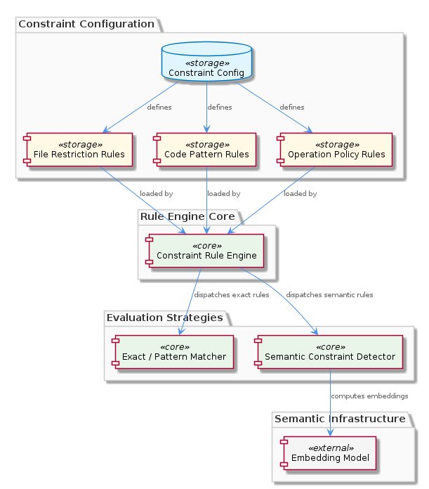
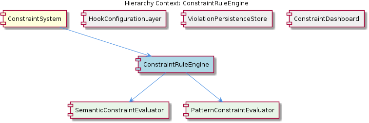

# ConstraintRuleEngine

**Type:** SubComponent

integrations/mcp-constraint-monitor/docs/constraint-configuration.md serves as the authoritative reference for how rules are expressed, indicating the engine must support multiple constraint types (file restrictions, code patterns, operation policies)

## What It Is

The `ConstraintRuleEngine` is the core evaluation subsystem within `ConstraintSystem`, responsible for determining whether a given tool invocation or file operation violates any configured constraint rules. Its design and documentation are grounded in the `integrations/mcp-constraint-monitor/` directory, with rule definitions authored in `integrations/mcp-constraint-monitor/docs/constraint-configuration.md` and evaluation strategy documentation split across `integrations/mcp-constraint-monitor/docs/semantic-constraint-detection.md` and `integrations/mcp-constraint-monitor/docs/semantic-detection-design.md`.

The engine is not a monolithic evaluator. Instead, it hosts two distinct child evaluators — `PatternConstraintEvaluator` and `SemanticConstraintEvaluator` — that represent two fundamentally different strategies for matching observed behavior against configured rules. This dual-evaluator model is the engine's defining architectural characteristic.

---

## Architecture and Design

The `ConstraintRuleEngine` sits inside `ConstraintSystem` alongside `HookConfigurationLayer`, `ViolationPersistenceStore`, and `ConstraintDashboard`. Its position in the hierarchy is significant: it receives structured input from `HookConfigurationLayer` (which parses the JSON payloads Claude Code emits at lifecycle points like pre-tool and post-tool) and its output — violation verdicts — flows downstream to `ViolationPersistenceStore` for durable capture and eventual surfacing via `ConstraintDashboard`.

The central design decision is the **dual-strategy evaluation architecture**. Rather than committing to a single matching approach, the engine delegates to two specialized evaluators that represent a deliberate spectrum:

- `PatternConstraintEvaluator` handles exact and pattern-based matching — the deterministic, rule-literal side of constraint enforcement.
- `SemanticConstraintEvaluator` handles meaning-aware matching using embedding-based techniques, enabling detection of violations that wouldn't be caught by literal rule comparison alone.

This separation reflects a clear trade-off: pattern matching offers predictability, auditability, and low computational cost, while semantic matching offers broader coverage at the cost of probabilistic rather than deterministic verdicts. By encapsulating each strategy in its own evaluator, the engine can apply them independently, compose their results, or tune their thresholds without coupling their internals.

---

## Implementation Details

The constraint types the engine must handle are defined in `integrations/mcp-constraint-monitor/docs/constraint-configuration.md`, which acts as the authoritative schema reference. The document establishes at least three categories of constraint: **file restrictions** (controlling which paths may be read or written), **code patterns** (flagging specific syntactic or structural constructs), and **operation policies** (governing which tool operations are permissible in a given context). Each category implies a different matching substrate — file path glob logic, AST or regex-based code inspection, and operation name/parameter matching, respectively.

`PatternConstraintEvaluator` consumes these rule definitions directly. Its evaluation logic is grounded in the structured constraint schema from `constraint-configuration.md`, matching the fields of an incoming hook payload (tool name, file paths, session context — as documented in `integrations/mcp-constraint-monitor/docs/CLAUDE-CODE-HOOK-FORMAT.md` and surfaced by `HookConfigurationLayer`) against configured rule conditions.

`SemanticConstraintEvaluator` operates differently. Per `integrations/mcp-constraint-monitor/docs/semantic-constraint-detection.md` and the companion design document `semantic-detection-design.md`, it uses a semantic layer that embeds either the incoming context or the rule intent (or both) into a vector space, enabling similarity-based detection. This is the "meaning-aware" matching capability — it catches violations where the literal form doesn't match a rule but the intent or effect does. The design document's existence as a separate file (`semantic-detection-design.md`) signals that this evaluator had non-trivial design complexity warranting independent documentation.

---

## Integration Points

The `ConstraintRuleEngine` is activated by `ConstraintSystem` in response to hook lifecycle events. The immediate upstream dependency is `HookConfigurationLayer`, which normalizes the raw Claude Code hook JSON (documented in `integrations/mcp-constraint-monitor/docs/CLAUDE-CODE-HOOK-FORMAT.md`) into a structured payload the engine can interrogate. The engine does not appear to own configuration parsing — that responsibility is upstream.

Downstream, the engine's violation verdicts feed into `ViolationPersistenceStore`. The separation of concerns here is clean: the engine determines *whether* a violation occurred, while the persistence store handles *recording* it durably. This means the engine itself can remain stateless across invocations, which is architecturally appropriate for a component triggered at high-frequency hook points.

The `ConstraintDashboard`, as a sibling component with its own subdirectory (`integrations/mcp-constraint-monitor/dashboard/`), consumes persisted violations rather than interacting with the engine directly. This further confirms the engine's role as a pure evaluation layer with no presentation concerns.

---

## Usage Guidelines

When authoring or modifying constraint rules, `integrations/mcp-constraint-monitor/docs/constraint-configuration.md` is the definitive reference. Rules must conform to its schema to be correctly interpreted by `PatternConstraintEvaluator`. Poorly structured rules may silently fail to match rather than raising configuration errors, so validation against the documented schema before deployment is important.

Developers extending the engine should respect the evaluator boundary. `PatternConstraintEvaluator` and `SemanticConstraintEvaluator` are architecturally separated for a reason — mixing semantic matching logic into the pattern evaluator (or vice versa) would collapse the clean strategy separation that makes each evaluator independently testable and tunable. New constraint types should be assessed against this axis: if the matching logic is deterministic and expressible as a rule predicate, it belongs in `PatternConstraintEvaluator`; if it requires intent inference or fuzzy similarity, it belongs in `SemanticConstraintEvaluator`.

Because `SemanticConstraintEvaluator` produces probabilistic matches, any pipeline consuming engine output should treat semantic verdicts as carrying a confidence dimension distinct from pattern verdicts. Downstream components like `ViolationPersistenceStore` should preserve this distinction so that `ConstraintDashboard` can surface semantic violations with appropriate qualification rather than presenting them with the same certainty as pattern-matched violations.

Finally, the hook-based activation model (inherited from `ConstraintSystem`'s integration with Claude Code's lifecycle via `~/.coding-tools/hooks.json` and `.coding/hooks.json`) means the engine is invoked synchronously at tool execution boundaries. Evaluation latency — particularly for `SemanticConstraintEvaluator` if it performs embedding lookups — directly impacts the responsiveness of Claude Code sessions. This is a key scalability consideration: semantic evaluation strategies should be designed with latency budgets in mind, potentially with caching of embeddings for frequently-seen rule and context pairs.

## Hierarchy Context

### Parent
- [ConstraintSystem](./ConstraintSystem.md) -- The ConstraintSystem is a monitoring and enforcement layer that validates code actions and file operations against configured rules during Claude Code sessions. It operates through a hook-based architecture where constraint checks are triggered at key lifecycle points (pre-tool, post-tool, etc.) and violations are captured, persisted, and surfaced to dashboards. The system integrates with Claude Code's native hook mechanism via configuration files at user-level (~/.coding-tools/hooks.json) and project-level (.coding/hooks.json), with project config overriding user config.

### Children
- [SemanticConstraintEvaluator](./SemanticConstraintEvaluator.md) -- integrations/mcp-constraint-monitor/docs/semantic-constraint-detection.md describes a semantic layer that uses meaning-aware matching rather than literal rule comparison, distinguishing it architecturally from pattern-based evaluation.
- [PatternConstraintEvaluator](./PatternConstraintEvaluator.md) -- integrations/mcp-constraint-monitor/docs/constraint-configuration.md serves as the rule source for this evaluator, defining the structure of constraints that get matched against tool invocations.

### Siblings
- [HookConfigurationLayer](./HookConfigurationLayer.md) -- integrations/mcp-constraint-monitor/docs/CLAUDE-CODE-HOOK-FORMAT.md documents the exact JSON schema Claude Code emits at each hook lifecycle point, which the configuration layer must parse to extract tool name, file paths, and session context
- [ViolationPersistenceStore](./ViolationPersistenceStore.md) -- integrations/mcp-constraint-monitor/README.md describes violations being persisted and surfaced to dashboards, implying a durable store separate from in-memory hook execution state
- [ConstraintDashboard](./ConstraintDashboard.md) -- integrations/mcp-constraint-monitor/dashboard/README.md is a dedicated sub-directory README, indicating the dashboard is architecturally separated from the core constraint engine

---

*Generated from 3 observations*
