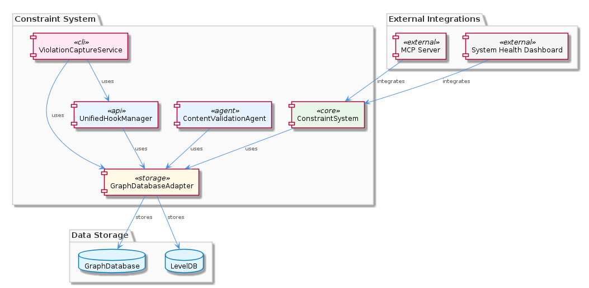
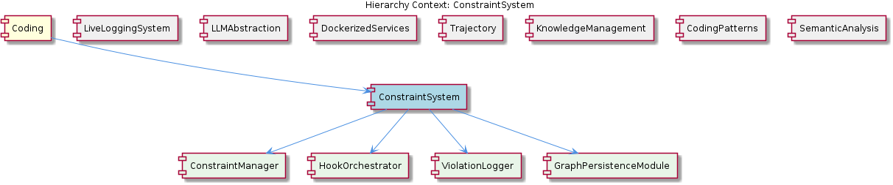

# ConstraintSystem

**Type:** Component

[LLM] The unified hook management system, implemented via the UnifiedHookManager class in lib/agent-api/hooks/hook-manager.js, plays a crucial role in centralizing hook event handling within the ConstraintSystem. This system enables the registration and execution of handlers for various events, allowing for flexible and extensible integration with multiple tools and services. The HookConfigLoader, located in lib/agent-api/hooks/hook-config.js, is responsible for loading and merging hook configurations from multiple sources, ensuring that the system can adapt to different hook configurations and event handlers. For instance, the useWorkflowDefinitions hook in integrations/system-health-dashboard/src/components/workflow/hooks.ts fetches workflow definitions from Redux, demonstrating the versatility of the hook management system.

## What It Is  

The **ConstraintSystem** component lives at the heart of the project’s rule‑enforcement layer and is implemented across several concrete files. Its persistence backbone is the **GraphDatabaseAdapter** located in `storage/graph-database-adapter.ts`, which couples Graphology with LevelDB to store constraints, violations and related metadata as a graph. Business‑logic agents such as the **ContentValidationAgent** (`integrations/mcp-server-semantic-analysis/src/agents/content-validation-agent.ts`) and the **ViolationCaptureService** (`scripts/violation-capture-service.js`) consume this adapter to read and write data. Coordination of event‑driven behavior is handled by the **UnifiedHookManager** (`lib/agent-api/hooks/hook-manager.js`) together with the **HookConfigLoader** (`lib/agent-api/hooks/hook-config.js`). Together these pieces form a self‑contained subsystem that validates entity content, captures constraint breaches, and propagates hook events to downstream tools.

The component sits under the top‑level **Coding** parent, sharing the same graph‑persistence philosophy used by sibling components such as **KnowledgeManagement** and **CodingPatterns**. Its immediate children—**ConstraintManager**, **HookOrchestrator**, **ViolationLogger**, and **GraphPersistenceModule**—encapsulate distinct responsibilities (rule storage, hook orchestration, violation recording, and low‑level graph I/O respectively). This hierarchy makes the ConstraintSystem both a consumer of shared infrastructure (the GraphDatabaseAdapter) and a provider of specialized services to the rest of the codebase.  

---

## Architecture and Design  

The ConstraintSystem follows a **modular, component‑based architecture** that emphasizes **separation of concerns**. Persistence is abstracted behind the **Adapter pattern**: `GraphDatabaseAdapter` hides the details of Graphology and LevelDB, presenting a clean API to higher‑level services. This mirrors the approach used by the **KnowledgeManagement** sibling, reinforcing a consistent data‑access strategy across the project.

Event handling is realized through an **Observer‑style hook system**. The **UnifiedHookManager** acts as a central dispatcher, while **HookConfigLoader** aggregates configuration from multiple sources, enabling dynamic registration of handlers. This design grants extensibility—new tools can plug in by simply adding a hook definition, as illustrated by the `useWorkflowDefinitions` hook in `integrations/system-health-dashboard/src/components/workflow/hooks.ts`. The hook orchestrator is further specialized by the child **HookOrchestrator**, which likely bridges the generic manager to ConstraintSystem‑specific events.

Business logic is encapsulated in lightweight agents. The **ContentValidationAgent** retrieves entity content via the GraphDatabaseAdapter and applies validation rules without being coupled to storage details. The **ViolationCaptureService** operates as a thin service layer that records violations and forwards them through the hook system, demonstrating a **Service‑oriented** design within the same process boundary.

Overall, the architecture blends **adapter**, **observer**, and **service** patterns to achieve a highly decoupled yet cohesive system. The trade‑off is an added indirection layer (hooks, adapters) that introduces runtime registration overhead, but the benefit is a system that can evolve its rule set, storage backend, or integration points without invasive code changes.

---

## Implementation Details  

1. **GraphDatabaseAdapter (`storage/graph-database-adapter.ts`)**  
   - Initializes a Graphology instance backed by LevelDB, providing CRUD operations for constraint nodes and edges.  
   - Exposes an automatic JSON export sync mechanism, ensuring that any mutation is mirrored to a JSON file for external consumption (e.g., the ContentValidationAgent).  
   - Acts as the sole persistence contract for ConstraintSystem children, allowing **ConstraintManager** and **ViolationLogger** to store their respective entities without dealing with low‑level storage APIs.

2. **UnifiedHookManager (`lib/agent-api/hooks/hook-manager.js`)**  
   - Maintains a registry of hook names → handler arrays.  
   - Offers `registerHook(name, handler)` and `triggerHook(name, payload)` methods used by agents and services.  
   - Works in concert with **HookConfigLoader** (`lib/agent-api/hooks/hook-config.js`), which merges JSON/YAML configurations from the file system, environment variables, and possibly remote sources, producing a final hook map at startup.

3. **ContentValidationAgent (`integrations/mcp-server-semantic-analysis/src/agents/content-validation-agent.ts`)**  
   - Calls `GraphDatabaseAdapter.getEntityContent(entityId)` to fetch the current payload.  
   - Iterates over a rule set (likely sourced from the graph) and applies validation functions.  
   - On failure, it invokes `UnifiedHookManager.triggerHook('constraintViolation', {entityId, ruleId, details})`, delegating response handling to any registered listeners.

4. **ViolationCaptureService (`scripts/violation-capture-service.js`)**  
   - Listens for tool‑generated events (e.g., from CI pipelines) and transforms them into constraint‑violation records.  
   - Persists each violation via `GraphDatabaseAdapter.saveViolation(violationObj)`.  
   - Notifies the hook system (`UnifiedHookManager.triggerHook('violationCaptured', violationObj)`) so that downstream components such as dashboards or alerting services can react.

5. **Child Modules**  
   - **ConstraintManager** likely provides higher‑level APIs (`createConstraint`, `updateConstraint`, `deleteConstraint`) that internally delegate to the GraphPersistenceModule.  
   - **HookOrchestrator** probably wraps the UnifiedHookManager with ConstraintSystem‑specific semantics (e.g., ordering of validation vs. logging hooks).  
   - **ViolationLogger** formats and writes violation events to audit logs, possibly re‑using the same JSON export path used by the adapter.  
   - **GraphPersistenceModule** is the low‑level wrapper around Graphology/LevelDB, exposing transaction‑like methods used by the other children.

These pieces interlock through well‑defined interfaces, allowing each child to evolve independently while preserving a stable contract with the GraphDatabaseAdapter and the hook infrastructure.

---

## Integration Points  

The ConstraintSystem is a hub for several cross‑component interactions:

* **Data Layer** – All persistence funnels through `GraphDatabaseAdapter`. This same adapter is also employed by the **KnowledgeManagement** and **CodingPatterns** siblings, enabling a unified graph view across the entire codebase.  

* **Hook Infrastructure** – `UnifiedHookManager` is a shared service used by many components. For example, the **System Health Dashboard** registers `useWorkflowDefinitions` (in `integrations/system-health-dashboard/src/components/workflow/hooks.ts`) to pull workflow definitions from Redux, illustrating how UI layers consume ConstraintSystem events.  

* **Agents & Services** – The **ContentValidationAgent** and **ViolationCaptureService** act as consumers of the persistence API and producers of hook events. Their outputs are consumed by downstream tools such as reporting dashboards, alerting pipelines, or CI integrations.  

* **Parent‑Child Relationships** – Within the **Coding** hierarchy, the ConstraintSystem’s children (ConstraintManager, HookOrchestrator, ViolationLogger, GraphPersistenceModule) expose public methods that other top‑level components may call. For instance, a new static analysis tool could invoke `ConstraintManager.validate(entityId)` to trigger a full validation cycle.  

* **External Sync** – The automatic JSON export from the GraphDatabaseAdapter provides a file‑based contract that external services can poll or ingest, facilitating lightweight integration without requiring direct database access.

These connections are visualized in the relationship diagram below:  

---

## Usage Guidelines  

1. **Prefer the High‑Level APIs** – Developers should interact with constraints through the **ConstraintManager** (e.g., `createConstraint`, `applyConstraint`) rather than calling the GraphDatabaseAdapter directly. This preserves encapsulation and ensures that any side‑effects (hook triggers, JSON sync) are correctly handled.  

2. **Register Hooks Early** – Hook handlers must be registered during application bootstrap, typically via the **HookConfigLoader**. Because the UnifiedHookManager dispatches events synchronously, missing registrations can lead to silent failures in validation or violation reporting.  

3. **Keep Validation Logic Stateless** – The **ContentValidationAgent** demonstrates a clean separation: it fetches data, applies pure functions, and reports results via hooks. When extending validation rules, follow this pattern to keep the agent testable and avoid coupling to storage concerns.  

4. **Leverage the JSON Export for Auditing** – The automatic JSON export is intended for external audit pipelines. Do not modify the exported file directly; instead, make changes through the provided APIs so the export stays consistent.  

5. **Mind Performance When Scaling** – Graphology + LevelDB scales well for read‑heavy workloads, but bulk writes (e.g., ingesting thousands of violations at once) should be batched to avoid overwhelming the event loop. The ViolationCaptureService can be extended with a simple queue or debounce mechanism if needed.  

---

### Architectural patterns identified  
- Adapter pattern (`GraphDatabaseAdapter`)  
- Observer / Publish‑Subscribe pattern (UnifiedHookManager & HookConfigLoader)  
- Service‑oriented design (ViolationCaptureService, ContentValidationAgent)  
- Modular component architecture (ConstraintManager, HookOrchestrator, etc.)

### Design decisions and trade‑offs  
- **Centralized hook manager** gives extensibility at the cost of runtime registration overhead.  
- **Graph‑based persistence** enables rich relationship queries but introduces dependency on LevelDB file I/O; suitable for moderate‑size graphs but may need sharding for very large knowledge bases.  
- **Separation of validation from storage** improves testability and maintainability but requires careful contract definition between agents and the adapter.  

### System structure insights  
- The ConstraintSystem is a distinct subtree under the **Coding** root, sharing persistence infrastructure with KnowledgeManagement.  
- Its children each own a focused responsibility, forming a clean vertical slice from UI hooks down to low‑level graph storage.  

### Scalability considerations  
- Graphology + LevelDB scales linearly for reads; write throughput can be improved by batching and using asynchronous hook dispatch.  
- Hook registration is lightweight, but a very large number of listeners could increase latency; consider prioritizing critical hooks.  

### Maintainability assessment  
- High maintainability thanks to clear boundaries (adapter, hook manager, agents).  
- The use of shared infrastructure (GraphDatabaseAdapter) reduces duplication but creates a single point of failure; thorough unit‑tests around the adapter and integration tests for hook flows are essential.  
- Adding new constraint types or validation rules involves only extending the rule set and possibly new pure validation functions, leaving the core architecture untouched.

## Hierarchy Context

### Parent
- [Coding](./Coding.md) -- Root node of the coding project knowledge hierarchy, encompassing all development infrastructure knowledge. The project consists of 8 major components: LiveLoggingSystem: [LLM] The LiveLoggingSystem component's modular architecture allows for easy extension and modification of agent-specific transcript formats. This is ; LLMAbstraction: [LLM] The LLMAbstraction component utilizes the LLMService class (lib/llm/llm-service.ts) as a single entry point for all LLM operations. This class i; DockerizedServices: [LLM] The DockerizedServices component utilizes a microservices architecture, with each sub-component responsible for a specific service or functional; Trajectory: [LLM] The Trajectory component's architecture is characterized by its use of adapters, such as the SpecstoryAdapter, to connect to different extension; KnowledgeManagement: [LLM] The KnowledgeManagement component utilizes the GraphDatabaseAdapter (integrations/mcp-server-semantic-analysis/src/storage/graph-database-adapte; CodingPatterns: [LLM] The CodingPatterns component utilizes the GraphDatabaseAdapter class in storage/graph-database-adapter.ts for persistence, allowing for automati; ConstraintSystem: [LLM] The ConstraintSystem component utilizes the GraphDatabaseAdapter for persistence, which is implemented in the storage/graph-database-adapter.ts ; SemanticAnalysis: [LLM] The SemanticAnalysis component utilizes a multi-agent system architecture, with agents such as OntologyClassificationAgent, SemanticAnalysisAgen.

### Children
- [ConstraintManager](./ConstraintManager.md) -- The ConstraintManager likely interacts with the GraphDatabaseAdapter in storage/graph-database-adapter.ts to store and manage constraints.
- [HookOrchestrator](./HookOrchestrator.md) -- The HookOrchestrator might be related to the Copi project in integrations/copi, which has documentation on hook functions and usage.
- [ViolationLogger](./ViolationLogger.md) -- The ViolationLogger might be related to the ConstraintManager, as it handles constraint violations.
- [GraphPersistenceModule](./GraphPersistenceModule.md) -- The GraphPersistenceModule might be related to the GraphDatabaseAdapter, as it utilizes Graphology and LevelDB for persistence.

### Siblings
- [LiveLoggingSystem](./LiveLoggingSystem.md) -- [LLM] The LiveLoggingSystem component's modular architecture allows for easy extension and modification of agent-specific transcript formats. This is achieved through the use of the TranscriptAdapter, which is implemented in the lib/agent-api/transcript-api.js file. The TranscriptAdapter provides a standardized interface for handling different agent formats, such as Claude Code and Copilot CLI, and converting them to the unified LSL format. For example, the ClaudeCodeTranscriptAdapter class in lib/agent-api/transcripts/claudia-transcript-adapter.js extends the TranscriptAdapter class and provides a specific implementation for handling Claude Code transcripts.
- [LLMAbstraction](./LLMAbstraction.md) -- [LLM] The LLMAbstraction component utilizes the LLMService class (lib/llm/llm-service.ts) as a single entry point for all LLM operations. This class is responsible for managing mode routing, caching, and provider fallback. For instance, the LLMService class includes a method for making LLM requests, which first checks the cache for a valid response before proceeding to make an actual request. This is evident in the use of the cache object within the LLMService class, where it attempts to retrieve a cached response before making a request to the provider. The cache is implemented using a simple in-memory object, where the keys are the request parameters and the values are the corresponding responses.
- [DockerizedServices](./DockerizedServices.md) -- [LLM] The DockerizedServices component utilizes a microservices architecture, with each sub-component responsible for a specific service or functionality. For instance, the LLM Service (lib/llm/llm-service.ts) acts as a high-level facade for all LLM operations, handling mode routing, caching, circuit breaking, and provider fallback. This modular design enables efficient and scalable operation, as well as easier maintenance and updates. The Service Starter (lib/service-starter.js) provides robust service startup with retry, timeout, and graceful degradation, using exponential backoff and health verification. This ensures that services are started reliably and with minimal downtime.
- [Trajectory](./Trajectory.md) -- [LLM] The Trajectory component's architecture is characterized by its use of adapters, such as the SpecstoryAdapter, to connect to different extensions and services. This is evident in the lib/integrations/specstory-adapter.js file, where the SpecstoryAdapter class is defined. The component's behavior is defined by its methods, including logConversation and connectViaHTTP, which enable logging and connection to the Specstory extension. For instance, the logConversation method in SpecstoryAdapter (lib/integrations/specstory-adapter.js:134) implements logging functionality, while the createLogger function from ../logging/Logger.js facilitates modular and flexible logging capabilities.
- [KnowledgeManagement](./KnowledgeManagement.md) -- [LLM] The KnowledgeManagement component utilizes the GraphDatabaseAdapter (integrations/mcp-server-semantic-analysis/src/storage/graph-database-adapter.ts) for persisting data in a graph database with automatic JSON export synchronization. This design decision enables efficient storage and retrieval of knowledge entities and relationships, which is crucial for the system's overall goals of knowledge discovery and insight generation. Furthermore, the use of Graphology+LevelDB persistence ensures a scalable and performant solution for managing the knowledge graph.
- [CodingPatterns](./CodingPatterns.md) -- [LLM] The CodingPatterns component utilizes the GraphDatabaseAdapter class in storage/graph-database-adapter.ts for persistence, allowing for automatic JSON export sync. This design decision enables seamless data synchronization and provides a robust foundation for the project's data management. The GraphDatabaseAdapter class is responsible for handling graph data storage and retrieval, making it a critical component of the project's architecture. By using this adapter, the CodingPatterns component can focus on its primary functionality, leaving data management to the GraphDatabaseAdapter.
- [SemanticAnalysis](./SemanticAnalysis.md) -- [LLM] The SemanticAnalysis component utilizes a multi-agent system architecture, with agents such as OntologyClassificationAgent, SemanticAnalysisAgent, and CodeGraphAgent, to process git history and LSL sessions. This is evident in the code files, such as integrations/mcp-server-semantic-analysis/src/agents/ontology-classification-agent.ts, integrations/mcp-server-semantic-analysis/src/agents/semantic-analysis-agent.ts, and integrations/mcp-server-semantic-analysis/src/agents/code-graph-agent.ts, which define the respective agents and their responsibilities. The use of multiple agents allows for a modular and scalable design, enabling the processing of large amounts of data and the integration of new agents as needed.

---

*Generated from 5 observations*
