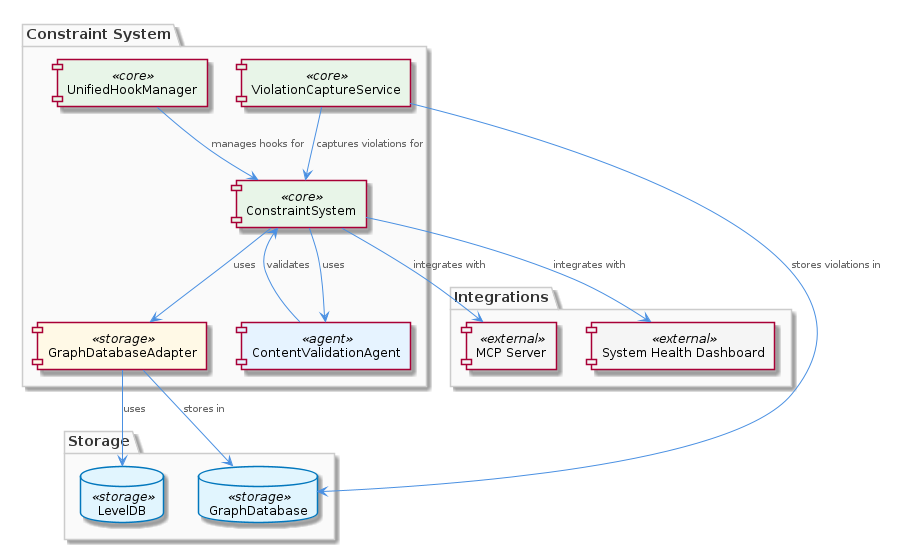
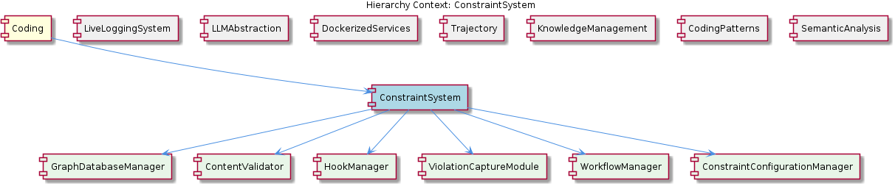

# ConstraintSystem

**Type:** Component

[LLM] The ConstraintSystem component employs a ViolationCaptureService, implemented in scripts/violation-capture-service.js, to bridge live session logging with constraint monitor dashboard persistence. This service is responsible for capturing and storing violations that occur during live sessions, allowing the system to track and analyze errors and inconsistencies. The ViolationCaptureService uses the graph database to store the violations, ensuring that the data is persisted and available for later analysis. The service also provides a way to retrieve and display the violations in the constraint monitor dashboard, allowing developers to identify and address issues. The ViolationCaptureService class in violation-capture-service.js includes methods for capturing and storing violations, such as the captureViolation method, which takes a violation object as input and stores it in the graph database.

## What It Is  

The **ConstraintSystem** component lives at the heart of the *Coding* project and is realized through a collection of tightly‑coupled modules that together enforce, monitor, and visualise constraint‑related rules. Its core implementation files are:

* `storage/graph-database-adapter.ts` – the **GraphDatabaseAdapter** that wraps **Graphology** + **LevelDB** and provides automatic JSON export sync.  
* `integrations/mcp-server-semantic-analysis/src/agents/content-validation-agent.ts` – the **ContentValidationAgent** that validates entity payloads before they are persisted.  
* `lib/agent‑api/hooks/hook‑manager.js` – the **UnifiedHookManager** (with its companion `hook-config.js`) that loads, merges and dispatches hook configurations.  
* `scripts/violation-capture-service.js` – the **ViolationCaptureService** that records live‑session violations into the graph store and feeds the constraint‑monitor dashboard.  
* `integrations/system-health-dashboard/src/components/workflow/hooks.ts` – two UI‑level hooks, **useWorkflowDefinitions** (Redux‑backed workflow lookup) and **useNodeWiggle** (node‑animation driver).

Together these files implement the functional contract expressed in the related‑entity list (GraphDatabaseManager, ContentValidator, HookManager, ViolationCaptureModule, WorkflowManager, ConstraintConfigurationManager). The component is a child of the top‑level **Coding** node and shares the same graph‑persistence philosophy as its sibling **KnowledgeManagement**, while offering a distinct constraint‑validation and monitoring focus.

---

## Architecture and Design  

### Core Architectural Style  
The ConstraintSystem follows a **modular, adapter‑centric architecture**. The `GraphDatabaseAdapter` implements the *Adapter* pattern, translating the generic graph‑operation interface used by higher‑level services into concrete calls to **Graphology** (in‑memory graph engine) and **LevelDB** (persistent key‑value store). This isolates the rest of the system from storage‑specific concerns and enables the automatic JSON export sync to act as a lightweight *event‑sourcing* bridge for downstream consumers.

### Hook‑Based Extensibility  
Event handling is centralized in the **UnifiedHookManager** (`lib/agent-api/hooks/hook-manager.js`). It loads hook definitions via the **HookConfigLoader** (`hook-config.js`), merges configurations from multiple sources, and dispatches events to registered handlers. This is an explicit **Observer / Publish‑Subscribe** mechanism that allows new constraint‑related behaviours (e.g., custom validation steps, notification sinks) to be added without touching core logic.

### Multi‑Agent Validation Layer  
The **ContentValidationAgent** (`content-validation-agent.ts`) embodies a *multi‑agent* pattern: it receives entities, runs semantic analysis and ML‑based checks, and emits a validation result. Its placement inside the `integrations/mcp-server-semantic-analysis` tree signals a deliberate separation between *semantic analysis* (shared across the project) and *constraint enforcement* (specific to ConstraintSystem).

### Service‑Oriented Violation Capture  
`ViolationCaptureService` (`scripts/violation-capture-service.js`) operates as a thin **service layer** that ingests live‑session logs, transforms them into violation objects, and persists them through the graph adapter. By routing violations through the same graph store, the system guarantees a single source of truth for both constraint definitions and observed breaches.

### UI Integration via Hooks  
The UI side (system‑health dashboard) accesses workflow definitions through the **useWorkflowDefinitions** hook, which pulls data from the Redux store. The **useNodeWiggle** hook adds a visual animation layer on top of the workflow graph, demonstrating a *separation of concerns*: data retrieval is handled by Redux, while presentation concerns live in React hooks.

### Design Decisions & Trade‑offs  

| Decision | Rationale (grounded) | Trade‑off |
|----------|----------------------|-----------|
| Use Graphology + LevelDB via an adapter | Provides efficient in‑memory graph ops (Graphology) and durable storage (LevelDB) while keeping the persistence logic encapsulated (`storage/graph-database-adapter.ts`). | LevelDB is a local embedded store; scaling beyond a single node requires additional sharding or migration to a distributed KV store. |
| Centralised hook manager with config loader | Allows hook definitions to be sourced from multiple files and merged, enabling flexible extension (`UnifiedHookManager` + `HookConfigLoader`). | Adds a runtime indirection layer; mis‑configured hooks can cause silent failures unless validated. |
| Content validation as a separate agent | Keeps semantic validation isolated from storage, promoting reuse across other components (`ContentValidationAgent`). | Introduces an extra async hop; latency-sensitive paths must account for validation time. |
| Automatic JSON export sync | Guarantees that any change to the graph is instantly reflected in a JSON snapshot for other components to consume. | Continuous export can increase I/O overhead on write‑heavy workloads. |
| UI hooks pulling from Redux | Provides a single source of truth for workflow definitions (`useWorkflowDefinitions`). | Tightly couples the dashboard UI to the Redux shape; any schema change requires coordinated updates. |

---

## Implementation Details  

### GraphDatabaseAdapter (`storage/graph-database-adapter.ts`)  
* **Responsibilities** – create/delete graphs, run queries, and keep a JSON export in sync.  
* **Key Methods** – likely `createGraph()`, `deleteGraph()`, `runQuery(query)`, and an internal watcher that writes the current graph state to a JSON file after each mutation.  
* **Technical Mechanics** – wraps a Graphology instance; on each mutation, the adapter serialises the graph (`graph.export()`) and writes it to LevelDB using LevelDB’s batch API for atomicity. The JSON export is written to a configurable path, enabling other services (e.g., the dashboard) to read a stable snapshot without opening LevelDB directly.

### ContentValidationAgent (`integrations/mcp-server-semantic-analysis/src/agents/content-validation-agent.ts`)  
* **Core API** – `validateEntityContent(entity): ValidationResult`.  
* **Process** – receives an entity, runs a pipeline of semantic checks (likely leveraging the broader SemanticAnalysis component) and ML models, then returns a result object containing `isValid`, `errors`, and possibly a `refreshReport`.  
* **Integration** – invoked by higher‑level services before persisting data through the GraphDatabaseAdapter, ensuring that only validated entities become part of the constraint graph.

### UnifiedHookManager & HookConfigLoader (`lib/agent-api/hooks/*.js`)  
* **HookConfigLoader** – `loadHookConfig(filePath): HookConfig`. Reads a JSON/YAML config, validates its schema, and returns a normalized hook map.  
* **UnifiedHookManager** – on startup, calls the loader for each configured source, merges the resulting maps (later sources override earlier ones), and registers handler functions. When an event occurs (e.g., “entityValidated”, “violationCaptured”), `dispatch(eventName, payload)` looks up all handlers for that event and invokes them sequentially or in parallel, depending on the implementation.  

### ViolationCaptureService (`scripts/violation-capture-service.js`)  
* **Public API** – `captureViolation(violation)`.  
* **Workflow** – receives a violation object (likely containing `type`, `location`, `timestamp`, `details`), enriches it with a unique identifier, and persists it via the GraphDatabaseAdapter (e.g., as a node with a “VIOLATION” label and edges to the offending entity). The service also exposes retrieval functions used by the constraint monitor dashboard to render violation tables or timelines.

### UI Hooks (`integrations/system-health-dashboard/src/components/workflow/hooks.ts`)  
* **useWorkflowDefinitions** – reads `state.workflowDefinitions` from Redux, returns a typed object `{ [workflowId]: { name, description, steps } }`.  
* **useNodeWiggle** – accepts a node reference, returns an animation descriptor `{ duration, easing, keyframes }` that the React component applies via CSS or a canvas library. This hook abstracts the animation logic away from the visual component, keeping the UI declarative.

### Child Modules (as listed in the hierarchy)  
* **GraphDatabaseManager** – a thin façade over `GraphDatabaseAdapter`, likely exposing domain‑specific methods like `addConstraintNode`, `linkEntityToConstraint`.  
* **ContentValidator** – a wrapper around `ContentValidationAgent` that may add rule‑based checks in addition to the ML‑driven validation.  
* **HookManager** – essentially the `UnifiedHookManager` exposed under a more domain‑specific name.  
* **ViolationCaptureModule** – the public façade of `ViolationCaptureService`.  
* **WorkflowManager** – consumes `useWorkflowDefinitions` data and may provide higher‑level orchestration (e.g., start/stop workflow execution).  
* **ConstraintConfigurationManager** – not directly observed, but logically would load static constraint definitions (perhaps from JSON files) and expose them to the GraphDatabaseManager.

---

## Integration Points  

1. **Graph Persistence** – All constraint‑related data (definitions, violations, validation results) flow through the **GraphDatabaseAdapter**. This adapter is also used by the sibling **KnowledgeManagement** component, ensuring a unified knowledge graph across the project.  

2. **Semantic Analysis Stack** – The **ContentValidationAgent** pulls in semantic analysis utilities from the broader `SemanticAnalysis` component, reusing language models and ontological classifiers.  

3. **Hook Infrastructure** – The **UnifiedHookManager** is a shared service across the codebase; other components (e.g., LiveLoggingSystem) can register hooks to react to constraint events, fostering a loosely‑coupled event ecosystem.  

4. **Dashboard UI** – The **useWorkflowDefinitions** and **useNodeWiggle** hooks bridge the backend graph store to the React‑based system‑health dashboard, enabling real‑time visualisation of workflows and violations.  

5. **Live Session Logging** – The **ViolationCaptureService** consumes live logs from the **LiveLoggingSystem** (via a script or direct API call) and writes violation nodes to the graph, making them instantly available to the dashboard and to any downstream analytics.  

6. **Redux State** – Workflow definitions are stored in Redux, meaning any component that can dispatch Redux actions (e.g., a configuration UI) can affect the constraint system’s view of available workflows.  

Overall, ConstraintSystem sits at the intersection of **persistence**, **validation**, **event handling**, and **visualisation**, acting as both a consumer and producer of data for its parent **Coding** component and its siblings.

---

## Usage Guidelines  

* **Persist Through the Adapter** – All graph mutations must go through `GraphDatabaseAdapter` (or its façade `GraphDatabaseManager`). Direct LevelDB access bypasses the automatic JSON export sync and can lead to stale snapshots.  

* **Validate Before Persist** – Invoke `ContentValidationAgent.validateEntityContent(entity)` (or the higher‑level `ContentValidator`) for every entity that will be stored. Treat a `validationResult.isValid === false` as a hard error; do not persist invalid data.  

* **Register Hooks Early** – When extending the system, add new hook definitions to a dedicated config file and ensure `UnifiedHookManager` loads it on startup. Use the `HookConfigLoader.loadHookConfig` API to test the config in isolation.  

* **Capture Violations Immediately** – Use `ViolationCaptureService.captureViolation(violation)` as soon as a constraint breach is detected. Include as much contextual metadata as possible (entity IDs, timestamps, stack trace) to aid downstream debugging.  

* **Consume Workflow Data via Redux Hooks** – UI components should never read the workflow JSON file directly; always use `useWorkflowDefinitions` to stay in sync with the global Redux store.  

* **Mind Performance on Write‑Heavy Loads** – Because each graph write triggers a JSON export, batch multiple mutations when possible (e.g., wrap a series of `addNode` calls in a LevelDB batch).  

* **Testing** – Unit‑test each child module in isolation (e.g., mock the GraphDatabaseAdapter in `ContentValidator` tests). Integration tests should spin up an in‑memory LevelDB instance to verify end‑to‑end persistence and export behaviour.  

* **Versioning** – When updating constraint definitions, use the **ConstraintConfigurationManager** (if present) to version the JSON files and trigger a graceful reload via the HookManager, avoiding runtime inconsistencies.

---

### Summary of Requested Deliverables  

1. **Architectural patterns identified** – Adapter (GraphDatabaseAdapter), Observer/Publish‑Subscribe (UnifiedHookManager), Multi‑Agent (ContentValidationAgent), Service Layer (ViolationCaptureService), UI Hook pattern (useWorkflowDefinitions / useNodeWiggle).  
2. **Design decisions and trade‑offs** – Centralised graph adapter for storage abstraction vs. LevelDB’s single‑node limitation; hook manager for extensibility vs. runtime indirection; automatic JSON export for visibility vs. I/O overhead; semantic‑agent validation for data quality vs. added latency.  
3. **System structure insights** – ConstraintSystem is a modular child of **Coding**, sharing the graph‑persistence strategy with **KnowledgeManagement**, and exposing six child modules (GraphDatabaseManager, ContentValidator, HookManager, ViolationCaptureModule, WorkflowManager, ConstraintConfigurationManager). The architecture diagram illustrates the layered flow from UI hooks → Redux → WorkflowManager → GraphDatabaseAdapter → LevelDB/JSON. The relationship diagram shows the bidirectional ties to LiveLoggingSystem, SemanticAnalysis, and the System‑Health Dashboard.  
4. **Scalability considerations** – Graphology + LevelDB scale well for moderate data volumes; horizontal scaling would require sharding or migration to a distributed KV store. Hook dispatch is lightweight but should be monitored for handler explosion. Validation and violation capture can be parallelised; batch writes mitigate export overhead.  
5. **Maintainability assessment** – Strong separation of concerns (adapter, agents, hooks) promotes testability and future replacement of underlying libraries. However, reliance on a single‑node LevelDB and automatic JSON sync introduces a coupling point that must be managed during upgrades. Clear module boundaries and the documented façade pattern (e.g., GraphDatabaseManager) aid maintainability, provided developers adhere to the usage guidelines above.

## Hierarchy Context

### Parent
- [Coding](./Coding.md) -- Root node of the coding project knowledge hierarchy, encompassing all development infrastructure knowledge. The project consists of 8 major components: LiveLoggingSystem: [LLM] The LiveLoggingSystem component utilizes a modular architecture, with separate components for logging, transcript processing, and configuration ; LLMAbstraction: [LLM] The LLMAbstraction component uses a provider-agnostic approach, allowing for easy switching between different LLM providers. This is achieved th; DockerizedServices: [LLM] The DockerizedServices component utilizes dependency injection to manage complex workflows and handle multiple requests efficiently. This is evi; Trajectory: [LLM] The Trajectory component utilizes the SpecstoryAdapter class, defined in lib/integrations/specstory-adapter.js, for logging conversations and ev; KnowledgeManagement: [LLM] The KnowledgeManagement component utilizes a GraphDatabaseAdapter for persistence, which is implemented in the file integrations/mcp-server-sema; CodingPatterns: [LLM] The CodingPatterns component utilizes a graph-based approach for code analysis, as seen in the integrations/code-graph-rag/README.md file, which; ConstraintSystem: [LLM] The ConstraintSystem component utilizes a GraphDatabaseAdapter for persistence, which is implemented in the storage/graph-database-adapter.ts fi; SemanticAnalysis: [LLM] The SemanticAnalysis component employs a multi-agent architecture, utilizing agents such as the OntologyClassificationAgent, SemanticAnalysisAge.

### Children
- [GraphDatabaseManager](./GraphDatabaseManager.md) -- GraphDatabaseManager uses the GraphDatabaseAdapter class in storage/graph-database-adapter.ts to manage graph database operations.
- [ContentValidator](./ContentValidator.md) -- ContentValidator checks entity content against predefined validation rules to ensure accuracy and consistency.
- [HookManager](./HookManager.md) -- HookManager loads hook events from a configuration file or database.
- [ViolationCaptureModule](./ViolationCaptureModule.md) -- ViolationCaptureModule captures constraint violations from tool interactions and stores them in a database.
- [WorkflowManager](./WorkflowManager.md) -- WorkflowManager loads workflow definitions from a configuration file or database.
- [ConstraintConfigurationManager](./ConstraintConfigurationManager.md) -- ConstraintConfigurationManager loads constraint configurations from a configuration file or database.

### Siblings
- [LiveLoggingSystem](./LiveLoggingSystem.md) -- [LLM] The LiveLoggingSystem component utilizes a modular architecture, with separate components for logging, transcript processing, and configuration validation. This is evident in the directory structure, where the 'integrations' folder contains subfolders for 'browser-access', 'code-graph-rag', and 'copi', each representing a distinct aspect of the system. For instance, the 'copi' subfolder contains files such as 'INSTALL.md' and 'USAGE.md', which provide installation and usage guidelines for the Copi component. The 'lib/agent-api' folder contains the TranscriptAdapter abstract base class, which is responsible for reading and converting transcripts from different agent formats. The 'scripts' folder contains the LSLConfigValidator, which is used for validating and optimizing LSL configuration. The logging module, located in 'integrations/mcp-server-semantic-analysis/src/logging.ts', provides a unified logging interface and is used throughout the system.
- [LLMAbstraction](./LLMAbstraction.md) -- [LLM] The LLMAbstraction component uses a provider-agnostic approach, allowing for easy switching between different LLM providers. This is achieved through the ProviderRegistry class (lib/llm/provider-registry.js), which manages the different LLM providers and their configurations. For instance, the AnthropicProvider class (lib/llm/providers/anthropic-provider.ts) is used to interact with the Anthropic API, while the DMRProvider class (lib/llm/providers/dmr-provider.ts) is used for local LLM inference. The use of a provider registry enables the component to be highly flexible and scalable, as new providers can be easily added or removed without affecting the overall architecture.
- [DockerizedServices](./DockerizedServices.md) -- [LLM] The DockerizedServices component utilizes dependency injection to manage complex workflows and handle multiple requests efficiently. This is evident in the lib/llm/llm-service.ts file, where the LLMService class is used for high-level LLM operations, including mode routing, caching, and provider fallback. The use of dependency injection allows for loose coupling between components, making it easier to test and maintain the codebase. Furthermore, the ServiceStarter class in lib/service-starter.js provides robust service startup with retry, timeout, and graceful degradation, ensuring that the component can recover from failures and provide a responsive user experience.
- [Trajectory](./Trajectory.md) -- [LLM] The Trajectory component utilizes the SpecstoryAdapter class, defined in lib/integrations/specstory-adapter.js, for logging conversations and events via Specstory. This class follows a specific pattern of constructor() + initialize() + logConversation() for its initialization and logging functionality. The logConversation() method employs a work-stealing concurrency pattern via a shared atomic index counter, allowing for efficient and concurrent logging of conversations and events.
- [KnowledgeManagement](./KnowledgeManagement.md) -- [LLM] The KnowledgeManagement component utilizes a GraphDatabaseAdapter for persistence, which is implemented in the file integrations/mcp-server-semantic-analysis/src/storage/graph-database-adapter.ts. This adapter provides an interface for agents to interact with the central Graphology + LevelDB knowledge graph. The adapter also includes automatic JSON export sync, ensuring that the knowledge graph remains up-to-date. Furthermore, the migrateGraphDatabase script, located in scripts/migrate-graph-db-entity-types.js, is used to update entity types in the live LevelDB/Graphology database, demonstrating a clear focus on data consistency and integrity.
- [CodingPatterns](./CodingPatterns.md) -- [LLM] The CodingPatterns component utilizes a graph-based approach for code analysis, as seen in the integrations/code-graph-rag/README.md file, which describes the Graph-Code RAG system. This system is used for graph-based code analysis and implies the use of graph structures and algorithms within the CodingPatterns component. The entity validation is performed by the EntityValidator class in integrations/mcp-server-semantic-analysis/src/agents/ontology-classification-agent.ts, suggesting a structured approach to validating entities within the coding patterns. Furthermore, the batch processing pipeline is defined in integrations/mcp-server-semantic-analysis/src/agents/ontology-classification-agent.ts, indicating that the CodingPatterns component may leverage batch processing for efficient handling of coding pattern analysis.
- [SemanticAnalysis](./SemanticAnalysis.md) -- [LLM] The SemanticAnalysis component employs a multi-agent architecture, utilizing agents such as the OntologyClassificationAgent, SemanticAnalysisAgent, and CodeGraphAgent, to perform tasks such as code analysis, ontology classification, and insight generation. The OntologyClassificationAgent, for instance, is implemented in the file integrations/mcp-server-semantic-analysis/src/agents/ontology-classification-agent.ts and is responsible for classifying observations against the ontology system. This agent-based approach allows for a modular and scalable design, enabling the component to handle large-scale codebases and provide meaningful insights.

---

*Generated from 6 observations*
