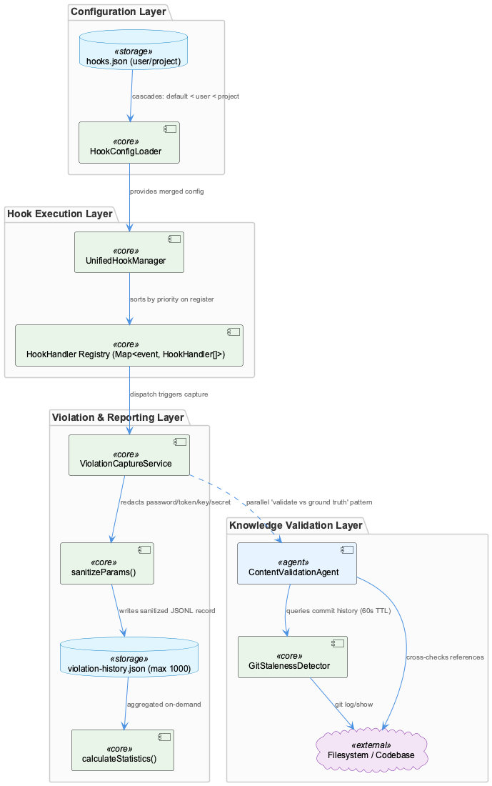
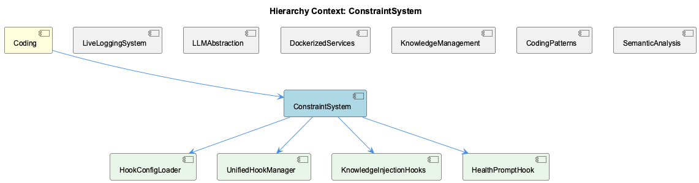

# ConstraintSystem

**Type:** Component

The ConstraintSystem provides rule-based validation and enforcement of code actions and file operations during Claude Code sessions, spanning hook configuration loading, hook dispatch orchestration, and violation capture/persistence. It is built around a unified hook architecture that merges user-level (~/.coding-tools/hooks.json) and project-level (.coding/hooks.json) configurations, with project config taking precedence, and dispatches events (pre-tool, post-tool, pre-prompt, post-prompt, startup, shutdown, error) to registered handlers of type script, command, or module.

Core orchestration lives in UnifiedHookManager (lib/agent-api/hooks/hook-manager.js), which maintains a Map of event names to sorted handler arrays (by priority), supports duplicate-ID overwrite semantics, and exposes registerHandler/unregisterHandler APIs bridging agent-native hook systems to a common HookEvent enum. Configuration parsing and structural validation is handled separately by HookConfigLoader (lib/agent-api/hooks/hook-config.js), which loads, merges, and validates settings/hooks blocks, logging warnings (not throwing) on malformed entries.

Violation detection results are captured and persisted via ViolationCaptureService (scripts/violation-capture-service.js), which writes JSONL violation records to .mcp-sync/session-violations.jsonl and maintains an aggregated violation-history.json with session tracking and computed statistics (severity breakdowns, most common constraint, average violations per session) for dashboard consumption. Sensitive parameter values are redacted before being written to logs, and history is capped at 1000 entries to bound file growth.

# ConstraintSystem: Technical Insight Document

## What It Is

The ConstraintSystem is a rule-based validation and enforcement subsystem for Claude Code sessions, implemented across three primary files: `lib/agent-api/hooks/hook-manager.js` (orchestration), `lib/agent-api/hooks/hook-config.js` (configuration loading), and `scripts/violation-capture-service.js` (violation persistence). As a child of the Coding project's root hierarchy, it sits alongside siblings like LiveLoggingSystem, LLMAbstraction, DockerizedServices, KnowledgeManagement, CodingPatterns, and SemanticAnalysis as one of the seven major infrastructure components. Its function is to intercept and validate code actions and file operations at defined lifecycle points, dispatching events (pre-tool, post-tool, pre-prompt, post-prompt, startup, shutdown, error) to registered handlers, and to durably record any detected violations for later analysis.

## Architecture and Design

The system's core architectural pattern is a **unified hook dispatch model** built around `UnifiedHookManager`, which bridges disparate "agent-native hook systems" into a common `HookEvent` enum and handler interface (script, command, or module type). This is a classic mediator/registry pattern: rather than tools directly coupling to validation logic, they emit events into a central Map<event, HookHandler[]>, decoupling producers of actionable events from consumers that enforce constraints.

Configuration follows a **two-tier override pattern** — user-level (`~/.coding-tools/hooks.json`) loaded first, then project-level (`.coding/hooks.json`) applied second via `mergeConfigs`/`applyConfig`, with project settings taking precedence. This mirrors common layered-config conventions (e.g., global vs. local git config) and is explicitly implemented in `HookManager`'s `initialize(projectPath)`, which calls `loadConfig(userConfigPath, 'user')` followed by `loadConfig(projectConfigPath, 'project')`.

Violation handling is architecturally separated from detection/dispatch: `ViolationCaptureService` is a distinct persistence layer, decoupled from the hook orchestration logic, following a **write-ahead log + aggregate view** split — an append-only JSONL stream paired with a computed rolling summary file for dashboards.

## Implementation Details

`UnifiedHookManager` initializes a `Map` entry for every `HookEvent` enum value up front, ensuring lookups never require existence checks. On `registerHandler()`, handlers are inserted and the array is re-sorted by numeric priority (lower = earlier), giving deterministic execution ordering. If no ID is supplied, a fallback ID is generated as `` `${event}-${handler.type}-${Date.now()}` ``; critically, handlers sharing an ID **overwrite** rather than duplicate, giving idempotent re-registration semantics — useful for hot-reload or repeated initialization scenarios.

`HookConfigLoader`'s `validateConfig()` deliberately only logs warnings instead of throwing on malformed hooks.json entries, favoring **graceful degradation** over hard failure — a partial, mostly-valid config is preferred to a crashed session. Related to this, `loadConfig()` applies `settings.enableLogging`, `stopOnError`, and `timeout` only when explicitly defined (`!== undefined` checks), preserving constructor defaults otherwise — a conservative merge strategy that avoids accidental overrides from sparse config files.

`ViolationCaptureService` writes JSONL records to `.mcp-sync/session-violations.jsonl` (append-only, one violation per line) while separately maintaining `violation-history.json`, capped at 1000 entries via `history.violations.slice(-1000)` to bound file growth. Before persistence, `sanitizeParams()` redacts values for keys matching password/token/key/secret/auth patterns, preventing credential leakage into logs — a security-conscious default applied uniformly regardless of tool. Aggregate statistics are computed by `calculateStatistics()`, which performs reduce-based aggregation for 24-hour rolling violation counts, severity breakdowns, and most-common-constraint identification, feeding dashboard consumption.

## Integration Points

The ConstraintSystem's children — HookManager, HookConfigLoader, ViolationCaptureService, KnowledgeInjectionHooks, and HealthPromptHook — form its complete internal surface. KnowledgeInjectionHooks integrates via `isInjectionEnabled()`, reading `process.env.CODING_KNOWLEDGE_INJECTION` and defaulting to enabled unless explicitly disabled ('0'/'false'/'off'), showing the hook system's extensibility for environment-driven feature toggling. HealthPromptHook's `checkHealthStatus()` uses `existsSync(VERIFIER_SCRIPT)` as a heuristic to detect execution outside the coding repo, returning `servicesAvailable:false` rather than attempting network calls — an example of hook handlers making local, fast decisions rather than depending on external services.

Within the broader Coding hierarchy, the ConstraintSystem's reliance on environment variables and filesystem heuristics parallels patterns seen in sibling components like LLMAbstraction's layered mode-resolution and CodingPatterns' environment-variable-driven agent wrapper scripts — suggesting a project-wide convention of config precedence chains and env-var toggles.

## Usage Guidelines

Developers extending the ConstraintSystem should register handlers with explicit, stable IDs to control overwrite behavior deliberately rather than relying on the timestamp-based fallback ID, which changes on every call and thus never overwrites. When adding new configuration options, follow the `!== undefined` guard pattern in `loadConfig()` to avoid clobbering defaults with sparse configs. Given that `validateConfig()` only warns on malformed entries, developers should not assume config errors halt execution — malformed hooks.json files can silently partial-load, so validation warnings should be monitored. Any new violation-related parameters must pass through `sanitizeParams()`-equivalent redaction to avoid credential leakage, and consumers of `violation-history.json` should account for its 1000-entry cap when building long-term analytics.

## Hierarchy Context

### Parent
- [Coding](./Coding.md) -- Root node of the coding project knowledge hierarchy, encompassing all development infrastructure knowledge. The project consists of 7 major components: LiveLoggingSystem: [LLM] The LiveLoggingSystem centers around logging.ts, which owns the core responsibilities of session windowing, file routing, and transcript capture; LLMAbstraction: [LLM] The mode-resolution logic in getLLMMode() (llm-mock-service.ts) establishes a clear precedence chain that new developers must understand before ; DockerizedServices: [LLM] The DockerizedServices component centers on docker/README.md as the canonical deployment reference, describing how semantic analysis MCP, constr; KnowledgeManagement: [LLM] The KnowledgeManagement component centers around a VKB (Virtual Knowledge Base) server that exposes graph-based storage operations to the rest o; CodingPatterns: [LLM] The agent wrapper scripts under config/agents/ (claude.sh, copilot.sh, opencode.sh, pi.sh) implement a consistent adapter pattern where each scr; ConstraintSystem: The ConstraintSystem provides rule-based validation and enforcement of code actions and file operations during Claude Code sessions, spanning hook con; SemanticAnalysis: [LLM] The batch-analysis pipeline is organized as a multi-agent workflow where distinct responsibilities are separated into dedicated agent classes ra.

### Children
- [HookManager](./HookManager.md) -- UnifiedHookManager.initialize(projectPath) loads user config first via loadConfig(userConfigPath, 'user') then project config via loadConfig(projectConfigPath, 'project'), giving project-level entries precedence through later overwrite.
- [HookConfigLoader](./HookConfigLoader.md) -- loadConfig() in hook-manager.js applies config.settings.enableLogging, stopOnError, and timeout only when explicitly defined in the file (`!== undefined` checks), preserving constructor defaults otherwise.
- [ViolationCaptureService](./ViolationCaptureService.md) -- Per architecture description, ViolationCaptureService writes JSONL violation records to .mcp-sync/session-violations.jsonl, separating an append-only raw log from a computed aggregate file.
- [KnowledgeInjectionHooks](./KnowledgeInjectionHooks.md) -- knowledge-injection-hook.js's isInjectionEnabled() reads process.env.CODING_KNOWLEDGE_INJECTION and treats only '0'/'false'/'off' (case-insensitive) as disabling, defaulting to enabled for unset values.
- [HealthPromptHook](./HealthPromptHook.md) -- checkHealthStatus() uses existsSync(VERIFIER_SCRIPT) as a heuristic to detect 'outside the coding repo' and returns servicesAvailable:false rather than attempting a network call in that case (Q3 carve-out).

### Siblings
- [LiveLoggingSystem](./LiveLoggingSystem.md) -- [LLM] The LiveLoggingSystem centers around logging.ts, which owns the core responsibilities of session windowing, file routing, and transcript capture. This module acts as the single ingestion point for live Claude Code conversation data, meaning any change to session lifecycle semantics (e.g., how a 'session window' is defined or when it rolls over to a new file) has cascading effects on downstream consumers like the classification agent and config validation tooling. New developers should treat logging.ts as the authoritative source of truth for how raw conversation events are structured before they are persisted to disk.
- [LLMAbstraction](./LLMAbstraction.md) -- [LLM] The mode-resolution logic in getLLMMode() (llm-mock-service.ts) establishes a clear precedence chain that new developers must understand before debugging unexpected LLM behavior: per-agent overrides in workflow-progress.json take precedence over a global mode setting, which in turn overrides a legacy mockLLM boolean flag, with 'public' as the ultimate fallback. This four-tier resolution means that a developer trying to force mock mode for testing might set the global mode but be silently overridden by a stale per-agent override left in workflow-progress.json from a previous run. The dual-checking of both llmState (new) and mockLLM (legacy) shapes in isMockLLMEnabled() and getLLMState() is a deliberate backward-compatibility shim, indicating the config schema evolved over time but old state files or tooling that only write the legacy flag must continue to work without breaking the mock system.
- [DockerizedServices](./DockerizedServices.md) -- [LLM] The DockerizedServices component centers on docker/README.md as the canonical deployment reference, describing how semantic analysis MCP, constraint monitor, graphify, and their supporting databases (likely Postgres/Neo4j/Redis instances based on the memory-systems architecture) are packaged as isolated containers. This separation allows each service to be versioned, scaled, and restarted independently of the host Coding CLI tooling, which is critical since the host-side agent orchestration (per docs/architecture/adding-new-agent.md) expects these services to be reachable over well-known ports/URLs rather than in-process calls.
- [KnowledgeManagement](./KnowledgeManagement.md) -- [LLM] The KnowledgeManagement component centers around a VKB (Virtual Knowledge Base) server that exposes graph-based storage operations to the rest of the Coding infrastructure. This server acts as the primary access point for entity CRUD operations, query resolution, and relationship traversal across the knowledge graph, decoupling consumers (agents, CLI tools, other components) from the underlying storage engine. This abstraction layer is critical because it has allowed the project to migrate storage backends (LevelDB to KMCore) without requiring downstream consumers to change their integration code, as evidenced by the dedicated migration test suite.
- [CodingPatterns](./CodingPatterns.md) -- [LLM] The agent wrapper scripts under config/agents/ (claude.sh, copilot.sh, opencode.sh, pi.sh) implement a consistent adapter pattern where each script normalizes a distinct third-party CLI's invocation surface into a common interface expected by the rest of the Coding infrastructure. Rather than having callers branch on which agent is being invoked, each wrapper reads its own set of environment variables (e.g., CODING_OPENCODE_MODEL for opencode.sh) and translates them into the flags or config files that the underlying binary expects. This pattern lets orchestration code (likely in bin/coding or docs/architecture/agent-abstraction-api.md-described layers) treat all agents uniformly, at the cost of needing to keep each wrapper script in sync whenever a new common capability (like model selection or proxy routing) is added — a new developer adding agent support should look at an existing wrapper like claude.sh as the canonical template, per docs/architecture/adding-new-agent.md.
- [SemanticAnalysis](./SemanticAnalysis.md) -- [LLM] The batch-analysis pipeline is organized as a multi-agent workflow where distinct responsibilities are separated into dedicated agent classes rather than a single monolithic analyzer. semantic-analysis-agent.ts is responsible for extracting structured knowledge entities from raw inputs (git history diffs/commits and LSL session logs), while ontology-classification-agent.ts takes those extracted entities and classifies them into a hierarchy (determining parent-child relationships and where a given entity fits within the broader ontology). This separation of extraction from classification allows each agent to have a narrower, more testable prompt/response contract with the underlying LLM, and lets the pipeline swap or tune one stage without affecting the other's logic.

---

*Generated from 8 observations*
