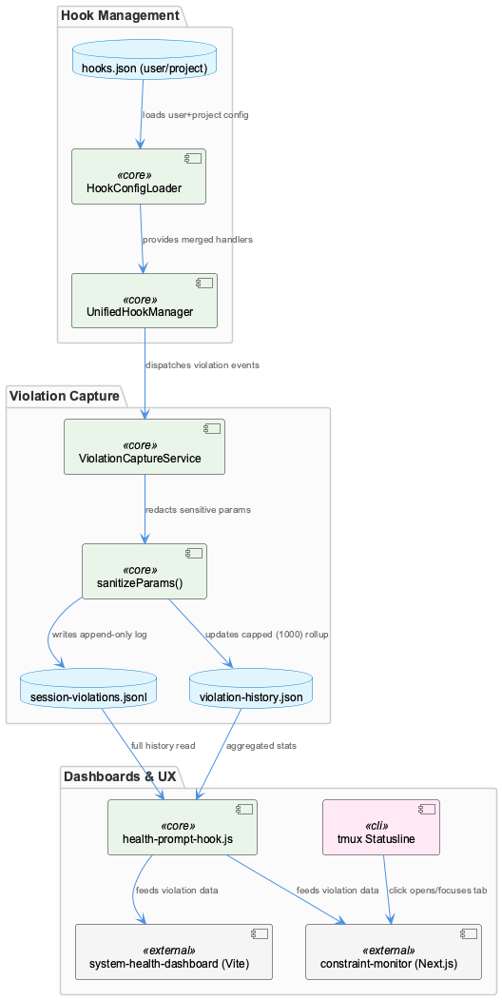
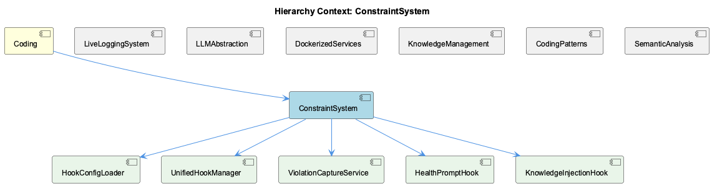

# ConstraintSystem

**Type:** Component

# ConstraintSystem — Technical Insight Document

## What It Is

ConstraintSystem is the enforcement and monitoring layer for tool-call policy within the coding project, implemented across a set of child components: HookConfigLoader (`lib/agent-api/hooks/hook-config.js`), UnifiedHookManager (`lib/agent-api/hooks/hook-manager.js`), HealthPromptHook, KnowledgeInjectionHook, and FeatureGatingSystem. It also extends into violation capture and dashboard reporting via `scripts/violation-capture-service.js`, and into knowledge-base content correctness via `integrations/semantic-analysis/src/agents/content-validation-agent.ts`'s ContentValidationAgent. Its purpose spans two related concerns: enforcing/registering hooks that gate or validate tool calls, and capturing, sanitizing, and surfacing violations of those constraints to developers in near-real-time.

## Architecture and Design

The configuration layer follows a three-tier merge pattern in HookConfigLoader: a built-in DEFAULT_CONFIG, a user-level `~/.coding-tools/hooks.json`, and a project-level `.coding/hooks.json`, merged via `applyConfig()` with project settings taking final precedence. This is deliberately file-based and git-diffable rather than database-backed, so hook policy changes can be reviewed in pull requests instead of applied silently at runtime — a trade-off favoring auditability over runtime flexibility.

UnifiedHookManager's `registerHandler()` re-sorts its entire handlers array on every registration (O(n log n) per call) rather than batch-sorting once at startup, trading minor runtime overhead for guaranteed consistent ordering even when handlers register dynamically mid-session (e.g., a late-loading plugin). Handlers come in script, command, and module variants, dispatched on pre-tool/post-tool events — an interchangeable-unit design supporting shell scripts, inline commands, and JS modules alike.

Violation capture uses a dual-write pattern: an append-only JSONL audit log plus a bounded `violation-history.json` capped at 1000 entries via array slicing, with aggregation (per-session and severity-breakdown stats) computed at write-time rather than query-time — pushing cost onto infrequent violation events rather than frequent dashboard polls.

## Implementation Details

`ViolationCaptureService.updateViolationHistory()` performs the dual write and inline statistics computation described above. Its `sanitizeParams()` function redacts tool-call parameters whose keys substring-match `password`, `token`, `key`, `secret`, or `auth` — intentionally over-redacting (catching `api_key_id`, `auth_header`, etc.) because violation logs feed a dashboard meant for broad team visibility rather than staying within the tool-calling agent's trust boundary.

ContentValidationAgent takes a structurally different approach: rather than validating structured tool parameters, it uses regex pattern arrays (`filePathPatterns`, `commandPatterns`) to extract file/command references from unstructured, free-text agent-generated observations, then checks them against the actual codebase. This introduces an inherent false-positive/false-negative tradeoff from regex-based extraction, distinguishing it from ViolationCaptureService's more deterministic sanitization.

## Integration Points

ConstraintSystem surfaces to developers through the tmux statusline: clicking the 'constraints' field (alongside project bubble, network, context gauge, health, lsl, obs fields) opens or focuses the constraint-monitor dashboard tab, per the Statusline Click-Report Feature. This dashboard is a distinct Next.js application, architecturally separate from the Vite-based system-health-dashboard, even though both share the tmux statusline entry mechanism and `health-prompt-hook.js` status aggregator — a shared integration layer, not a shared frontend codebase. Fixes to one dashboard must not be assumed to apply to the other.

Within its own child hierarchy, HealthPromptHook has a known open issue where a coverage-ratio denominator wrongly includes 'observations' and 'digests' entity types. KnowledgeInjectionHook's actual implementation is unconfirmed in current evidence — supplied files for `health-prompt-hook.js` show only health-status reporting, not knowledge-injection logic, indicating a documentation/naming gap worth resolving. FeatureGatingSystem is evidenced by `tests/features/cli-and-rules-gating.test.mjs`, which exercises `lib/features/require-feature.sh` and FEATURE_IDS from `lib/features/catalogue.cjs` against CLIs like `bin/graphify`, `bin/semantic`, `bin/constraints`, enforcing exit-code-2/stderr-only gating contracts. At the sibling level, ConstraintSystem shares the DockerizedServices' `lib/service-probe.js` readiness-polling pattern conceptually (both gate downstream action on state), though this is not a direct dependency.

## Usage Guidelines

Hook policy changes should go through `.coding/hooks.json` project overrides rather than mutating user-level config, since project settings win in `applyConfig()` and this is the reviewable, git-tracked layer. Developers adding new hook handlers should rely on UnifiedHookManager's automatic priority/sort behavior (default priority 100) rather than manually managing ordering. Anyone touching violation logging must preserve the sanitize-before-persist invariant in `sanitizeParams()`, given the dashboard's broad visibility. When debugging dashboard rendering, confirm which dashboard (constraint-monitor vs. system-health-dashboard) is in scope, since they are separate Next.js/Vite codebases despite a shared statusline entry point. Finally, the KnowledgeInjectionHook naming/implementation mismatch should be treated as an open question rather than assumed-correct documentation.

## Work Record

What working sessions recorded about this entity — decisions taken, problems hit, and why things are the way they are:

- Statusline Click-Report Feature establishes that clicking the 'constraints' field in the tmux statusline opens or focuses the constraint-monitor dashboard tab, integrating HookManagementSystem-driven violation data with the dashboard UI
- The 'HealthDashboard — Performance/System-Health/Token-Cost Dashboards: Architecture' record establishes that the constraint-monitor dashboard is a distinct Next.js application, architecturally separate from the Vite-based system-health-dashboard, even though both are reached through the same tmux statusline click-report mechanism and the same health-prompt-hook.js status aggregator. This means the ConstraintSystem's UI surface does not share a frontend build pipeline, component library, or deployment process with the token-usage/performance dashboards — a developer fixing a rendering bug in one must not assume the fix applies to the other, and any shared behavior (like click-to-focus-tab) is implemented at the tmux/statusline integration layer rather than in a shared frontend codebase.
- The Statusline Click-Report Feature record establishes that clicking the 'constraints' field specifically in the tmux statusline opens or focuses the constraint-monitor dashboard tab, as one of several clickable fields (alongside project bubble, network, context gauge, health, lsl, obs). This confirms the ConstraintSystem is deliberately exposed as a first-class, always-visible entry point in the developer's terminal environment rather than a buried admin panel, and that its violation data (produced by ViolationCaptureService) is intended for continuous at-a-glance monitoring during active coding sessions rather than post-hoc audit review only.

## Hierarchy Context

### Parent
- [Coding](./Coding.md) -- Root node of the coding project knowledge hierarchy, encompassing all development infrastructure knowledge. The project consists of 7 major components: LiveLoggingSystem: [LLM] The classification layer for LiveLoggingSystem is implemented in ontology-classification-agent.ts, which categorizes captured session content as; LLMAbstraction: [SESSION] 'LLM Routing Tier Priority' establishes that LLM requests must follow fallback tier order — max-subscription models first, then work/GH Copi; DockerizedServices: [LLM] lib/service-probe.js implements the health-check polling logic that determines readiness of dockerized services (semantic analysis MCP, constrai; KnowledgeManagement: [SESSION] Wave Insight Persistence work record establishes that Wave 4 wrote 73 insight documents but zero Insight graph nodes, because the History si; CodingPatterns: [SESSION] Documentation Style Guide for Diagrams and Markdown establishes that .puml source files must live in docs/puml/ and generated diagram artifa; ConstraintSystem: [SESSION] Statusline Click-Report Feature establishes that clicking the 'constraints' field in the tmux statusline opens or focuses the constraint-mon; SemanticAnalysis: [SESSION] Pipeline CodingLowerOntologySource Emission Bug documents an unresolved defect where the pipeline emits a CodingLowerOntologySource referenc.

### Children
- [HookConfigLoader](./HookConfigLoader.md) -- [CGR] HookConfigLoader (class) in hook-config.js
- [UnifiedHookManager](./UnifiedHookManager.md) -- [CGR] UnifiedHookManager (class) in hook-manager.js
- [HealthPromptHook](./HealthPromptHook.md) -- [SESSION] obs-api Service Lifecycle and Dev Workflow Resumption: a coverage metric in obs-api computes a ratio whose denominator should exclude 'observations' and 'digests' entity types but currently includes them, skewing reported coverage — an open unresolved code-fix task
- [KnowledgeInjectionHook](./KnowledgeInjectionHook.md) -- [LLM] None of the four supplied code files — scripts/health-prompt-hook.js, tests/integration/health-prompt-hook-stall.test.mjs, integrations/system-health-dashboard/src/components/workflow/hooks.ts, tests/features/cli-and-rules-gating.test.mjs, and integrations/system-health-dashboard/src/hooks/usePolledFetch.ts — mention 'KnowledgeInjectionHook', a knowledge-base injection mechanism, or any hook that inserts KB content into an agent/LLM prompt. health-prompt-hook.js is a UserPromptSubmit hook, but its entire body is health-status reporting (coordinator polling, deriveSummary, envelope shaping) with no reference to knowledge, retrieval, or content injection.
- [FeatureGatingSystem](./FeatureGatingSystem.md) -- [LLM+CGR] tests/features/cli-and-rules-gating.test.mjs is the clearest evidence of a FeatureGatingSystem: it imports FEATURE_IDS from lib/features/catalogue.cjs, exercises lib/features/require-feature.sh via subprocess calls to bin/graphify, bin/semantic, bin/constraints, etc., and asserts a specific contract — disabled features exit with code 2 and stderr matching /'codegraph' feature, which is switched off/, while stdout stays empty so piped output is never polluted by gate messages.

### Siblings
- [LiveLoggingSystem](./LiveLoggingSystem.md) -- [LLM] The classification layer for LiveLoggingSystem is implemented in ontology-classification-agent.ts, which categorizes captured session content as it flows through the logging pipeline. Its hierarchy-root validation logic is tested separately in ontology-classification-agent.hierarchy-roots.test.ts, indicating that root-node classification (i.e., correctly assigning top-level ontology categories rather than leaf nodes) is treated as a distinct correctness concern from general classification accuracy — likely because incorrect root assignment cascades into misfiled session data across the entire per-person or per-project vault structure.
- [LLMAbstraction](./LLMAbstraction.md) -- [SESSION] 'LLM Routing Tier Priority' establishes that LLM requests must follow fallback tier order — max-subscription models first, then work/GH Copilot models, then Groq Llama-70B only as a last resort — rather than demoting to lower-tier providers as primary
- [DockerizedServices](./DockerizedServices.md) -- [LLM] lib/service-probe.js implements the health-check polling logic that determines readiness of dockerized services (semantic analysis MCP, constraint monitor) before dependent processes proceed. Rather than a single fixed timeout, the probe pattern issues periodic requests against known health endpoints and treats consecutive failures within a window as the signal for 'not ready' versus 'transiently slow', which matters in a Docker context where container startup order and cold-start times (loading models, connecting to databases) are highly variable across restarts.
- [KnowledgeManagement](./KnowledgeManagement.md) -- [SESSION] Wave Insight Persistence work record establishes that Wave 4 wrote 73 insight documents but zero Insight graph nodes, because the History sidebar filters strictly to entityType 'Insight' — documents alone are invisible to graph queries
- [CodingPatterns](./CodingPatterns.md) -- [SESSION] Documentation Style Guide for Diagrams and Markdown establishes that .puml source files must live in docs/puml/ and generated diagram artifacts have defined placement rules, enforcing a convention for the docs pipeline to render correctly.
- [SemanticAnalysis](./SemanticAnalysis.md) -- [SESSION] Pipeline CodingLowerOntologySource Emission Bug documents an unresolved defect where the pipeline emits a CodingLowerOntologySource reference in output despite documentation stating this source type should never be produced, indicating a gap between the L2 refinement design and current emission behavior

---

*Generated from 8 observations*
