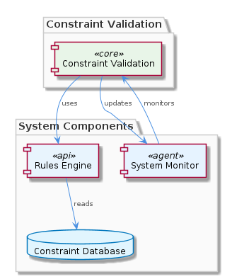
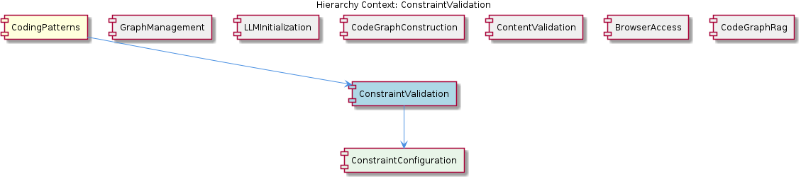

# ConstraintValidation

**Type:** SubComponent

ConstraintValidation ensures that the system operates within defined boundaries, preventing errors and inconsistencies.

## What It Is  

ConstraintValidation is a **sub‑component** of the **CodingPatterns** module that is dedicated to monitoring and enforcing system‑wide constraints. It operates by applying a **rules‑based approach** to verify that the application stays within its defined boundaries, thereby preventing errors, inconsistencies, and violations of business logic. Although the observations do not list concrete source‑file locations for the implementation, the component lives conceptually under the `CodingPatterns` hierarchy and works closely with its child entity **ConstraintConfiguration**, whose documentation resides at `integrations/mcp-constraint-monitor/docs/constraint-configuration.md`.  

The primary purpose of ConstraintValidation is to give the system the ability to **handle complex constraints with ease**. By centralising validation logic, it ensures that all higher‑level features—such as graph construction, LLM initialization, and content validation—operate on a sound, consistent foundation.

---

## Architecture and Design  

ConstraintValidation follows a **rules‑based validation architecture**. This design treats each constraint as an individual rule that can be evaluated independently or in combination with others. The pattern mirrors the approach used by the sibling **ContentValidation** component, indicating a shared architectural philosophy across the CodingPatterns family: encapsulate validation concerns into discrete, reusable rule objects that the engine iterates over.

The component sits directly beneath the **CodingPatterns** parent, which itself delegates persistence to the `GraphDatabaseAdapter` (found in `storage/graph-database-adapter.ts`). While ConstraintValidation does not handle storage directly, it relies on the same data‑integrity guarantees provided by the graph adapter, ensuring that constraint definitions stored in the graph are consistently retrieved for evaluation.

Interaction flow (high‑level):

1. **ConstraintConfiguration** supplies the set of active rules and their parameters.  
2. ConstraintValidation loads these rules, often via the graph‑database layer used by the parent.  
3. During runtime events (e.g., graph updates, LLM prompts), the validation engine iterates through the rule set, applying each rule to the current state.  
4. Violations are reported back to the calling component, which can then take corrective action or abort the operation.

This design promotes **separation of concerns**: configuration lives in its own documentation and (presumably) data store, while the validation engine focuses solely on rule execution.  

---

## Implementation Details  

Even though the source repository does not expose concrete symbols for ConstraintValidation, the observations give us enough to infer its core pieces:

| Element | Role |
|---------|------|
| **Rule Engine** | A loop or dispatcher that receives a collection of constraint rules (likely objects or functions) and evaluates each against the current system state. |
| **ConstraintConfiguration** | Provides the declarative definition of each rule—its type, thresholds, and any conditional logic. The markdown guide (`integrations/mcp-constraint-monitor/docs/constraint-configuration.md`) outlines the expected schema, suggesting that the engine parses this configuration at startup or on‑demand. |
| **Violation Reporter** | Generates structured reports (e.g., error codes, messages) when a rule fails, allowing calling components to react appropriately. |
| **Integration Hooks** | Points in the system (such as after a graph mutation or before an LLM query) where ConstraintValidation is invoked. These hooks are likely implemented in the sibling components (e.g., **GraphManagement**, **LLMInitialization**) to ensure constraints are respected throughout the workflow. |

Because the component is described as “rules‑based,” it likely employs a **Strategy**‑like pattern where each rule implements a common interface (e.g., `validate(state): ValidationResult`). This enables easy addition of new constraints without altering the engine core.

---

## Integration Points  

ConstraintValidation is tightly coupled with several other parts of the architecture:

* **Parent – CodingPatterns**: The parent component supplies the overall orchestration and persistence layer (via `GraphDatabaseAdapter`). ConstraintValidation consumes constraint definitions stored in the graph, aligning its lifecycle with the parent’s data‑management responsibilities.  

* **Sibling – ContentValidation**: Both share the rules‑based paradigm, suggesting that they may reuse a common rule‑definition format or even a shared validation framework.  

* **Sibling – GraphManagement & CodeGraphConstruction**: When graph structures are created or modified, these components likely trigger ConstraintValidation to ensure that new nodes/edges respect defined constraints (e.g., no circular dependencies, naming conventions).  

* **Sibling – LLMInitialization**: Before an LLM agent is lazily loaded, ConstraintValidation could verify resource limits or configuration constraints, preventing mis‑configured agents from consuming excess resources.  

* **Child – ConstraintConfiguration**: The child component is the authoritative source of rule definitions. Any change to the configuration markdown is expected to be reflected in the validation engine after a reload or hot‑swap, enabling dynamic constraint management.  

The **relationship diagram** below visualises these connections, highlighting the flow of rule data from ConstraintConfiguration into the engine and the downstream impact on sibling modules.  

---

## Usage Guidelines  

1. **Define Constraints Declaratively** – All rules should be expressed in the `ConstraintConfiguration` markdown (or its underlying data representation). Follow the documented schema to ensure the validation engine can parse them correctly.  

2. **Invoke Validation at Logical Boundaries** – Call the ConstraintValidation engine after any state‑changing operation (graph updates, LLM initialization, content generation). This guarantees that violations are caught early.  

3. **Handle Violations Gracefully** – The engine returns structured results; developers should inspect the `ValidationResult` and either abort the operation, log the issue, or trigger remediation workflows.  

4. **Leverage Shared Rule Libraries** – When possible, reuse rule definitions that are already employed by **ContentValidation** or other siblings to reduce duplication and maintain consistency across the system.  

5. **Monitor Performance** – Because each rule is evaluated sequentially, a large rule set can impact latency. Profile the rule engine in high‑throughput scenarios and consider grouping or short‑circuiting non‑critical rules.  

---

### Architectural Patterns Identified  
* **Rules‑Based Validation** (akin to Strategy/Command pattern for individual constraints)  
* **Separation of Concerns** – distinct configuration (ConstraintConfiguration) vs. execution (ConstraintValidation)  

### Design Decisions and Trade‑offs  
* **Centralised Rule Engine** simplifies consistency but introduces a single point of latency; careful rule ordering mitigates this.  
* **Declarative Configuration** enables non‑developers to adjust constraints, at the cost of runtime parsing overhead.  

### System Structure Insights  
* ConstraintValidation is a leaf under **CodingPatterns**, sharing persistence via the graph adapter and collaborating with multiple siblings that modify system state.  

### Scalability Considerations  
* Adding new constraints scales linearly in evaluation time; for large rule sets, parallel evaluation or rule prioritisation may be required.  
* Because the component relies on the graph database for rule storage, scaling the underlying graph layer directly benefits ConstraintValidation’s performance.  

### Maintainability Assessment  
* High maintainability due to the clear split between configuration and engine logic.  
* Reuse of the rules‑based pattern across siblings (e.g., ContentValidation) further reduces duplication and eases future refactoring.  

By adhering to the guidelines above and respecting the documented relationships, developers can confidently extend and maintain the **ConstraintValidation** sub‑component as the system evolves.

## Hierarchy Context

### Parent
- [CodingPatterns](./CodingPatterns.md) -- [LLM] The CodingPatterns component utilizes the GraphDatabaseAdapter class in storage/graph-database-adapter.ts for persistence, allowing for automatic JSON export sync. This design decision enables seamless data synchronization and provides a robust foundation for the project's data management. The GraphDatabaseAdapter class is responsible for handling graph data storage and retrieval, making it a critical component of the project's architecture. By using this adapter, the CodingPatterns component can focus on its primary functionality, leaving data management to the GraphDatabaseAdapter.

### Children
- [ConstraintConfiguration](./ConstraintConfiguration.md) -- The integrations/mcp-constraint-monitor/docs/constraint-configuration.md file provides a guide on constraint configuration, indicating the importance of this aspect in the ConstraintValidation sub-component.

### Siblings
- [GraphManagement](./GraphManagement.md) -- GraphDatabaseAdapter handles graph data storage and retrieval, making it a critical component of the project's architecture.
- [LLMInitialization](./LLMInitialization.md) -- LLMInitialization uses a lazy loading approach to initialize LLM agents, reducing computational overhead.
- [CodeGraphConstruction](./CodeGraphConstruction.md) -- CodeGraphConstruction uses a graph-based approach to construct code graphs, enabling efficient data management.
- [ContentValidation](./ContentValidation.md) -- ContentValidation uses a rules-based approach to validate content, ensuring system integrity.
- [BrowserAccess](./BrowserAccess.md) -- BrowserAccess uses a browser-based approach to provide access to web-based interfaces.
- [CodeGraphRag](./CodeGraphRag.md) -- CodeGraphRag uses a graph-based approach to analyze code, providing a robust foundation for the project's functionality.

---

*Generated from 6 observations*
