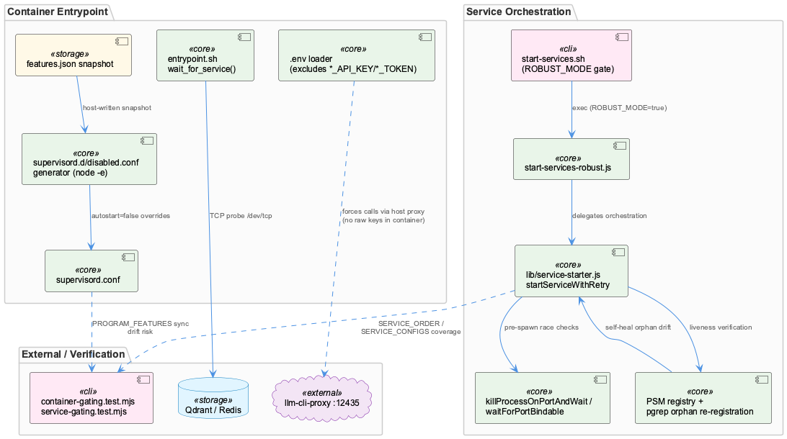
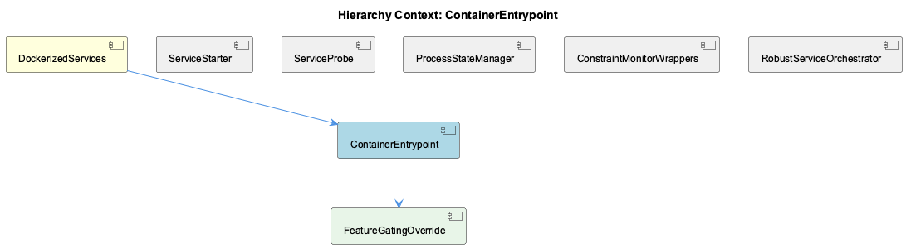

# ContainerEntrypoint

**Type:** SubComponent

# ContainerEntrypoint — Technical Insight Document

## What It Is

ContainerEntrypoint is implemented at `docker/entrypoint.sh` and serves as the single bootstrap script that runs when the container starts, orchestrating three distinct concerns in sequence: (1) blocking readiness checks against external dependencies, (2) safe environment loading, and (3) translation of host-computed feature state into supervisord configuration. As the child component of DockerizedServices, it is the container-side boundary layer that mediates between the host's configuration/resolution logic and the in-container supervisord process manager. Its own child, FeatureGatingOverride, implements the third of these responsibilities as a fully generated artifact rather than an incremental patch.

## Architecture and Design

The script's first responsibility, `wait_for_service()` (entrypoint.sh:15-30), is a blocking TCP-probe loop using `/dev/tcp/$host/$port` bash redirection to confirm Qdrant and Redis are reachable before continuing — a simple, dependency-free readiness gate that avoids requiring `nc` or `curl` in the image.

The second responsibility is a security-by-omission pattern: the `.env` loader (entrypoint.sh:56-64) explicitly `continue`s past any variable matching `*_API_KEY|*_TOKEN|*_MANAGEMENT_KEY` in its `case` statement. Even though the host's `.env` is bind-mounted into the container, raw provider credentials are never exported into the container's process environment. This is the container-side half of a "T2 egress lockdown," forcing all LLM/embedding traffic through the host's `llm-cli-proxy` on port 12435 rather than permitting an in-container SDK to dial a provider directly. It is a boundary enforced structurally, not by network policy.

The third responsibility — feature gating — implements the config-snapshot-to-supervisord-override pattern: the host writes a flat snapshot to `/coding/.coding/runtime/features.json` (since `~/.coding/features.yaml` is never mounted into the container), and entrypoint.sh (lines 100-138) converts it via an inline `node -e` snippet into `/etc/supervisor/features.d/disabled.conf`, setting `autostart=false` per program rather than mutating `supervisord.conf` directly. This generation is fully derivative — FeatureGatingOverride clears the directory on every boot before regenerating, so no stale override can survive across restarts. This design is deliberately read-only and non-authoritative on the container side, avoiding duplicated feature-resolution logic across the host/container boundary, as also emphasized in sibling components ServiceStarter and ServiceProbe.

## Implementation Details

The `PROGRAM_FEATURES` mapping hardcodes an eight-entry association (e.g., `semantic-analysis:knowledge`, `graphify:codegraph`) between supervisord program names and feature IDs. This mapping must remain in exact sync with `supervisord.conf`'s `[program:...]` sections and with `tests/features/container-gating.test.mjs` — a drift risk the script's own comments explicitly flag, and one echoed structurally in sibling ConstraintMonitorWrappers, which relies on the same mapping for `constraint-monitor`/`constraint-dashboard` entries.

The gating logic treats `value === false` as the sole condition for disabling a program; any other outcome — including `undefined` for a feature key absent from an older snapshot — resolves to `"true"` (enabled). Combined with a missing-file branch that logs "starting everything" and a `|| echo "true"` fallback on node execution error, the layer fails open at three independent points. This mirrors the project-wide convention (noted in CLAUDE.md) that startup surfaces should over-run rather than silently under-run, since a container doing nothing due to a late-arriving config file is harder to diagnose than one over-starting.

`node -e` is used instead of `jq` (not installed in the image) to parse the snapshot — a small but load-bearing implementation detail repeated across sibling ServiceProbe and ConstraintMonitorWrappers observations.

## Integration Points

ContainerEntrypoint sits directly beneath DockerizedServices, which more broadly enforces PSM-based process lifecycle tracking (via wrappers like `api-service.js`/`dashboard-service.js`) independent of supervisord's own state. ContainerEntrypoint's feature-gating step is one of two independent layers described by sibling ServiceStarter: the container-side layer here versus the host-side `loadFeatures()`/`startOneService()` layer in `scripts/start-services-robust.js`, which is the real orchestrator invoked by `start-services.sh` (behind the `ROBUST_MODE` flag, default `true`) once the legacy bash fallback path is bypassed. Both layers must independently honor the same feature catalogue, structurally enforced by `tests/features/service-gating.test.mjs`, which asserts service-to-feature coverage against `FEATURE_IDS` from `lib/features/catalogue.cjs`, and by `tests/features/container-gating.test.mjs`, which guards the entrypoint's own `PROGRAM_FEATURES` mapping.

Downstream, its output (`/etc/supervisor/features.d/disabled.conf`) is consumed directly by supervisord, making FeatureGatingOverride the concrete artifact bridging entrypoint logic to process management — the actual disabling mechanism, generated once per boot with no accumulated state.

## Usage Guidelines

Anyone modifying supervisord program names must update `PROGRAM_FEATURES` in entrypoint.sh, `supervisord.conf`'s `[program:...]` sections, and `tests/features/container-gating.test.mjs` in lockstep — this is a manually-maintained three-way sync point with no automated derivation, and the test suite is the only safety net against drift. Do not attempt to export provider API keys/tokens through this script's `.env` loader; the exclusion pattern is intentional security policy, not an oversight, and any LLM/embedding access must go through the host-side `llm-cli-proxy`. When reasoning about feature-off states, remember the system fails open by design at every layer (missing snapshot, unknown feature key, execution error) — a program unexpectedly running is expected behavior under a stale or absent config, not a bug. Finally, because FeatureGatingOverride regenerates its output from scratch each boot, no manual edits to `/etc/supervisor/features.d/disabled.conf` will persist; changes must be made upstream in the host's feature resolution or the `PROGRAM_FEATURES` mapping itself.

## Hierarchy Context

### Parent
- [DockerizedServices](./DockerizedServices.md) -- [LLM] The DockerizedServices architecture enforces a strict separation between process spawning and process lifecycle management via a consistent wrapper pattern in scripts/api-service.js and scripts/dashboard-service.js. Rather than letting supervisord directly manage the underlying Node processes (dashboard-server.js on port 3031, or 'npm run dev' for the Next.js dashboard on port 3030), each wrapper script spawns the actual service as a child process and immediately registers it with the ProcessStateManager (PSM) under a well-known name like 'constraint-api-child'. This indirection allows the PSM to maintain a canonical, queryable registry of running services independent of supervisord's own state tracking, which is critical when other components (health-coordinator, CLI tooling) need to introspect or manage services without going through supervisorctl. The wrappers also forward SIGTERM/SIGINT to the child and unregister from PSM on exit, ensuring the PSM registry never drifts from actual OS process state even during ungraceful container stops.

### Children
- [FeatureGatingOverride](./FeatureGatingOverride.md) -- [LLM] docker/entrypoint.sh implements feature gating as a generated supervisord *include* file (`/etc/supervisor/features.d/disabled.conf`) rather than templating `supervisord.conf` itself. The script clears the directory (`rm -f "$FEATURES_DIR"/*.conf`) on every container start before regenerating it, meaning the override is fully derived state, never accumulated or diffed — a stale entry from a previous boot's snapshot can never survive into the next boot, which sidesteps an entire class of drift bugs that an incremental patcher would have to guard against explicitly.

### Siblings
- [ServiceStarter](./ServiceStarter.md) -- [LLM] The component enforces feature-gating at two independent layers that must stay in sync: the container-side layer in docker/entrypoint.sh reads a flat host-written snapshot (/coding/.coding/runtime/features.json) and rewrites it into a supervisord include (/etc/supervisor/features.d/disabled.conf) that flips `autostart=false` for programs whose feature is off, while the host-side layer in scripts/start-services-robust.js consults `loadFeatures()` per-service via `startOneService()` before invoking each service's `startFn`. Both layers deliberately fail toward 'everything enabled' — entrypoint.sh explicitly comments that a missing/unreadable snapshot leaves the features directory empty ('starts everything — the historical behaviour'), and an unrecognized feature name in the snapshot is treated as enabled by the inline `node -e` script (`value === false ? "false" : "true"`) rather than defaulting to disabled. This is a considered fail-open design: an incomplete config produces a container that does too much rather than one that silently does nothing, which the comments call easier to diagnose.
- [ServiceProbe](./ServiceProbe.md) -- [LLM] docker/entrypoint.sh implements a fail-open feature-gating layer that sits strictly between the host's feature resolver and supervisord: it reads a flat JSON snapshot at /coding/.coding/runtime/features.json (written by the host, never by the container) and, for each entry in the PROGRAM_FEATURES mapping (e.g. 'semantic-analysis:knowledge', 'constraint-monitor:constraints', 'health-dashboard:health'), uses `node -e` (not jq, since jq isn't installed in the image) to decide whether to emit an `autostart=false` override into /etc/supervisor/features.d/disabled.conf. Critically, the script comments explain the asymmetric fail-open design: a missing or unparseable snapshot leaves the override directory empty, which starts EVERYTHING, because the authors judged that a container silently running nothing due to a late-arriving JSON file would be a much harder failure mode to diagnose than one that over-starts. An unknown feature key in the snapshot also reads as enabled by default, guarding against an old host snapshot silently disabling a newer program it doesn't know about.
- [ProcessStateManager](./ProcessStateManager.md) -- [CGR] ProcessStateManager (class) in process-state-manager.js
- [ConstraintMonitorWrappers](./ConstraintMonitorWrappers.md) -- [LLM] docker/entrypoint.sh implements a fail-open feature-gating layer that translates the host's `~/.coding/features.yaml` (never mounted into the container) into a supervisord include directory. It reads a flat snapshot at `/coding/.coding/runtime/features.json` and, for each entry in the `PROGRAM_FEATURES` mapping (e.g. `constraint-monitor:constraints`, `constraint-dashboard:constraints`, `constraint-dashboard-api:constraints`), shells out to `node -e` (not `jq`, which isn't installed in the image) to read `snap.features?.[feature]` and writes `[program:<name]\nautostart=false` into `/etc/supervisor/features.d/disabled.conf` when the value is explicitly `false`. An unknown feature key or a missing snapshot file both resolve to 'enabled', which the comment block explicitly frames as deliberate: a stale/older host snapshot must never silently turn a program off, and a late-arriving JSON file must never leave the container running nothing.
- [RobustServiceOrchestrator](./RobustServiceOrchestrator.md) -- [LLM] The parent-context observations describe a wrapper-based process-management architecture (api-service.js, dashboard-service.js, lib/service-starter.js) that is largely superseded in the actual files shown here by scripts/start-services-robust.js, which implements its own retry/backoff logic directly rather than delegating entirely to lib/service-starter.js's startServiceWithRetry(). start-services-robust.js does import startServiceWithRetry, createHttpHealthCheck, createPidHealthCheck, isPortListening, isTcpPortListening, isProcessRunning, and sleep from '../lib/service-starter.js', confirming the layering described in the parent context, but it also defines significant orchestration logic locally (isProcessRunningByScript, killProcessOnPortAndWait, waitForPortBindable), suggesting RobustServiceOrchestrator is a thicker composition layer on top of the primitives rather than a thin consumer.

---

*Generated from 12 observations*
