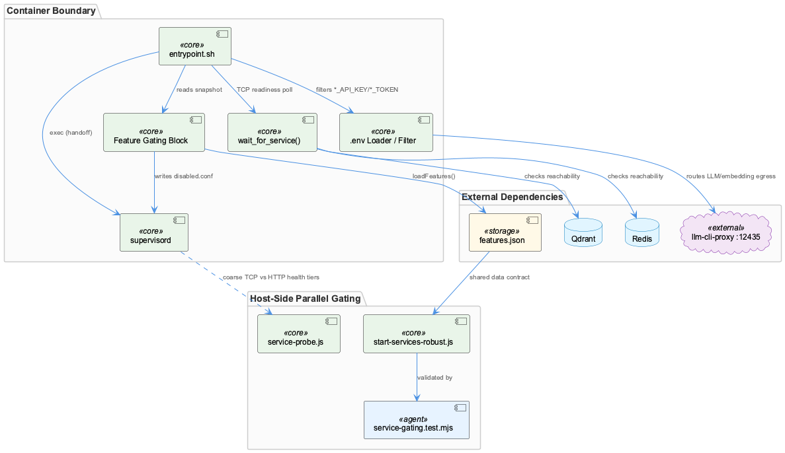
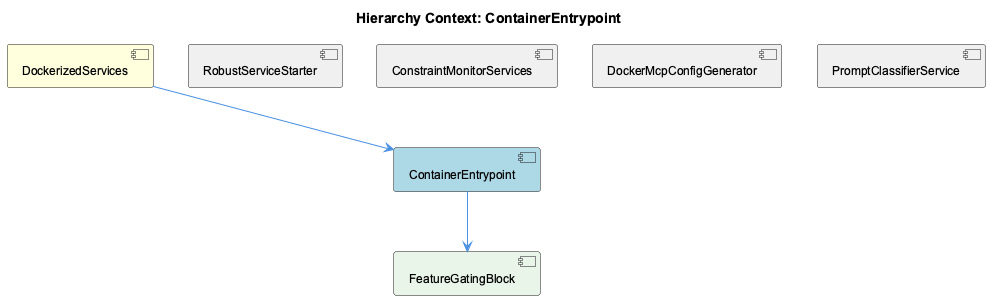

# ContainerEntrypoint

**Type:** SubComponent

# ContainerEntrypoint — Technical Insight Document

## What It Is

ContainerEntrypoint is implemented directly in `docker/entrypoint.sh` and is the container-side counterpart in the DockerizedServices system. It performs three distinct jobs before handing control to the process supervisor: it gates on raw TCP readiness of Qdrant and Redis via `wait_for_service()`, it translates a feature snapshot into supervisord autostart configuration through its child component FeatureGatingBlock, and it enforces an egress security boundary by filtering sensitive keys out of the container's environment. Only after these steps does it `exec "$@"` into supervisord, making entrypoint.sh the single gatekeeper between container start and the supervised process tree that the parent DockerizedServices component (via `lib/service-probe.js`) subsequently monitors for finer-grained health.

## Architecture and Design

The dominant pattern is a two-tier readiness model: entrypoint.sh's `wait_for_service()` performs coarse TCP-level polling of Qdrant and Redis, while the parent DockerizedServices' `lib/service-probe.js` performs HTTP health-endpoint polling with consecutive-failure windowing. This is an explicit trade-off — a TCP-open port is a weaker guarantee than an HTTP-healthy endpoint, since a database can be mid-cold-start while still accepting connections. The design accepts this weaker guarantee at the entrypoint boundary because deeper verification is deferred downstream.

Feature gating follows an override-rather-than-rewrite pattern, delegated to the child FeatureGatingBlock: rather than mutating supervisord.conf, it reads `/coding/.coding/runtime/features.json` and writes `disabled.conf` into `/etc/supervisor/features.d`, relying on supervisord's native `[include]` mechanism. This keeps program definitions in one file while a second, dynamically generated file suppresses autostart — a coordination pattern that depends on both files agreeing on program names.

A third pattern is boundary-enforced security: the `.env` loader excludes any key matching `*_API_KEY|*_TOKEN|*_MANAGEMENT_KEY`, centralizing LLM/embedding egress lockdown at the container boundary rather than trusting individual services to self-police, reinforcing the mock/proxy swap pattern (llm-cli-proxy on :12435) described elsewhere in the system.

## Implementation Details

Key mechanics documented for `docker/entrypoint.sh`:

- **`wait_for_service()`** — blocking TCP readiness polling against Qdrant and Redis, executed before any supervised process starts.
- **PROGRAM_FEATURES / FEATURES_SNAPSHOT block** — the FeatureGatingBlock logic that reads the features snapshot and writes `[program:X]\nautostart=false` stanzas into `disabled.conf` for gated-off programs. The design is explicitly fail-open: a missing or unreadable snapshot leaves the directory empty (everything starts), and an unknown feature key is treated as enabled. This favors an over-running container over a silently under-running one, trading resource waste for diagnosability.
- **`.env` loader** — filters environment variables by regex before import, with an explicit comment tying the exclusion to the requirement that all LLM/embedding traffic route through the host proxy.
- **Final `exec "$@"`** — hands off to supervisord, terminating entrypoint.sh's own process and replacing it with the supervised tree.

## Integration Points

ContainerEntrypoint sits beneath DockerizedServices, whose `lib/service-probe.js` performs the subsequent HTTP-level readiness checks on services like semantic-analysis and constraint-monitor. Two SESSION records establish that Docker reporting the container "up" reflects only entrypoint.sh's `exec` completing — not ServiceProbe-level readiness — so a documented post-rebuild verification step is required, and this same sequence is reused by the "coding --copilot Launcher," meaning changes to `wait_for_service()` timeouts have effects beyond docker-compose usage alone.

On the host side, sibling RobustServiceStarter (`scripts/start-services-robust.js`) implements a structurally parallel feature-gating scheme via `SERVICE_ORDER`/`SERVICE_CONFIGS`, sharing only the `features.json`/`loadFeatures()` data contract with entrypoint.sh's `PROGRAM_FEATURES`. `tests/features/service-gating.test.mjs` enforces that these two independently-implemented gates (host processes vs. containerized supervisord programs) stay structurally in sync — there is no shared code enforcing this, only the test and the shared data contract. Siblings ConstraintMonitorServices and PromptClassifierService are otherwise unrelated to entrypoint mechanics; DockerMcpConfigGenerator was checked and found to have no grounding in these sources.

## Usage Guidelines

Developers modifying `docker/entrypoint.sh` must treat any change to `wait_for_service()` timeouts as affecting both docker-compose and the copilot launcher paths. When adding a new supervised program, its name must appear consistently in supervisord.conf, in the FeatureGatingBlock's `PROGRAM_FEATURES` list, and in the host-side `SERVICE_ORDER`/`SERVICE_CONFIGS` pairing validated by `tests/features/service-gating.test.mjs` — drift between container-side and host-side gating is only caught by this test, not by any runtime check. New environment variables carrying secrets should be named to match the `*_API_KEY|*_TOKEN|*_MANAGEMENT_KEY` exclusion pattern, or the pattern must be updated deliberately. Finally, a container reporting "up" should never be treated as a readiness signal on its own; the documented health-verification workflow's separate check step is mandatory after any rebuild.

## Work Record

What working sessions recorded about this entity — decisions taken, problems hit, and why things are the way they are:

- The 'Coding-Services Docker Container — Health Verification Workflow' record establishes that entrypoint.sh's successful `exec` into supervisord is not the same as the container being usable: the documented procedure requires a separate, explicit post-rebuild step confirming supervised processes and health endpoints are live, because Docker reporting the container 'up' only reflects entrypoint.sh completing, not ServiceProbe-level readiness of semantic-analysis or constraint-monitor.
- The 'coding --copilot Launcher Health Check' record establishes that this same entrypoint/rebuild/verify sequence is invoked from a second entry point — the copilot launcher — reusing the identical ServiceProbe-based check rather than a bespoke one, so a change to entrypoint.sh's readiness assumptions (e.g. altering wait_for_service timeouts) has effects beyond direct docker-compose usage.

## Hierarchy Context

### Parent
- [DockerizedServices](./DockerizedServices.md) -- [LLM] lib/service-probe.js implements the health-check polling logic that determines readiness of dockerized services (semantic analysis MCP, constraint monitor) before dependent processes proceed. Rather than a single fixed timeout, the probe pattern issues periodic requests against known health endpoints and treats consecutive failures within a window as the signal for 'not ready' versus 'transiently slow', which matters in a Docker context where container startup order and cold-start times (loading models, connecting to databases) are highly variable across restarts.

### Children
- [FeatureGatingBlock](./FeatureGatingBlock.md) -- [LLM] The feature-gating block in docker/entrypoint.sh (lines defining FEATURES_SNAPSHOT, FEATURES_DIR, and the PROGRAM_FEATURES loop) implements a translation layer between the host's resolved features.json snapshot and supervisord's native include mechanism. Rather than rewriting supervisord.conf, it writes a separate disabled.conf into /etc/supervisor/features.d containing only `[program:X]\nautostart=false` stanzas for gated-off programs, which requires supervisord.conf to already declare an `[include]` directive pointing at that directory. This override-rather-than-rewrite design keeps program definitions (command, logging, env) in exactly one file while allowing a second, dynamically-generated file to suppress autostart — a two-file coordination pattern that only works if both files agree on program names.

### Siblings
- [RobustServiceStarter](./RobustServiceStarter.md) -- [LLM] scripts/start-services-robust.js implements the actual RobustServiceStarter logic: SERVICE_CONFIGS declares each service (transcriptMonitor, liveLoggingCoordinator, etc.) with required/optional classification, maxRetries, timeout, a startFn, and a healthCheckFn, and startOneService (referenced in tests/features/service-gating.test.mjs) drives feature-gated startup with blocking semantics for required services. This confirms the parent's description of retry-with-timeout and graceful degradation is concretely realized here rather than being aspirational documentation.
- [ConstraintMonitorServices](./ConstraintMonitorServices.md) -- [LLM] start-services.sh's legacy path (invoked when ROBUST_MODE=false) contains the only executable logic for provisioning constraint-monitor in this file set: it conditionally `git clone`s `github.com/fwornle/constraint-monitor.git` into `integrations/constraint-monitor` if absent, runs `npm install --production`, then either `docker-compose up -d` (preferred, checking for `qdrant`/`redis` containers reporting `Up.*healthy`) or falls back to raw `docker run` for `constraint-monitor-qdrant` (ports 6333/6334) and `constraint-monitor-redis` (port 6379). It further starts `constraint-monitor`'s own dashboard (`PORT=3030 npm run dashboard`) and API (`npm run api`, implicitly port 3031) as background shell jobs when the docker-compose path isn't used, with success/failure captured only in shell-local `CONSTRAINT_MONITOR_STATUS`/`_WARNING` variables printed to console — there is no structured health object returned to a caller.
- [DockerMcpConfigGenerator](./DockerMcpConfigGenerator.md) -- [LLM] No file among the supplied sources — docker/entrypoint.sh, scripts/prompt-classifier-service.mjs, scripts/start-services-robust.js, start-services.sh, tests/features/service-gating.test.mjs — defines, imports, or references a class, function, or module named 'DockerMcpConfigGenerator'. The closest thematic neighbors are docker/entrypoint.sh's feature-gating block (lines building /etc/supervisor/features.d/disabled.conf from a features.json snapshot) and lib/service-starter.js (referenced by start-services-robust.js), neither of which generates MCP configuration.
- [PromptClassifierService](./PromptClassifierService.md) -- [SESSION] A live-network dial failure was traced to the classifier holding one fixed backend URL from boot: two --pi turns hit 'classifier HTTP 502' when the network changed and the laptop backend went unreachable while the on-prem cluster destination stayed up; config/prompt-classifier.yaml now declares an ordered backend list with first-enabled-network-match, mirroring llm-routing.yaml's offload target pattern.

---

*Generated from 9 observations*
