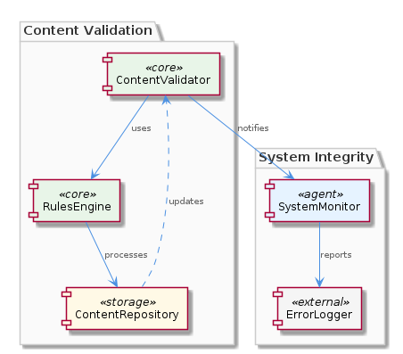
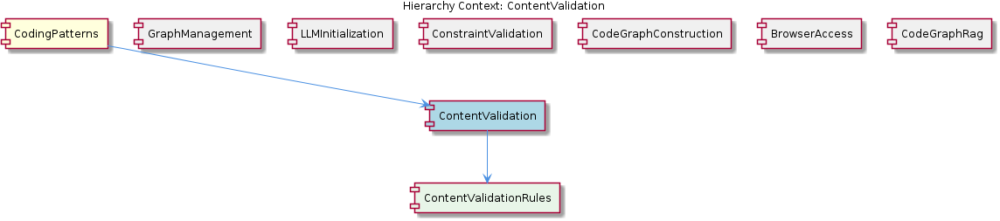

# ContentValidation

**Type:** SubComponent

ContentValidation ensures that the system operates within defined boundaries, preventing errors and inconsistencies.

## What It Is  

ContentValidation is a **sub‑component** that lives inside the **CodingPatterns** component.  Its purpose, as described in the observations, is to *validate content* using a **rules‑based approach**.  By applying explicit validation rules, the sub‑component guarantees that the system operates within defined boundaries, preventing errors and inconsistencies while allowing the broader system to handle complex content with ease.  The only concrete location that references the rules themselves is the child component **ContentValidationRules**, whose definition is documented in `integrations/mcp-constraint-monitor/docs/constraint-configuration.md`.  Because ContentValidation is part of the CodingPatterns hierarchy, it inherits the same overall architectural context (e.g., the use of `storage/graph-database-adapter.ts` for persistence in the parent component) while focusing specifically on content integrity.

## Architecture and Design  

The design of ContentValidation is anchored in a **rules‑based architecture**.  Rather than embedding ad‑hoc checks throughout the codebase, the sub‑component centralises validation logic into declarative rules that can be added, removed, or modified without touching the core validation engine.  This mirrors the approach taken by the sibling component **ConstraintValidation**, which also “uses a rules‑based approach to validate constraints, ensuring system integrity.”  The shared pattern suggests a deliberate architectural decision to treat validation concerns uniformly across the platform, promoting consistency and reusability.

Interaction-wise, ContentValidation sits under the **CodingPatterns** parent, which itself relies on the `GraphDatabaseAdapter` (found in `storage/graph-database-adapter.ts`) for persistence.  While ContentValidation does not directly manage data storage, it can leverage the parent’s persistence layer when rules need to be persisted or audited.  The **ContentValidationRules** child provides the concrete rule definitions; these are likely loaded at runtime and fed into the validation engine.  The overall flow can be visualised in the architecture diagram below:

The relationship diagram further clarifies how ContentValidation connects to its parent, siblings, and child:

### Architectural patterns identified  
* **Rules‑based validation** – centralised, declarative rule definitions that drive the validation process.  
* **Component hierarchy** – ContentValidation is a child of CodingPatterns and a parent of ContentValidationRules, reflecting a clear containment model.  

## Implementation Details  

Although the source snapshot contains **zero code symbols**, the observations give us enough to infer the implementation scaffolding:

1. **Rule definition storage** – The child component **ContentValidationRules** is documented in `integrations/mcp-constraint-monitor/docs/constraint-configuration.md`.  This markdown file likely enumerates rule identifiers, conditions, and expected outcomes in a structured format (e.g., JSON or YAML).  

2. **Validation engine** – ContentValidation probably exposes a function such as `validateContent(content: any): ValidationResult` that iterates over the loaded rules, evaluates each against the incoming content, and aggregates any violations.  Because the approach “simplifies the validation process,” the engine is expected to be lightweight, avoiding complex branching logic in favour of rule iteration.

3. **Integration with CodingPatterns** – The parent component’s reliance on `GraphDatabaseAdapter` suggests that validation results or rule sets could be persisted for audit trails.  For example, after a successful validation, the system might call `GraphDatabaseAdapter.saveValidationResult(result)` to store the outcome in the graph database.

4. **Error handling** – The observations stress “preventing errors and inconsistencies,” implying that the validation engine throws or returns detailed error objects that pinpoint exactly which rule failed and why, enabling downstream components to react appropriately.

## Integration Points  

ContentValidation interacts with several parts of the system:

* **Parent – CodingPatterns** – As a child, it inherits the parent’s configuration and can utilise the `GraphDatabaseAdapter` for persisting rule sets or validation logs.  The parent’s broader responsibilities (e.g., pattern generation) are safeguarded by ensuring that any generated content first passes through ContentValidation.

* **Sibling – ConstraintValidation** – Both components share the same rules‑based philosophy.  It is plausible that they reuse a common rule‑loading utility or share a base `Validator` class, reducing duplication.

* **Sibling – GraphManagement, LLMInitialization, CodeGraphConstruction, BrowserAccess, CodeGraphRag** – While these siblings address different concerns (graph storage, lazy LLM loading, graph construction, UI access, retrieval‑augmented generation), they all depend on the system’s integrity.  ContentValidation therefore acts as a gatekeeper before data flows into these modules, ensuring that only well‑formed content reaches the graph layer or LLM pipelines.

* **Child – ContentValidationRules** – The rule definitions are the primary data source for the validator.  Any change to `integrations/mcp-constraint-monitor/docs/constraint-configuration.md` directly influences validation behaviour, making this file a critical integration point.

## Usage Guidelines  

1. **Define rules declaratively** – All validation logic should be expressed in the `constraint-configuration.md` file under the **ContentValidationRules** directory.  Stick to the existing schema (e.g., rule ID, condition, severity) to guarantee that the validator can parse them correctly.

2. **Invoke validation early** – Call the ContentValidation API as soon as content is produced or received, before it is handed to downstream components such as **GraphManagement** or **LLMInitialization**.  Early validation reduces the risk of propagating malformed data.

3. **Handle validation results explicitly** – The validator returns a `ValidationResult` that includes a list of failed rules.  Consumers must check this result and either reject the content or perform corrective actions.  Ignoring the result defeats the purpose of the rules‑based approach.

4. **Persist audit trails when needed** – If traceability is required (e.g., for compliance), forward the validation result to the `GraphDatabaseAdapter` for storage.  This leverages the parent component’s persistence strategy without adding new storage mechanisms.

5. **Keep rule sets versioned** – Because the rules live in a markdown file, treat the file as version‑controlled artefact.  Any change should be reviewed and tested to avoid unintentionally breaking existing workflows.

---

### Design decisions and trade‑offs  

* **Centralised rules vs. scattered checks** – Centralising validation into rules simplifies maintenance and onboarding but adds a dependency on the rule‑loading mechanism.  If rule parsing fails, the entire validator could become inoperable.  
* **Lightweight engine** – By avoiding heavy frameworks, the validator remains fast, which is essential for real‑time content pipelines.  The trade‑off is that complex validation logic may require more expressive rule definitions or auxiliary code.  

### System structure insights  

The hierarchy (CodingPatterns → ContentValidation → ContentValidationRules) demonstrates a clear separation of concerns: the parent orchestrates overall pattern logic, the sub‑component enforces integrity, and the child supplies the declarative policies.  Sibling components follow similar patterns, indicating a cohesive architectural language across the codebase.

### Scalability considerations  

Because validation is rule‑driven, scaling horizontally is straightforward: each instance can load the same rule set and validate content independently.  The primary bottleneck would be rule‑loading I/O; caching the parsed rule set in memory mitigates this.  Persisting results via the shared `GraphDatabaseAdapter` also scales with the graph database’s capacity.

### Maintainability assessment  

The rules‑based design enhances maintainability: updates to validation logic are confined to the markdown rule file, eliminating the need to modify source code.  However, the lack of explicit code symbols in the current snapshot suggests that developers must rely on documentation and the rule file to understand behaviour.  Adding a thin wrapper class (e.g., `ContentValidator`) with well‑named methods would further improve discoverability and IDE support.

## Hierarchy Context

### Parent
- [CodingPatterns](./CodingPatterns.md) -- [LLM] The CodingPatterns component utilizes the GraphDatabaseAdapter class in storage/graph-database-adapter.ts for persistence, allowing for automatic JSON export sync. This design decision enables seamless data synchronization and provides a robust foundation for the project's data management. The GraphDatabaseAdapter class is responsible for handling graph data storage and retrieval, making it a critical component of the project's architecture. By using this adapter, the CodingPatterns component can focus on its primary functionality, leaving data management to the GraphDatabaseAdapter.

### Children
- [ContentValidationRules](./ContentValidationRules.md) -- The integrations/mcp-constraint-monitor/docs/constraint-configuration.md file suggests that constraint configuration is a key aspect of content validation, implying the presence of rules-based validation.

### Siblings
- [GraphManagement](./GraphManagement.md) -- GraphDatabaseAdapter handles graph data storage and retrieval, making it a critical component of the project's architecture.
- [LLMInitialization](./LLMInitialization.md) -- LLMInitialization uses a lazy loading approach to initialize LLM agents, reducing computational overhead.
- [ConstraintValidation](./ConstraintValidation.md) -- ConstraintValidation uses a rules-based approach to validate constraints, ensuring system integrity.
- [CodeGraphConstruction](./CodeGraphConstruction.md) -- CodeGraphConstruction uses a graph-based approach to construct code graphs, enabling efficient data management.
- [BrowserAccess](./BrowserAccess.md) -- BrowserAccess uses a browser-based approach to provide access to web-based interfaces.
- [CodeGraphRag](./CodeGraphRag.md) -- CodeGraphRag uses a graph-based approach to analyze code, providing a robust foundation for the project's functionality.

---

*Generated from 6 observations*
