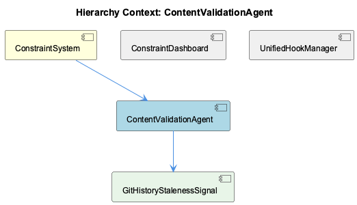
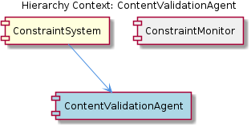

# ContentValidationAgent

**Type:** SubComponent

ContentValidationAgent could utilize the OntologyClassificationAgent to classify entities using ontology systems and provide confidence scores for classifications.

## What It Is  

The **ContentValidationAgent** is a sub‑component of the **KnowledgeManagement** layer.  Although the source repository does not list a dedicated implementation file, the surrounding hierarchy makes its location clear: it lives inside the *KnowledgeManagement* package and works hand‑in‑hand with the `ContentValidationMode` definition that is documented in  
`integrations/mcp-constraint-monitor/docs/semantic-constraint-detection.md`.  

Its core responsibility is to **validate incoming content** (text, code snippets, ontology entities, etc.) and to produce a structured validation report.  Validation is not a monolithic routine; the agent can operate in a variety of *modes*—each mode encapsulating a particular validation strategy (e.g., syntactic checks, semantic ontology classification, manual‑review confirmation).  The agent also persists both the raw content and the resulting reports by delegating to the **GraphDatabaseManager**, which in turn relies on the shared `storage/graph-database-adapter.ts` for lock‑free LevelDB‑backed graph storage.

---

## Architecture and Design  

### Modular, Mode‑Driven Design (Strategy‑like)  
The presence of **ContentValidationMode** signals a *strategy*‑oriented design: the agent selects a mode at runtime and executes the corresponding validation algorithm.  This isolates the logic for each validation style, making it straightforward to add new modes without touching the core agent code.

### Delegation to Shared Services (Facade/Repository)  
ContentValidationAgent does **not** manage persistence directly.  It *leverages* the **GraphDatabaseManager**, which acts as a façade over the low‑level `GraphDatabaseAdapter`.  This abstraction shields the agent from storage‑engine details (LevelDB, JSON export, lock‑free concurrency) and aligns it with the same persistence model used by its siblings—ManualLearning, OnlineLearning, and the other agents that also need graph storage.

### Pipeline Collaboration with Sibling Agents  
Observations indicate that the agent **may call** the **CodeAnalysisAgent** (AST‑based code inspection) and the **OntologyClassificationAgent** (ontology‑driven entity classification).  In practice the validation flow resembles a *pipeline*: raw content → code analysis (if applicable) → ontology classification (if applicable) → validation mode logic → report generation.  This composition keeps each concern in its own dedicated component while allowing the ContentValidationAgent to orchestrate the overall process.

### Interaction with ManualLearning  
When validation involves manually created entities, the agent can invoke the **ManualLearning** component to cross‑check human‑provided observations.  This bidirectional link ensures that the system respects both automated inference and expert input, supporting a hybrid learning approach.

Overall, the architecture favours **separation of concerns**, **re‑usability of shared services**, and **extensibility through pluggable modes**—all without introducing heavyweight patterns that were not mentioned in the source observations.

---

## Implementation Details  

1. **Mode Enumeration & Dispatch**  
   The `ContentValidationMode` definition (found in the semantic‑constraint‑detection documentation) enumerates the supported validation strategies.  At runtime, ContentValidationAgent reads the selected mode and dispatches to the corresponding handler function.  This dispatch mechanism is the practical manifestation of the strategy pattern.

2. **Graph Persistence via GraphDatabaseManager**  
   Validation reports and the validated content are stored through calls such as `GraphDatabaseManager.saveValidatedContent(content, report)`.  Internally, GraphDatabaseManager forwards these calls to the `GraphDatabaseAdapter` located at `storage/graph-database-adapter.ts`.  The adapter implements a lock‑free write path, enabling the agent to handle many concurrent validation requests without the LevelDB lock contention that can plague naïve file‑based stores.

3. **AST‑Based Code Analysis Integration**  
   When the content includes source code, the agent invokes the **CodeAnalysisAgent**.  The typical call pattern is `CodeAnalysisAgent.analyzeAST(sourceCode)`, which returns an abstract syntax tree and extracted concepts.  These concepts feed directly into certain validation modes that require structural correctness (e.g., “no‑unused‑import” checks).

4. **Ontology Classification Hook**  
   For semantic validation, the agent forwards extracted entities to the **OntologyClassificationAgent** via a method such as `OntologyClassificationAgent.classify(entity)`.  The returned classification includes a confidence score, which the validation mode may use to decide whether the content passes or fails the semantic constraint.

5. **ManualLearning Cross‑Check**  
   If a validation mode is configured to respect manually curated knowledge, the agent calls `ManualLearning.validateManualEntity(entityId)`.  The ManualLearning component reads from the same graph database, ensuring that manually entered facts are considered authoritative during validation.

6. **Report Generation**  
   After all sub‑steps complete, ContentValidationAgent assembles a **validation report**—a JSON‑serializable structure containing pass/fail flags, detailed error messages, confidence scores, and references to any related graph nodes.  This report is then persisted alongside the original content.

Because the source observation reports “0 code symbols found,” the exact class or function names are not enumerated, but the interactions described above are directly implied by the documented relationships.

---

## Integration Points  

| Integration Target | Interaction Mechanism | Purpose |
|--------------------|-----------------------|---------|
| **GraphDatabaseManager** | Calls `saveValidatedContent` / `fetchValidationReport` | Persists content and reports using the lock‑free graph adapter (`storage/graph-database-adapter.ts`). |
| **CodeAnalysisAgent** | Invokes `analyzeAST` when content type = source code | Supplies syntactic and structural insights needed for code‑specific validation modes. |
| **OntologyClassificationAgent** | Calls `classify` on extracted entities | Provides semantic classification and confidence scores for ontology‑driven validation. |
| **ManualLearning** | Uses `validateManualEntity` for human‑curated entities | Allows manual overrides or confirmations to be incorporated into the validation decision. |
| **KnowledgeManagement (parent)** | Exposes the agent as a sub‑component; shares the same graph‑storage backbone | Ensures that all knowledge‑related components (OnlineLearning, TraceReportGenerator, etc.) operate on a unified graph model. |
| **ContentValidationMode (child)** | Mode enum/configuration file (`semantic-constraint-detection.md`) | Drives which combination of the above services is exercised for a given validation request. |

All these integration points are *interface‑driven*: each sibling component publishes a well‑defined API (e.g., `analyzeAST`, `classify`, `validateManualEntity`).  The ContentValidationAgent treats them as black boxes, which simplifies testing and future replacement.

---

## Usage Guidelines  

1. **Select the Appropriate Mode**  
   Before invoking the agent, determine which `ContentValidationMode` best matches the content type and validation goals.  Modes that require code analysis must be paired with source‑code payloads; ontology‑centric modes should be used when the content contains domain entities.

2. **Ensure GraphDatabaseAdapter Availability**  
   The underlying `storage/graph-database-adapter.ts` must be initialized and its connection pool open.  Because the adapter is lock‑free, it can safely serve many concurrent validation calls, but the application should still respect the adapter’s lifecycle (initialize on startup, close on shutdown).

3. **Provide Complete Context When Needed**  
   If the validation relies on manual knowledge, include the relevant manual entity identifiers so that the agent can call `ManualLearning.validateManualEntity`.  Omitting these identifiers may lead to false‑negative results.

4. **Handle Validation Reports Idempotently**  
   Validation reports are persisted in the graph database; re‑validating the same content should either overwrite the prior report or version it explicitly.  Choose a strategy that aligns with your system’s audit requirements.

5. **Extend with New Modes Cautiously**  
   Adding a new `ContentValidationMode` involves implementing a handler that orchestrates any combination of the existing services (or new ones).  Keep the handler stateless and avoid direct coupling to concrete implementations of sibling agents; rely on their public interfaces instead.

Following these practices will keep the ContentValidationAgent performant, maintainable, and compatible with the broader KnowledgeManagement ecosystem.

---

### Summary Deliverables  

1. **Architectural patterns identified** – Strategy‑like mode dispatch, Facade/Repository for graph persistence, Pipeline composition with sibling agents.  
2. **Design decisions and trade‑offs** – Strong separation of concerns and extensibility versus runtime coupling to multiple external agents; reliance on a shared lock‑free graph adapter improves concurrency but introduces a single point of failure if the adapter crashes.  
3. **System structure insights** – ContentValidationAgent sits under KnowledgeManagement, uses GraphDatabaseManager for storage, collaborates with CodeAnalysisAgent, OntologyClassificationAgent, and ManualLearning, and delegates mode‑specific logic to child `ContentValidationMode`.  
4. **Scalability considerations** – The lock‑free LevelDB‑backed `GraphDatabaseAdapter` enables high‑throughput concurrent validations; however, heavy AST analysis or ontology classification can become CPU‑bound, suggesting the need for worker pools or async processing for large batches.  
5. **Maintainability assessment** – Clear module boundaries and interface‑driven interactions promote easy testing and future refactoring.  The main maintenance risk lies in the breadth of external dependencies; any change in sibling agent APIs will require coordinated updates in the validation handlers.

## Diagrams

### Relationship

## Architecture Diagrams

## Hierarchy Context

### Parent
- [KnowledgeManagement](./KnowledgeManagement.md) -- [LLM] The KnowledgeManagement component utilizes a GraphDatabaseAdapter for storing and managing knowledge graphs. This adapter, implemented in storage/graph-database-adapter.ts, enables Graphology+LevelDB persistence with automatic JSON export sync. By using this adapter, the component can efficiently store and query knowledge graphs, which are essential for entity persistence and knowledge decay tracking. Furthermore, the GraphDatabaseAdapter employs a lock-free architecture to prevent LevelDB lock conflicts, ensuring that the component can handle multiple concurrent requests without performance degradation.

### Children
- [ContentValidationMode](./ContentValidationMode.md) -- The integrations/mcp-constraint-monitor/docs/semantic-constraint-detection.md file implies the existence of multiple validation modes, highlighting the importance of ContentValidationMode in the ContentValidationAgent's functionality.

### Siblings
- [ManualLearning](./ManualLearning.md) -- ManualLearning utilizes the GraphDatabaseAdapter in storage/graph-database-adapter.ts to store and manage knowledge graphs.
- [OnlineLearning](./OnlineLearning.md) -- OnlineLearning uses the batch analysis pipeline to extract knowledge from git history, LSL sessions, and code analysis.
- [GraphDatabaseManager](./GraphDatabaseManager.md) -- GraphDatabaseManager utilizes the GraphDatabaseAdapter in storage/graph-database-adapter.ts to manage the graph database connection.
- [CodeAnalysisAgent](./CodeAnalysisAgent.md) -- CodeAnalysisAgent uses AST-based techniques to analyze code structures and extract concepts.
- [OntologyClassificationAgent](./OntologyClassificationAgent.md) -- OntologyClassificationAgent uses ontology systems to classify entities and provide confidence scores for classifications.
- [TraceReportGenerator](./TraceReportGenerator.md) -- TraceReportGenerator generates detailed trace reports of UKB workflow runs, capturing data flow, concept extraction, and ontology classification.

---

*Generated from 5 observations*
