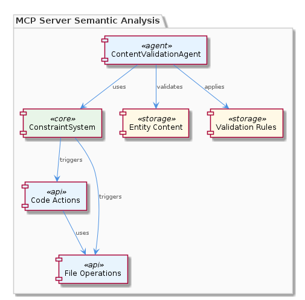

# ContentValidationAgent

**Type:** SubComponent

ContentValidationAgent follows a specific pattern, executing a validation function with input and context as parameters, similar to the execute(input, context) pattern used in the ConstraintMonitor sub-component.

## What It Is  

The **ContentValidationAgent** is a sub‑component that lives in the file  
`integrations/mcp-server-semantic-analysis/src/agents/content-validation-agent.ts`.  
Its sole responsibility is to validate the *content* of entities—such as code actions and file operations—against a set of rules that have been configured for the system. By doing so it provides a uniform enforcement point for the **ConstraintSystem**, ensuring that every modification performed during a Claude Code session respects the predefined constraints. The agent is therefore a key pillar in the overall constraint‑enforcement pipeline, sitting directly under the parent **ConstraintSystem** component and working alongside its sibling, **ConstraintMonitor**, which follows a very similar execution model.

## Architecture and Design  

The design of the ContentValidationAgent is deliberately lightweight and follows the **execute‑input‑context** pattern that is also used by the sibling ConstraintMonitor. In practice the agent exposes a single entry point—conceptually `execute(input, context)`—that receives the data to be validated together with any contextual information required for rule evaluation. This pattern creates a **standardized validation contract** across the ConstraintSystem, allowing different agents to be swapped or extended without changing the surrounding orchestration logic.

The agent is part of a **rule‑driven validation layer**. Rules are configured elsewhere in the system (the observations do not specify the exact location) and are applied by the agent’s internal validation function. The function iterates over these rules, checking the incoming entity content for compliance. Because the validation logic is encapsulated in a single function, the agent can be treated as a **pure function** from the perspective of the ConstraintSystem—no side effects other than reporting validation outcomes are introduced.  

  

This architectural choice promotes **decoupling**: the ConstraintSystem does not need to know the internals of how validation is performed, only that the agent will return a pass/fail (or detailed error) result. The similarity to ConstraintMonitor also means that both agents can be orchestrated using the same dispatcher or pipeline, simplifying the overall system design.

## Implementation Details  

The concrete implementation resides in `content-validation-agent.ts`. While the source snapshot does not list individual symbols, the observations make clear that the file defines **a validation function** that receives two parameters—`input` (the entity content to be checked) and `context` (metadata such as the current session, user permissions, or rule set version). Inside this function the following steps are performed:

1. **Rule Retrieval** – The function accesses the configured validation rules, likely via a configuration service or a static definition bundled with the agent.  
2. **Content Inspection** – The incoming `input` is examined; for code actions this might involve parsing AST nodes, while for file operations it could be a diff or file metadata.  
3. **Rule Application** – Each rule is applied in turn. The rules are expressed as predicates that return true when the content complies, or produce a descriptive violation object when it does not.  
4. **Result Aggregation** – All violations are collected and returned to the caller, enabling the ConstraintSystem to either block the operation or surface the issues to the user.

Because the agent follows the same **execute(input, context)** signature as ConstraintMonitor, the implementation likely reuses shared utility modules for logging, error handling, and rule loading, though those details are not enumerated in the observations.

## Integration Points  

ContentValidationAgent is tightly integrated with the **ConstraintSystem**. The parent component invokes the agent whenever an entity that could affect system state is about to be persisted or executed. The agent’s output feeds directly into the ConstraintSystem’s decision‑making flow: a successful validation permits the operation to continue, while any violations cause the system to reject the action or request remediation.

The agent also shares an execution contract with its sibling **ConstraintMonitor**, meaning that both can be registered with a common dispatcher inside the ConstraintSystem. This dispatcher abstracts the concrete agent implementations, passing the same `input` and `context` structures to whichever validation routine is appropriate.  

  

Other integration points, inferred from the observations, include:

* **Code Actions** – The agent validates the content generated by Claude Code before it is applied to the repository.  
* **File Operations** – When files are created, modified, or deleted, the agent checks the operation against the rule set.  

No child components are mentioned; the agent appears to be a leaf node in the ConstraintSystem hierarchy.

## Usage Guidelines  

Developers should treat the ContentValidationAgent as a **black‑box validator** that must be invoked via its `execute(input, context)` interface. The `input` payload should be a fully‑formed representation of the entity (e.g., a code‑action object or a file‑operation descriptor), and the `context` should contain any metadata required for rule evaluation, such as the current user’s role or the active rule version.  

When adding new validation rules, place them in the configuration location consumed by the agent rather than modifying the agent’s code. This preserves the separation of concerns and allows rule changes to be hot‑reloaded without redeploying the agent.  

Because the agent follows the same pattern as ConstraintMonitor, any tooling or middleware that intercepts `execute` calls (e.g., logging, tracing, or performance monitoring) can be applied uniformly to both agents.  

Finally, ensure that any failure returned by the agent is handled gracefully by the ConstraintSystem—either by presenting a clear error to the user or by rolling back the pending operation. Ignoring validation results would defeat the purpose of the constraint enforcement layer.

---

### Summary of Key Insights  

1. **Architectural patterns identified** – Execute‑input‑context contract, rule‑driven validation layer, pure‑function style agent, shared dispatcher pattern with sibling agents.  
2. **Design decisions and trade‑offs** – Centralizing validation in a single function simplifies enforcement and testing but couples rule configuration tightly to the agent; using the same pattern as ConstraintMonitor reduces duplication but may limit flexibility if future agents need richer interfaces.  
3. **System structure insights** – ContentValidationAgent is a leaf node under ConstraintSystem, sibling to ConstraintMonitor, and acts as the enforcement gate for code actions and file operations. The architecture promotes decoupling through a common execution contract.  
4. **Scalability considerations** – Because validation is performed synchronously via a single function, the agent can become a bottleneck under high‑throughput workloads. Scaling can be achieved by parallelizing rule evaluation or by sharding rule sets across multiple agent instances, provided the dispatcher supports concurrent execution.  
5. **Maintainability assessment** – The clear separation of rule configuration from validation logic, combined with the uniform execute pattern, yields high maintainability. Adding or updating rules does not require code changes, and the agent’s isolated location (`content-validation-agent.ts`) makes it easy to locate and test. The main risk is the lack of visible modularization within the file (no symbols reported), so future refactoring should introduce explicit classes or interfaces to improve readability.

## Hierarchy Context

### Parent
- [ConstraintSystem](./ConstraintSystem.md) -- [LLM] The ConstraintSystem component utilizes the ContentValidationAgent, which is implemented in the content-validation-agent.ts file, to validate entity content against configured rules. This agent is responsible for ensuring that the code actions and file operations performed during a Claude Code session comply with the predefined constraints. The ContentValidationAgent follows a specific pattern, where it executes a validation function with the input and context as parameters, similar to the execute(input, context) pattern used in the ConstraintMonitor sub-component. This pattern allows for a standardized way of validating constraints across different components of the system. The content-validation-agent.ts file is located in the integrations/mcp-server-semantic-analysis/src/agents directory.

### Siblings
- [ConstraintMonitor](./ConstraintMonitor.md) -- The ConstraintMonitor uses an execute(input, context) pattern to validate constraints, similar to the pattern used by the ContentValidationAgent.

---

*Generated from 5 observations*
