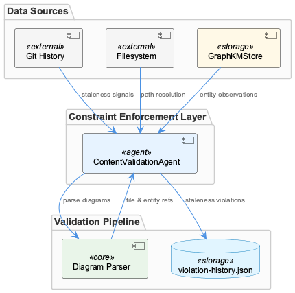

# ContentValidationAgent

**Type:** SubComponent

As documented in docs/constraints/README.md, ContentValidationAgent is part of the constraint enforcement layer, meaning staleness violations it detects feed into the same violation-history.json pipeline as hook-based violations

# ContentValidationAgent — Technical Insight Document

## What It Is

ContentValidationAgent is a SubComponent of the ConstraintSystem responsible for validating the semantic integrity of recorded knowledge against the live state of the repository. Rather than intercepting tool calls at runtime (the role of its sibling UnifiedHookManager), ContentValidationAgent operates as a retrospective auditor: it interrogates the graph-based memory store and checks whether what was previously observed and recorded still accurately reflects the current codebase.

Its operational scope is defined in `docs/constraints/README.md`, which places it explicitly within the constraint enforcement layer. This means ContentValidationAgent is not an isolated utility — its findings are first-class violations that flow into the same `.mcp-sync/violation-history.json` pipeline that ConstraintDashboard reads for historical analysis and reporting.

The agent works against entity observations stored in the GraphKMStore architecture (documented in `docs/architecture/memory-systems.md`), meaning it validates *graph nodes* — structured records about files, components, and their relationships — rather than directly scanning raw source files. This design decision is significant: ContentValidationAgent is a second-order validator, checking the health of the knowledge layer itself.

## Architecture and Design

ContentValidationAgent embodies a two-pronged validation strategy. The first prong is temporal: through its child component GitHistoryStalenessSignal, it uses git commit history as a staleness <COMPANY_NAME_REDACTED>. The second prong is structural: it performs file reference extraction from diagrams and observations, resolving those references against the actual filesystem to detect broken links caused by file deletions or moves.

The key architectural decision here is the separation of *when* something changed (git history, delegated to GitHistoryStalenessSignal) from *whether* something still exists (filesystem resolution, handled at the ContentValidationAgent level). This decomposition means staleness detection is version-control-aware, not merely timestamp-based — a file that was touched in a significant commit carries more weight as a staleness trigger than one that was incidentally modified.

The choice to validate graph nodes rather than raw source files reflects a clean layering principle: ContentValidationAgent assumes the GraphKMStore is the authoritative record of what the agent "knows," and its job is to ensure that record remains trustworthy. This makes ContentValidationAgent a guardian of the knowledge graph's fidelity rather than a linter of source code.

The integration with the violation pipeline shared by the hook-based ConstraintSystem (UnifiedHookManager feeding into `violation-history.json`) is a deliberate unification of two otherwise separate validation modes — live interception and retrospective audit — under a single observability surface. ConstraintDashboard therefore presents a unified view of both real-time constraint violations and stale-knowledge violations without needing to distinguish their source.

## Implementation Details

ContentValidationAgent contains GitHistoryStalenessSignal as a dedicated child responsible for the git-history comparison step. As described in `docs/constraints/constraint-monitoring-system.md`, GitHistoryStalenessSignal compares the timestamps or commit ancestry of recorded entity observations against recent commits affecting the corresponding files. Observations that predate significant file changes are flagged as potentially stale — the implication being that whatever was recorded about a file may no longer reflect its current structure or behavior.

The file reference extraction capability is the second major implementation concern. ContentValidationAgent can parse structured diagram formats — the observations point to Mermaid or similar syntaxes — to extract embedded file paths and entity references. These extracted references are then resolved against the live filesystem. A reference that no longer resolves (because the file was deleted, renamed, or moved) becomes a structural violation. This means ContentValidationAgent must maintain logic for both diagram parsing and path resolution, making it one of the more complex agents in the system despite having no direct code symbols currently indexed.

The output of both validation paths — staleness flags from GitHistoryStalenessSignal and broken-reference flags from diagram/observation parsing — is formatted as violations compatible with `.mcp-sync/violation-history.json`. This shared schema is the integration contract that connects ContentValidationAgent to the rest of the ConstraintSystem.

## Integration Points

ContentValidationAgent sits within ConstraintSystem alongside UnifiedHookManager and ConstraintDashboard, but its integration mode is distinct from both siblings. UnifiedHookManager operates synchronously on tool events via `lib/agent-api/hooks/hook-manager.js`; ContentValidationAgent operates asynchronously or on-demand against the knowledge graph. ConstraintDashboard consumes the shared violation history that ContentValidationAgent populates, making ConstraintDashboard the downstream consumer of ContentValidationAgent's findings.

The dependency on GraphKMStore (per `docs/architecture/memory-systems.md`) means ContentValidationAgent is tightly coupled to the memory system's node structure. Any changes to how entity observations are recorded in the graph — their schema, identifiers, or file reference format — will directly affect ContentValidationAgent's ability to extract and validate references. This is a meaningful architectural coupling to track.

The git history dependency introduces an external integration point: ContentValidationAgent (via GitHistoryStalenessSignal) must have access to the repository's git log, meaning it implicitly requires execution in an environment where the `.git` directory is accessible and git commands can be run or their output parsed.

## Usage Guidelines

Developers working with or extending ContentValidationAgent should treat the `violation-history.json` schema as a strict contract. Violations emitted by ContentValidationAgent must be structurally identical to those produced by hook-based mechanisms, since ConstraintDashboard does not distinguish between sources. Any new validation check added to ContentValidationAgent must produce output conforming to this shared schema.

When interpreting staleness signals, it is important to understand that GitHistoryStalenessSignal flags observations that *predate significant file changes* — not all file changes. The definition of "significant" is a design parameter documented in `docs/constraints/README.md` and `docs/constraints/constraint-monitoring-system.md`. Developers tuning the system should revisit that definition before adjusting sensitivity thresholds, as overly aggressive staleness flagging will pollute the violation history with false positives visible in ConstraintDashboard.

For diagram validation to function correctly, diagrams embedded in observations or documentation must use a format ContentValidationAgent can parse (currently indicated to be Mermaid or similar structured syntax). Ad-hoc or image-only diagrams will be invisible to the file reference extraction step, creating a blind spot in structural validation. Teams should standardize on parseable diagram formats for any documentation that includes file or entity references intended to be kept current.

Finally, because ContentValidationAgent validates graph nodes rather than source files directly, its accuracy is bounded by the <USER_ID_REDACTED> of the GraphKMStore's recorded observations. If observations are incomplete, coarsely granular, or recorded infrequently, ContentValidationAgent's staleness and reference checks will only be as reliable as that underlying data. Keeping the knowledge graph well-maintained is a prerequisite for ContentValidationAgent to provide meaningful signal.

## Hierarchy Context

### Parent
- [ConstraintSystem](./ConstraintSystem.md) -- The ConstraintSystem is a multi-layered enforcement framework that validates code actions and file operations during Claude Code sessions. It operates through a hook-based architecture where the UnifiedHookManager (lib/agent-api/hooks/hook-manager.js) intercepts agent tool events (pre-tool, post-tool, etc.) and routes them through registered handlers loaded from user-level (~/.coding-tools/hooks.json) and project-level (.coding/hooks.json) configuration files. Violations detected during these checks are captured, persisted, and surfaced through a dashboard for monitoring.

### Children
- [GitHistoryStalenessSignal](./GitHistoryStalenessSignal.md) -- Described in the ContentValidationAgent sub-component context as comparing recorded entity observations against recent commits to flag observations that predate significant file changes, per docs/constraints/README.md and docs/constraints/constraint-monitoring-system.md documentation context.

### Siblings
- [ConstraintDashboard](./ConstraintDashboard.md) -- ConstraintDashboard reads violation data from .mcp-sync/violation-history.json, a shared sync file that persists violations across Claude Code sessions for historical analysis
- [UnifiedHookManager](./UnifiedHookManager.md) -- UnifiedHookManager lives at lib/agent-api/hooks/hook-manager.js and serves as the single interception point for all agent tool lifecycle events in the ConstraintSystem

---

*Generated from 5 observations*
