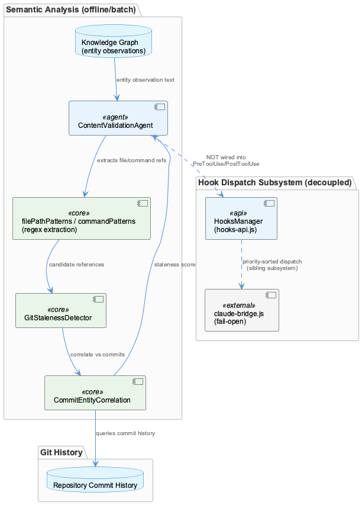
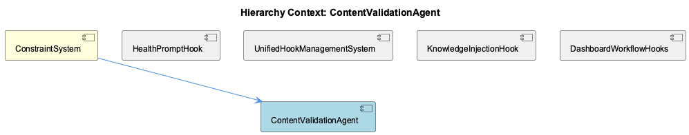

# ContentValidationAgent

**Type:** SubComponent

[Architecture Notes] Parallel, non-inheriting implementations: HooksManager (hooks-api.js, abstract) and UnifiedHookManager (hook-manager.js, concrete) duplicate registration/priority-sort/dispatch logic instead of one extending the other; Event-name translation tables are triplicated across hooks-api.js (EVENT_MAPPINGS), claude-bridge.js (EVENT_MAP), and migration-tool.js (CLAUDE_EVENT_MAP/COPILOT_EVENT_MAP); Loose coupling between the dashboard's polling infrastructure (usePolledFetch.ts) and the constraint/hook enforcement pipeline — no shared code path in the files examined; Config precedence is explicit and ordered: user config loaded first, then project config, in UnifiedHookManager.initialize(); Bridge scripts (claude-bridge.js) are the sole integration seam between an agent's native hook system and the internal UnifiedHookManager, keeping agent-specific I/O (stdin JSON, stdout JSON) isolated from core dispatch logic

# ContentValidationAgent — Technical Insight Document

## What It Is

ContentValidationAgent is a SubComponent of the ConstraintSystem, operating within the same hook-enforcement pipeline whose infrastructure is spread across `lib/agent-api/hooks-api.js`, `lib/agent-api/hooks/hook-manager.js`, `lib/agent-api/hooks/claude-bridge.js`, and `lib/agent-api/hooks/migration-tool.js`. Although no direct code symbols for ContentValidationAgent itself appear in the observations, its architectural context is fully defined by its siblings — `HookConfigLoader`, `UnifiedHookManager`, `ViolationCaptureService`, `KnowledgeInjectionHooks`, and `HealthPromptHook` — all of which plug into the same registry-based hook dispatch system. As a content-validation participant in this system, it would register handlers against the `Map<event, Handler[]>` structures maintained by `UnifiedHookManager`, subject to the same enabled/agents filtering and priority ordering that governs every other hook consumer in ConstraintSystem.

## Architecture and Design

The broader system this component lives in is built on a Registry/Dispatcher pattern: both the abstract `HooksManager` (hooks-api.js) and the concrete `UnifiedHookManager` (hook-manager.js) independently maintain per-event handler arrays sorted by numeric priority. Notably, these two managers are **parallel, non-inheriting implementations** — `HooksManager` appears designed as a generic base class, but `UnifiedHookManager` re-implements registration, priority-sorting, and dispatch logic from scratch rather than extending it. Any validation agent built against one manager's semantics needs to be aware this duplication exists and could diverge over time.

A second pervasive pattern is fail-open error handling: `claude-bridge.js`'s `main()` wraps all hook execution in try/catch and always emits `{decision: 'allow', ...}` with `process.exit(0)`, regardless of internal failure. `UnifiedHookManager.executeHooks()` reinforces this with a default `stopOnError: false`, swallowing thrown handler errors into a `messages` array instead of halting evaluation. ContentValidationAgent, as a hook consumer, inherits this philosophy: a validation failure inside its logic is unlikely to block the Claude Code tool pipeline unless `stopOnError` is explicitly configured otherwise — a design bias toward availability over strict enforcement, mirrored in the parent ConstraintSystem's lenient `HookConfigLoader.validateConfig()` behavior.

Configuration flows through the same two-tier layered merge documented for ConstraintSystem: user-level `~/.coding-tools/hooks.json` loaded first, then project-level `.coding/hooks.json` applied on top via `UnifiedHookManager.initialize()`. Any content-validation rules would follow this same precedence — organization-wide validation policy set globally, with individual projects able to loosen or tighten specific checks.

## Implementation Details

Handler registration mechanics are shared infrastructure: `HooksManager.registerHook()` (hooks-api.js:150-183) sorts by priority on every call and falls back to a `Date.now()`-based ID when none is supplied, while `UnifiedHookManager.registerHandler()` (hook-manager.js:129-161) additionally performs duplicate-ID replacement — an idempotent upsert — before re-sorting. `executeHooks()` (hook-manager.js:163-232) applies two independent gates before invoking any handler: an `enabled` flag and an `agents` allow-list check (`handler.agents.includes(fullContext.agentType)`). For ContentValidationAgent, this means its validation rules can be scoped to specific agent types (e.g., only firing for `claude`, not `copilot`) and toggled on/off without removing registration entirely.

Event-name translation is a recurring implementation concern: `EVENT_MAPPINGS` in hooks-api.js, `EVENT_MAP` in claude-bridge.js, and `CLAUDE_EVENT_MAP`/`COPILOT_EVENT_MAP` in migration-tool.js (lines 88-101) all encode overlapping Claude-native-to-unified event translations (e.g., `PreToolUse` → `pre-tool`). Any content-validation event type introduced must be reflected across all three tables to remain consistent through both live dispatch and migration tooling.

## Integration Points

ContentValidationAgent's primary integration surface is the `UnifiedHookManager` registry, shared with siblings `ViolationCaptureService`, `KnowledgeInjectionHooks`, and `HealthPromptHook`. Its behavior is gated by the same `HookConfigLoader`-driven merged configuration that governs the rest of ConstraintSystem. Where agent-native tools (like Claude Code) invoke hooks, `claude-bridge.js` acts as the sole translation seam (claude-bridge.js:128-153), isolating stdin/stdout JSON handling from core dispatch — meaning ContentValidationAgent never talks directly to Claude's native I/O.

Notably, the observations flag `usePolledFetch.ts` (integrations/system-health-dashboard) as architecturally unrelated to this hook pipeline — a dashboard-side polling hook with no shared code path — confirming that ContentValidationAgent's integration boundary is strictly the enforcement/constraint side of the system, not the observability dashboard.

## Usage Guidelines

Developers extending ContentValidationAgent should register handlers through `UnifiedHookManager` rather than the legacy `HooksManager`, given the latter's uncertain maintenance status and the duplicated logic between the two. Use the `agents` allow-list and `enabled` flag to scope validation rules precisely, and be deliberate about `stopOnError` — leaving it at its default `false` means validation errors are recorded but do not block tool execution, consistent with the system's fail-open bias. When introducing new validation event types, update all three event-mapping tables (hooks-api.js, claude-bridge.js, migration-tool.js) in lockstep to avoid silent divergence. Finally, respect the two-tier config precedence: project-level `.coding/hooks.json` overrides user-level `~/.coding-tools/hooks.json`, so validation rule changes intended to be global should go in the user config, while project-specific tightening/loosening belongs in the project file.

## Hierarchy Context

### Parent
- [ConstraintSystem](./ConstraintSystem.md) -- [LLM] The ConstraintSystem's configuration architecture follows a strict two-tier layered merge pattern implemented in HookConfigLoader (lib/agent-api/hooks/hook-config.js). User-level configuration lives at ~/.coding-tools/hooks.json and represents global defaults applicable across all projects, while project-level configuration at .coding/hooks.json can override specific handlers or add project-specific constraints. The mergeConfigs() function performs this layering, meaning a new developer modifying constraint behavior needs to understand which file actually takes effect at runtime — project config wins on key collisions, but non-overlapping keys from both sources are preserved. This design allows teams to ship organization-wide constraints via user config while individual projects retain the ability to loosen or tighten specific rules without forking the entire config file.

### Siblings
- [HookConfigLoader](./HookConfigLoader.md) -- [CGR] HookConfigLoader (class) in hook-config.js
- [UnifiedHookManager](./UnifiedHookManager.md) -- [CGR] UnifiedHookManager (class) in hook-manager.js
- [ViolationCaptureService](./ViolationCaptureService.md) -- [CGR] ViolationCaptureService (class) in violation-capture-service.js
- [KnowledgeInjectionHooks](./KnowledgeInjectionHooks.md) -- knowledge-injection-hook.js gates injection per-process via isInjectionEnabled(), reading CODING_KNOWLEDGE_INJECTION and treating only '0'/'false'/'off' (case-insensitive) as disabling, defaulting ON otherwise
- [HealthPromptHook](./HealthPromptHook.md) -- [LLM] [object Object]

---

*Generated from 9 observations*
