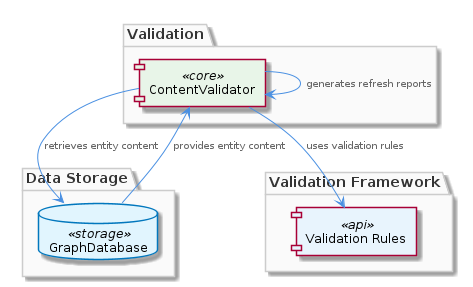
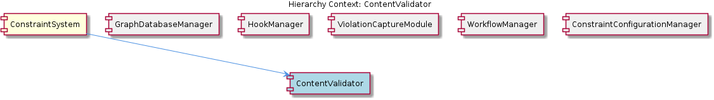

# ContentValidator

**Type:** SubComponent

ContentValidator checks entity content against predefined validation rules to ensure accuracy and consistency.

## What It Is  

`ContentValidator` is a **sub‑component** that lives inside the **ConstraintSystem** domain. Although the exact source file is not listed in the observations, the component is referenced by name throughout the system and is instantiated as a class called **ContentValidator**. Its primary responsibility is to **validate entity content** against a **predefined set of validation rules**. When validation fails, the validator **generates refresh reports** that flag inconsistencies, thereby helping the system maintain data integrity and consistency across all stored entities.

The validator does **not** operate in isolation; it **relies on the GraphDatabaseManager** to fetch the current state of an entity from the underlying graph store before applying its rule set. The validation logic itself is supplied by a **validation framework** (the concrete framework name is not disclosed) that encapsulates the rule definitions and the execution engine. By centralising this logic, `ContentValidator` becomes the gate‑keeper for any content that flows through the `ConstraintSystem`.

---

## Architecture and Design  

The design of `ContentValidator` follows a **rule‑based validation architecture**. The component receives raw entity data from the **GraphDatabaseManager**, then passes that data through a **validation framework** that iterates over a **predefined validation rule set**. This approach mirrors the **Strategy pattern** at a high level: each rule can be seen as a concrete strategy that the framework invokes to evaluate a specific aspect of the entity. Because the rule set is predefined and static, the system favours **predictability** and **deterministic outcomes** over dynamic rule discovery.

Interaction with sibling components is minimal but well‑defined. `ContentValidator` shares the **GraphDatabaseManager** as its data‑access dependency, the same manager used by other siblings such as **ViolationCaptureModule** and **WorkflowManager**. This common dependency encourages **reuse of the graph‑access layer** and reduces duplication of data‑retrieval logic. The parent component, **ConstraintSystem**, orchestrates the overall flow: it loads constraint configurations (via `ConstraintConfigurationManager`), invokes `ContentValidator` for each entity, and subsequently records any violations through `ViolationCaptureModule`.

The **relationship diagram** below illustrates these connections, showing how `ContentValidator` sits between the graph layer and the reporting mechanisms.

---

## Implementation Details  

The core implementation revolves around three logical parts:

1. **Data Retrieval** – `ContentValidator` calls into **GraphDatabaseManager** (which itself uses the `GraphDatabaseAdapter` located at `storage/graph-database-adapter.ts`) to obtain the current entity graph representation. This indirection abstracts the underlying LevelDB‑backed Graphology store, allowing the validator to remain agnostic of storage specifics.

2. **Rule Execution** – The validator leverages a **validation framework** that houses the predefined rules. While the exact class or function names are not enumerated, the observations make clear that the framework provides a **set of predefined validation rules**. Each rule likely implements a common interface (e.g., `validate(entity): ValidationResult`) that the framework iterates over, accumulating any failures.

3. **Report Generation** – Upon encountering rule violations, `ContentValidator` constructs **refresh reports**. These reports capture the nature of the inconsistency and are intended for downstream processes (e.g., the `ViolationCaptureModule` or a UI dashboard). The generation step is tightly coupled with the validation outcome, ensuring that only failing entities trigger a report.

Because no explicit code symbols were discovered, the implementation is inferred from the functional description: the validator is a class (`class ContentValidator`) that exposes at least one public method such as `validateEntity(entityId)` which internally orchestrates the three steps above.

---

## Integration Points  

`ContentValidator` is tightly integrated with several sibling components:

* **GraphDatabaseManager** – The sole source of entity data. All validation runs begin with a call to `GraphDatabaseManager.getEntityContent(entityId)` (or an equivalent method). This dependency ensures that the validator always works with the most recent graph state.

* **ConstraintConfigurationManager** – Supplies the **predefined validation rules** that the validator consumes. While the observations do not detail the exact hand‑off, it is reasonable to assume that the rule set is loaded during system start‑up and cached for fast access.

* **ViolationCaptureModule** – Consumes the **refresh reports** produced by `ContentValidator`. When a report is generated, it is likely passed to this module for persistence or further analysis.

* **WorkflowManager** and **HookManager** – Although not directly invoked by the validator, they operate in the same constraint ecosystem. For example, a workflow may trigger a validation run, and hooks could be used to fire side‑effects when a refresh report is emitted.

The parent **ConstraintSystem** orchestrates these interactions, ensuring that validation occurs at appropriate lifecycle moments (e.g., after a data import or before a workflow transition).

---

## Usage Guidelines  

1. **Always retrieve entities through `GraphDatabaseManager`** before invoking `ContentValidator`. Direct access to the underlying graph store bypasses the abstraction layer and can lead to stale or inconsistent data being validated.

2. **Do not modify the predefined rule set at runtime**. The validator expects a static collection of rules; altering them on‑the‑fly could produce nondeterministic validation results and break the refresh‑report generation pipeline.

3. **Handle refresh reports promptly**. Since the validator generates reports only on failure, downstream consumers (e.g., `ViolationCaptureModule`) must be prepared to ingest and act on these reports to maintain system integrity.

4. **Leverage the `ConstraintConfigurationManager`** for any updates to validation logic. When new constraints are required, they should be added to the configuration source and reloaded via the manager rather than hard‑coding changes inside `ContentValidator`.

5. **Maintain separation of concerns**. Keep any business logic that is not directly related to content validation out of `ContentValidator`. Use sibling modules (e.g., `WorkflowManager`) to coordinate when validation should be triggered.

---

### Architectural Patterns Identified  

* **Rule‑Based Validation (Strategy‑like)** – Validation rules are encapsulated and iterated over by a framework.  
* **Facade over Persistence** – `GraphDatabaseManager` acts as a façade for the graph database, shielding `ContentValidator` from storage details.  

### Design Decisions and Trade‑offs  

* **Static Rule Set** – Guarantees repeatable validation but reduces flexibility for dynamic rule updates.  
* **Centralised Validation Logic** – Simplifies maintenance and ensures uniform enforcement of constraints, at the cost of a single point of failure if the validator becomes a bottleneck.  

### System Structure Insights  

`ContentValidator` sits in the middle tier of the **ConstraintSystem** architecture, bridging data retrieval (graph layer) and integrity enforcement (reporting layer). Its reliance on shared services (`GraphDatabaseManager`, `ConstraintConfigurationManager`) promotes cohesion among sibling components.

### Scalability Considerations  

Because validation is performed synchronously after data retrieval, the component’s throughput is bounded by the speed of the graph queries and the complexity of the rule set. Scaling horizontally would involve parallelising validation calls across multiple instances, each sharing the same `GraphDatabaseManager` pool.

### Maintainability Assessment  

The clear separation of responsibilities—data access, rule execution, and report generation—makes `ContentValidator` **highly maintainable**. Adding new validation rules only requires updating the configuration source, while the core validator code remains untouched. However, the lack of dynamic rule loading means any change to the rule set necessitates a redeployment or configuration reload, which should be managed carefully.

## Hierarchy Context

### Parent
- [ConstraintSystem](./ConstraintSystem.md) -- [LLM] The ConstraintSystem component utilizes a GraphDatabaseAdapter for persistence, which is implemented in the storage/graph-database-adapter.ts file. This adapter enables the system to store and retrieve graph structures using Graphology and LevelDB, with automatic JSON export sync. The use of Graphology allows for efficient graph operations, while LevelDB provides a robust and scalable storage solution. The GraphDatabaseAdapter class in storage/graph-database-adapter.ts is responsible for managing the graph database, including creating and deleting graphs, as well as handling graph queries. The automatic JSON export sync feature ensures that the graph data is consistently updated and available for other components to access.

### Siblings
- [GraphDatabaseManager](./GraphDatabaseManager.md) -- GraphDatabaseManager uses the GraphDatabaseAdapter class in storage/graph-database-adapter.ts to manage graph database operations.
- [HookManager](./HookManager.md) -- HookManager loads hook events from a configuration file or database.
- [ViolationCaptureModule](./ViolationCaptureModule.md) -- ViolationCaptureModule captures constraint violations from tool interactions and stores them in a database.
- [WorkflowManager](./WorkflowManager.md) -- WorkflowManager loads workflow definitions from a configuration file or database.
- [ConstraintConfigurationManager](./ConstraintConfigurationManager.md) -- ConstraintConfigurationManager loads constraint configurations from a configuration file or database.

---

*Generated from 7 observations*
