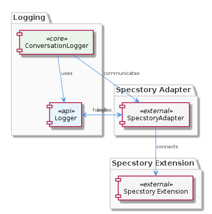
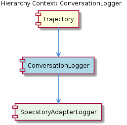

# ConversationLogger

**Type:** SubComponent

The SpecstoryAdapter class in lib/integrations/specstory-adapter.js serves as a bridge between the ConversationLogger and the Specstory extension, enabling seamless communication between the two.

## What It Is  

ConversationLogger is a **sub‑component** that lives inside the **Trajectory** component. Its concrete implementation lives in the integration layer at `lib/integrations/specstory-adapter.js`, where the `SpecstoryAdapter` class is defined. The adapter is responsible for forwarding every conversation event—message sends, receives, edits, and user inputs—to the external **Specstory** extension. Logging itself is powered by the `createLogger` factory found in `../logging/Logger.js`, which supplies a modular, configurable logger instance that the ConversationLogger (and its child `SpecstoryAdapterLogger`) uses throughout the lifecycle of a conversation.

## Architecture and Design  

The design that emerges from the observations is an **Adapter‑based architecture**. The `SpecstoryAdapter` class acts as a bridge between the internal ConversationLogger and the external Specstory service, encapsulating all protocol‑specific details (e.g., HTTP communication via `connectViaHTTP`). This isolates the rest of the system from changes in the Specstory API and makes the logger reusable across different extensions if needed.

Logging is further decoupled through a **Factory pattern**: `createLogger` from `../logging/Logger.js` creates logger instances that can be swapped or re‑configured without touching the core ConversationLogger code. This modularity supports flexible log destinations (console, file, remote) and consistent log formatting across the component hierarchy.

Interaction flow:

1. **Initialization** – Trajectory instantiates a `ConversationLogger`, which in turn creates a `SpecstoryAdapterLogger` child.  
2. **Connection** – `SpecstoryAdapter.connectViaHTTP` establishes an HTTP link to the Specstory extension.  
3. **Logging** – When a conversation event occurs, `SpecstoryAdapter.logConversation` (line 134) is invoked. It receives the event payload, formats it, and forwards it through the logger created by `createLogger`.  
4. **Error Handling** – Any exceptions raised during the HTTP call or logging are caught and processed by the adapter, preventing propagation to the parent component.

## Implementation Details  

### Core Classes & Functions  

- **`SpecstoryAdapter` (lib/integrations/specstory-adapter.js)** – Provides two pivotal methods:  
  - `connectViaHTTP()` – Sets up the HTTP channel to the Specstory extension, handling authentication and endpoint configuration.  
  - `logConversation(event)` – Implemented at line 134, this method receives a structured conversation event (message send, receive, edit, or user input) and delegates it to the logger. It also normalizes the payload and enriches it with timestamps and identifiers.  

- **`createLogger` (../logging/Logger.js)** – A factory that returns a logger object with methods such as `info`, `error`, and `debug`. The factory’s flexibility allows the ConversationLogger to switch log transports without code changes.

- **`SpecstoryAdapterLogger`** – The concrete child component of ConversationLogger. While the observations do not expose its internal code, its naming suggests it wraps the logger produced by `createLogger` and possibly adds Specstory‑specific metadata before emitting logs.

### Mechanics  

When a user interacts with the system, the Trajectory component captures the raw interaction and forwards it to ConversationLogger. ConversationLogger calls `SpecstoryAdapter.logConversation(event)`. Inside `logConversation`, the adapter:

1. Validates the event shape (ensuring required fields like `type`, `content`, `authorId`).  
2. Calls the logger instance (produced by `createLogger`) to record the event at an appropriate severity level (`info` for normal messages, `debug` for edits, `error` for failures).  
3. If the HTTP connection is required for additional telemetry, it uses the channel opened by `connectViaHTTP`.  

Error handling is centralized in the adapter: any network failure, malformed payload, or logger exception is caught, logged as an error, and optionally retried or escalated according to the adapter’s internal policy.

## Integration Points  

- **Parent – Trajectory**: The Trajectory component owns ConversationLogger. It is responsible for instantiating the logger and ensuring the adapter’s `connectViaHTTP` is called during system startup.  

- **Child – SpecstoryAdapterLogger**: This child encapsulates the concrete logger used by the adapter. It likely provides a thin wrapper that injects Specstory‑specific context (e.g., session IDs) before delegating to the generic logger.  

- **External Service – Specstory Extension**: Communication occurs over HTTP. The adapter abstracts the endpoint URL, headers, and any required authentication tokens, exposing a simple `logConversation` API to the rest of the system.  

- **Logging Infrastructure – ../logging/Logger.js**: The `createLogger` factory is the sole dependency for logging. Because it is modular, developers can replace the underlying logger (e.g., switch from console to a cloud‑based log service) without altering ConversationLogger or SpecstoryAdapter.  

These integration points keep the ConversationLogger loosely coupled: changes in the Specstory API or logging backend do not ripple through the Trajectory component.

## Usage Guidelines  

1. **Initialize Early** – Call `SpecstoryAdapter.connectViaHTTP()` during application boot‑up. This ensures the HTTP channel is ready before any conversation events are emitted.  

2. **Use the Factory** – Always obtain a logger via `createLogger()` rather than constructing one manually. This guarantees consistency with the rest of the system and respects any runtime configuration (log level, transport).  

3. **Log All Event Types** – The adapter’s `logConversation` method supports messages, receives, edits, and user inputs. Developers should forward every relevant event to this method to maintain a complete audit trail.  

4. **Handle Errors Gracefully** – Although the adapter catches most exceptions, callers should still be prepared for a rejected promise (if the method is async) and implement fallback logic (e.g., local buffering) if logging fails repeatedly.  

5. **Avoid Direct Specstory Calls** – All interactions with the Specstory extension must go through `SpecstoryAdapter`. Direct HTTP calls bypass the error handling and logging conventions baked into the adapter and can lead to inconsistent state.  

---

### Architectural patterns identified  

- **Adapter Pattern** – `SpecstoryAdapter` bridges internal logging calls to the external Specstory service.  
- **Factory Pattern** – `createLogger` supplies configurable logger instances.  

### Design decisions and trade‑offs  

- **Separation of concerns**: By isolating HTTP communication and logging in the adapter, the core Trajectory logic remains clean, at the cost of an extra indirection layer.  
- **Modular logging**: Using a factory enables swapping log backends without code changes, though it introduces a runtime dependency on the logging module’s configuration.  

### System structure insights  

- ConversationLogger sits one level below Trajectory and above the concrete `SpecstoryAdapterLogger`.  
- The component hierarchy is linear (Trajectory → ConversationLogger → SpecstoryAdapterLogger) with the adapter acting as the sole integration point to an external service.  

### Scalability considerations  

- Because logging is delegated to a factory, scaling the log backend (e.g., moving from local file to distributed log service) can be achieved without altering ConversationLogger.  
- HTTP communication is encapsulated; scaling the Specstory service (load‑balancing, sharding) only requires updating the endpoint configuration used by `connectViaHTTP`.  

### Maintainability assessment  

- **High maintainability**: Clear boundaries (adapter, logger factory) make the codebase easy to reason about and modify.  
- **Low coupling**: The parent component (Trajectory) interacts only with the adapter’s public methods, reducing the impact of changes in the Specstory API.  
- **Potential risk**: The adapter currently handles both connection management and error handling; future growth may benefit from further splitting these responsibilities (e.g., a dedicated connection manager).

## Hierarchy Context

### Parent
- [Trajectory](./Trajectory.md) -- [LLM] The Trajectory component's architecture is characterized by its use of adapters, such as the SpecstoryAdapter, to connect to different extensions and services. This is evident in the lib/integrations/specstory-adapter.js file, where the SpecstoryAdapter class is defined. The component's behavior is defined by its methods, including logConversation and connectViaHTTP, which enable logging and connection to the Specstory extension. For instance, the logConversation method in SpecstoryAdapter (lib/integrations/specstory-adapter.js:134) implements logging functionality, while the createLogger function from ../logging/Logger.js facilitates modular and flexible logging capabilities.

### Children
- [SpecstoryAdapterLogger](./SpecstoryAdapterLogger.md) -- The logConversation method in SpecstoryAdapter (lib/integrations/specstory-adapter.js:134) implements logging functionality for conversation entries.

---

*Generated from 7 observations*
