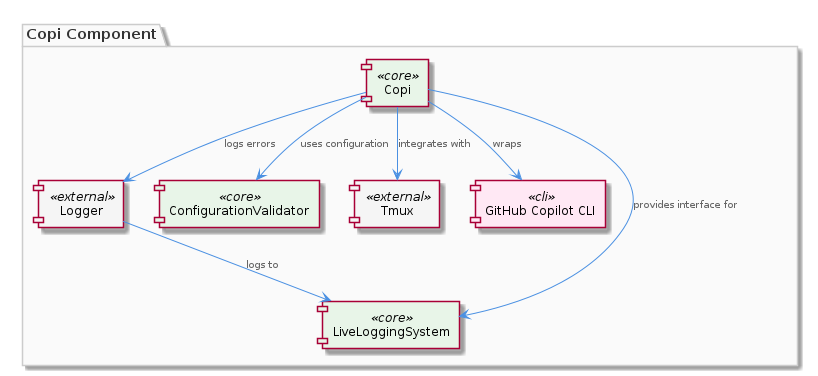
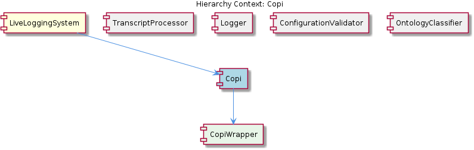

# Copi

**Type:** SubComponent

The Copi component provides a standardized interface for interacting with the Copilot CLI, allowing for easy integration with the LiveLoggingSystem.

## What It Is  

The **Copi** sub‑component lives under the path `integrations/copi` and is delivered as a **GitHub Copilot CLI wrapper** that adds structured logging and optional Tmux integration.  The folder contains the usual documentation artefacts (`INSTALL.md`, `USAGE.md`, `README.md`) that describe how to install the wrapper and invoke it from the surrounding system.  Inside the same folder a concrete class – `CopiWrapper` – encapsulates all interactions with the Copilot CLI, exposing a **standardized interface** that the parent **LiveLoggingSystem** can call.  By delegating to this wrapper, the rest of the system does not need to know the low‑level details of invoking the Copilot binary, handling its output, or managing its terminal session.

Copi’s responsibilities are three‑fold:  

1. **Logging** – every command execution, result payload, and error condition is routed through the unified logging interface supplied by the sibling **Logger** component (`integrations/mcp-server-semantic-analysis/src/logging.ts`).  
2. **Configuration** – the component reads its runtime options (e.g., whether to enable Tmux, log verbosity, output destinations) from the central configuration validator (`scripts/LSLConfigValidator`).  
3. **Result validation** – after the Copilot CLI returns a response, Copi validates the payload to guarantee that downstream consumers receive reliable data.

Together these capabilities make Copi a thin yet robust bridge between the raw Copilot CLI and the broader **LiveLoggingSystem** telemetry pipeline.

---

## Architecture and Design  

Copi is embedded in a **modular architecture** that the parent LiveLoggingSystem enforces across its integration subfolders (`browser-access`, `code-graph-rag`, `copi`).  Each integration lives in its own directory and exposes a *wrapper* class that conforms to a common contract used by the LiveLoggingSystem’s logging and transcript pipelines.  This design mirrors the **Wrapper (Adapter) pattern**, where `CopiWrapper` adapts the external Copilot CLI API to the internal interface expected by the system.

The component relies heavily on **dependency inversion**: rather than hard‑coding a logger, Copi calls the abstract logging methods provided by the **Logger** sibling (`logging.ts`).  This allows the same logging implementation to be swapped or extended without touching Copi’s core logic.  Configuration is likewise injected via the **ConfigurationValidator**, ensuring that any changes to configuration schema are validated centrally before Copi consumes them.

Interaction flow (illustrated by the architecture diagram below) proceeds as follows:

1. LiveLoggingSystem requests a Copilot operation through the `CopiWrapper` API.  
2. `CopiWrapper` reads its settings from the validated configuration payload.  
3. The wrapper spawns the Copilot CLI, optionally attaching a Tmux session for interactive use.  
4. All stdout/stderr streams are captured and forwarded to the Logger.  
5. The raw result is passed to Copi’s internal validator before being returned to the caller.

The **high‑volume handling** note in the observations suggests that Copi processes streams asynchronously and likely employs non‑blocking I/O (e.g., Node.js child_process with event listeners) to avoid back‑pressure when many CLI calls are issued concurrently.  No explicit concurrency framework is mentioned, but the design choice to keep the wrapper lightweight and delegate heavy lifting to the OS process model is a pragmatic trade‑off that favors simplicity and testability.

---

## Implementation Details  

Although the source scan did not expose concrete symbols, the observations give a clear picture of the key artefacts:

* **`integrations/copi/README.md`** – documents the purpose of Copi as a “GitHub Copilot CLI Wrapper with Logging & Tmux Integration”. This file also hints at the existence of a wrapper class that orchestrates CLI calls.  
* **`CopiWrapper`** – the child component referenced in the hierarchy. It likely implements methods such as `runCommand(command: string, args: string[]): Promise<Result>` and `validateResult(raw: any): ValidatedResult`. These methods encapsulate process spawning, Tmux session management, and result verification.  
* **Logging integration** – every interaction funnels through the unified logger (`integrations/mcp-server-semantic-analysis/src/logging.ts`). The wrapper probably calls methods like `logger.info()`, `logger.error()`, and `logger.debug()` with structured metadata (e.g., command name, timestamps, exit codes).  
* **Configuration validation** – before any CLI call, Copi queries the **ConfigurationValidator** (implemented by `scripts/LSLConfigValidator`). This step ensures that options such as `enableTmux`, `logLevel`, and `maxConcurrentCalls` conform to the expected schema, preventing runtime misconfiguration.  
* **Error handling** – the observations explicitly mention that Copi logs errors and exceptions via the Logger. This suggests try‑catch blocks around process execution, with detailed error objects passed to `logger.error()` for traceability.  
* **Result validation** – after the CLI finishes, Copi runs a validation routine (perhaps a simple schema check or more sophisticated sanity tests) to guarantee that the returned suggestions are well‑formed before they are handed to downstream components like the **TranscriptProcessor**.

Because the component is meant to handle “high volumes of Copilot CLI interactions”, the implementation likely includes a **queue** or **semaphore** to limit concurrent process spawns, thereby protecting system resources while still delivering throughput.

---

## Integration Points  

Copi sits at a nexus of three sibling services:

1. **Logger** – provides the only logging API Copi uses. By delegating all log statements to `integrations/mcp-server-semantic-analysis/src/logging.ts`, Copi inherits the system‑wide log formatting, routing (e.g., to files, stdout, or remote collectors), and log level controls.  
2. **ConfigurationValidator** – supplies a validated configuration object that Copi reads at startup or on‑the‑fly. The validator lives in the `scripts` folder and is invoked via the `LSLConfigValidator` script, ensuring that any configuration drift is caught early.  
3. **LiveLoggingSystem (parent)** – orchestrates the overall flow. When a higher‑level feature (e.g., a live transcript enrichment) needs a Copilot suggestion, it calls the `CopiWrapper` API exposed by Copi. The parent also aggregates the logs emitted by Copi into its broader telemetry stream.

The **relationship diagram** below visualizes these connections:

Beyond these direct links, Copi indirectly supports the **TranscriptProcessor** because validated Copilot suggestions may become part of a transcript that the processor later consumes.  Likewise, any ontology classification performed by the **OntologyClassifier** could depend on the semantic content of Copilot outputs, making Copi’s validation step critical for downstream accuracy.

---

## Usage Guidelines  

* **Initialize through the LiveLoggingSystem** – developers should never instantiate `CopiWrapper` directly. Instead, request a Copilot operation via the parent system’s service locator or dependency injection container, which guarantees that the wrapper is wired with the correct logger and configuration.  
* **Respect configuration limits** – the `LSLConfigValidator` may enforce a `maxConcurrentCalls` setting. Applications should honor this limit, either by awaiting promises sequentially or by using the provided concurrency helper (if any).  
* **Enable Tmux only when needed** – Tmux integration adds a persistent terminal session that can be useful for debugging but incurs extra resource usage. Turn it on via the configuration flag (`enableTmux: true`) only for interactive debugging sessions.  
* **Handle validation failures** – the wrapper throws or returns a `ValidationError` when the Copilot CLI output does not meet the expected schema. Callers must catch this error and decide whether to retry, fall back to a default suggestion, or surface the issue to the user.  
* **Log at appropriate levels** – use `logger.debug` for raw CLI output, `logger.info` for successful command completions, and `logger.error` for any exceptions or validation failures. This convention keeps the central logging pipeline consistent across all integrations.

Following these conventions ensures that Copi remains a reliable, observable, and maintainable bridge between the Copilot CLI and the rest of the LiveLoggingSystem.

---

### Summary of Architectural Insights  

| Item | Detail |
|------|--------|
| **Architectural patterns identified** | Wrapper (Adapter) pattern for CLI abstraction; Dependency Inversion for Logger and ConfigurationValidator; Modular component layout within LiveLoggingSystem. |
| **Design decisions and trade‑offs** | • Centralized logging vs. per‑integration logs – chosen to unify observability.  
• Configuration validation at startup – adds a validation step but prevents runtime misconfiguration.  
• Asynchronous, non‑blocking CLI execution – favors scalability at the cost of added complexity in error handling. |
| **System structure insights** | Copi lives under `integrations/copi`, exposing `CopiWrapper` as its public API. It consumes services from sibling components (Logger, ConfigurationValidator) and is orchestrated by the parent LiveLoggingSystem, which aggregates logs and coordinates transcript processing. |
| **Scalability considerations** | High‑volume handling is achieved through asynchronous process spawning and likely a concurrency guard (semaphore/queue). Configuration can cap concurrent calls, protecting the host from resource exhaustion. |
| **Maintainability assessment** | The clear separation of concerns (wrapper, logging, configuration) and reliance on shared interfaces make the component easy to test and evolve. Documentation (`INSTALL.md`, `USAGE.md`) and the explicit wrapper class further aid onboarding. The primary risk is tight coupling to the Copilot CLI binary; any CLI API change will require updates to `CopiWrapper` and its validation logic. |

## Hierarchy Context

### Parent
- [LiveLoggingSystem](./LiveLoggingSystem.md) -- [LLM] The LiveLoggingSystem component utilizes a modular architecture, with separate components for logging, transcript processing, and configuration validation. This is evident in the directory structure, where the 'integrations' folder contains subfolders for 'browser-access', 'code-graph-rag', and 'copi', each representing a distinct aspect of the system. For instance, the 'copi' subfolder contains files such as 'INSTALL.md' and 'USAGE.md', which provide installation and usage guidelines for the Copi component. The 'lib/agent-api' folder contains the TranscriptAdapter abstract base class, which is responsible for reading and converting transcripts from different agent formats. The 'scripts' folder contains the LSLConfigValidator, which is used for validating and optimizing LSL configuration. The logging module, located in 'integrations/mcp-server-semantic-analysis/src/logging.ts', provides a unified logging interface and is used throughout the system.

### Children
- [CopiWrapper](./CopiWrapper.md) -- The integrations/copi/README.md file describes Copi as a 'GitHub Copilot CLI Wrapper with Logging & Tmux Integration', indicating the presence of a wrapper class.

### Siblings
- [TranscriptProcessor](./TranscriptProcessor.md) -- The TranscriptProcessor uses the TranscriptAdapter abstract base class in 'lib/agent-api' to read and convert transcripts from various agent formats.
- [Logger](./Logger.md) -- The Logger component is implemented in 'integrations/mcp-server-semantic-analysis/src/logging.ts', providing a unified logging interface.
- [ConfigurationValidator](./ConfigurationValidator.md) -- The ConfigurationValidator is implemented in the 'scripts' folder, using the LSLConfigValidator script to validate and optimize configuration.
- [OntologyClassifier](./OntologyClassifier.md) -- The OntologyClassifier uses a modular design, allowing for easy integration of new ontology systems and classification mechanisms.

---

*Generated from 7 observations*
