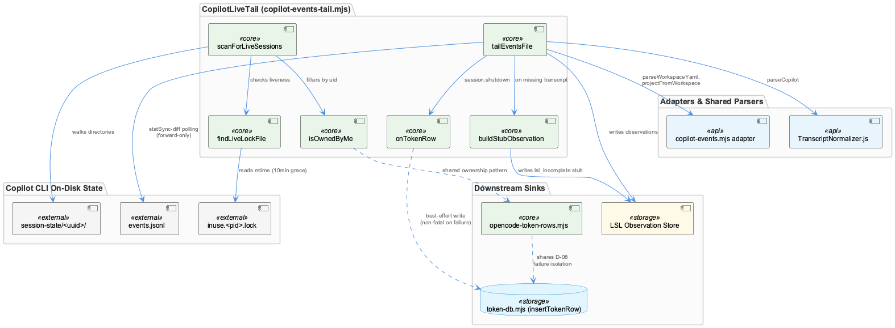
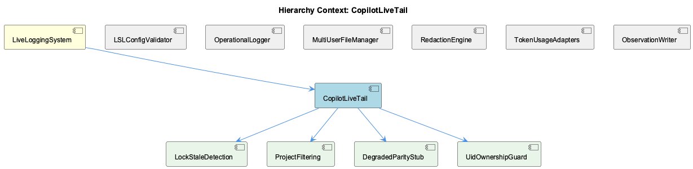

# CopilotLiveTail

**Type:** SubComponent

[Architecture Notes] CopilotLiveTail (copilot-events-tail.mjs) sits downstream of Copilot CLI's own on-disk event log (~/.copilot/session-state/<uuid>/events.jsonl), which it does not control and cannot enrich — it can only forward what Copilot chooses to persist; Deliberately does not import the generic Phase 50 LSL primitives (window.mjs, scan-and-convert.mjs), instead depending on Copilot-specific adapters (../adapters/copilot-events.mjs) and the shared TranscriptNormalizer.js parser; Tight coupling to a stale-lock convention (`inuse.<pid>.lock`, 10-minute grace) as the sole liveness signal — no direct process-liveness check (e.g., PID existence) is performed; Failure isolation boundary explicitly separates optional token-accounting emission (onTokenRow) from the primary subagent lifecycle error path (onError), preventing telemetry failures from affecting core LSL capture; Known, accepted architectural gap: no live mitigation path exists for Copilot's missing inner-reasoning data — the design compensates via metadata flags (lsl_incomplete) rather than data recovery

# CopilotLiveTail — Technical Insight Document

## What It Is

CopilotLiveTail is implemented in `lib/lsl/live/copilot-events-tail.mjs` and serves as the live-ingestion boundary between GitHub Copilot CLI's own on-disk event log and the rest of the LiveLoggingSystem. It reads from `~/.copilot/session-state/<uuid>/events.jsonl`, a file format and content policy it does not control: Copilot CLI persists only `subagent.started`, `subagent.completed`, and `subagent.failed` lifecycle events, never the sub-agent's inner reasoning or tool-call content. CopilotLiveTail's entire design is shaped around this externally-imposed constraint — it is fundamentally a forward-only poller and lifecycle-event forwarder, not a full transcript capturer.

As a SubComponent of LiveLoggingSystem, it sits alongside siblings like TokenUsageAdapters, ObservationWriter, and RedactionEngine, but unlike those, CopilotLiveTail's defining trait is what it *cannot* do: recover data that Copilot never writes to disk.

## Architecture and Design

The architecture is built from four composed child responsibilities — LockStaleDetection, ProjectFiltering, DegradedParityStub, and UidOwnershipGuard — each implemented as single-purpose functions rather than one monolithic gatekeeper. `scanForLiveSessions()` walks session-state directories and applies `isOwnedByMe()` (UidOwnershipGuard) as a harder, louder gate than `findLiveLockFile()`'s staleness check (LockStaleDetection): non-owned directories are skipped with an stderr warning, while stale-locked (crashed) sessions are dropped silently. This asymmetry is a deliberate but consequential trade-off — an operator debugging a missing session gets no signal at all if the cause is a stale lock.

Ingestion itself, via `tailEventsFile()`, is a statSync-based polling loop (`TAIL_POLL_INTERVAL_MS=200`) chosen per RESEARCH-copilot.md Option A1 over `fs.watch()`. It is explicitly forward-only — pre-existing file content is intentionally skipped, deferred to a separate sweep/backfill component (`metadata.source = 'sub-agent-backfill'`). This creates a two-tier ingestion model where no single component owns end-to-end capture; completeness depends on both the live tail and the backfill sweep running correctly.

Rather than treating the lifecycle-only data feed as a bug, the module encodes it as DegradedParityStub: a permanent, accepted data-loss contract, stamped via `lsl_incomplete: true` and surfaced through the `lsl_incomplete_marker_present` heartbeat field for external visibility.

## Implementation Details

`findLiveLockFile()` matches `^inuse\.\d+\.lock$` filenames and compares `mtimeMs` against `LOCK_STALE_GRACE_MS` (hardcoded to 10 minutes), a value deliberately tuned against "RESEARCH landmine #5" — a hard-crashed session leaving an orphaned lock. `isOwnedByMe()` implements an asymmetric trust model: it returns `true` when `myUid == null` (non-POSIX platforms skip the check entirely), `false` on any `statSync` failure, and otherwise compares uids directly — meaning Windows deployments get zero traversal protection from this function.

`buildStubObservation()` synthesizes a two-message user/assistant exchange from spawn metadata (`agentName`, `agentDescription`, `started_at`, `completed_at`, `completion_status`) in place of a real transcript. This shape is a locked contract — the header notes it is "Locked by Test 6," and `COPILOT_LSL_INCOMPLETE_NOTE`'s exact wording is asserted verbatim by tests, making it a fragile magic-string dependency that must be grepped before editing.

`projectMatches()` implements ProjectFiltering as fail-closed: when a `projectRoot` filter is active, sessions whose `projectFromWorkspace()` resolution is falsy or `'unknown'` are dropped rather than included by default, biasing toward under-inclusion.

The `onTokenRow` hook, fired on `session.shutdown`, is wrapped so failures route to a dedicated non-fatal stderr line rather than the subagent `onError` path — the D-08 failure-isolation discipline.

## Integration Points

CopilotLiveTail deliberately does not import Phase 50's generic LSL primitives (`lib/lsl/window.mjs`, `lib/lsl/scan-and-convert.mjs`), judging them unsuitable for Copilot's lifecycle-only stream. Instead it reuses Plan 51-04's Copilot-specific adapters (`parseWorkspaceYaml`, `projectFromWorkspace`, `stripToolCallIdPrefix` from `../adapters/copilot-events.mjs`) and the shared `parseCopilot` parser from `../../../src/live-logging/TranscriptNormalizer.js`, keeping vendor-specific parsing centralized.

Its UidOwnershipGuard pattern is not unique — it reappears independently in sibling module `lib/lsl/token/opencode-token-rows.mjs`'s `ownedDbPath()` and is referenced by `lib/lsl/token/token-db.mjs`, forming a codebase-wide, cross-cutting multi-user-safety convention (also noted as the distributed responsibility behind the MultiUserFileManager sibling entity, which has no single implementing class). Similarly, its D-08 failure-isolation discipline mirrors `insertTokenRow` in token-db.mjs, suggesting a shared architectural doctrine that side-channel telemetry must never destabilize primary observation paths.

## Usage Guidelines

Developers should never attempt to "fix" the missing inner-reasoning data — this is a structural absence on disk, not a bug; efforts should instead target the `lsl_incomplete_marker_present` heartbeat/health surface. The `LOCK_STALE_GRACE_MS` constant should not be changed without re-reading the landmine #5 comments, since it balances false negatives against false positives in session discovery. Any change to `COPILOT_LSL_INCOMPLETE_NOTE` wording requires a coordinated test-suite update since it's asserted verbatim. Because live tailing is strictly forward-only, correctness depends on the separate backfill sweep also running — do not assume CopilotLiveTail alone provides full session coverage. Finally, note that ownership-based security guards provide no protection on non-POSIX platforms, so Windows deployments must rely on OS-level ACLs instead.

## Hierarchy Context

### Parent
- [LiveLoggingSystem](./LiveLoggingSystem.md) -- [LLM] The LiveLoggingSystem's validation layer (scripts/validate-lsl-config.js, LSLConfigValidator class) is architecturally decoupled from the runtime logging layer (integrations/semantic-analysis/src/logging.ts). This separation means a developer touching one file should be aware the other exists independently: the validator is a preflight/health-check tool invoked separately (likely via CLI or CI) to sanity-check `.specstory/config/lsl-config.json` and `redaction-config.yaml` before or during operation, while logging.ts is the actual hot-path code executed during live sessions. Bugs in schema validation won't crash live logging and vice versa, but a misconfigured lsl-config.json that passes validation with wrong runtime assumptions could still cause silent misbehavior in logging.ts if the two ever drift out of sync in their assumptions about field names or defaults.

### Children
- [LockStaleDetection](./LockStaleDetection.md) -- [LLM] The stale-lock detection logic in `lib/lsl/live/copilot-events-tail.mjs` is implemented as two composed, single-purpose predicates rather than one combined check: `findLiveLockFile(sessionDir)` regex-matches `^inuse\.\d+\.lock$` filenames and compares `fs.statSync(lockPath).mtimeMs` against `Date.now()` within `LOCK_STALE_GRACE_MS` (a module-level constant hardcoded to `10 * 60 * 1000`), while `isOwnedByMe(sessionDir, myUid)` independently gates on filesystem uid. `scanForLiveSessions()` then short-circuits per-entry: a non-owned directory is skipped with a `process.stderr.write` warning (`[live-copilot] skipping non-owned session ${sessionId}`) *before* the lock-staleness check ever runs, meaning ownership is a harder gate than freshness — an owned-but-crashed session is silently dropped (no stderr line at all), while a foreign session is dropped loudly. This asymmetry in observability (warn on security-relevant skips, stay silent on staleness-relevant skips) means an operator debugging 'why isn't my session being tailed' has no log signal at all if the cause is a stale lock rather than a permissions mismatch.
- [ProjectFiltering](./ProjectFiltering.md) -- [LLM] The `projectMatches()` function in lib/lsl/live/copilot-events-tail.mjs implements an opt-in, fail-closed filtering policy: when a `projectRoot` filter is supplied, it calls `projectFromWorkspace(workspaceYaml)` and explicitly rejects any session whose resolved project is falsy or the sentinel string `'unknown'` — the comment states this 'saves resources for stray Copilot sessions that don't belong to this project.' This means a session lacking a readable `workspace.yaml` (returned by `readWorkspace()` when the file is absent or fails to parse) is silently dropped from consideration the moment a filter is active, rather than being included by default — a deliberate bias toward under-inclusion over accidentally tailing another project's events.
- [DegradedParityStub](./DegradedParityStub.md) -- [LLM] The core architectural decision in lib/lsl/live/copilot-events-tail.mjs is to treat data loss as a permanent, documented contract rather than a defect. The module's header explicitly states Copilot CLI 'emits ONLY subagent.started/subagent.completed/subagent.failed lifecycle events on disk' and that inner reasoning is 'FOREVER LOST — no live mitigation possible.' This is operationalized in three concrete code artifacts: the `COPILOT_LSL_INCOMPLETE_REASON` constant, the `lsl_incomplete: true` stamp applied to every observation, and the `buildStubObservation()` function which synthesizes a two-message exchange (`userMsg`/`asstMsg`) from spawn metadata (`agentName`, `agentDescription`, `started_at`, `completed_at`, `completion_status`) instead of attempting to recover a real transcript. The design explicitly redirects any future fix attempts toward Plan 51-11's `lsl_incomplete_marker_present` heartbeat field rather than toward the impossible task of transcript recovery.
- [UidOwnershipGuard](./UidOwnershipGuard.md) -- [LLM] The `isOwnedByMe()` function in lib/lsl/live/copilot-events-tail.mjs implements a fail-closed-on-error but permissive-by-default ownership check: it returns `true` immediately when `myUid == null` (non-POSIX platforms like Windows skip the check entirely), returns `false` on any `fs.statSync` failure (treating an unreadable directory as untrusted rather than as 'unknown'), and otherwise compares `st.uid` against the caller's uid. This is an asymmetric trust model — the absence of a uid concept (Windows) is treated as safe, while the presence of a stat error is treated as unsafe — which only makes sense if POSIX uid checks are considered the only meaningful attack surface for this guard; a Windows deployment gets zero traversal protection from this function, relying entirely on OS-level filesystem ACLs instead.

### Siblings
- [LSLConfigValidator](./LSLConfigValidator.md) -- [CGR] LSLConfigValidator (class) in validate-lsl-config.js
- [OperationalLogger](./OperationalLogger.md) -- Lives in integrations/semantic-analysis/src/logging.ts, the actual hot-path code executed during live sessions as opposed to the validator's preflight checks.
- [MultiUserFileManager](./MultiUserFileManager.md) -- [LLM] No file or class literally named `MultiUserFileManager` appears anywhere in the evidence provided (the code graph is empty and none of the four supplied files declare such a class). The responsibility implied by that name — routing file/database access safely across multiple OS users — is instead DISTRIBUTED across several independent guards: `validateUserEnvironment()` (referenced in the parent LiveLoggingSystem observations) derives a per-user hash to namespace session files, `isOwnedByMe()` in lib/lsl/live/copilot-events-tail.mjs checks file uid ownership before tailing another user's Copilot session directory, and `ownedDbPath()` in lib/lsl/token/opencode-token-rows.mjs performs the identical uid-check pattern before opening `opencode.db`. This SubComponent is therefore best understood as a cross-cutting concern realized by convention across the codebase rather than a single class — a developer looking for 'the multi-user file manager' would need to know to search for the `isOwnedByMe`/`ownedDbPath` idiom, not a single module.
- [RedactionEngine](./RedactionEngine.md) -- [LLM] None of the code excerpts supplied for this analysis (lib/lsl/live/copilot-events-tail.mjs, lib/lsl/token/opencode-token-rows.mjs, lib/lsl/token/token-db.mjs, src/live-logging/ObservationWriter.js, tests/agents/copilot-session-command.test.mjs) contain the RedactionEngine's own implementation — no class or module literally named RedactionEngine appears. The only concrete evidence of a redaction component is the import `import ConfigurableRedactor from './ConfigurableRedactor.js';` at src/live-logging/ObservationWriter.js:19 and the constructor comment noting `this.dbPath` is retained specifically 'as a path string used to derive `projectRoot` for the redactor' (ObservationWriter.js, Phase 44 Plan 13 comment block). This means the redaction subsystem is consumed, not defined, inside the files under review — any deeper architectural claim about RedactionEngine's internals (rule sets, regex patterns, PII categories) cannot be grounded in this evidence set and should be treated as external to what was reviewed.
- [TokenUsageAdapters](./TokenUsageAdapters.md) -- [LLM] copilot-events-tail.mjs implements a poll-based file tail (tailEventsFile, TAIL_POLL_INTERVAL_MS=200) over Copilot's `~/.copilot/session-state/<uuid>/events.jsonl` rather than an fs.watch()-based approach, explicitly choosing statSync polling per RESEARCH-copilot.md Option A1. The module's own comments flag a hard architectural limitation: Copilot CLI persists only `subagent.started`/`subagent.completed`/`subagent.failed` lifecycle bookends to disk, never the sub-agent's actual messages or reasoning — so buildStubObservation() synthesizes a 2-message user/assistant exchange from spawn metadata alone, and every resulting observation is stamped `lsl_incomplete: true` with a locked note (COPILOT_LSL_INCOMPLETE_NOTE), a deliberately accepted, permanent data-loss gap rather than a bug to fix.
- [ObservationWriter](./ObservationWriter.md) -- src/live-logging/ObservationWriter.js routes all three write methods through km-core's putEntity via the legacy-ingest adapter (legacyObservationToEntity, legacyDigestToEntity, legacyInsightToEntity), per the Phase 44 hard-cutover decision (no dual-write, no feature flag).

---

*Generated from 10 observations*
