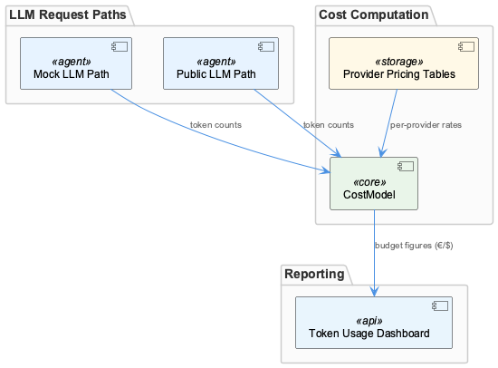
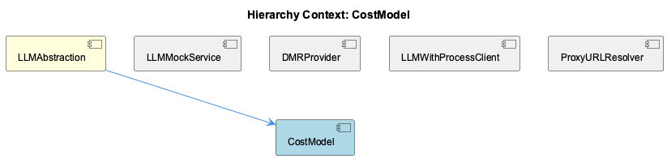

# CostModel

**Type:** SubComponent

Because it is pure computation logic, CostModel has no side effects on workflow-progress.json or network calls, keeping cost math testable in isolation

# CostModel — Technical Insight Document

## What It Is

CostModel is a subcomponent of LLMAbstraction responsible for translating token counts into monetary figures (€/$) using per-provider pricing tables. Unlike much of the surrounding LLM infrastructure—which deals with network calls, mode resolution, and process orchestration—CostModel is defined purely in terms of computation: it takes numeric token inputs and pricing data and produces cost outputs. No specific file paths or class names were identified in the current observations, suggesting this component's logic is either small, embedded within a broader LLM abstraction module, or not yet decomposed into named symbols that have been indexed.

## Architecture and Design

The defining architectural characteristic of CostModel is its purity: it is implemented as a set of pure functions with no side effects. It does not write to workflow-progress.json, does not perform network calls, and does not depend on runtime state beyond its inputs (token counts and pricing tables). This is a deliberate design decision that isolates cost arithmetic from the more volatile, I/O-heavy parts of the LLM subsystem.

This purity is what allows CostModel to serve as a shared calculation layer across divergent execution paths. Both the mock LLM path (governed by LLMMockService's getLLMMode() precedence chain) and the public/live LLM path route their token usage through CostModel, ensuring that budget figures are computed identically regardless of which provider actually served a given request. This is an important architectural safeguard: cost reporting integrity does not depend on whether a request was serviced by DMRProvider, routed through LLMWithProcessClient to rapid-llm-proxy, or resolved via ProxyURLResolver's environment-based endpoint selection—CostModel guarantees consistent cost semantics on top of an otherwise heterogeneous provider landscape.

## Implementation Details

Because CostModel operates on pricing tables keyed per provider, its core mechanic is a lookup-and-multiply pattern: given a token count and a provider identifier, it resolves the applicable rate table and computes a resulting cost. The absence of side effects means these functions can be invoked repeatedly, in any order, without concern for accumulated state or ordering effects—an important property given that LLM calls in this system can be dispatched through several different code paths (mock, DMR, proxy-based) depending on the mode-resolution hierarchy implemented in the sibling LLMMockService.

No specific class or function symbols were surfaced in the current code index for CostModel, which suggests the current insight is derived primarily from behavioral/architectural observation rather than direct source inspection. Future documentation passes should attempt to name the specific module and functions once they are indexed, to sharpen this section beyond the functional description provided by observations.

## Integration Points

CostModel sits underneath LLMAbstraction, the parent component that also houses LLMMockService (mode resolution), DMRProvider (Docker Model Runner's OpenAI-compatible surface), LLMWithProcessClient (direct fetch-based proxy calls), and ProxyURLResolver (environment-driven endpoint selection). While these siblings are concerned with *how* and *where* an LLM request is dispatched, CostModel is concerned with *what it costs* once token usage is known—making it a downstream consumer of token counts regardless of dispatch path.

Its outputs likely feed the documented Token Usage Dashboard referenced in project documentation, positioning CostModel as the computational backbone for any budget-tracking or cost-visibility feature in the system. This dashboard connection, while not confirmed by direct code inspection, is a reasonable inference given that CostModel's sole purpose is producing cost figures that must surface somewhere for human consumption.

## Usage Guidelines

Developers integrating with CostModel should preserve its purity: any new consumer should pass in token counts and provider identifiers and treat the return value as a deterministic function of those inputs, without expecting or introducing side effects. Because the mock and public LLM paths both rely on CostModel for consistent budget math, any changes to per-provider pricing tables must be validated against both paths to ensure the "consistent budget figures regardless of provider" guarantee continues to hold.

Given its isolation from network calls and workflow-progress.json, CostModel is well-suited for unit testing in isolation—changes to pricing logic should be accompanied by targeted tests rather than relying on end-to-end LLM call testing. When debugging discrepancies in reported costs, developers should first confirm which LLM path (mock vs. public, and which provider under LLMMockService's mode-resolution precedence) generated the token counts before suspecting CostModel itself, since its logic is deterministic and provider-pricing-table-driven rather than a likely source of variable behavior.

## Hierarchy Context

### Parent
- [LLMAbstraction](./LLMAbstraction.md) -- [LLM] The LLMAbstraction component implements a mode-resolution hierarchy that is critical for understanding how any given agent call is actually dispatched. getLLMMode() in llm-mock-service.ts checks, in strict order: a per-agent override (allowing individual agents to be pinned to mock/local/public independently of global state), then a global mode setting, then a legacy mockLLM boolean flag (retained for backward compatibility with older config schemas), and finally falls back to 'public' as the safe default. This layered precedence means a developer debugging unexpected LLM behavior for a specific agent must check all four levels rather than assuming the global setting applies uniformly—per-agent overrides silently win even if the global mode says otherwise, which is a common source of confusion during multi-agent experiments.

### Siblings
- [LLMMockService](./LLMMockService.md) -- getLLMMode() in llm-mock-service.ts implements a strict precedence chain: per-agent override, then global mode, then legacy mockLLM boolean, then 'public' default
- [DMRProvider](./DMRProvider.md) -- DMRProvider wraps Docker Model Runner's OpenAI-compatible API surface, letting existing OpenAI-style request/response code reuse the same client shape
- [LLMWithProcessClient](./LLMWithProcessClient.md) -- LLMWithProcessClient bypasses higher-level SDK abstractions in favor of a direct fetch() call to /api/complete on rapid-llm-proxy
- [ProxyURLResolver](./ProxyURLResolver.md) -- ProxyURLResolver reads environment variables such as RAPID_LLM_PROXY_URL and LLM_CLI_PROXY_URL to decide which endpoint to use

---

*Generated from 4 observations*
