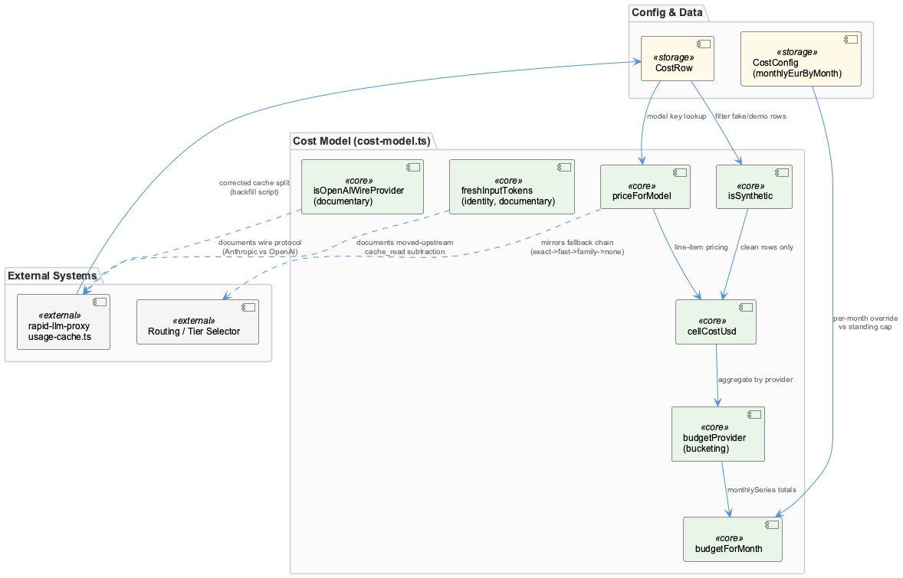
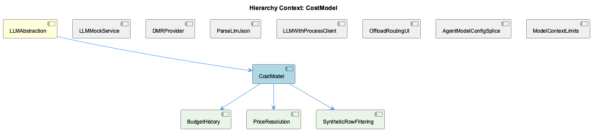

# CostModel

**Type:** SubComponent

## What It Is

CostModel is implemented entirely in `integrations/system-health-dashboard/src/components/cost/cost-model.ts`, a dependency-free, side-effect-free TypeScript module (explicitly documented as having "no React here") that computes LLM usage costs and budget status for the system-health-dashboard. It sits under the LLMAbstraction component as a sub-domain concerned specifically with pricing, budgeting, and aggregation of `CostRow[]` data against a `CostConfig`. Its three children — BudgetHistoryModel, FastModePricingRule, and ModelFamilyPriceFallback — are not separate modules but named conceptual facets of logic that all live inside this one file, particularly within `budgetForMonth()` and `priceForModel()`.

## Architecture and Design

The dominant pattern is a layered fallback cascade for price resolution in `priceForModel()`: exact match → fast-mode suffix handling → family fallback via `modelFamily()` and `FAMILY_REPRESENTATIVE`. This mirrors the same cascade shape used elsewhere in the LLM abstraction layer (e.g., `getLLMMode()`'s per-agent → global → legacy → default resolution), suggesting a house style for tiered configuration resolution across the codebase.

A second structural decision is representing the budget cap as a time-windowed, append-only history (`monthlyEurByMonth`) rather than a single mutable `monthlyEur` value — this is the essence of what's labeled BudgetHistoryModel. The design explicitly rejects retroactive re-judgment of past months; a `null` override is honored as "no cap," and the recorded 300→600→1000 cap history for `copilot` in `DEFAULT_COST_CONFIG.budgets.copilot` demonstrates this in practice.

A third pattern is self-documenting deprecation: `freshInputTokens()` and `isOpenAIWireProvider()` are retained as no-op/identity functions purely as named anchors so future maintainers don't have to rediscover a wire-protocol distinction that used to matter. This reflects a "don't fix what isn't broken, but don't erase the history either" maintainability ethos.

## Implementation Details

`FastModePricingRule` is a recursive branch inside `priceForModel()`, not a lookup table: on a `-fast` suffix miss, it strips the suffix, recursively re-prices the base model, and only applies `scalePrice(price, FAST_MODE_MULTIPLIER)` (2x) if the base resolved with `priced: true` — preventing a zeroed price from being incorrectly scaled. The 2x multiplier is verified for `claude-opus-5` but only assumed for `claude-opus-4.8`; divergence should be fixed by adding an explicit row, not adjusting the shared constant.

`ModelFamilyPriceFallback` performs two passes: first checking curated `FAMILY_REPRESENTATIVE` keys, then a looser `Object.keys(prices).find(...)` pass matching any priced model sharing the same family via `modelFamily()`'s substring detection (haiku/sonnet/opus/fable/gpt-4o). This makes the representative list a preference order rather than an exhaustive gate.

`budgetForMonth()` and `budgetProvider()` implement budget resolution, mapping subscriptions into two buckets — `copilot` and `claude-max` — that directly correspond to the routing tiers described by the parent LLMAbstraction ("max-subscription models first, then work/GH Copilot models, then Groq Llama-70B as last resort").

`freshInputTokens()` is now a pure identity function; its docstring records it previously subtracted `cache_read_tokens` to avoid double-billing OpenAI-wire cached tokens, a compensation made obsolete once the proxy began subtracting at the parse boundary (`openAIFreshInputTokens`) and a backfill corrected historical rows. `isOpenAIWireProvider()` documents the Anthropic-wire vs OpenAI-wire cache-accounting incompatibility that motivated this. `isSynthetic()` filters demo/probe rows (`fake-peer`, `synthetic`/`fake-model`/`demo`-prefixed) before `monthlySeries()` or `cellCostUsd()` aggregation runs.

## Integration Points

CostModel is consumed by dashboard components supplying `CostRow[]` from `GET /api/token-usage/cost` and `CostConfig` from `GET /api/llm/settings`, keeping the pure computational core decoupled from data fetching. Its cache-accounting assumptions are coupled by convention (comments only, no shared type/contract test) to rapid-llm-proxy's `src/usage-cache.ts` and the upstream fix described in the "Usage Token Accounting" work record for BudgetTracker. Its budget bucketing depends on routing-policy decisions made in the LLMAbstraction parent and the "API Model Field and Token Count Reliability" work record, meaning cost-accounting logic here is downstream of, and must track, routing-tier changes decided elsewhere.

## Usage Guidelines

Do not collapse `monthlyEurByMonth` back into a single mutable cap — this would retroactively misjudge past months. When adding a `-fast` variant, prefer an explicit row over adjusting `FAST_MODE_MULTIPLIER` if pricing tiers diverge. Never reintroduce cache-token compensation in `cellCostUsd()`/`freshInputTokens()` without first checking whether the proxy or backfill already handles it — doing so silently double-subtracts and zeroes out fresh-input tokens on affected rows. Keep `isSynthetic()` filtering at the aggregation boundary rather than moving it to ingestion, preserving co-location with the math it protects. Since the copilot/claude-max budget split encodes a business assumption from the routing layer, any change to LLMAbstraction's fallback tier order should prompt a review of `budgetProvider()`.

## Work Record

What working sessions recorded about this entity — decisions taken, problems hit, and why things are the way they are:

- The 'Rapid-LLM-Proxy — Usage Token Accounting (cached_tokens split)' work record (about BudgetTracker) establishes that usage responses returned by proxy shims must report prompt tokens and cached tokens separately per the AI SDK usage spec, so downstream cost/usage dashboards do not undercount cached-token consumption — this is the upstream fix that `freshInputTokens()`'s docstring in cost-model.ts refers to when it says the proxy now 'subtracts at the parse boundary,' making the local compensation in this file obsolete.
- The 'API Model Field and Token Count Reliability' work record (about LLMAbstraction) establishes that LLM requests must follow an intended fallback tier order — max-subscription models first, then work/GH Copilot models, then Groq Llama-70B only as last resort — a routing-tier constraint that is the direct counterpart to `budgetProvider()`'s two-bucket split (`copilot` vs `claude-max`) in cost-model.ts: the budget model treats these as the two real subscriptions worth capping precisely because the routing layer is supposed to exhaust them before falling through to lower/free tiers.

## Hierarchy Context

### Parent
- [LLMAbstraction](./LLMAbstraction.md) -- [SESSION] 'LLM Routing Tier Priority' establishes that LLM requests must follow fallback tier order — max-subscription models first, then work/GH Copilot models, then Groq Llama-70B only as last resort — rather than demoting to lower tiers as primary

### Children
- [BudgetHistoryModel](./BudgetHistoryModel.md) -- [LLM] No file, class, or exported symbol named `BudgetHistoryModel` appears anywhere in the supplied code (cost-model.ts, offload-decision.tsx, use-classifier-judge.ts, provider.tsx, or the copilot-model-ids test). The nearest conceptual match is the `BudgetConfig` interface and its `budgetForMonth()` resolver in `integrations/system-health-dashboard/src/components/cost/cost-model.ts:44-60`, which is what the parent's observations describe almost verbatim (the two-tier `monthlyEurByMonth` override over `monthlyEur`, the honored-`null`-means-no-cap semantics, and the 300→600→1000 2026-08 history baked into `DEFAULT_COST_CONFIG.budgets.copilot`). That interface is a plain data shape plus one pure lookup function, not a named 'model' class — so retrieval appears to have surfaced the parent Detail's own file under a different, invented component label.
- [FastModePricingRule](./FastModePricingRule.md) -- [LLM] The fast-mode rule is implemented as a recursive branch inside `priceForModel()` (integrations/system-health-dashboard/src/components/cost/cost-model.ts) rather than as a standalone lookup: when the exact-match check against `prices[normalized]` misses and the model string ends in `FAST_MODE_SUFFIX` ('-fast'), the function strips the suffix and calls itself with the base model name, then wraps the recursive result through `scalePrice(resolved.price, FAST_MODE_MULTIPLIER)` if — and only if — the base model resolved to `priced: true`. This means a `-fast` model whose base model is itself unpriced correctly falls through to `priced: false` rather than being scaled from a zeroed price object, since the `if (resolved.priced)` guard sits between the recursive call and the multiplication.
- [ModelFamilyPriceFallback](./ModelFamilyPriceFallback.md) -- [LLM] `priceForModel()` in integrations/system-health-dashboard/src/components/cost/cost-model.ts implements the family-fallback path directly: after the exact-match check on `prices[normalized]` fails and the `-fast` suffix check also fails to resolve, it calls `modelFamily(model)` and walks `FAMILY_REPRESENTATIVE[fam]` looking for the first key that exists in the caller-supplied `prices` map. Only if none of the representative keys are found does it fall through to a second, looser pass — `Object.keys(prices).find(k => modelFamily(k) === fam)` — which accepts ANY priced model in the same family, not just the curated representatives. This two-pass structure means the representative list is a preference order, not an exhaustive gate: an operator-added custom model sharing a family substring (e.g. anything containing 'opus') can still be matched even if it was never added to `FAMILY_REPRESENTATIVE`.

### Siblings
- [LLMMockService](./LLMMockService.md) -- [SESSION] 'PlantUML Diagram Generation — Wave 4 Syntax Failures' ties LLMMockService to diagnosing syntax failures/truncation in generated .puml files during mocked runs
- [DMRProvider](./DMRProvider.md) -- [LLM] The parent context describes dmr-provider.ts's loadDMRConfig() as searching three candidate filesystem paths (cwd/config/dmr-config.yaml, cwd/integrations/semantic-analysis/config/dmr-config.yaml, and a __dirname-relative path) before falling back to an in-code DEFAULT_CONFIG. None of the supplied code files contain this file or function — the retrieved files (cost-model.ts, offload-decision.tsx, use-classifier-judge.ts, provider.tsx, copilot-model-ids.test.mjs) are all part of the rapid-llm-proxy dashboard and test surface, not the DMR provider module itself.
- [LLMWithProcessClient](./LLMWithProcessClient.md) -- [SESSION] 'CLI/UKB Run Timeout and Provider Error Diagnostics' documents this layer's role in distinguishing proxy-layer timeouts from provider-specific failures further down the call chain
- [LlmJsonParser](./LlmJsonParser.md) -- [LLM] None of the supplied code files (copilot-model-ids.test.mjs, cost-model.ts, offload-decision.tsx, use-classifier-judge.ts, provider.tsx) implement or import parseLlmJson or any JSON-repair logic described in the parent context for LlmJsonParser. The parent observation about parseLlmJson()'s inString state machine and control-character escaping in parse-llm-json.ts is not reachable from this file set.
- [CopilotModelIdAlignment](./CopilotModelIdAlignment.md) -- [LLM] tests/features/copilot-model-ids.test.mjs is the entire visible implementation of CopilotModelIdAlignment: it is a drift-guard test suite, not the alignment logic itself, and its own file-header comment explains why the correction exists as a standalone post-install script (`integrations/semantic-analysis/scripts/align-copilot-model-ids.mjs`) rather than a patch-package diff — attempting patch-package against the vendored `@rapid/llm-proxy` tarball produced a 148KB patch spanning 25 unrelated files, because the package is installed from a GitHub release tarball with no clean npm-registry baseline to diff against.
- [OffloadRoutingDashboard](./OffloadRoutingDashboard.md) -- [SESSION] 'LLM Routing Tier Priority' establishes the fallback tier order (max-subscription first, then work/Copilot, then Groq Llama-70B last resort) that this dashboard's rung ladder is built to visualize and verify
- [ModelContextLimits](./ModelContextLimits.md) -- [LLM] None of the five retrieved files define, reference, or import anything called `ModelContextLimits`, and none contain logic that maps a model id to a context-window size (e.g. a token-count ceiling used to decide whether a prompt fits). The closest thematic neighbor is `integrations/system-health-dashboard/src/components/cost/cost-model.ts`, but its `modelPrices` table and `priceForModel()`/`cellCostUsd()` functions price tokens in dollars — they never bound how many tokens a model can accept. A component named ModelContextLimits would need its own file (or a section of a routing config) that this retrieval did not surface.

---

*Generated from 11 observations*
