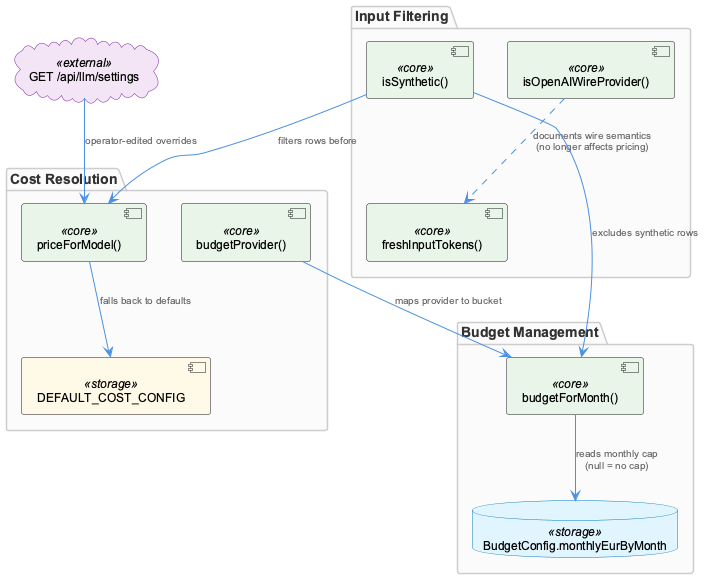
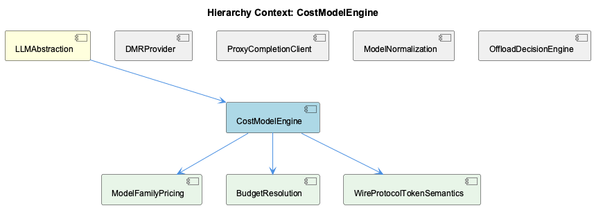

# CostModelEngine

**Type:** SubComponent

freshInputTokens() is now a pure identity function; comments document that its prior cache-token subtraction logic was removed because the proxy now performs that compensation at the parse boundary (openAIFreshInputTokens), avoiding double-subtraction

# CostModelEngine — Technical Insight Document

## What It Is

CostModelEngine is the pricing and budget-resolution core implemented in `cost-model.ts`, living within the broader LLMAbstraction subsystem. It is responsible for turning raw usage rows into priced costs (`priceForModel()`), enforcing monthly spend caps (`budgetForMonth()`), classifying providers into billing buckets (`budgetProvider()`), and filtering out non-production data (`isSynthetic()`) before any cost arithmetic executes. As a sibling to DMRProvider, ProxyCompletionClient, ModelNormalization, and OffloadDecisionEngine, it sits downstream of model normalization and completion tagging, consuming their outputs rather than producing raw usage data itself.

## Architecture and Design

The engine is structured around three delegated child concerns — ModelFamilyPricing, BudgetResolution, and WireProtocolTokenSemantics — each encapsulating a distinct resolution problem rather than being solved inline in a monolithic function. This decomposition reflects a deliberate design choice: pricing resolution, budget-cap resolution, and wire-protocol token semantics each have independent evolution paths and edge cases, so isolating them (`modelFamily()`, `budgetForMonth()`, `isOpenAIWireProvider()`) keeps each function auditable in isolation.

`priceForModel()` embodies a fallback-chain pattern: exact model key match → family-representative match (via `FAMILY_REPRESENTATIVE`) → generic family match → a zero-priced 'none' source as an ultimate default. This graceful-degradation approach ensures the system never throws on an unrecognized model, instead degrading to a documented, non-crashing default — a pragmatic trade-off favoring availability over strict correctness for unmapped models.

Budget resolution similarly encodes a precedence rule, but with a subtler nuance: `budgetForMonth()` distinguishes an explicit `null` in `BudgetConfig.monthlyEurByMonth` (an intentional "no cap this month") from an absent key (fall through to `b.monthlyEur`). This is a classic example of using presence-vs-value semantics to preserve historical intent, avoiding retroactive corruption of past budget records when caps change over time (e.g., a documented 300→600→1000 progression in 2026-08).

## Implementation Details

`isSynthetic()` acts as a pre-filter gate, excluding rows tagged with `SYNTHETIC_MODELS`, `SYNTHETIC_PROVIDERS`, or 'fake'/'demo' prefixes, ensuring demo or probe traffic never enters cost totals — a data-integrity guard positioned before any pricing math runs.

`budgetProvider()` performs a many-to-two reduction, collapsing arbitrary raw provider strings into exactly two billing buckets, 'copilot' and 'claude-max', mirroring the two real subscriptions the dashboard actually tracks. This is a deliberately narrow mapping rather than a generic extensible enum, reflecting the current real-world billing model rather than anticipating future providers speculatively.

`freshInputTokens()` is notable for what it no longer does: it is now a pure identity function, with in-code comments explaining that its former cache-token-subtraction logic was removed because the proxy now performs that compensation earlier, at the parse boundary (`openAIFreshInputTokens`). This is a clear case of responsibility migration upstream to avoid double-subtraction bugs, with the historical logic intentionally left documented rather than silently deleted.

`isOpenAIWireProvider()` — implementing WireProtocolTokenSemantics — encodes the difference between Anthropic-style wire semantics (cache tokens additive) and OpenAI-style semantics (cache tokens as a subset of `prompt_tokens`), flagging copilot/github/opencode as OpenAI-wire speakers. Notably, this function is retained purely for documentation/clarity even though current pricing logic no longer depends on it, indicating the team values explicit semantic modeling over dead-code removal when the semantics remain conceptually important.

`DEFAULT_COST_CONFIG` hardcodes per-model prices (in/out/cacheRead/cacheWrite) across the known model catalogue, serving as the fallback baseline beneath operator-editable configuration retrieved from `GET /api/llm/settings`.

## Integration Points

CostModelEngine is contained within LLMAbstraction, whose parent-level concern is mode resolution (`getLLMMode()` in `llm-mock-service.ts`) — a separate precedence chain governing mock vs. real LLM behavior, distinct from but architecturally adjacent to cost/budget resolution.

Upstream, ModelNormalization directly feeds `priceForModel()`: normalized model identifiers become the keys consumed against `CostConfig.modelPrices`. ProxyCompletionClient tags requests with a process identifier that surfaces downstream as `CostRow.process`, linking completion-level tracing to cost attribution. DMRProvider's OpenAI-compatible interface substitution pattern is architecturally analogous to (though separate from) the wire-protocol distinctions CostModelEngine tracks via WireProtocolTokenSemantics.

OffloadDecisionEngine, while a sibling rather than a direct dependency, shares the same philosophy of gate-ordering correctness (`evaluateOffload()`'s exact short-circuit order) that CostModelEngine applies to its own resolution chains — both subsystems treat order-of-evaluation as semantically load-bearing, not incidental.

## Usage Guidelines

Developers modifying `priceForModel()` must preserve the three-tier fallback order — exact match, family representative, generic family, then zero-priced default — since downstream cost totals silently degrade rather than error, making silent misconfiguration a real risk if fallback tiers are reordered.

When editing `BudgetConfig.monthlyEurByMonth`, treat `null` and "key absent" as semantically distinct; collapsing this distinction will corrupt historical budget accuracy for past months whose caps were intentionally removed.

Do not remove `isOpenAIWireProvider()` or WireProtocolTokenSemantics documentation on the assumption it's dead code — it's intentionally retained as living documentation of wire-format differences even though current pricing paths don't branch on it directly, per the note in observation 6.

Any new synthetic/test provider or model naming convention must be registered in `SYNTHETIC_MODELS`/`SYNTHETIC_PROVIDERS` or via the 'fake'/'demo' prefix convention, or it will silently pollute production cost totals since `isSynthetic()` is the sole gate before cost math executes. Finally, new providers should be evaluated against `budgetProvider()`'s two-bucket mapping — the intentionally narrow copilot/claude-max split — before assuming automatic support for additional billing categories.

## Hierarchy Context

### Parent
- [LLMAbstraction](./LLMAbstraction.md) -- [LLM] The mode-resolution logic in getLLMMode() (llm-mock-service.ts) establishes a clear precedence chain that new developers must understand before debugging unexpected LLM behavior: per-agent overrides in workflow-progress.json take precedence over a global mode setting, which in turn overrides a legacy mockLLM boolean flag, with 'public' as the ultimate fallback. This four-tier resolution means that a developer trying to force mock mode for testing might set the global mode but be silently overridden by a stale per-agent override left in workflow-progress.json from a previous run. The dual-checking of both llmState (new) and mockLLM (legacy) shapes in isMockLLMEnabled() and getLLMState() is a deliberate backward-compatibility shim, indicating the config schema evolved over time but old state files or tooling that only write the legacy flag must continue to work without breaking the mock system.

### Children
- [ModelFamilyPricing](./ModelFamilyPricing.md) -- modelFamily() in cost-model.ts maps model substrings like 'haiku', 'sonnet', 'opus', 'fable', 'gpt-4o-mini', 'gpt-4o', 'gpt-5' to a ModelFamily enum, defaulting to 'other'
- [BudgetResolution](./BudgetResolution.md) -- budgetForMonth() in cost-model.ts checks b.monthlyEurByMonth for an own-property match on the 'YYYY-MM' key before falling back to b.monthlyEur
- [WireProtocolTokenSemantics](./WireProtocolTokenSemantics.md) -- isOpenAIWireProvider() in cost-model.ts flags copilot/github/opencode providers as speaking the OpenAI wire versus Anthropic wire

### Siblings
- [DMRProvider](./DMRProvider.md) -- DMRProvider (dmr-provider.ts) implements an OpenAI-compatible client interface so it can be substituted for remote providers without changing call sites
- [ProxyCompletionClient](./ProxyCompletionClient.md) -- llm-with-process.ts tags each completion request with a process identifier, which downstream shows up as CostRow.process in cost-model.ts
- [ModelNormalization](./ModelNormalization.md) -- Model identifiers normalized here feed directly into CostConfig.modelPrices keys consumed by priceForModel() in cost-model.ts
- [OffloadDecisionEngine](./OffloadDecisionEngine.md) -- evaluateOffload() in offload-gates.ts reproduces the proxy's short-circuit gate order exactly (considered→route-allows→band→target→target-band→scope→transport→offloaded), because gate order determines which reason string is attributed to a call

---

*Generated from 7 observations*
