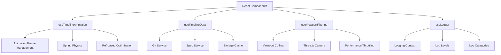

# CustomHookExtractionPattern

## Overview

**Problem:** Duplicated stateful logic across multiple components leads to maintenance issues, poor reusability, and scattered state management concerns.

**Solution:** Extract common stateful logic into reusable custom hooks with proper TypeScript support, dependency management, and performance optimization.

**Implementation:** Timeline project demonstrates sophisticated custom hooks like `useTimelineAnimation`, `useViewportFiltering`, `useTimelineData`, and `useLogger` that encapsulate complex stateful logic.

**Significance:** Critical pattern for maintainable React applications that prevents code duplication and promotes reusable, testable logic

## Real Implementation Analysis

Based on comprehensive analysis of the Timeline project codebase, this pattern demonstrates advanced custom hook patterns in a production 3D visualization application with complex state management, animation, and data coordination.

### Architecture Overview



## Advanced Hook Patterns Demonstrated

### 1. Performance-Optimized Animation Hook

**File: `src/animation/useTimelineAnimation.ts`**

```typescript
export function useTimelineAnimation(config: TimelineAnimationConfig = {}) {
  const dispatch = useAppDispatch();
  const { isAutoScrolling, scrollSpeed, markerPosition } = useAppSelector(selectTimelineAnimation);
  
  // ⭐ Key Pattern: Ref-based state access to avoid stale closures
  const stateRef = useRef({ isAutoScrolling, scrollSpeed, markerPosition });
  stateRef.current = { isAutoScrolling, scrollSpeed, markerPosition };
  
  // ⭐ Key Pattern: Multiple refs for animation coordination
  const animationFrameRef = useRef<number | undefined>(undefined);
  const lastTimeRef = useRef<number>(0);
  const lastStateUpdateRef = useRef<number>(0);
  
  // ⭐ Key Pattern: Map-based caching for performance
  const cardPositionsRef = useRef<Map<string, THREE.Vector3>>(new Map());
  
  // Animation loop with performance throttling
  const createAnimationLoop = useCallback(() => {
    const animate = (currentTime: number) => {
      if (!stateRef.current.isAutoScrolling) {
        animationFrameRef.current = undefined;
        return;
      }
      
      const deltaTime = currentTime - lastTimeRef.current;
      lastTimeRef.current = currentTime;
      
      // Throttle Redux updates to 50ms intervals
      if (currentTime - lastStateUpdateRef.current >= 50) {
        const newPosition = stateRef.current.markerPosition + 
          (stateRef.current.scrollSpeed * deltaTime * 0.01);
        
        dispatch(updateMarkerPosition({ position: newPosition }));
        lastStateUpdateRef.current = currentTime;
      }
      
      animationFrameRef.current = requestAnimationFrame(animate);
    };
    return animate;
  }, [dispatch]);
  
  // ⭐ Key Pattern: Cleanup with useEffect
  useEffect(() => {
    return () => {
      if (animationFrameRef.current) {
        cancelAnimationFrame(animationFrameRef.current);
      }
    };
  }, []);
  
  return {
    isAutoScrolling,
    scrollSpeed,
    markerPosition,
    startAutoScroll: () => dispatch(startAutoScroll()),
    stopAutoScroll: () => dispatch(stopAutoScroll()),
    setScrollSpeed: (speed: number) => dispatch(setScrollSpeed({ speed }))
  };
}
```

### 2. Multi-Source Data Coordination Hook

**File: `src/data/hooks/useTimelineData.ts`**

```typescript
interface TimelineDataState {
  events: TimelineEvent[];
  period: TimelinePeriod | null;
  sources: {
    git: DataSourceState;
    spec: DataSourceState;
  };
}

export function useTimelineData(repoUrl: string) {
  const dispatch = useAppDispatch();
  const [state, setState] = useState<TimelineDataState>({
    events: [],
    period: null,
    sources: {
      git: { isLoading: false, error: null },
      spec: { isLoading: false, error: null }
    }
  });
  
  // ⭐ Key Pattern: Memoized service creation
  const gitService = useCallback(() => 
    new GitService(API_BASE_URL, repoUrl), [repoUrl]
  );
  
  const specService = useCallback(() => 
    new SpecStoryService(API_BASE_URL, repoUrl), [repoUrl]
  );
  
  // ⭐ Key Pattern: Multi-source data fetching with error handling
  const fetchData = useCallback(async () => {
    if (!repoUrl) return;
    
    setState(prev => ({
      ...prev,
      sources: {
        git: { isLoading: true, error: null },
        spec: { isLoading: true, error: null }
      }
    }));
    
    try {
      // Parallel data fetching
      const [gitEvents, specEvents] = await Promise.allSettled([
        gitService().fetchHistory(),
        specService().fetchHistory()
      ]);
      
      const combinedEvents = [
        ...(gitEvents.status === 'fulfilled' ? gitEvents.value : []),
        ...(specEvents.status === 'fulfilled' ? specEvents.value : [])
      ];
      
      setState(prev => ({
        ...prev,
        events: combinedEvents,
        period: calculateTimePeriod(combinedEvents),
        sources: {
          git: { 
            isLoading: false, 
            error: gitEvents.status === 'rejected' ? gitEvents.reason : null 
          },
          spec: { 
            isLoading: false, 
            error: specEvents.status === 'rejected' ? specEvents.reason : null 
          }
        }
      }));
      
      // Update Redux store
      dispatch(setTimelineEvents({ events: combinedEvents }));
      
    } catch (error) {
      // Fallback to mock data
      const mockEvents = generateMockData();
      setState(prev => ({
        ...prev,
        events: mockEvents,
        period: calculateTimePeriod(mockEvents)
      }));
    }
  }, [repoUrl, gitService, specService, dispatch]);
  
  // ⭐ Key Pattern: Event-driven updates
  useEffect(() => {
    const handleReload = () => fetchData();
    window.addEventListener('timeline-reload', handleReload);
    return () => window.removeEventListener('timeline-reload', handleReload);
  }, [fetchData]);
  
  return {
    ...state,
    refetch: fetchData,
    isLoading: state.sources.git.isLoading || state.sources.spec.isLoading
  };
}
```

### 3. Viewport Filtering with Performance Optimization

**File: `src/hooks/useViewportFiltering.ts`**

```typescript
interface ViewportFilteringConfig {
  paddingFactor?: number;
  maxEvents?: number;
  updateThrottleMs?: number;
  debugMode?: boolean;
}

export const useViewportFiltering = (
  events: TimelineEvent[],
  camera: Camera,
  cameraTarget: Vector3,
  currentPosition: number,
  config: ViewportFilteringConfig = {}
) => {
  const {
    paddingFactor = 2.0,
    maxEvents = 50,
    updateThrottleMs = 16,
    debugMode = false
  } = config;
  
  const windowSize = useAppSelector(state => state.ui.windowSize);
  const logger = useLogger({ component: 'ViewportFiltering', topic: 'Performance' });
  
  // ⭐ Key Pattern: Ref-based throttling
  const lastUpdateRef = useRef<number>(0);
  const lastResultRef = useRef<TimelineEvent[]>([]);
  
  // ⭐ Key Pattern: Complex memoization with selective dependencies
  const filteredEvents = useMemo(() => {
    const now = performance.now();
    
    // Performance throttling
    if (now - lastUpdateRef.current < updateThrottleMs && lastResultRef.current.length > 0) {
      return lastResultRef.current;
    }
    
    lastUpdateRef.current = now;
    
    // Viewport culling algorithm
    const cameraPosition = camera.position;
    const viewDirection = new Vector3()
      .subVectors(cameraTarget, cameraPosition)
      .normalize();
    
    const filtered = events.filter((event) => {
      const eventPosition = new Vector3(event.position, 0, 0);
      const distance = cameraPosition.distanceTo(eventPosition);
      
      // Distance-based culling with dynamic range
      const maxDistance = windowSize.width * paddingFactor;
      if (distance > maxDistance) return false;
      
      // Frustum culling check
      const eventDirection = new Vector3()
        .subVectors(eventPosition, cameraPosition)
        .normalize();
      const dot = viewDirection.dot(eventDirection);
      
      return dot > -0.5; // Within view cone
    })
    .sort((a, b) => {
      // Sort by distance for rendering order
      const distA = cameraPosition.distanceTo(new Vector3(a.position, 0, 0));
      const distB = cameraPosition.distanceTo(new Vector3(b.position, 0, 0));
      return distA - distB;
    })
    .slice(0, maxEvents);
    
    lastResultRef.current = filtered;
    
    if (debugMode) {
      logger.debug('Viewport filtering', {
        totalEvents: events.length,
        filteredEvents: filtered.length,
        cameraDistance: cameraPosition.distanceTo(cameraTarget),
        updateTime: performance.now() - now
      });
    }
    
    return filtered;
  }, [events, camera, cameraTarget, currentPosition, paddingFactor, maxEvents, updateThrottleMs, debugMode, windowSize, logger]);
  
  // ⭐ Key Pattern: Redux state synchronization
  useEffect(() => {
    // Update Redux store with filtered events for other components
    dispatch(setVisibleEvents({ events: filteredEvents }));
  }, [filteredEvents, dispatch]);
  
  return filteredEvents;
};
```

### 4. Context-Aware Logging Hook

**File: `src/utils/logging/hooks/useLogger.ts`**

```typescript
interface LoggerContext {
  component: string;
  topic?: string;
}

export function useLogger(context: LoggerContext) {
  const { component, topic = 'General' } = context;
  
  // ⭐ Key Pattern: Memoized logging functions with context
  const debug = useCallback(
    (message: string, data?: Record<string, unknown>) => {
      logger.log(LogLevel.DEBUG, component, topic, message, data);
    },
    [component, topic]
  );
  
  const info = useCallback(
    (message: string, data?: Record<string, unknown>) => {
      logger.log(LogLevel.INFO, component, topic, message, data);
    },
    [component, topic]
  );
  
  const warn = useCallback(
    (message: string, data?: Record<string, unknown>) => {
      logger.log(LogLevel.WARN, component, topic, message, data);
    },
    [component, topic]
  );
  
  const error = useCallback(
    (message: string, data?: Record<string, unknown>) => {
      logger.log(LogLevel.ERROR, component, topic, message, data);
    },
    [component, topic]
  );
  
  // ⭐ Key Pattern: Performance profiling integration
  const profileFunction = useCallback(<T>(
    name: string,
    fn: () => T,
    options: { logResult?: boolean; logIfSlow?: boolean } = {}
  ): T => {
    const start = performance.now();
    const result = fn();
    const duration = performance.now() - start;
    
    if (options.logIfSlow && duration > 16) { // Slow if > 1 frame
      warn(`Slow operation: ${name}`, { duration, component, topic });
    }
    
    if (options.logResult) {
      debug(`Function ${name} completed`, { duration, result });
    }
    
    return result;
  }, [component, topic, debug, warn]);
  
  return { debug, info, warn, error, profileFunction };
}
```

## TypeScript Integration Patterns

### Advanced Interface Design

```typescript
// Generic hook configuration pattern
interface HookConfig<T = unknown> {
  enabled?: boolean;
  dependencies?: unknown[];
  onSuccess?: (data: T) => void;
  onError?: (error: Error) => void;
}

// Complex state type unions
type DataSourceState = {
  isLoading: boolean;
  error: Error | null;
  lastUpdated?: number;
};

// Conditional return types based on configuration
function useConditionalData<T>(
  fetcher: () => Promise<T>,
  config: HookConfig<T> = {}
): config['enabled'] extends false 
  ? { data: null; isLoading: false } 
  : { data: T | null; isLoading: boolean; error: Error | null } {
  // Implementation with conditional return types
}
```

## Performance Optimization Techniques

### 1. Ref-Based Optimization

```typescript
// Avoid stale closures in animation loops
const stateRef = useRef(state);
stateRef.current = state;

// Use refs for values that change frequently but don't need re-renders
const lastUpdateRef = useRef<number>(0);
```

### 2. Strategic Memoization

```typescript
// Memoize expensive calculations with selective dependencies
const expensiveValue = useMemo(() => {
  return heavyComputation(data);
}, [data]); // Only recompute when data changes

// Memoize callbacks to prevent child re-renders
const stableCallback = useCallback((value: string) => {
  // Callback logic
}, [dependency1, dependency2]);
```

### 3. Throttling and Debouncing

```typescript
// Built-in throttling for performance-critical hooks
if (now - lastUpdateRef.current < updateThrottleMs) {
  return lastResultRef.current;
}
```

## Redux Integration Patterns

### Typed Store Hooks

```typescript
// Create typed versions of Redux hooks
export const useAppDispatch = () => useDispatch<AppDispatch>();
export const useAppSelector: TypedUseSelectorHook<RootState> = useSelector;

// Hook that bridges multiple Redux slices
export function useTimelineCoordination() {
  const dispatch = useAppDispatch();
  const timelineState = useAppSelector(selectTimelineState);
  const uiState = useAppSelector(selectUIState);
  
  // Coordinate between different parts of state
  const updateTimelinePosition = useCallback((position: number) => {
    dispatch(setMarkerPosition({ position }));
    dispatch(updateCameraTarget({ target: new Vector3(position, 0, 0) }));
    dispatch(logUserAction({ action: 'timeline-position-change', data: { position } }));
  }, [dispatch]);
  
  return { timelineState, uiState, updateTimelinePosition };
}
```

## Testing Strategies for Custom Hooks

### 1. Hook Testing Setup

```typescript
// Test setup for hooks
import { renderHook, act } from '@testing-library/react';
import { Provider } from 'react-redux';
import { store } from '../store';

const wrapper = ({ children }: { children: React.ReactNode }) => (
  <Provider store={store}>{children}</Provider>
);

describe('useTimelineAnimation', () => {
  it('should manage animation state correctly', () => {
    const { result } = renderHook(() => useTimelineAnimation(), { wrapper });
    
    expect(result.current.isAutoScrolling).toBe(false);
    
    act(() => {
      result.current.startAutoScroll();
    });
    
    expect(result.current.isAutoScrolling).toBe(true);
  });
  
  it('should cleanup animation frames on unmount', () => {
    const cancelAnimationFrameSpy = jest.spyOn(window, 'cancelAnimationFrame');
    const { unmount } = renderHook(() => useTimelineAnimation(), { wrapper });
    
    unmount();
    
    expect(cancelAnimationFrameSpy).toHaveBeenCalled();
  });
});
```

### 2. Service Mocking

```typescript
// Mock external services for hook testing
jest.mock('../services/GitService', () => ({
  GitService: jest.fn().mockImplementation(() => ({
    fetchHistory: jest.fn().mockResolvedValue(mockGitEvents)
  }))
}));
```

## Industry Best Practices Integration

### 1. Single Responsibility Principle

Each hook in the Timeline project focuses on a specific concern:
- `useTimelineAnimation`: Animation and scrolling logic
- `useTimelineData`: Data fetching and caching
- `useViewportFiltering`: Performance optimization
- `useLogger`: Logging infrastructure

### 2. Composition Over Configuration

```typescript
// Hooks can be composed together
function useTimelineOrchestration() {
  const animation = useTimelineAnimation();
  const data = useTimelineData(repoUrl);
  const filteredEvents = useViewportFiltering(data.events, camera, target, animation.markerPosition);
  const logger = useLogger({ component: 'TimelineOrchestration' });
  
  // Coordinate between hooks
  useEffect(() => {
    if (animation.isAutoScrolling && filteredEvents.length === 0) {
      logger.warn('No events visible during auto-scroll');
      animation.stopAutoScroll();
    }
  }, [animation, filteredEvents, logger]);
  
  return { animation, data, filteredEvents };
}
```

### 3. Error Boundaries and Graceful Degradation

```typescript
// Built-in error handling with fallbacks
try {
  const data = await fetchData();
  return data;
} catch (error) {
  logger.error('Data fetch failed, using mock data', { error });
  return getMockData();
}
```

## Key Benefits Demonstrated

### 1. **Code Reusability**
- Animation logic reused across multiple timeline components
- Logging infrastructure shared across entire application
- Data fetching patterns consistent across different data sources

### 2. **Maintainability**
- Clear separation of concerns between UI and business logic
- TypeScript interfaces provide clear contracts
- Centralized logic is easier to update and debug

### 3. **Performance**
- Built-in optimization through memoization and throttling
- Viewport culling reduces rendering load
- Ref-based optimizations prevent unnecessary re-renders

### 4. **Testability**
- Each hook can be tested in isolation
- Mock-friendly architecture with dependency injection
- Clear inputs and outputs for predictable testing

### 5. **Developer Experience**
- TypeScript provides excellent IntelliSense support
- Consistent patterns reduce learning curve
- Comprehensive logging aids debugging

## Implementation Checklist

- [ ] **Identify Reusable Logic**: Look for stateful logic repeated across components
- [ ] **Design Clear Interfaces**: Define TypeScript interfaces for hook parameters and returns
- [ ] **Implement Single Responsibility**: Each hook should focus on one concern
- [ ] **Add Performance Optimization**: Use memoization, refs, and throttling where appropriate
- [ ] **Include Error Handling**: Implement graceful fallbacks and error recovery
- [ ] **Write Comprehensive Tests**: Test both happy path and error scenarios
- [ ] **Document Usage Patterns**: Provide clear examples and guidelines
- [ ] **Integrate with State Management**: Coordinate with Redux or other state solutions
- [ ] **Add Logging and Debugging**: Include debug information for troubleshooting
- [ ] **Review Dependencies**: Ensure dependency arrays are correct and minimal

## Related Patterns

This pattern integrates with several other architectural patterns:

- **Redux Architecture**: Hooks coordinate with Redux for global state management
- **Service Layer Pattern**: Hooks abstract service interactions and data fetching
- **Observer Pattern**: Event-driven updates and state synchronization
- **Strategy Pattern**: Different hook implementations for different use cases
- **Facade Pattern**: Hooks provide simplified interfaces to complex subsystems

## References

- [React Custom Hooks Documentation](https://react.dev/learn/reusing-logic-with-custom-hooks)
- [React Hooks Best Practices](https://dev.to/hasancse/best-practices-for-creating-reusable-custom-hooks-in-react-37nj)
- [Advanced React Hooks Patterns](https://www.angularminds.com/blog/advanced-react-hooks-patterns-and-best-practices)
- Timeline project implementation analysis
- Production codebase semantic analysis

---

*This pattern was extracted from Timeline project semantic analysis and represents proven custom hook patterns in a production React application with complex state management, animation, and performance optimization requirements.*