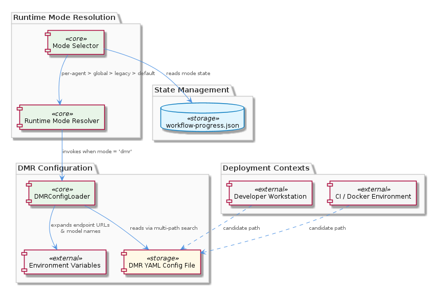
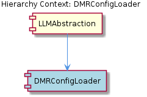

# DMRConfigLoader

**Type:** SubComponent

DMRConfigLoader performs multi-path search for the DMR YAML config file, checking several candidate locations to support both local dev and containerized deployments as documented in integrations/mcp-server-semantic-analysis/docs/configuration.md

# DMRConfigLoader — Technical Insight Document

## What It Is

DMRConfigLoader is a SubComponent within the `LLMAbstraction` layer of the `integrations/mcp-server-semantic-analysis` integration. Its responsibility is to locate, parse, and resolve the YAML configuration file that describes how the system should connect to Docker Model Runner (DMR) — a local inference backend used as one of the alternatives to public cloud LLM providers. Documentation for the loader's behavior and the configuration file format lives at `integrations/mcp-server-semantic-analysis/docs/configuration.md`, and its role in the broader mode-resolution flow is described in `integrations/mcp-server-semantic-analysis/README.md`.

Unlike the surrounding mode-selection machinery (which relies on a `workflow-progress.json` state file), DMRConfigLoader operates on a dedicated YAML document. This distinction is intentional: the YAML file carries declarative, environment-portable configuration data (endpoint URLs, model identifiers), whereas the JSON state file tracks dynamic runtime selections. The loader is invoked only when the resolved runtime mode is `dmr`, making it a lazy, on-demand subsystem rather than a startup dependency.

## Architecture and Design

The loader implements a **multi-path search strategy** for locating its YAML configuration file. Rather than depending on a single fixed path, it walks an ordered list of candidate locations to support both local developer workstations and containerized deployments (CI runners, Docker images). This pattern keeps the same codebase deployable across heterogeneous environments without requiring path overrides or per-environment forks — a critical property given that `LLMAbstraction` is explicitly designed to support development, testing, and production scenarios from one codebase.

A second architectural choice is **environment variable expansion at load time**. Values within the YAML — particularly DMR endpoint URLs and model names — can be parameterized using environment variable references. This treats the YAML file as a template rather than a hardcoded artifact, separating structural configuration (committed to the repository) from environment-specific values (injected at runtime). The pattern aligns with twelve-factor-style configuration discipline while preserving the readability of YAML for the parts that genuinely belong in version control.

DMRConfigLoader participates in a clear **priority chain** documented for the parent `LLMAbstraction`: per-agent override > global mode > legacy flag > default (`public`). The loader is not invoked unless the chain resolves to `dmr`, which means its costs (file I/O, parsing, env expansion) are paid only when DMR is the selected backend. Sibling subcomponents handling Anthropic, OpenAI, Groq, or the mock mode follow analogous lazy-resolution patterns within the same abstraction layer.

## Implementation Details

The loader's core mechanics consist of three stages executed in sequence. First, it performs the multi-path lookup — iterating through candidate locations described in `integrations/mcp-server-semantic-analysis/docs/configuration.md` — and selects the first match. This approach gracefully degrades: a missing file in one location does not fail the load if another candidate exists, which is essential for containers where the YAML may be mounted at a different path than in a developer checkout.

Second, the loader parses the YAML payload into an in-memory configuration object. Because YAML is used (rather than JSON or pure environment-variable configuration), the file can naturally express nested structures, comments, and multi-line values — useful for documenting model choices and endpoint conventions inline. This choice contrasts deliberately with `workflow-progress.json`, the JSON state file managed by the mode selector elsewhere in `LLMAbstraction`; JSON is appropriate for machine-written state, YAML for human-authored configuration.

Third, environment variable expansion is applied to the parsed configuration. Tokens referencing environment variables are resolved against the current process environment so that values such as the DMR endpoint URL and model name are bound late. This means a single committed YAML file can drive different DMR instances across machines by varying only the environment, with no edits to the file itself.

## Integration Points

DMRConfigLoader is contained within `LLMAbstraction`, the provider-agnostic layer that brokers LLM calls across multiple backends. Its invocation is gated by the mode resolver inside `LLMAbstraction`: only when the priority chain (per-agent override > global mode > legacy flag > default) yields `dmr` does the loader run. This makes the loader an internal collaborator of the mode resolver rather than an externally exposed API.

The loader's outputs — resolved endpoint URLs and model names — feed downstream DMR client code that performs the actual local inference calls. It shares architectural space with sibling provider integrations for Anthropic, OpenAI, Groq, and the mock backend; each of these follows the same lazy-activation pattern, ensuring that providers not in use impose no runtime cost. The loader also has a documented relationship with `integrations/mcp-server-semantic-analysis/docs/configuration.md` (its specification) and `integrations/mcp-server-semantic-analysis/README.md` (its place in the mode-resolution priority chain).

External dependencies are minimal and clean: a YAML parser, the host filesystem (for the multi-path search), and the process environment (for variable expansion). No coupling exists to the `workflow-progress.json` state file used by the mode selector — these are deliberately separate concerns.

## Usage Guidelines

When deploying or developing against DMR, prefer placing the YAML config in one of the documented candidate locations rather than introducing a new path; extending the search list should be done sparingly and only with corresponding updates to `integrations/mcp-server-semantic-analysis/docs/configuration.md`. The multi-path strategy exists precisely so that developers do not need per-environment overrides — exploit it.

Treat the YAML file as a template, not a secret store. DMR endpoint URLs and model names should be expressed as environment variable references when they vary across machines or deployments. Hardcoding such values defeats the parameterization design and tends to leak into version control. Conversely, structural choices that genuinely belong to the codebase (which models are supported, what shape the config takes) belong directly in the YAML.

Remember that the loader is invoked lazily. Adding work or side effects to the loader will be felt only by users on the `dmr` mode; conversely, do not rely on the loader running at startup for any cross-cutting initialization — that responsibility belongs higher up in `LLMAbstraction`. Finally, when adding new sibling provider loaders (for other local inference engines, for example), follow the same separation: a dedicated configuration source, lazy invocation through the mode resolver, and clean isolation from the `workflow-progress.json` state file.

---

### Summary of Insights

1. **Architectural patterns identified**: multi-path file discovery, lazy on-demand subsystem activation gated by a priority chain, declarative-template configuration with late binding via environment variable expansion, and clean separation between human-authored YAML config and machine-managed JSON state.

2. **Design decisions and trade-offs**: YAML chosen over JSON or env-only configuration for human readability and structure, at the cost of a YAML parsing dependency; multi-path search reduces deployment friction but adds a small amount of lookup logic; lazy invocation minimizes idle cost but means config errors surface only when DMR is selected.

3. **System structure insights**: DMRConfigLoader is a focused subcomponent of `LLMAbstraction`, sitting alongside provider integrations for Anthropic, OpenAI, Groq, and a mock backend. It is deliberately decoupled from the `workflow-progress.json` mode-state mechanism, reflecting a clean split between configuration and state.

4. **Scalability considerations**: The loader's cost is bounded and incurred only when DMR mode is active. The pattern scales horizontally to additional local-inference providers by replicating the structure (dedicated config source + lazy loader) rather than expanding this loader's responsibilities.

5. **Maintainability assessment**: The design is highly maintainable — clear single responsibility, documented file format and search paths, no hidden coupling to unrelated state files, and an extension pattern (add a sibling loader) that does not require modifying existing code. The principal maintenance risk is drift between the candidate-path list in code and the documentation in `integrations/mcp-server-semantic-analysis/docs/configuration.md`; these should be kept in sync.

## Hierarchy Context

### Parent
- [LLMAbstraction](./LLMAbstraction.md) -- LLMAbstraction is the provider-agnostic layer in the mcp-server-semantic-analysis integration that abstracts LLM calls across multiple backends: public cloud providers (Anthropic, OpenAI, Groq), local inference via Docker Model Runner (DMR), and a mock mode for testing. The component manages runtime mode selection through a workflow-progress.json state file, supporting both global and per-agent mode overrides with a priority chain: per-agent override > global mode > legacy flag > default ('public'). This enables dynamic switching between inference backends without code changes, supporting development, testing, and production scenarios from the same codebase.

---

*Generated from 5 observations*
